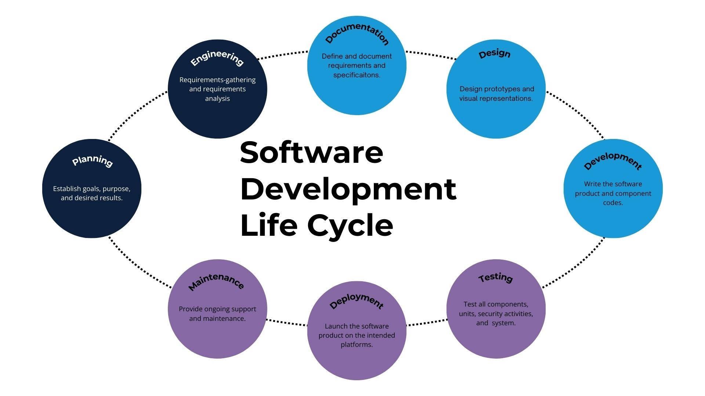

### Question 1

#### Conduct a google search on what software development lifecycle (SDLC) is and document your findings.

        Findings - Question 1

[Diagram 1 - SDLC Phases](prerequisite_side_self_study.md) 

The Software Development Lifecycle (SDLC) is a structured framework and methodology that development teams use to design, build, test, and deploy high-quality software. Its primary goal is to minimize project risks through forward planning and iterative processes so that the final product meets or exceeds customer expectations while staying within budget and time constraints.

The seven phases of SDLC are summarised below including:

**1. Planning and analysis** - figure out project goals, costs, and requirements. Stakeholders gather requirements to define the project's goals, scope, and estimated costs. This ensures the team has a clear roadmap before any work begins.

**2. Design** - Create the technical blueprint and software architecture. Software architects create a detailed blueprint of the system's structure and user interface. This technical plan guides the developers on how the software will look and function.

**3. Development (or implementation)** - Write the actual code for the software. Programmers write the actual source code based on the design blueprints. They build the functional parts of the application piece by piece.

**4. Testing** - find and fix bugs to ensure quality. Quality assurance teams look for bugs, security flaws, and performance issues. This step guarantees the software works correctly and meets all requirements.

**5. Deployment** - release the finished software to the users. The finished software is released to the production environment for users to access. This can happen all at once or in smaller, controlled phases.

**6. Maintenance** - update the software and fix new problems. Developers monitor the live software to fix newly discovered bugs and add user updates. This ensures the application remains secure and useful over time.

**7. Disposal (Retirement)** - retire the software when it is outdated. The system is safely shut down and retired when it becomes outdated. Teams migrate important data and archive the software securely.

The major SDLC models popularly used insoftware development include:

**1. Waterfall model** - this traditional model follows a strict, linear sequence where one phase must be completely finished before the next begins. It relies heavily on upfront documentation and is best suited for small projects with fixed, unchanging requirements. However, its rigidity makes it difficult to adjust if requirements change later in the process.

**2. Agile model** - this highly flexible approach focuses on breaking development down into short, iterative cycles called sprints. Instead of building the entire project at once, teams rapidly deliver small, functional software updates based on continuous user feedback. It prioritizes active customer collaboration and adaptability over rigid pre-planning.

**3. V-Model (Verification and Validation)** - this model functions as a direct extension of the Waterfall methodology but arranges the phases in a "V" shape. The left side of the "V" covers development planning, while the right side introduces a corresponding testing phase for every single stage. It is highly structured and commonly used for security-sensitive applications where quality control is critical.

**4. Spiral Model** - : this risk-driven framework combines the gradual repetition of the iterative model with the structured flow of Waterfall. Projects move through repeating loops, allowing teams to build prototypes and perform intense risk analysis during every cycle. This makes it expensive but highly effective for large, complex systems with high uncertainty.

**5. DevOps Model** - : rhis modern approach merges software development with operations teams into a singular, highly collaborative system. It relies heavily on automated testing, continuous integration, and continuous deployment (CI/CD) to push out fast software updates. The primary goal is to bridge the traditional gap between writing code and managing live server environments.

### Question 2

#### Conduct another Google search, understand what LAMP stack means.

        Findings - Question 2

The LAMP stack is a classic, open-source software bundle used by developers to build and run dynamic websites and web applications. It serves as the foundational blueprint for many modern web platforms, with each letter representing a core layer of the server environment.

The following explains each layer of the the LAMP stack:  

   1. **L - Linux:** this is the open-source operating system that serves as the base layer for the entire stack. It manages the hardware resources and provides a secure, highly stable environment for the web application to run on.
   
   2. **A -Apache:** this is the web server software that processes incoming user requests from internet browsers. It translates those requests and delivers the correct website files back to the user's screen over the internet.  
     
   3. **M - MySQL:** this is the relational database management system used to store and organize the website's data. It securely keeps track of dynamic information like user accounts, product catalogs, and blog posts so they can be retrieved instantly.
   
   4. **P - PHP (or Python/Perl):** this is the server-side programming language that connects all the pieces of the stack together. It writes the core logic of the application, pulls data from the database, and generates dynamic HTML pages for the user.
   

### Question 3

#### Read about "chmod" and "chown" commands in linux and understand how access and ownership of files and directories work.

        Findings - Question 3

In Linux, access control is split into two layers: identity (who owns the file) and capability (what actions can be performed). Here is how the two core commands manage these layers:

**chmod** (Change Mode): this command modifies the read, write, and execute capabilities (rwx) assigned to a file or directory. It dictates exactly what actions the owner, the assigned user group, and all other system users are allowed to perform.

**chown** (Change Owner): this command alters the structural identity of a file or directory by assigning it to a new individual user, a new group, or both simultaneously. It determines exactly who the permission guardrails established by chmod will actually apply to.

### Question 4

#### Learn what TCP and UPD terms mean and how they are different. List down ports most commonly used in web (http, https, ssh, telnet, ftp, sftp)

        Findings - Question 4

TCP (Transmission Control Protocol) and UDP (User Datagram Protocol) are the two primary Transport Layer protocols used to transfer data across a network, differing fundamentally in how they balance reliability against speed.

1. **TCP** (Transmission Control Protocol): this is a connection-oriented protocol that establishes a formal connection between devices via a "three-way handshake" before sending data. It guarantees that every single packet arrives safely, without errors, and in the correct order by requiring acknowledgments and resending any lost data. Because of this heavy error-checking and overhead, it is slower but highly reliable—making it ideal for web browsing, emails, and file transfers.
   
2. **UDP** (User Datagram Protocol): this is a connectionless, lightweight protocol that streams data packets directly to the destination without establishing a formal connection or waiting for a confirmation receipt. It features zero error recovery or packet retransmission, sacrificing data accuracy to maximize processing speeds. Because it prioritizes low latency over perfect delivery, it is the standard choice for time-sensitive traffic like online gaming, video streaming, and live voice calls.

Common Network and Web Ports:

- **Port 20 & 21 – FTP** (File Transfer Protocol): used to move files between a client and a server. Port 21 handles commands and administrative authentication, while Port 20 manages the actual raw data transfer.
  
- **Port 22 – SSH** (Secure Shell) & SFTP (Secure FTP): provides an encrypted tunnel for secure remote server management (SSH). Because SFTP uses this same secure subsystem to transfer files safely, it shares this default port.
  
- **Port 23 – Telnet**: an older remote login service used to control text-based terminals. Unlike SSH, it is completely unencrypted, meaning credentials and data are sent over the network in clear text.
  
- **Port 80 – HTTP** (Hypertext Transfer Protocol): the foundational protocol for loading standard web pages across the internet. All traffic moving through this port is unencrypted.
  
- **Port 443 – HTTPS** (HTTP Secure): the modern, secure version of web traffic. It uses SSL/TLS encryption to shield sensitive web browsing data—like passwords and financial information—from interception.

### Question 5

#### Get yourself familiar with basic text editing in Vi (Vim) editor

        Findings - Question 5

Editing text efficiently in Vi or Vim requires understanding that the editor is modal which means the keys on your keyboard do completely different things depending on your current mode.

The two most critical modes needed are Normal Mode (for navigating and manipulating text) and Insert Mode (for typing text).

The 4 Essential Vi/Vim Commands:

Almost any basic editing task can be accomplished by mastering four actions:

- **Switch to Insert Mode** (i): When a file is opened, it defaults to Normal Mode and cannot type. Pressing the **i** key switches into Insert Mode, allowing the insertion of text normally at the cursor's position.
  
- **Return to Normal Mode** (Esc): Whenever typing is done and there is need to save, move around, or delete text, hit the **Esc** key. This drops back into Normal Mode so issue structural commands can be issued.
  
- **Delete a Line** (dd): While in Normal Mode, pressing the **d** key twice in rapid succession instantly delete (cut) the entire line the cursor is currently resting on.
  
- **Save and Exit** (:wq): While in Normal Mode, type a colon (**:**) to open the command line at the bottom of the screen, type **wq** (write and quit), and hit **Enter** to save your progress and close the file.

Navigation and Emergency Exits:

+ **Moving Around**: In Normal Mode, arrow keys or the traditional Vim keys can be used: **h** (left), **j** (down), **k** (up), and **l** (right).
  
- **The Panic Button** (:q!): If a mistake is made or one is stuck and there is a need to exit without saving any of the changes, press **Esc**, type **:q!**, and hit **Enter** to force-quit.