# WEB STACK IMPLEMENTATION (LEMP STACK) IN AWS

**Introduction**  

The LEMP stack is a popular open-source web development platform that consists of four main components: `Linux`, `Nginx`, `MySQL`, and `PHP` (or sometimes Perl or Python). This documentation outlines the setup, configuration, and usage of the LEMP stack.

## Step 0: Prerequisites
1. EC2 Instance of t3.micro type and Ubuntu 24.04 LTS (HVM) was launched in the us-east-1c region using the AWS console.

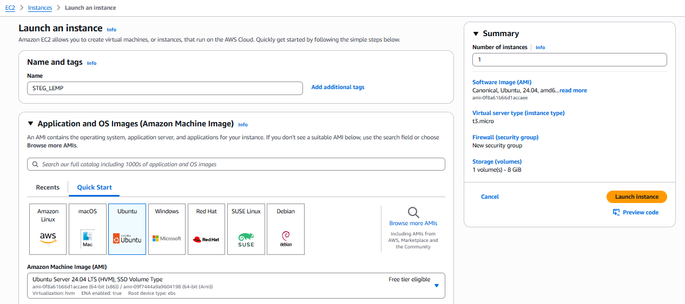

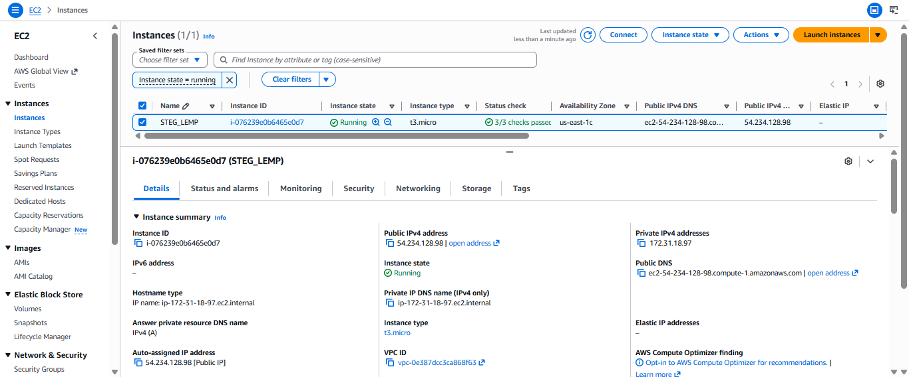

2. Created SSH key pair named STEG_LEMP key to access the instance on port 22

3. The security group was configured with the following inbound rules:

- Allow traffic on port 80 (HTTP) with source from anywhere on the internet (0.0.0.0/0).  
- Allow traffic on port 443 (HTTPS) with source from anywhere on the internet (0.0.0.0/0).  
- Allow traffic on port 22 (SSH) with source from any IP address (0.0.0.0/0). This is opened by default.  

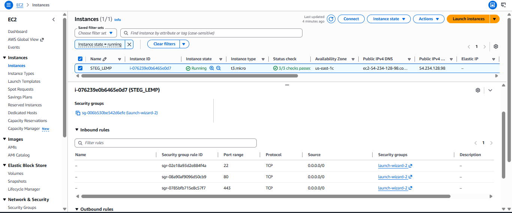

4. The default VPC and Subnet was used for the networking configuration.

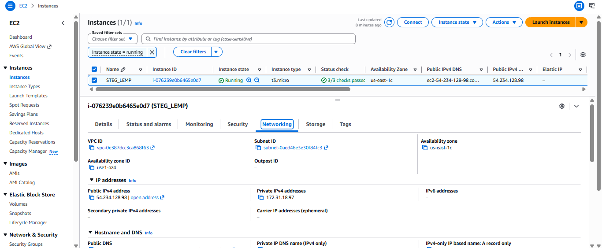

5. The private ssh key that got downloaded was located, permission was changed for the private key file and then used to connect to the instance by running the command:

**chmod 400 STEG_LEMP.pem**  

**ssh -i "STEG_LEMP.pem" ubuntu@54.234.128.98  
Where username=ubuntu and public ip address=54.234.128.98

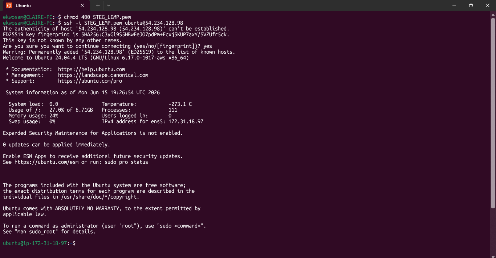

## Step 1 - Install nginx web server

1. Update and upgrade the server’s package index

**sudo apt update**

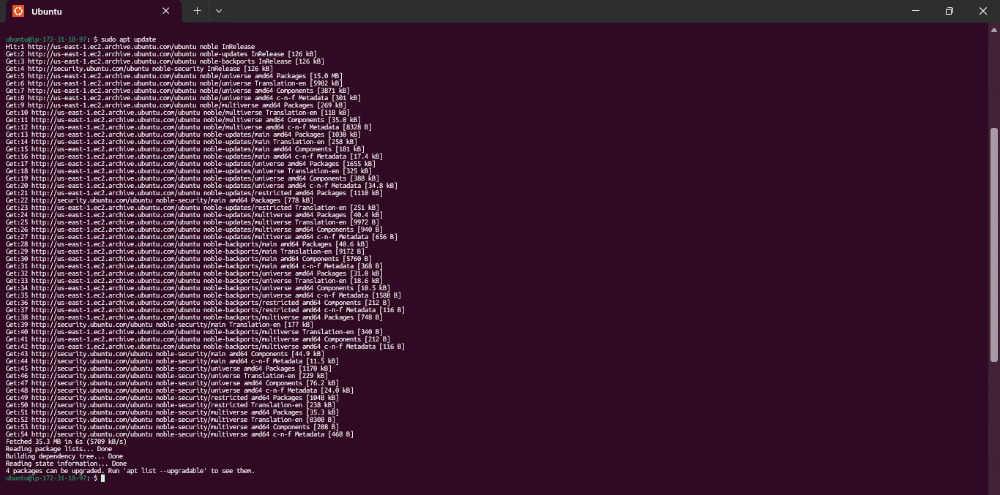

2. Install nginx with the command:

**sudo apt install nginx**

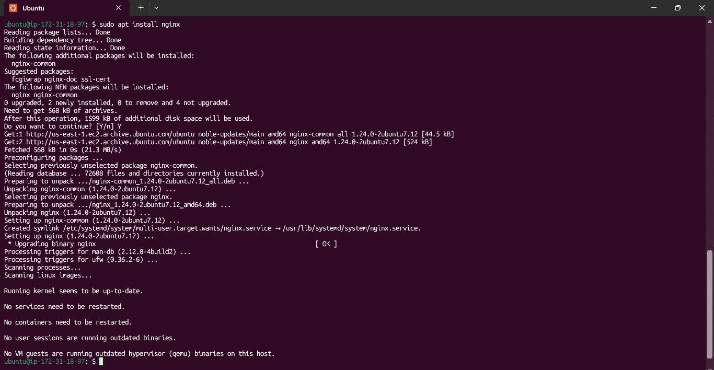

3. Verify that nginx is active and running

**sudo systemctl status nginx**

If it's green and running, then nginx is correctly installed

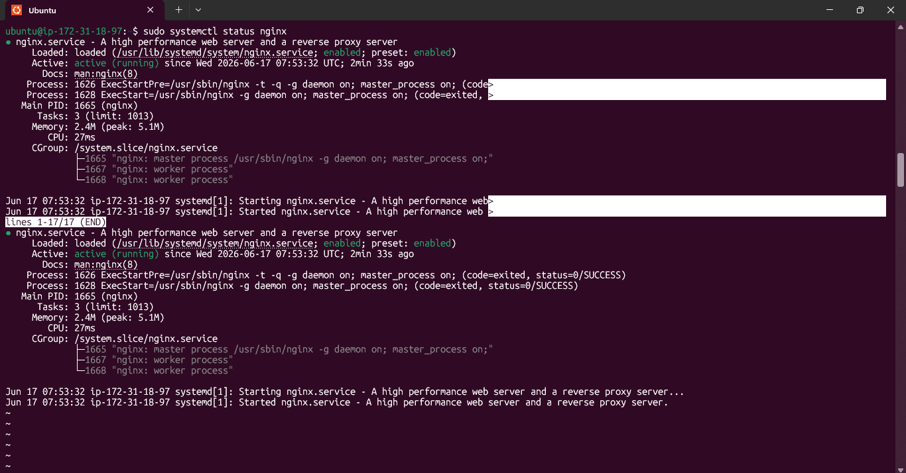

4. Access nginx locally on the Ubuntu shell

**curl http://localhost:80**

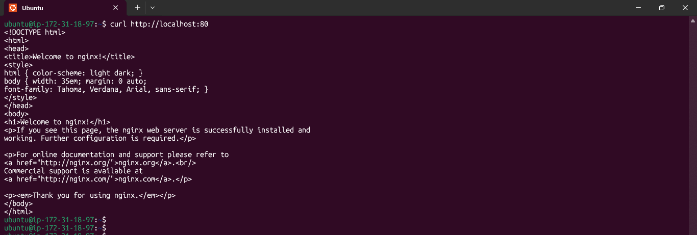

5. Test with the public IP address if the Nginx server can respond to request from the internet using the url on a browser.

**http://54.91.39.35** 

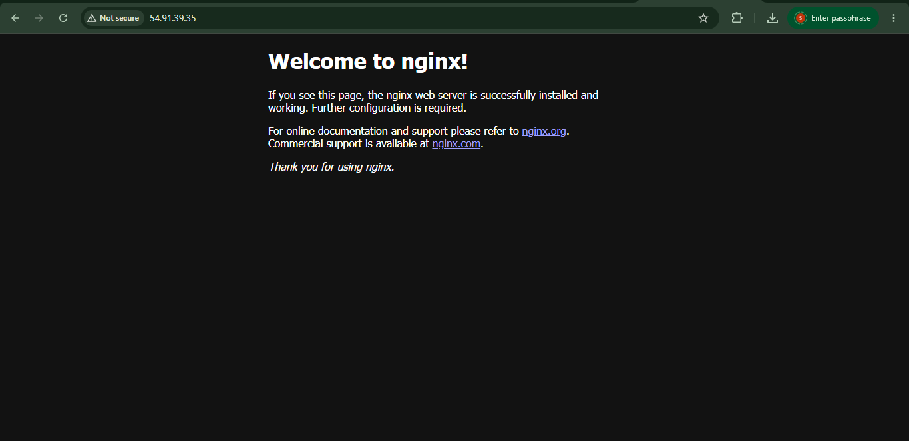
This shows that the web server is correctly installed and it is accessible throuhg the firewall.

6. Another way to retrieve the public ip address other than check the aws console

**curl -s http://169.254.169.254/latest/meta-data/public-ipv4**

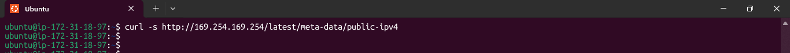
The above command, gave an error `and did not retrieve the public ip address.

### Technical Documentation: Resolving EC2 Public IP Retrieval Issues

🛑 Problem Statement  

When attempting to retrieve the EC2 instance's public IP address from within the Linux terminal using the standard AWS metadata endpoint (curl -s http://169.254.169.254/latest/meta-data/public-ipv4), the command returned a blank output and failed silently.  

Additionally, running a generic third-party lookup via `curl ipconfig.me` returned a `301 Moved Permanently` redirect message instead of the IP address.

🔍 Root Cause Analysis  

    1. AWS IMDSv2 Enforcement: The EC2 instance is configured to require Instance Metadata Service Version 2 (IMDSv2). Since curl -s http://169.254.169.254/latest/meta-data/public-ipv4 is an IMDSv1 command, AWS IMDSv2 blocks direct curl requests to the metadata IP. It strictly requires a session token via a PUT request to a specific URL path (/latest/api/token) before it will release any server data. 
    
    A shortcut would have been changing IMDSv2 from Required to Optional to solve the problem and allow the original curl command to work instantly. By making it optional, it will enable IMDSv1, which allows insecure, direct metadata requests without a token. However, AWS made IMDSv2 the default because IMDSv1 is vulnerable to SSRF (Server-Side Request Forgery) attacks. If an attacker exploits a vulnerability in a web application running on the server, an attacker can easily steal AWS IAM role credentials using that exact curl command.
     
    2. Truncated Command Line: Attempts to automate the IMDSv2 token creation via a .bashrc alias failed because the long AWS endpoint paths were being truncated/cut off during the terminal paste operation.  
   
    3. HTTP to HTTPS Redirect: The curl ipconfig.me command failed because the service now enforces secure connections (https). Without explicit flags, curl does not follow web redirects.

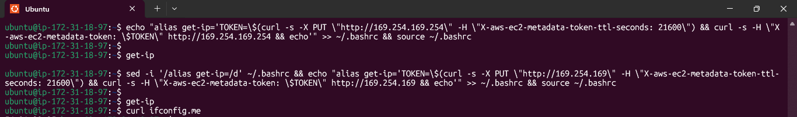

🛠️ Resolution Summary...

1. The solution involved bypassing the long, complex AWS metadata service URLs entirely to avoid terminal truncation bugs, while updating the third-party lookup to securely handle web redirects.  
   
2. A permanent bash alias (get-ip) was appended to the user's profile using curl with the -L (location/follow redirects) and -s (silent) flags targeting the secure ifconfig.me service.

To clean up previous attempts and create a secure, short public IP lookup alias

**sed -i '/alias get-ip=/d' ~/.bashrc && echo "alias get-ip='curl -sL ifconfig.me && echo'" >> ~/.bashrc && source ~/.bashrc**

Running the shortened alias command now instantly outputs the correct public IPv4 address

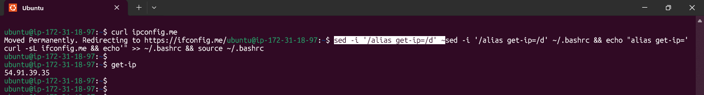

## Step 2 - Install MySQL

1. Install a relational database (RDB)

MySQL was installed in this project. It is a popular relational database management system used within PHP environments.

**sudo apt install mysql-server**

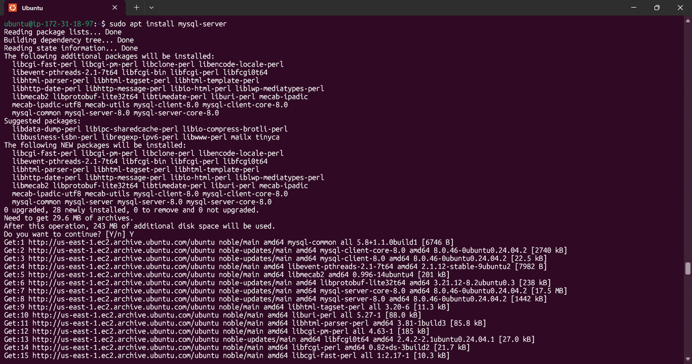

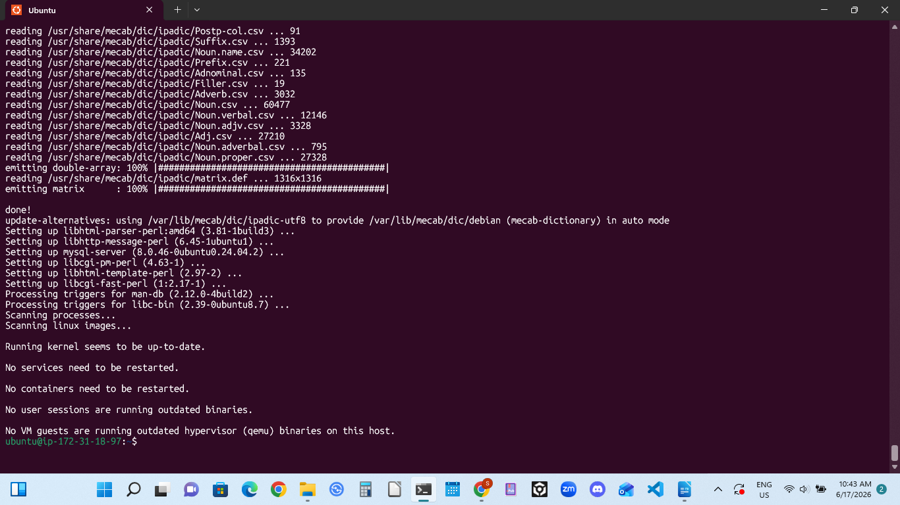

2. Log in to mysql console with the command:

**sudo mysql**

This connects to the MySQL server as the administrative database user root infered by the use of sudo when running the command.

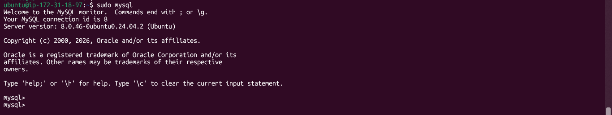

3. Set a password for root user using mysql_native_password as default authentication method.

Here, the user's password was defined as "`PassWord.1`"

**ALTER USER 'root'@'localhost' IDENTIFIED WITH mysql_native_password BY 'PassWord.1';**

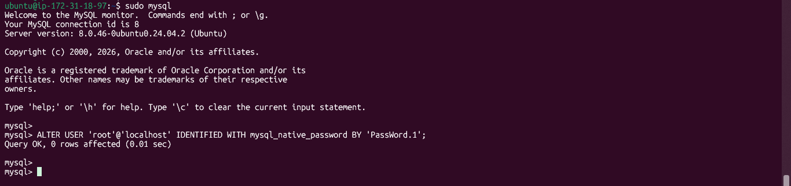

Exit the MySQL shell with this command:

**exit**

4. Run an Interactive script to secure MySQL

The security script comes pre-installed with mysql. This script removes some insecure settings and lock down access to the database system.

**sudo mysql_secure_installation**

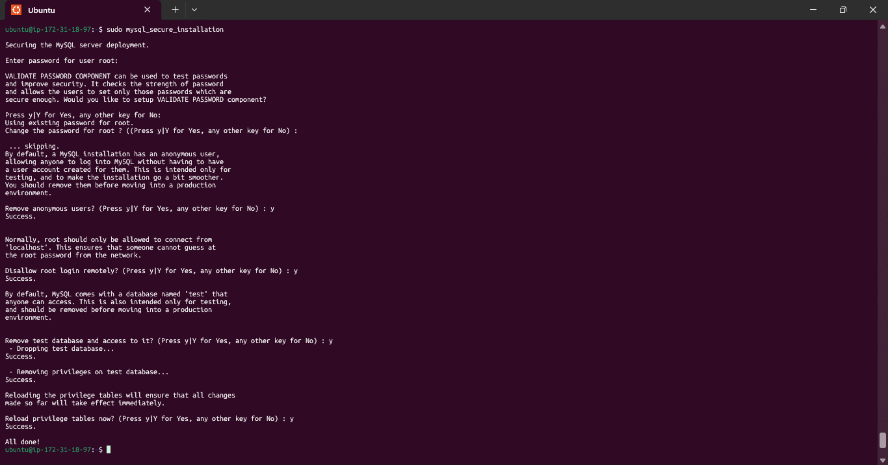

5. After changing root user password, log in to MySQL console.

A command prompt for password was noticed after running the command below.

**sudo mysql -p**

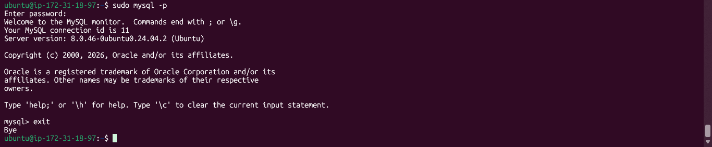
MySQL shell was exited with the command 

**exit**

## Step 3 - Install PHP

1. Install php

Install `php-fpm` (PHP fastCGI process manager) and tell nginx to pass PHP requests to this software for processing. Also, install `php-mysql`, a php module that allows PHP to communicate with MySQL-based databases. Core PHP packages will automatically be installed as dependencies.

The following were installed:

- `php-fpm` (PHP fastCGI process manager)  

- `php-mysql`  
  
**sudo apt install php-fpm php-mysql**

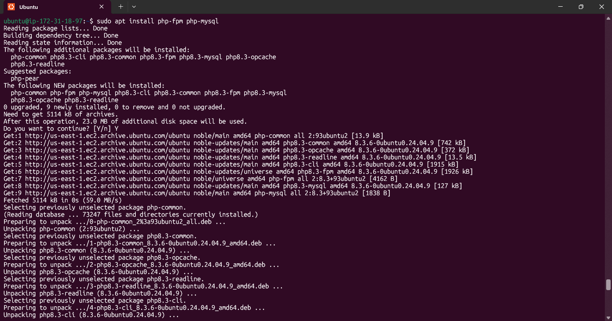

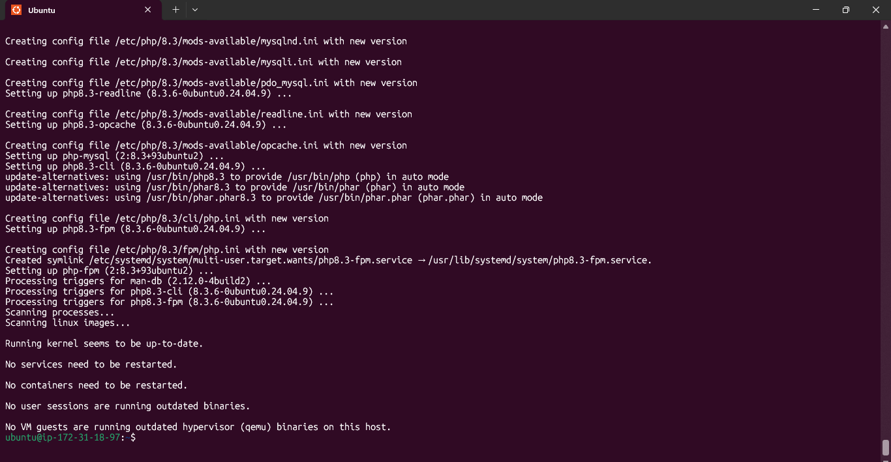

## Step 4 - Configure nginx to use PHP processor

This involves creating server blocks in Nginx (virtual host in Apache) to ensure that many domains can be hosted on the same webserver.

1. Create a root web directory for your_domain

**sudo mkdir /var/www/projectLEMP**

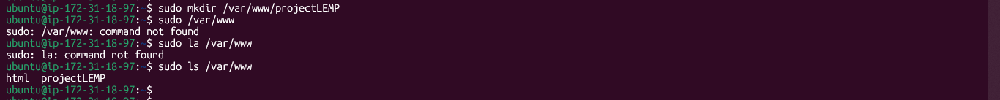

2. Assign the directory ownership with $USER which will reference the current system user

**sudo chown -R \$USER:$USER /var/www/projectLEMP**

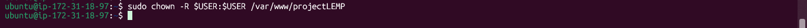

3. Create a new configuration file in Nginx’s “sites-available” directory.

**sudo nano /etc/nginx/sites-available/projectLEMP**

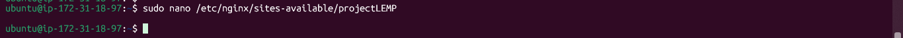

Paste in the following bare-bones configuration:

server {  
  listen 80;
  server_name projectLEMP www.projectLEMP;
  root /var/www/projectLEMP;  

  index index.html index.htm index.php;

  location / {
    try_files $uri $uri/ =404;
  }

  location ~ \.php$ {  
    include snippets/fastcgi-php.conf;  
    fastcgi_pass unix:/var/run/php/php8.1-fpm.sock;  
  }

  location ~ /\.ht {  
    deny all;  
    }  
}

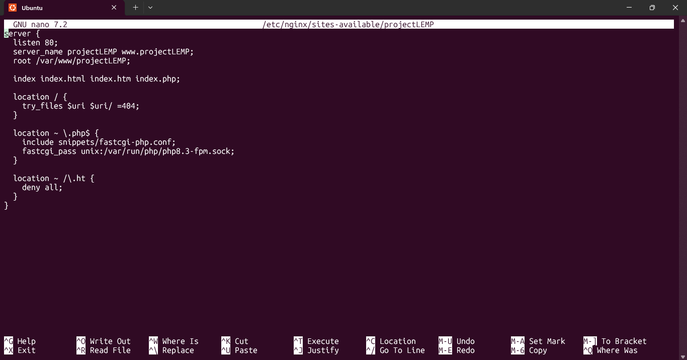

Here’s what each directives and location blocks does:  

**listen** - Defines what port nginx listens on. In this case it will listen on port 80, the default port for HTTP.

**root** - Defines the document root where the files served by this website are stored.

**index** - Defines in which order Nginx will prioritize the index files for this website. It is a common practice to list index.html files with a higher precedence than index.php files to allow for quickly setting up a maintenance landing page for PHP applications. You can adjust these settings to better suit your application needs.

**server_name** - Defines which domain name and/or IP addresses the server block should respond for. Point this directive to your domain name or public IP address.

**location /** - The first location block includes the try_files directive, which checks for the existence of files or directories matching a URI request. If Nginx cannot find the appropriate result, it will return a 404 error.

**location ~ .php$** - This location handles the actual PHP processing by pointing Nginx to the fastcgi-php.conf configuration file and the php7.4-fpm.sock file, which declares what socket is associated with php-fpm.

**location ~ /.ht** - The last location block deals with .htaccess files, which Nginx does not process. By adding the deny all directive, if any .htaccess files happen to find their way into the document root, they will not be served to visitors.

4. Activate the configuration by linking to the config file from Nginx’s sites-enabled directory

**sudo ln -s /etc/nginx/sites-available/projectLEMP /etc/nginx/sites-enabled/**

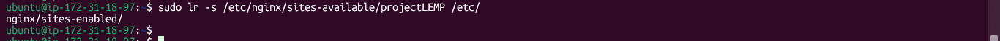
This will tell Nginx to use this configuration when next it is reloaded.

5. Test the configuration for syntax error

**sudo nginx -t**

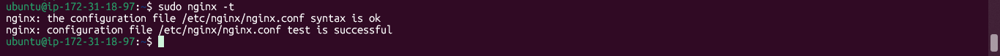

6. Disable the default Nginx host that currently configured to listen on port 80

**sudo unlink /etc/nginx/sites-enabled/default**

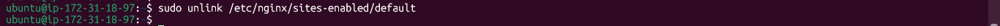

7. Reload Nginx to apply the changes

**sudo systemctl reload nginx**

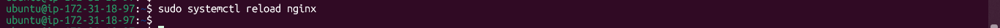

8. The new website is now active but the web root /var/www/projectLEMP is still empty. Create an index.html file in this location so to test the virtual host work as expected.

**sudo echo 'Hello LEMP from hostname' $(TOKEN=`curl -X PUT "http://169.254.169.254/latest/api/token" -H "X-aws-ec2-metadata-token-ttl-seconds: 21600"` && curl -H "X-aws-ec2-metadata-token: $TOKEN" -s http://169.254.169.254/latest/meta-data/public-hostname) 'with public IP' $(TOKEN=`curl -X PUT "http://169.254.169.254/latest/api/token" -H "X-aws-ec2-metadata-token-ttl-seconds: 21600"` && curl -H "X-aws-ec2-metadata-token: $TOKEN" -s http://169.254.169.254/latest/meta-data/public-ipv4) > /var/www/projectLEMP/index.html**

The virtual host did not respond correctly.
When automating an HTML landing page configuration via a terminal script, the final webpage output either left the public IP blank, both public IP and public hostname blank or erroneously printed a massive list of historical dates (e.g., 2007-01-19, 2026-04-15, latest) instead of the actual public IPv4 address.

**🛑 Problem Statement**

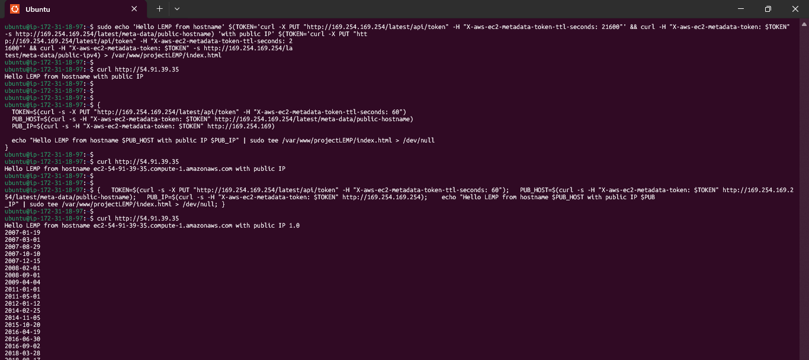

**Root Cause Analysis**  

    1. Terminal Paste Truncation: The SSH/terminal window paste buffer automatically wrapped and cut off long URL configurations mid-line.  
   
    2. AWS Metadata API Fallback: Due to the truncation, the command curl http://169.254.169.254 was cut down to just the root address http://169.254.169. Requesting the root metadata address prompts Amazon's IMDSv2 to output its API directory index (a list of all supported version release dates since 2007), which was then saved into the index.html file.

**🛠️ Resolution Summary**  

The solution utilized a hybrid data-gathering approach to keep the terminal execution commands short and immune to line-wrap truncation bugs.
The public DNS hostname was gathered using the secure AWS IMDSv2 token method, while the public IP was retrieved using an ultra-short external request (curl -sL ifconfig.me) to prevent command cutting.

The below was applied:  
{
  TOKEN=$(curl -s -X  PUT "http://169.254.169.254/latest/api/token" -H "X-aws-ec2-metadata-token-ttl-seconds: 60")  

  PUB_HOST=$(curl -s -H "X-aws-ec2-metadata-token: $TOKEN" http://169.254.169.254/latest/meta-data/public-hostname)  

  PUB_IP=$(curl -sL ifconfig.me)

  echo "Hello LEMP from hostname $PUB_HOST with public IP $PUB_IP" | sudo tee /var/www/projectLEMP/index.html > /dev/null  

}  

The result properly showed the public hostname and public ip address with the command line: 

**curl http://54.91.39.35**

with the response:

*Hello LEMP from hostname ec2-54-91-39-35.compute-1.amazonaws.com with public IP 54.91.39.35*

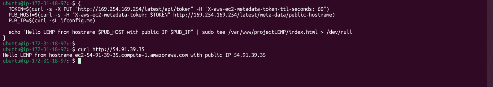

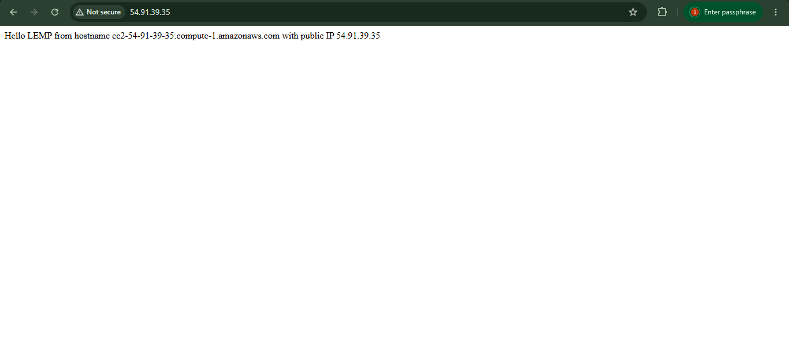

Open it with public dns name (port is optional)  

**http://ec2-54-91.39.35.compute-1.amazonaws.com**

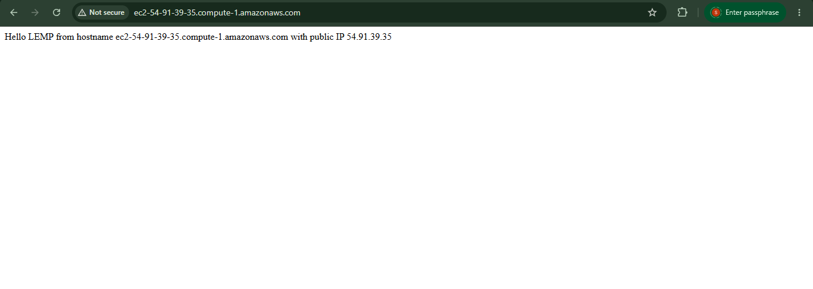

This file can be left in place as a temporary landing page for the application until an index.php file is set up to replace it. Once this is done, remove or rename the index.html file from the document root as it will take precedence over index.php file by default.

The LEMP stack is now fully configured. At this point, the LEMP stack is completely installed and fully operational.

## Step 5 - Test PHP with Nginx
Test the LEMP stack to validate that Nginx can handle the .php files to the PHP processor.

1. Create a test PHP file in the document root. Open a new file called info.php within the document root.

**sudo nano /var/www/projectLEMP/info.php**

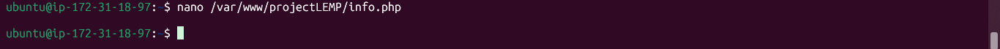

Paste in:

\<?php  
phpinfo();

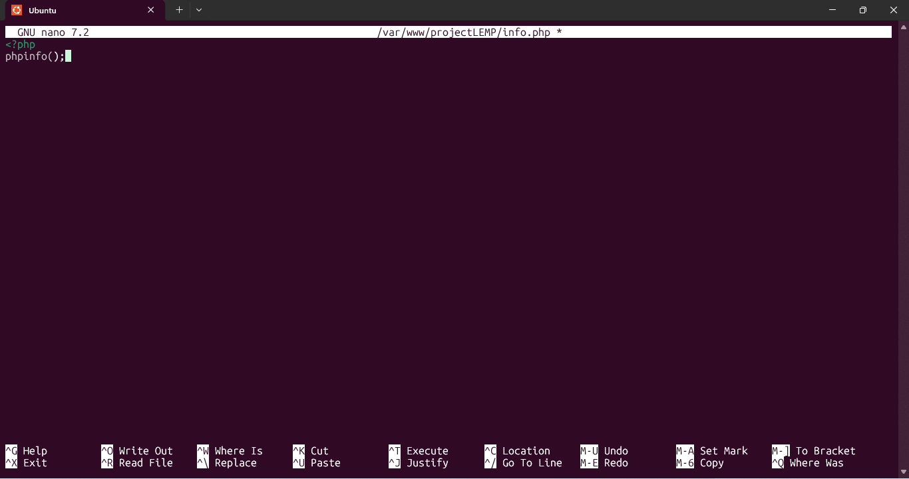

2. Access the page on the browser and attach /info.php

**http://54.91.39.35/info.php**

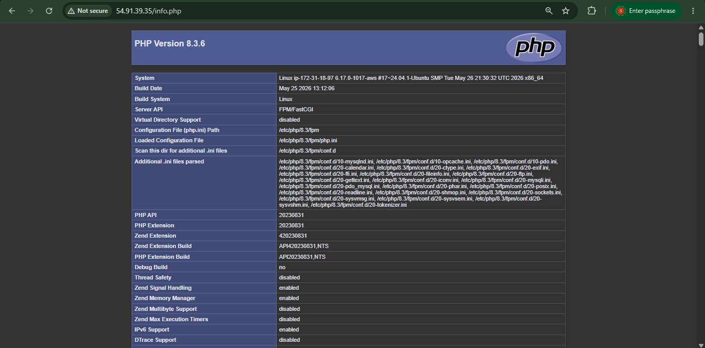

After checking the relevant information about the server through this page, It’s best to remove the file created as it contains sensitive information about the PHP environment and the ubuntu server. It can always be recreated if the information is needed later.

**sudo rm /var/www/projectLEMP/info.php**

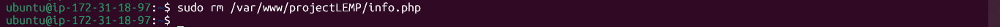

## Step 6 - Retrieve Data from MySQL database with PHP
Create a new user with the mysql_native_password authentication method in order to be able to connect to MySQL database from PHP.  

Create a database named `example_database` and a user named `example_user`

1. First, connect to the MySQL console using the root account.

**sudo mysql -p**

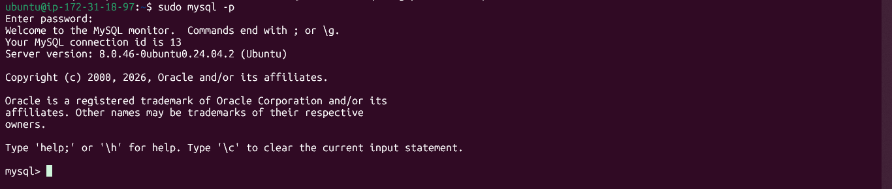

2. Create a new database

**CREATE DATABASE example_database;**

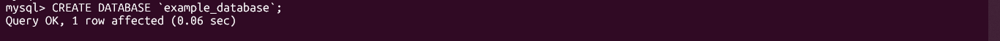

3. Create a new user and grant the user full privileges on the new database.

**CREATE USER 'example_user'@'%' IDENTIFIED WITH mysql_native_password BY 'PassWord.1';**

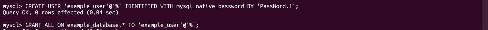

**GRANT ALL ON example_database.* TO 'example_user'@'%';**

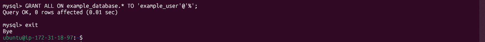

**exit**

4. Login to MySQL console with the user custom credentials and confirm that you have access to example_database.

**mysql -u example_user -p**

**SHOW DATABASES;**

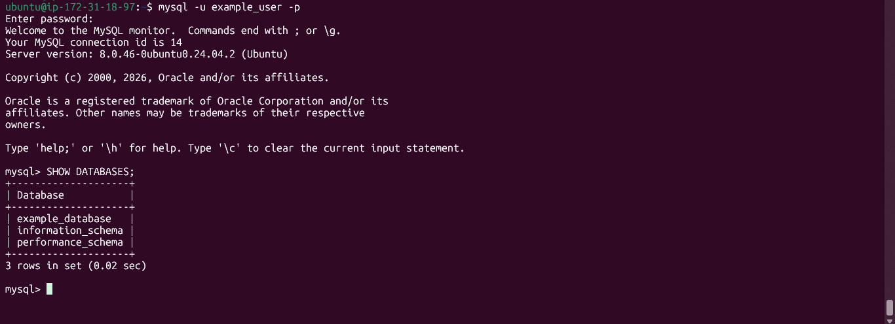
The -p flag will prompt for password used when creating the example_user

5. Create a test table named todo_list.

From MySQL console, run the following:

CREATE TABLE example_database.todo_list (  
  item_id INT AUTO_INCREMENT,  
  content VARCHAR(255),  
  PRIMARY KEY(item_id)  
);

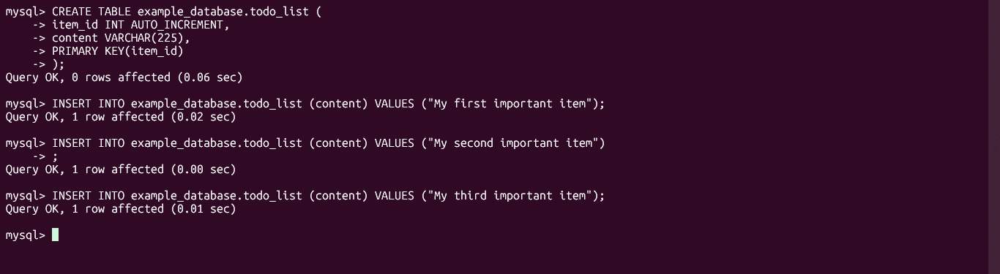

6. Insert a few rows of content to the test table.

INSERT INTO example_database.todo_list (content) VALUES ("My first important item");

INSERT INTO example_database.todo_list (content) VALUES ("My second important item");

INSERT INTO example_database.todo_list (content) VALUES ("My third important item");

INSERT INTO example_database.todo_list (content) VALUES ("and this one more thing");

7. To confirm that the data was successfully saved to the table run:

**SELECT * FROM example_database.todo_list;**

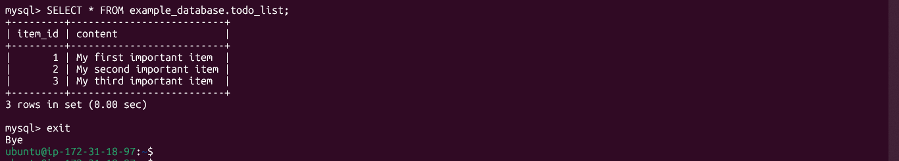

**exit**

8. Create a PHP script that will connect to MySQL and query the content.

Create a new PHP file in the custom web root directory

**sudo nano /var/www/projectLEMP/todo_list.php**

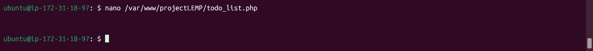

The PHP script connects to MySQL database and queries for the content of the todo_list table, displays the results in a list. If there’s a problem with the database connection, it will throw an exception.

Copy the content below into the todo_list.php script.

\<?php  
\$user = "example_user";  
\$password = "PassWord.1";  
\$database = "example_database";  
\$table = "todo_list";  

try {  
  \$db = new PDO("mysql:host=localhost;  
   dbname=\$database", \$user, \$password);  
   echo \"\<h2>TODO\</h2>\<ol>";  
  foreach($db->query("SELECT content FROM $table") as $row)  
  {  
    echo "\<li>" . $row['content'] . "\</li>";  
  }  
  echo "\</ol>";  
} catch (PDOException $e) {
    print "\Error!: " . $e->getMessage() . "\ ";  
    die();  
}  
?>

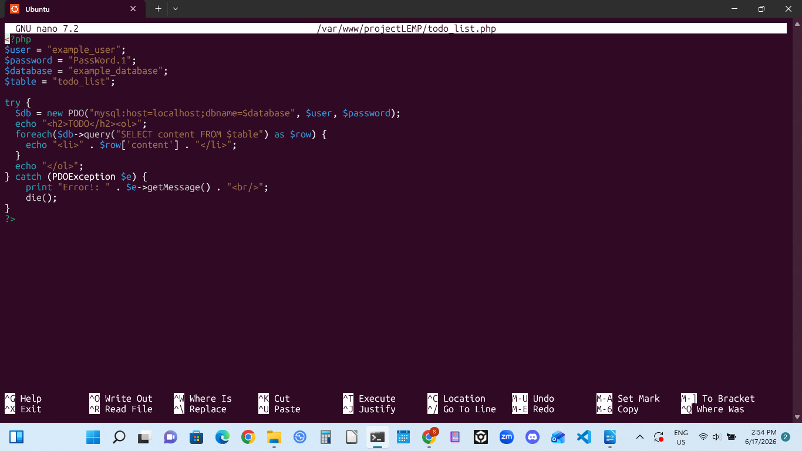

9. Access the database page in your web browser using the public ip or domain name configured for the website followed by `/todo_list.php`

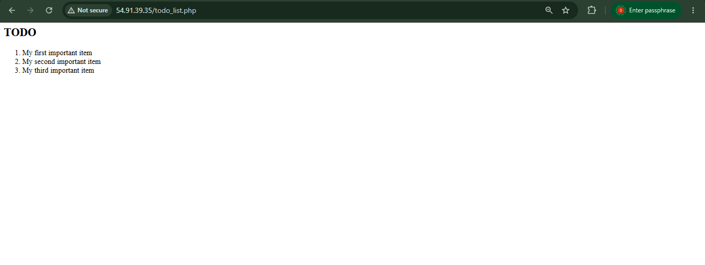

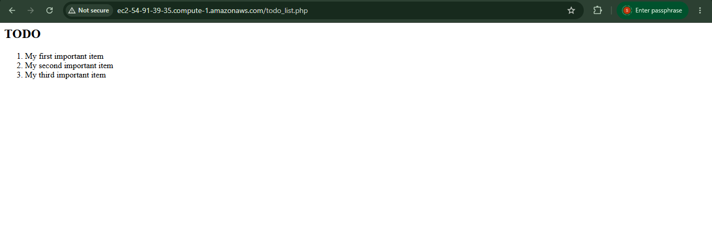

## Conclusion

The LEMP stack provides a robust platform for hosting and serving web applications. By leveraging the power of Linux, Nginx, MySQL (or MariaDB), and PHP, developers can deploy scalable and reliable web solutions.

