# MERN WEB STACK IMPLEMENTATION IN AWS

## Introduction
The MERN stack is a popular choice for building dynamic web applications. It leverages a combination of JavaScript technologies:

`MongoDB`: A NoSQL document-based database for flexible data storage.

`Express.js`: A lightweight server-side web framework for Node.js that simplifies building APIs and web applications.

`React.js`: A frontend framework and powerful library for creating interactive user interfaces.

`Node.js`: A JavaScript runtime environment that allows execution of server-side JavaScript code.__

This guide provides a comprehensive overview of setting up and utilizing each component of the MERN stack, to develop robust web applications.

## Step 0: Prerequisites

1. EC2 Instance of t3.micro type and Ubuntu 24.04 LTS (HVM) was lunched in the us-east-1c region using the AWS console.

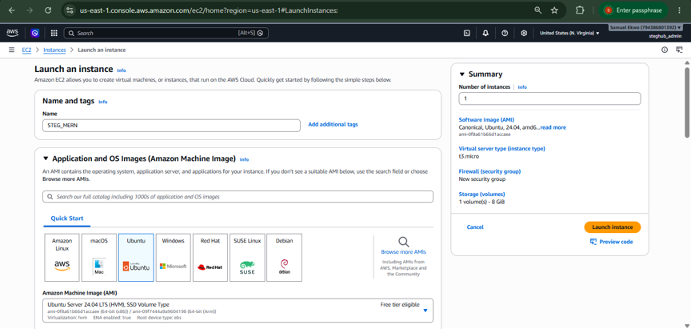

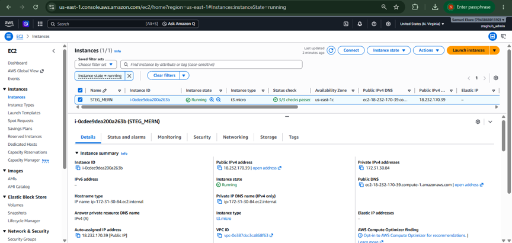

2. Attached SSH key named STEG_MERN key to access the instance on port 22

3. The security group was configured with the following inbound rules:

Allow traffic on `port 80 (HTTP)` with source from anywhere on the internet (0.0.0.0/0).

Allow traffic on `port 443 (HTTPS)` with source from anywhere on the internet (0.0.0.0/0).

Allow traffic on `port 22 (SSH)` with source from any IP address (0.0.0.0/0). This is opened by default.

Allow traffic on `port 5000 (Custom TCP)` with source from anywhere (0.0.0.0/0).

Allow traffic on `port 3000 (Custom TCP)` with sourec from anywhere (0.0.0.0/0).

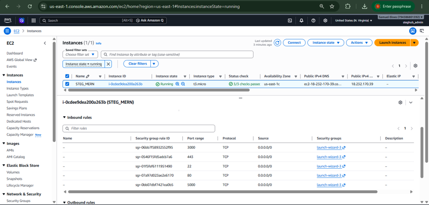

4. The private ssh key permission was changed for the private key file and then used to connect to the instance by running

**chmod 400 STEG_MERN.pem**

**ssh -i STEG_MERN.pem ubuntu@18.232.170.39
Where username=ubuntu and public ip address=18.232.170.39**

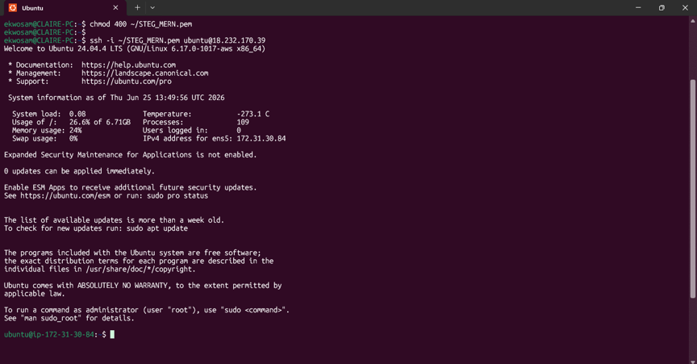

## Step 1 - Backend Configuration

1. Update and upgrade ubuntu

**sudo apt update**

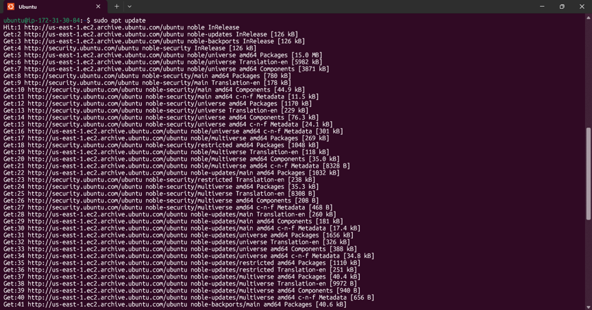

**sudo apt upgrade -y**

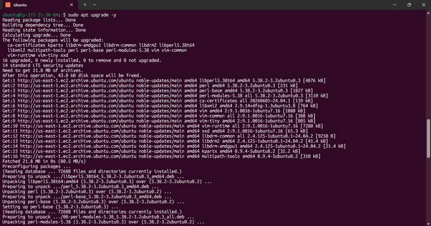

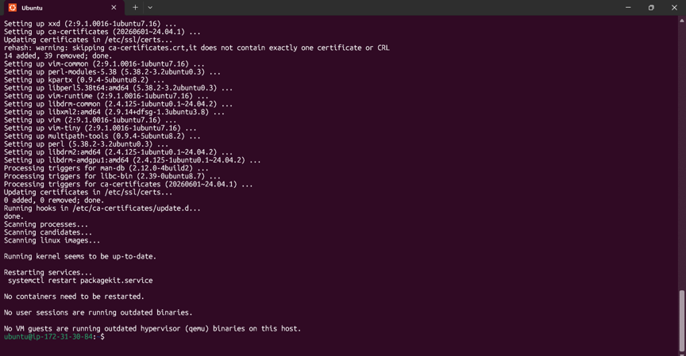

2. Get the location of Node.js software from ubuntu repositories.

**curl fsSL https://deb.nodesource.com/setup_18.x | sudo -E bash -**

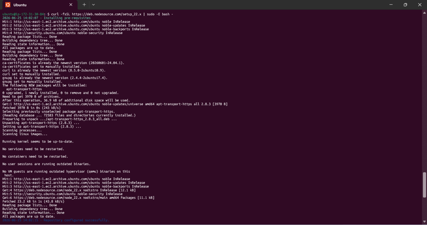

3. Install node.js on the server with the command below.

**sudo apt-get install nodejs -y**

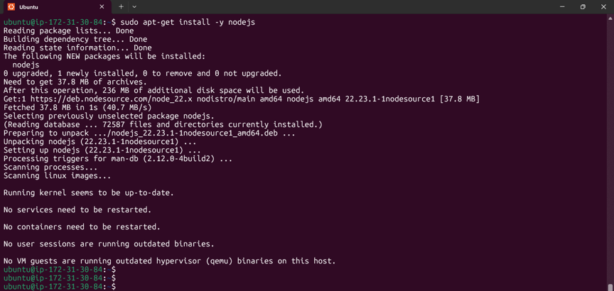

Note: the above command installs both node.js and npm. NPM is a package manager for Node just as apt is a package manager for Ubuntu. It is used to install Node modules and packages and to manage dependency conflicts.

4. Verify the Node installation with the command below.

**node -v**        // Gives the node version

**npm -v**        // Gives the node package manager version

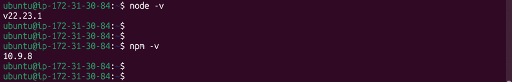

### Application Code Setup

1. Create a new directory for the TO-DO project and switch to it. Then initialize the project directory.

**mkdir Todo && ls && cd Todo**

**npm init**

Then,

run the **ls** command to confirm the package.json file is created.

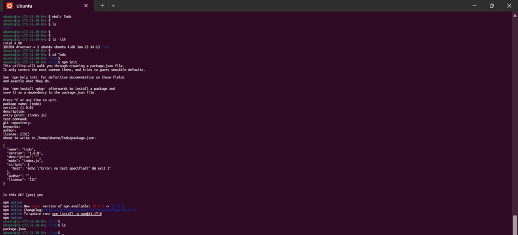

This is to initialize the project directory and in the process, creates a new file called `package.json`. This file contains information about the application and the dependencies it needs to run. Follow the prompts after running the command. Press “Enter” several times to accept default values, then accept to write out the package.json file by typing yes.

### Install ExpressJs

Express is a framework for Node.js. It simplifies development and abstracts a lot of low level details. For example, express helps to define routes of the application based on HTTP methods and URLs.

1. Install Express using npm

**npm install express**

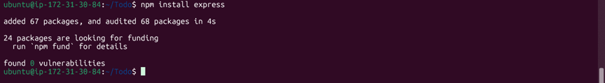

2. Create a file index.js and run ls to confirm the file

**touch index.js && ls**

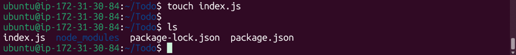

3. Install dotenv module

**npm install dotenv**

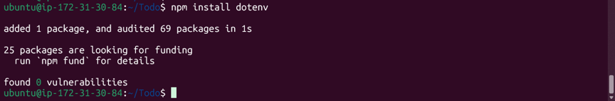

4. Open index.js file

**vim index.js**

Type the code below into it

    const express = require('express');  

    require('dotenv').config();

    const app = express();

    const port = process.env.PORT || 5000;

    app.use((req, res, next) => {  
        res.header("Access-Control-Allow-Origin", "*");  
        res.header("Access-Control-Allow-Headers","Origin, X-Requested-With, Content-Type, Accept");
        next();
    });

    app.use((req, res, next) => {  
        res.send('Welcome to Express');  
    });

    app.listen(port, () => {  
        console.log(`Server running on port ${port}`);  
    });

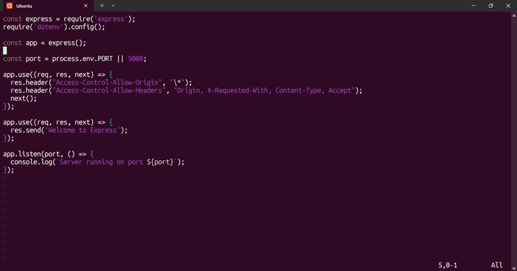

Note: Port 5000 have been specified to be used in the code. This was required later on the browser.

5. Start the server to see if it works. Open the terminal in the same directory as the index.js file. Run

**node index.js**

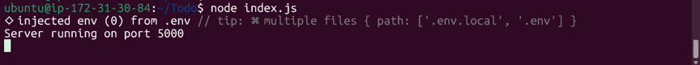

Port 5000 has been opened in ec2 security group.

Access the server with the public IP followed by the port

http://18.232.170.39:5000

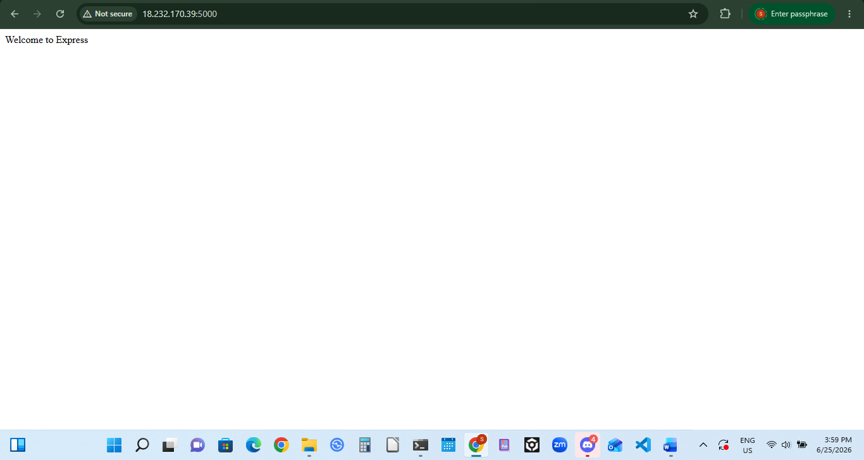

### Routes

There are three actions that the Todo application needs to be able to do:

- Create a new task
- Display list of all task
- Delete a completed task  
  
Each task was associated with some particular endpoint and used different standard HTTP request methods:  

 `POST`  

 `GET`   

 `DELETE`.

For each task, routes were created which defined various endpoints that the ToDo app depends on.

1. Create a folder `routes`, switch to `routes` directory and create a file api.js. Open the file

**mkdir routes && cd routes && touch api.js**

Then, run the command 

**vim api.js**

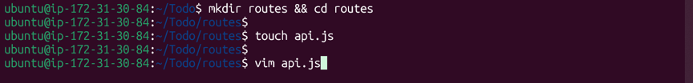

Copy the code below into the file

    const express = require('express');  

    const router = express.Router();

    router.get('/todos', (req, res, next) => {

    });

    router.post('/todos', (req, res, next) => {

    });

    router.delete('/todos/:id', (req, res, next) => {

    });

    module.exports = router;

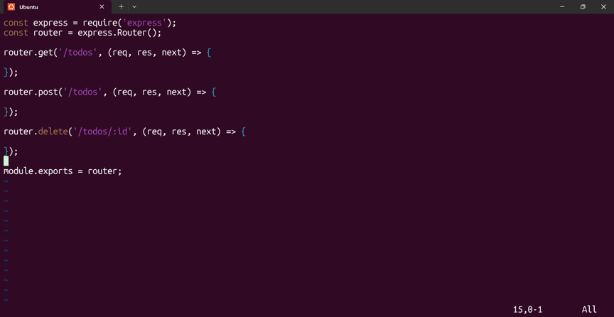

### Models
A model is at the heart of JavaScript based applications and it is what makes it interactive.

Models was used to define the database schema. This is important in order be able to define the fields stored in each Mongodb document.

In essence, the schema is a blueprint of how the database is constructed, including other data fields that may not be required to be stored in the database. These are known as virtual properties. To create a schema and a model, mongoose was installed, which is a Node.js package that makes working with mongodb easier.

1. Change the directory back to Todo folder and install mongoose

**npm install mongoose**

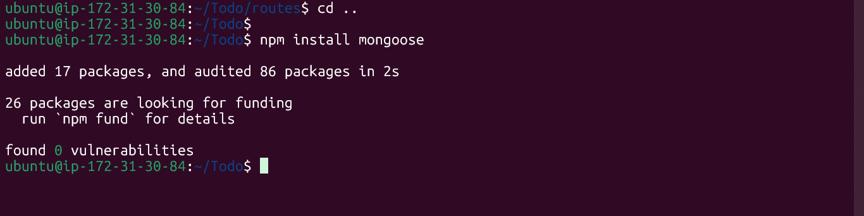

2. Create a new folder models, switch to models directory, create a file todo.js inside models. Open the file

**mkdir models && cd models && touch todo.js**

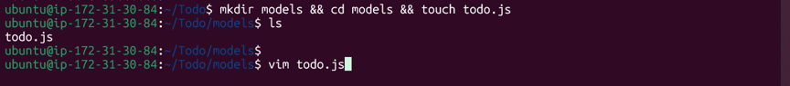

Open the file using the command

**vim todo.js**

Paste the code below into the file

    const mongoose = require('mongoose');
    const Schema = mongoose.Schema;

    // Create schema for todo
    const TodoSchema = new Schema({
        action: {
            type: String,
            required: [true, 'The todo text field is required']
    }
    });

    // Create model for todo
    const Todo = mongoose.model('todo',            TodoSchema);

    module.exports = Todo;

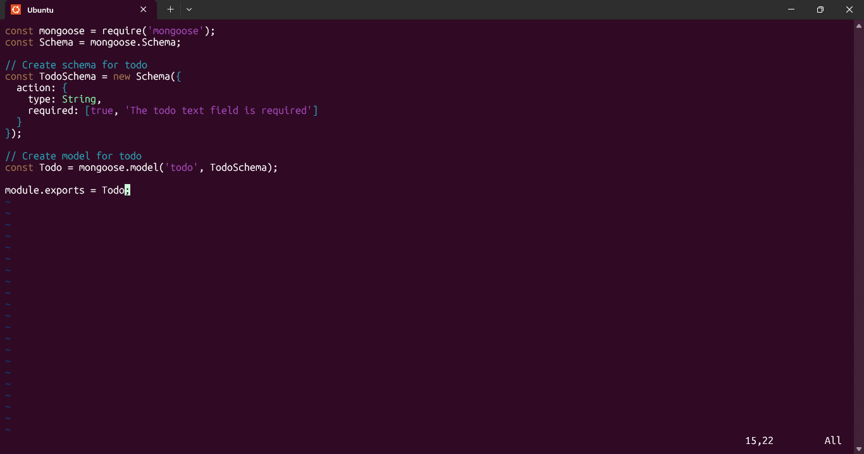

The routes was updated from the file api.js in the ‘routes’ directory to make use of the new model.

3. In Routes directory, open api.js and delete the code inside with :%d.

**vim api.js**

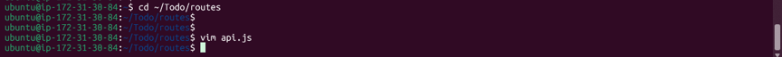
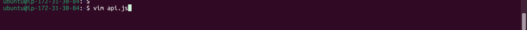

Paste the new code below into it

    const express = require('express');
    const router = express.Router();
    const Todo = require('../models/todo');

    router.get('/todos', (req, res, next) => {
        // This will return all the data, exposing only the id and action field to the client
    Todo.find({}, 'action')
        .then(data => res.json(data))
        .catch(next);
    });

    router.post('/todos', (req, res, next) => {
        if (req.body.action) {
            Todo.create(req.body)
            .then(data => res.json(data))
            .catch(next);
    } else {
        res.json({
            error: "The input field is empty"
        });
    }
    });

    router.delete('/todos/:id', (req, res, next) => {
        Todo.findOneAndDelete({"_id": req.params.id})
            .then(data => res.json(data))
            .catch(next);
    });

    module.exports = router;

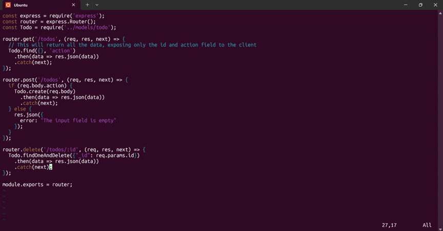

### MongoDB Database

mLab provides MongoDB database as a service solution (DBaaS). MongoDB has two cloud database management system components: mLab and Atlas, Both were formerly cloud databases managed by MongoDB (MongoDB acquired mLab in 2018, with certain differences). In November, MongoDB merged the two cloud databases and as such, mLab.com redirects to the MongoDB Atlas website.

1. Create a MongoDB database and collection inside MongoDB Atlas

MongoDB Cluster Overview

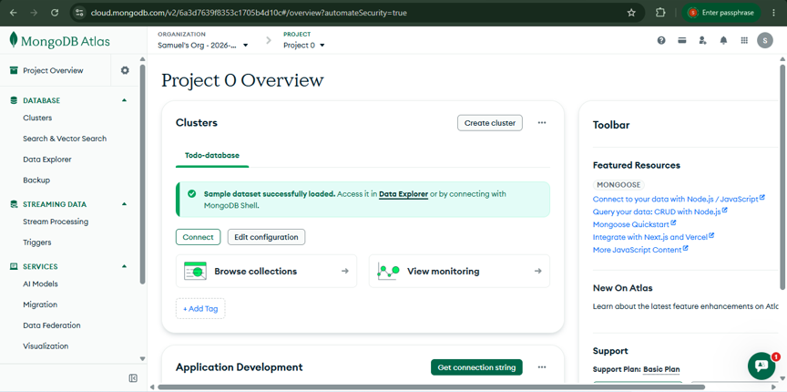

AWS cloud provider, in region N. Virginia (us-east-1) was selected.

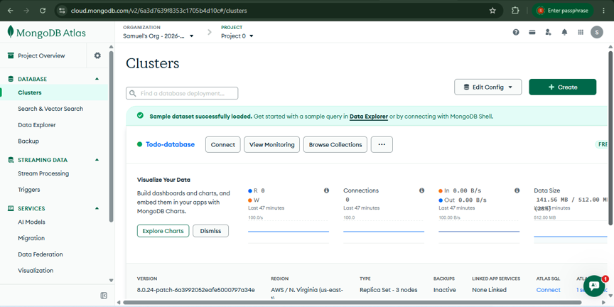

Access from anywhere to the MongoDB database was allowed (Not secure but it is ideal for testing).

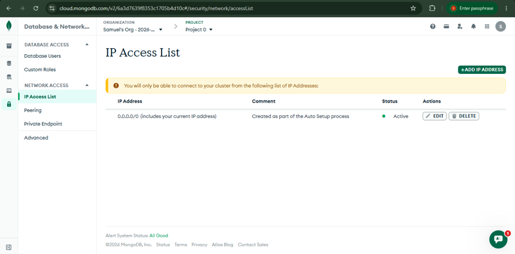

A database named todo_database and collections named todos was created.

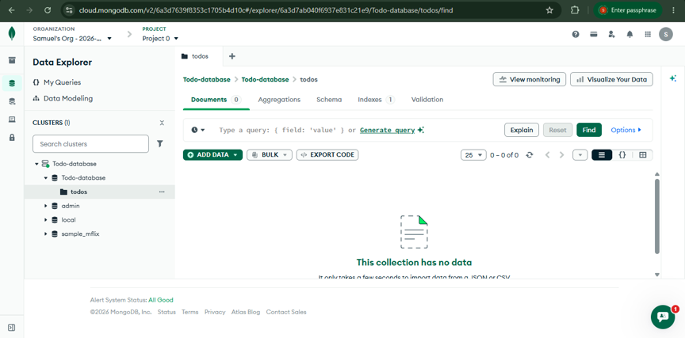

2. Create a file in your Todo directory and name it .env, open the file

**touch .env && vim .env**

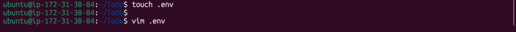

Add connection string below to access the database

DB = ‘mongodb+srv://\<username>:\<password>@\<network-address>/\<dbname>?retryWrites=true&w=majority’

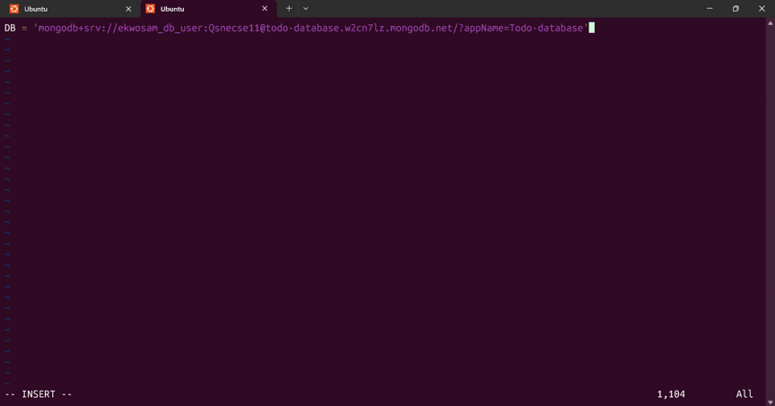

3. Update the index.js to reflect the use of .env so that Node.js can connect to the database.

**vim index.js**

Delete existing content in the file, and update it with the entire code below:

    const express = require('express');
    const bodyParser = require('body-parser');
    const mongoose = require('mongoose');
    const routes = require('./routes/api');
    const path = require('path');
    require('dotenv').config();

    const app = express();

    const port = process.env.PORT || 5000;

    // Connect to the database
    mongoose.connect(process.env.DB, {          useNewUrlParser: true, useUnifiedTopology: true })
    .then(() => console.log(`Database connected successfully`))
    .catch(err => console.log(err));

    // Since mongoose promise is deprecated, we override it with Node's promise
    mongoose.Promise = global.Promise;

    app.use((req, res, next) => {
        res.header("Access-Control-Allow-Origin", "*");
        res.header("Access-Control-Allow-Headers", "Origin, X-Requested-With, Content-Type, Accept");
        next();
    });

    app.use(bodyParser.json());

    app.use('/api', routes);

    app.use((err, req, res, next) => {
        console.log(err);
        next();
    });

    app.listen(port, () => {
        console.log(`Server running on port ${port}`);
    });

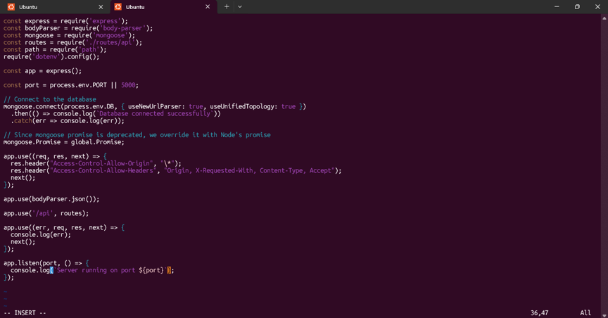

Using environment variables to store information is considered more secure and best practice to separate configuration and secret data from the application, instead of writing connection strings directly inside the index.js application file.

4. Start your server using the command

**node index.js**
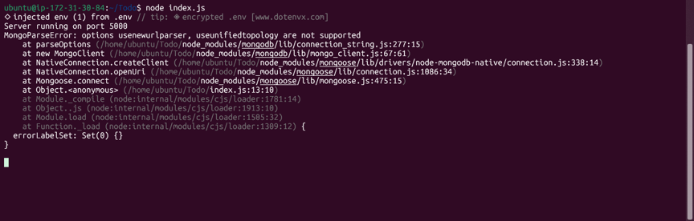

The database connection was not successful.

**Summary of the Database Connection Issue and Resolution**

**1. The Core Issue**  
The Node.js deployment backend (index.js) was failing to connect to your live MongoDB Atlas cloud database. The issue occurred in two progressive stages:  

    • Stage 1 (Outdated Code Options): The application initially crashed with a MongoParseError because it contained obsolete configuration properties (useNewUrlParser and useUnifiedTopology). These options were completely removed in modern versions of Mongoose.  

    • Stage 2 (Environment Misconfiguration): After removing the broken code options, the app crashed again with a MongooseError stating that the connection string URI was undefined. The application could not read the database credentials from the environment file.

**2. Actions Taken to Fix It**  
To resolve both errors and secure a stable database connection, the following actions were executed:  

    • Cleaned Up Mongoose Configuration: Opened index.js using Vim and deleted the outdated object parameters from the mongoose.connect() function block. This streamlined the connection syntax to meet modern development standards.  

    • Synchronized Environment Variables: Edited the .env file via Vim to ensure the connection string variable name was explicitly set to MONGO_URI. This step aligned it letter-for-letter with the process.env.MONGO_URI call inside the application code.  

    • Verified Runtime Injection: Verified that the  training framework’s native runtime tool (dotenvx) was successfully pre-loading and injecting that MONGO_URI directly into the server memory on boot.  

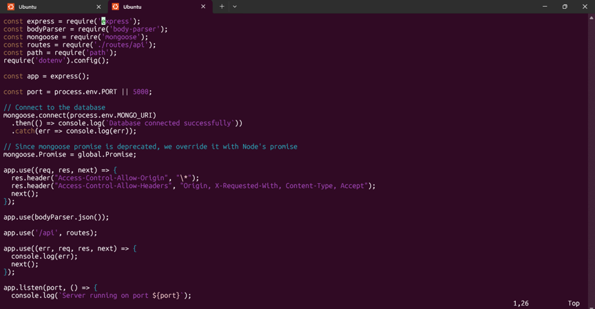

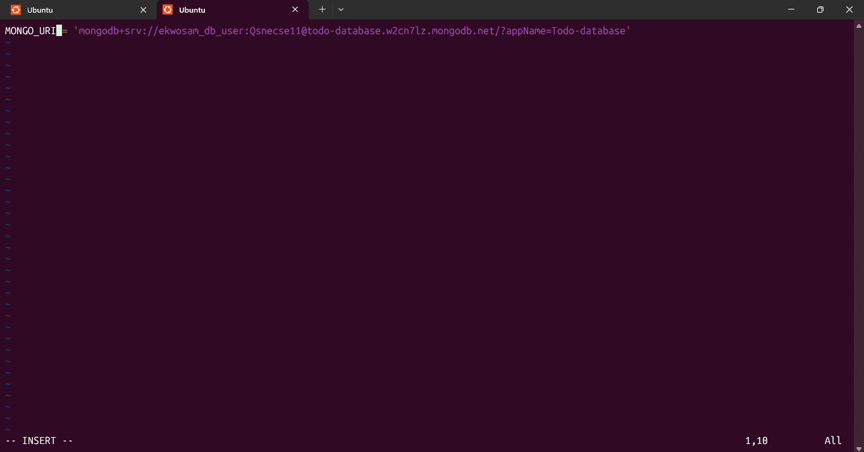

**3. The Result**  

Upon running node index.js, the backend application successfully started on port 5000 and established a secure, live cloud connection to the database cluster, printing: "Database connected successfully".

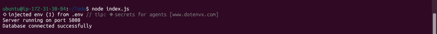

### Testing Backend Code without Frontend using RESTful API

Postman was used to test the backend code. The endpoints were tested. For the endpoints that require body, JSON was sent back with the necessary fields since it’s what was set up in the code.

1. Open Postman and Set the header

http://18.232.170.39:5000/api/todos

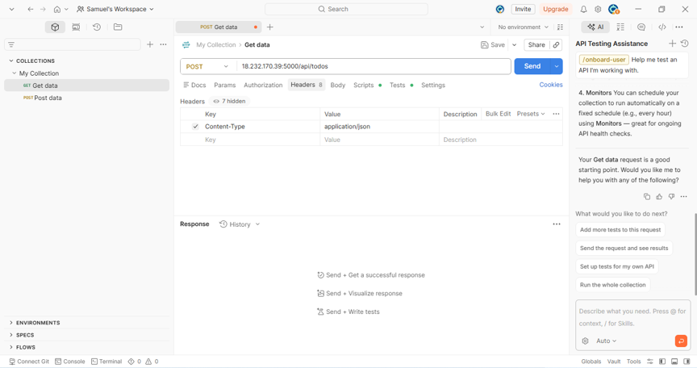

Create POST requests to the API

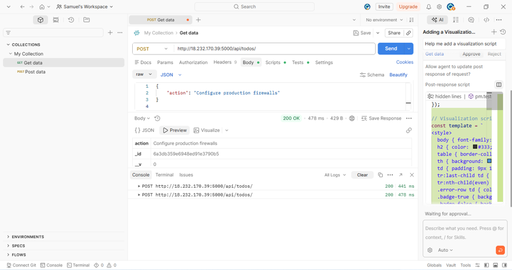

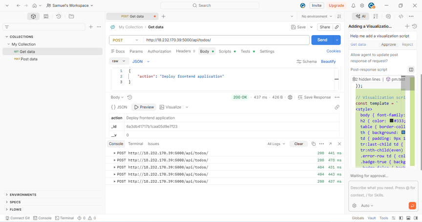

Check Database Collections

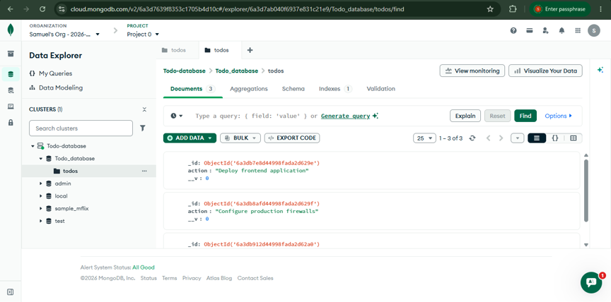
Three entries were recorded under "Documents" tab.

Make a GET requests to the API

This request retrieves all existing records from our To-Do application (backend requests these records from the database and sends us back as a response to GET request).

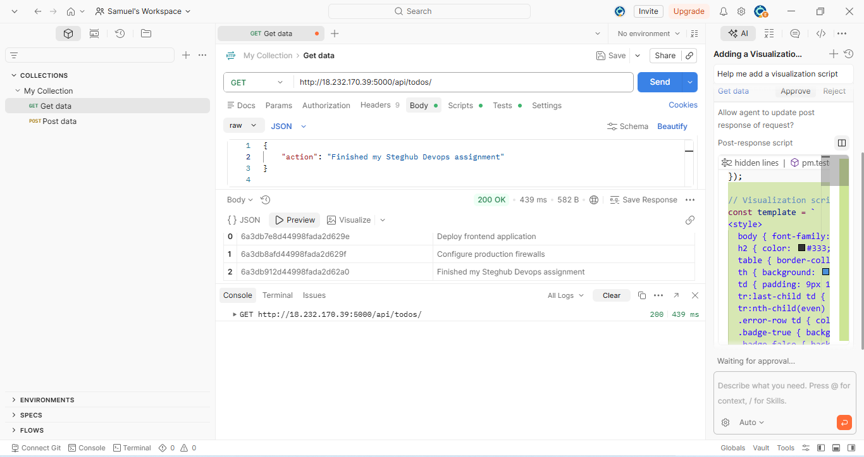

Create a DELETE requests to the API

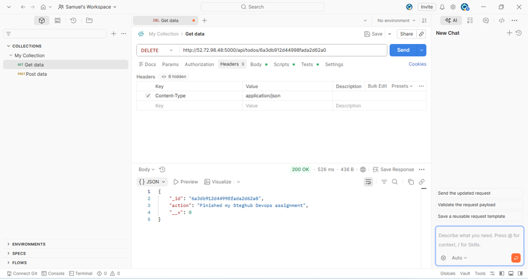

Check Database Collections for successful DELETION

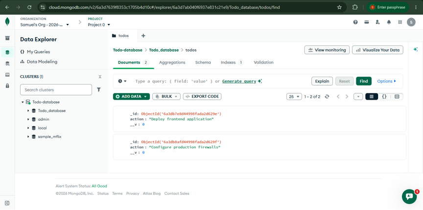

Only two entries were recorded under "Documents" showing that the `DELETE` action was successful.

Make another GET requests to the API

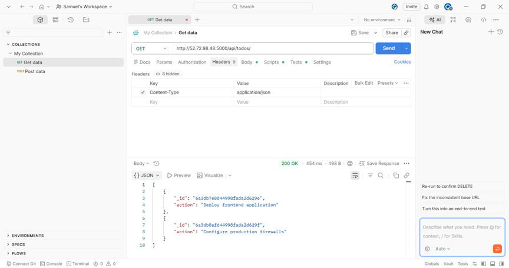

This is final confirmation that only two entries were recorded under "Documents" showing that the `DELETE` action was successful.

## Step 2 - Frontend Creation

It is time to create a user interface for a Web client (browser) to interact with the application via API

1. In the same root directory as your backend code, which is the Todo directory, run:

**npx create-react-app client**

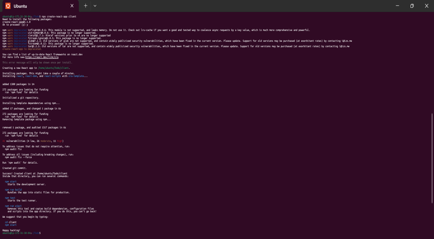

This created a new folder in the Todo directory called client, where all the react code was added.

Running a React App  

Before testing the react app, the following dependencies needs to be installed in the project root directory.

`Install concurrently`. It is used to run more than one command simultaneously from the same terminal window.

**npm install concurrently --save-dev**

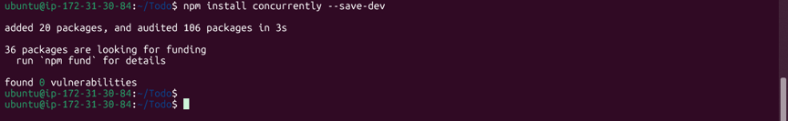

`Install nodemon`. It is used to run and monitor the server. If there is any change in the server code, nodemon will restart it automatically and load the new changes.

**npm install nodemon --save-dev**

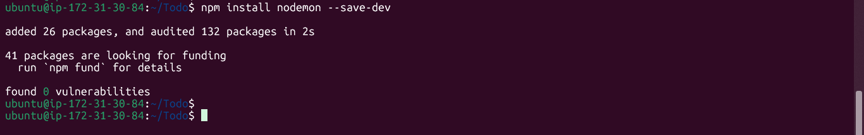

In Todo folder open the package.json file, change the highlighted part of the below screenshot and replace with the code below:

    "scripts": {  
        "start": "node index.js",  
        "start-watch": "nodemon index.js",  
        "dev": "concurrently \"npm run start-watch\"   \\"cd client && npm start\""
    }

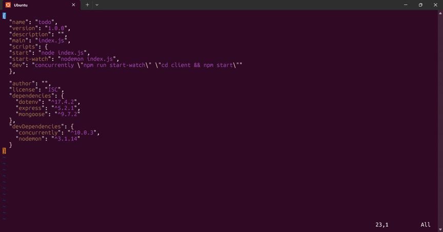

Configure Proxy In package.json

Change directory to “client”

**cd client**

Open the package.json file

**vim package.json**

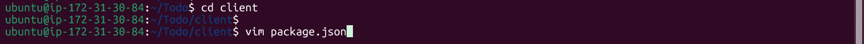

Add the key value pair in the package.json file “proxy”:  
“http://localhost:5000”

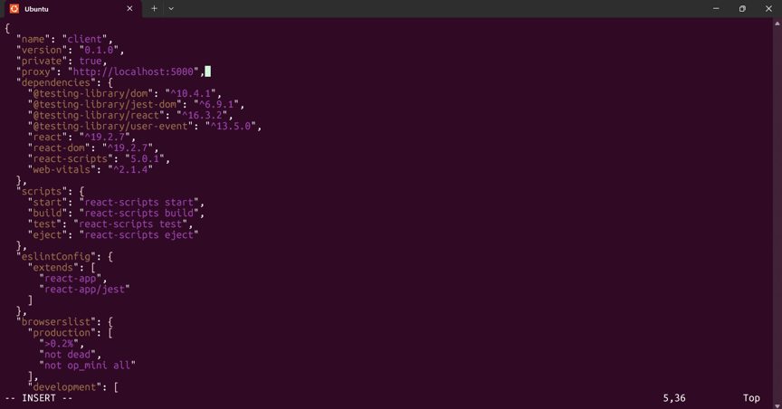

The whole purpose of adding the proxy configuration above is to make it possible to access the application directly from the browser by simply calling the server url like http://locathost:5000 rather than always including the entire path like http://localhost:5000/api/todos

Ensure you are inside the Todo directory, and simply do:

**npm run dev**

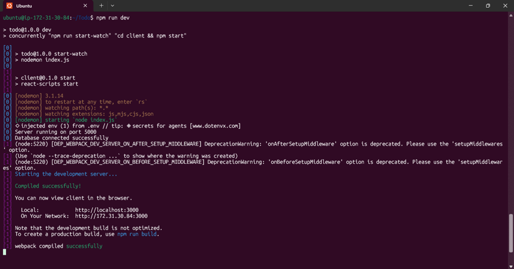

The app opened and started running on localhost:3000

Note: In order to access the application from the internet, TCP port 3000 had been opened on EC2.

Creating React Components
One of the advantages of react is that it makes use of components, which are reusable and also makes code modular. For the Todo app, there are two stateful components and one stateless component. From Todo directory, run:

**cd client**

Move to the “src” directory

**cd src**

2. Inside your src folder, create another folder called “components”

**mkdir components**

Move into the components directory

**cd components**

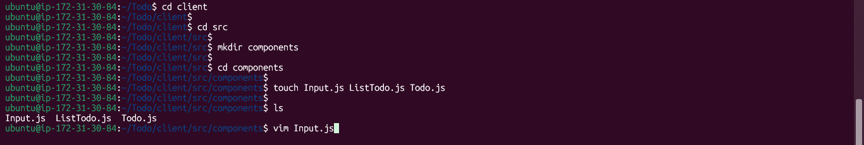

It can be seen that inside the ‘components’ directory three files were created “Input.js”, “ListTodo.js” and “Todo.js” using the command:

**touch Input.js ListTodo.js Todo.js**

3. Confirm React app setup
   
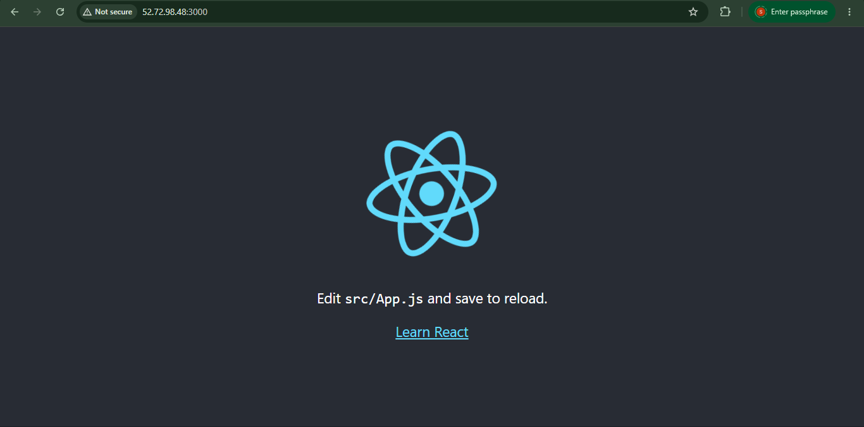

Open Input.js file

**vim Input.js**

Paste in the following:

    import React, { Component } from 'react';
    import axios from 'axios';

    class Input extends Component {
        state = {
            action: ""
        }

        handleChange = (event) => {
            this.setState({ action: event.target.value });
        }

        addTodo = () => {
            const task = { action: this.state.action };

            if (task.action && task.action.length > 0) {
                axios.post('/api/todos', task)
                .then(res => {
            if (res.data) {
                this.props.getTodos();
                this.setState({ action: "" });
                }
            })
                .catch(err => console.log(err));
        } else {
            console.log('Input field required');
            }
        }

        render() {
            let { action } = this.state;
                return (
            

                <input type="text" onChange={this.handleChange} value={action} />
                <button onClick={this.addTodo}>add todo</button>
                

            );
        }
    }

    export default Input;

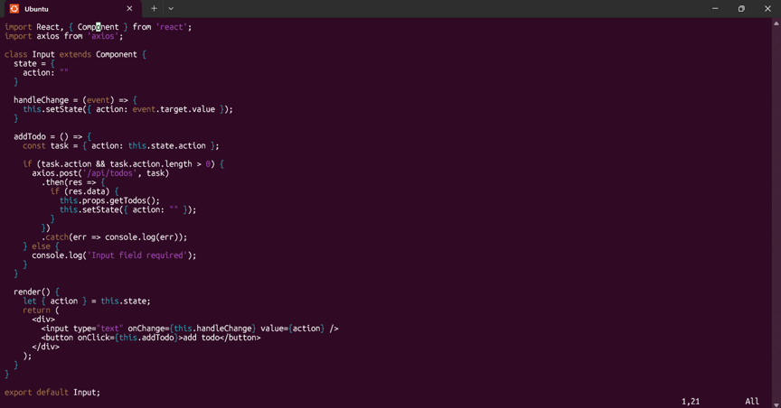

In oder to make use of Axios, which is a Promise based HTTP client for the browser and node.js, you need to cd into your client from your terminal and run yarn add axios or npm install axios.

Move to the client folder

**cd ../..**

Install Axios

**npm install axios**

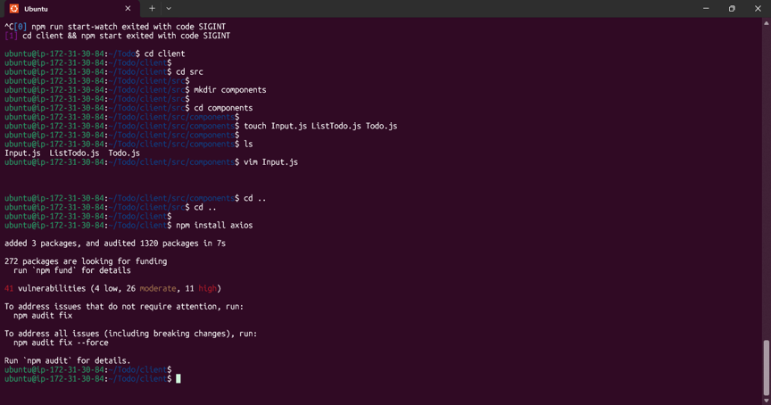

Go to components directory

**cd src/components**

After that open the ListTodo.js

**vim ListTodo.js**

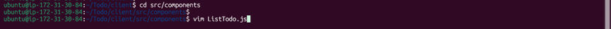

Copy and paste the following code:

    import React from 'react';  

    const ListTodo = ({ todos, deleteTodo }) => {  
        return (  
            \<ul>  
                {  
                    todos && todos.length > 0 ? (  
                    todos.map(todo => {  
                        return (  
                        <li key={todo._id} onClick={() => deleteTodo(todo._id)}>  
                            {todo.action}  
                            \</li>  
                            );  
                        })  
                    ) : (  
                    \<li>No todo(s) left\</li>  
                    )  
                }  
            \</ul>  
        );  
    }  

    export default ListTodo;

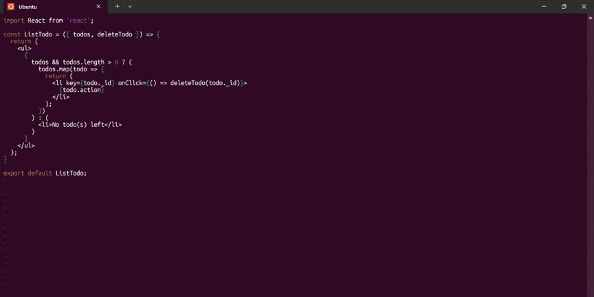

Then in the Todo.js file, write the following code

**vim Todo.js**

    import React, { Component } from 'react';  
    import axios from 'axios';  

    import Input from './Input';  
    import ListTodo from './ListTodo';  

    class Todo extends Component {  
        state = {  
            todos: []  
        }  

        componentDidMount() {  
            this.getTodos();  
        }  

        getTodos = () => {  
            axios.get('/api/todos')  
                .then(res => {  
            if (res.data) {  
                this.setState({  
                    todos: res.data  
                });  
                }  
            })  
            .catch(err => console.log(err));  
        }  

        deleteTodo = (id) => {  
            axios.delete(`/api/todos/${id}`)  
                .then(res => {  
            if (res.data) {  
                this.getTodos();  
                }  
            })  
                .catch(err => console.log(err));  
        }  

        render() {  
            let { todos } = this.state;  
                return (  
            \
  
                \<h1>My Todo(s)</h1>  
                \<Input getTodos={this.getTodos} />  
                \<ListTodo todos={todos} deleteTodo={this.deleteTodo}/>  
                \
  
            );  
        }  
    }  

    export default Todo;

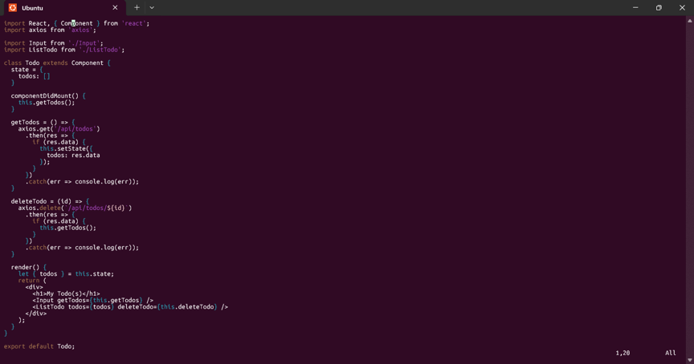

We need to make a little adjustment to our react code. Delete the logo and adjust our App.js to look like this

Move to src folder

**cd ..**

Ensure to be in the src folder and run:

**vim App.js**

Copy and paste the following code

    import React from 'react';
    import Todo from './components/Todo';
    import './App.css';

    const App = () => {
        return (
            

                <Todo />
            

        );
    }

    export default App;

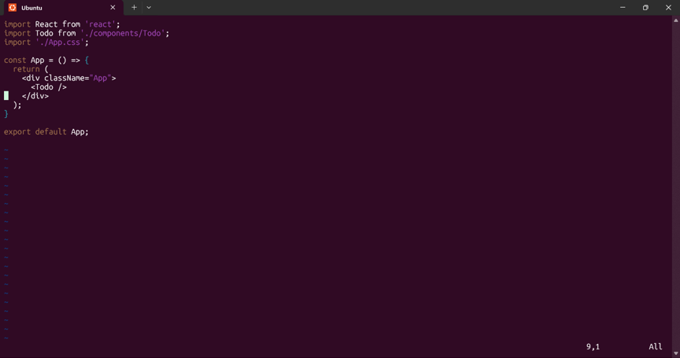

In the src directory, open the `App.css`

**vim App.css**

Paste the following code into it

    .App {  
        text-align: center;  
        font-size: calc(10px + 2vmin);  
        width: 60%;  
        margin-left: auto;  
        margin-right: auto;  
        }

    input {  
        height: 40px;  
        width: 50%;  
        border: none;  
        border-bottom: 2px #101113 solid;  
        background: none;  
        font-size: 1.5rem;  
        color: #787a80;  
        }  

    input:focus {  
        outline: none;  
        }  

    button {  
        width: 25%;  
        height: 45px;  
        border: none;  
        margin-left: 10px;  
        font-size: 25px;  
        background: #101113;  
        border-radius: 5px;  
        color: #787a80;  
        cursor: pointer;  
        }  

    button:focus {  
        outline: none;  
        }  

        ul {  
        list-style: none;  
        text-align: left;  
        padding: 15px;  
        background: #171a1f;  
        border-radius: 5px;  
        }  

    li {  
        padding: 15px;  
        font-size: 1.5rem;  
        margin-bottom: 15px;  
        background: #282c34;  
        border-radius: 5px;  
        overflow-wrap: break-word;  
        cursor: pointer;  
        }

    @media only screen and (min-width: 300px) {  
        .App {  
        width: 80%;  
        }  

    input {  
        width: 100%;  
        }  

    button {  
        width: 100%;  
        margin-top: 15px;  
        margin-left: 0;  
        }  
    }  

    @media only screen and (min-width: 640px) {  
        .App {  
        width: 60%;  
        }  

    input {  
        width: 50%;  
        }  

    button {  
        width: 30%;  
        margin-left: 10px;  
        margin-top: 0;  
        }  
    }  

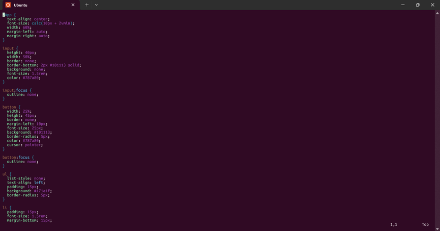

In the src directory, open the index.css

**vim index.css**

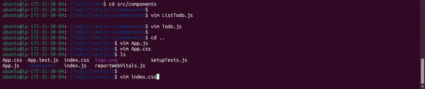

Copy and paste the code below:

    body {  
        margin: 0;  
        padding: 0;  
        font-family: -apple-system, BlinkMacSystemFont, "Segoe UI", "Roboto", "Oxygen", "Ubuntu", "Cantarell", "Fira Sans", "Droid Sans", "Helvetica Neue", sans-serif;  
        -webkit-font-smoothing: antialiased;  
        -moz-osx-font-smoothing: grayscale;  
        box-sizing: border-box;  
        background-color: #282c34;  
        color: #787a80;  
    }  

    code {  
        font-family: source-code-pro, Menlo, Monaco, Consolas, "Courier New", monospace;  
    }  

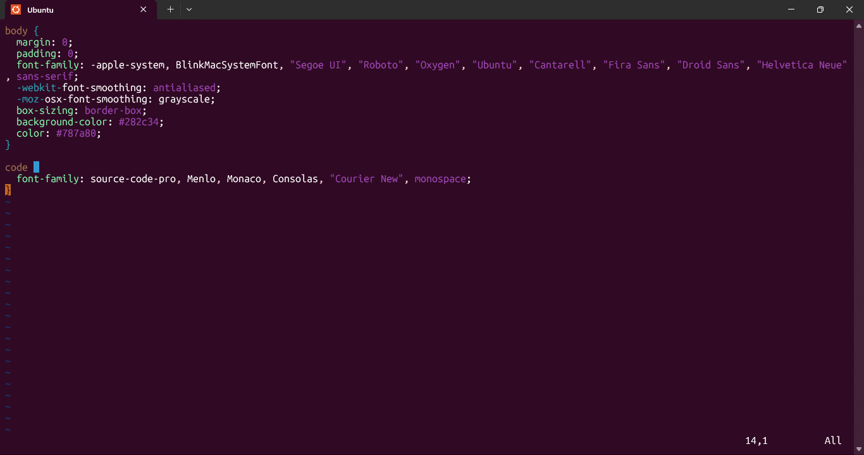

Go to the Todo directory

**cd ../..**

Run:

**npm run dev**

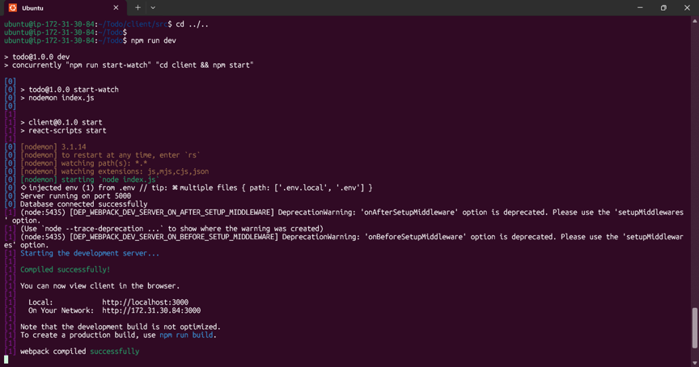

At this point, the To-Do app is ready and fully functional with the functionality discussed earlier: Creating a task, deleting a task, and viewing all the tasks.

The client can now be viewed in the browser. Add some todos via the browser.

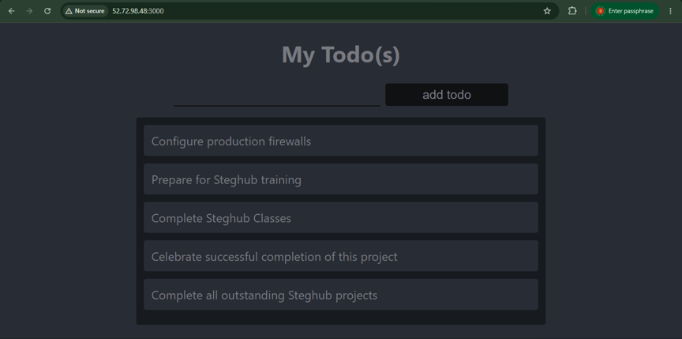

Confirm the added tasks are properly recorded in the database.

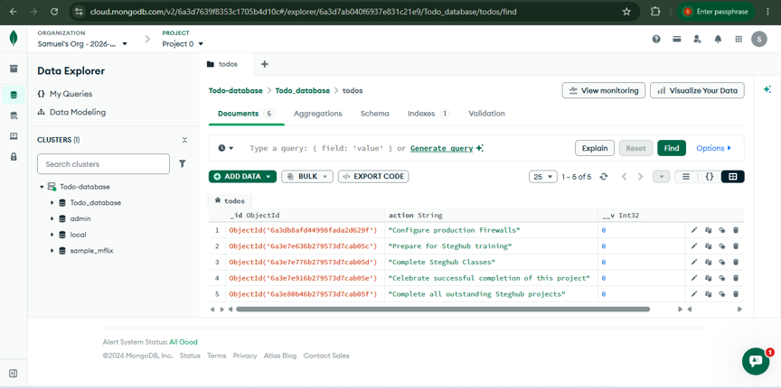

## Conclusion

By following this documentation and leveraging the provided resources, one is well-equipped to build and deploy full-fledged web applications utilizing the MERN stack.