# MEAN STACK IMPLEMENTATION IN AWS

## INTRODUCTION

The MEAN stack is an open-source, end-to-end JavaScript software framework designed for engineering high-performance, single-language web applications. Standardizing on JavaScript across every tier eliminates execution context switching between frontend and backend environments.

Component-Level Engineering Breakdown

**1. MongoDB (Database Layer)Architecture:**

- Document-based, distributed NoSQL database.  
  
- Data Structures: Persists records natively as flexible BSON (Binary JSON) documents with dynamic schemas. 
   
-  Core Utility: Maximizes horizontal write/read scaling via sharding and replication, making it a perfect architectural fit for the unstructured data pipelines of modern web systems.

**2. Express.js (Backend Application Framework)Architecture:**

- Minimalist, unopinionated routing and middleware engine tailored for Node.js.  
- Core Utility: Provides a clean abstraction layer over the raw Node.js HTTP network subsystem.  
- It streamlines API design, endpoints management, request parsing pipeline injection, and backend routing implementations.  
 
**3. Angular (Frontend Application Framework)Architecture:** 
- A TypeScript-based component architecture developed and maintained by Google (the modern evolution of the deprecated, MVC-based AngularJS).  
- Core Utility: Drives client-side execution through Single Page Application (SPA) paradigms.  
- It relies on standard directives, built-in dependency injection, and declarative two-way data-binding models to construct high-performance user interfaces.
  
**4. Node.js (Asynchronous Runtime Environment)Architecture:**
- Event-driven server runtime environment powered by Chrome's V8 engine core.Core Utility: Executes server-side JavaScript outside browser sandboxes. It utilizes a single-threaded, non-blocking I/O event loop mechanism, allowing backend services to manage thousands of concurrent requests with low memory footprints.

## Step 0: Prerequisites

1. EC2 Instance of t3.small type and Ubuntu 22.04 LTS (HVM) was lunched in the us-east-1 region using the AWS console.

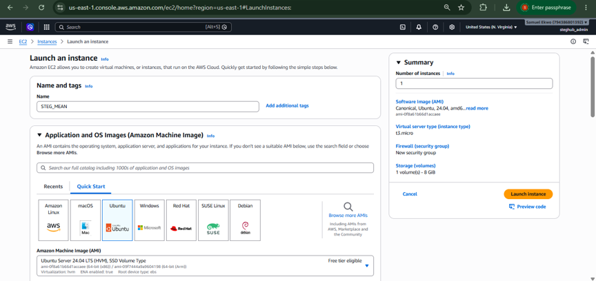

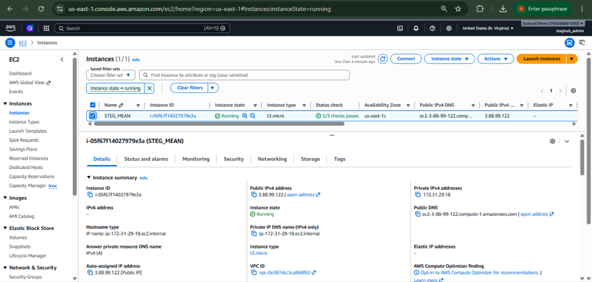

2. Attached SSH key named STEG_MEAN key to access the instance on port 22

3. The security group was configured with the following inbound rules:

Allow traffic on port 80 (HTTP) with source from anywhere on the internet (0.0.0.0/0).

Allow traffic on port 443 (HTTPS) with source from anywhere on the internet (0.0.0.0/0).

Allow traffic on port 22 (SSH) with source from any IP address (0.0.0.0/0). This is opened by default.

Allow traffic on port 3300 (Custom TCP) with source from anywhere (0.0.0.0/0).

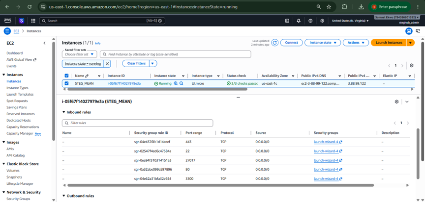

4. The private ssh key permission was changed for the private key file and then used to connect to the instance by running:

**chmod 400 STEG_MEAN.pem**

**ssh -i "STEG_MEAN.pem" ubuntu@3.88.99.122**

Where username=ubuntu and public ip address=3.88.99.122

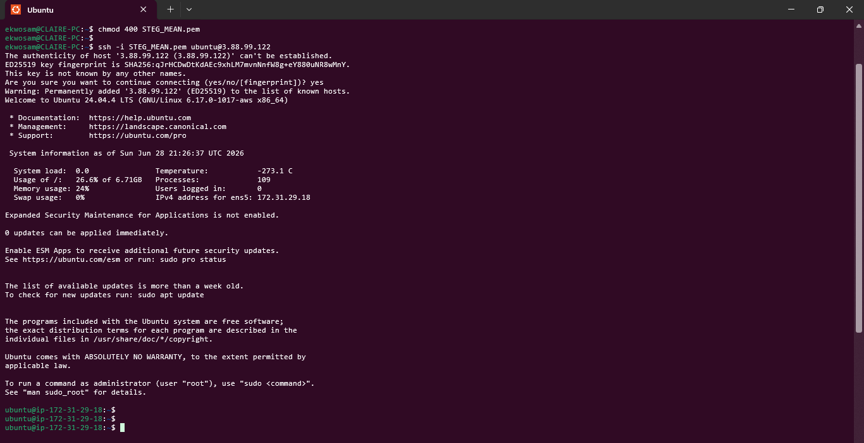

## Step 1 - Install Nodejs

Node.js is a JavaScript runtime built on Chrome’s V8 JavaScript engine. Node.js is used in this tutorial to set up the Express routes and AngularJS controllers.

1. Update and Upgrade ubuntu  

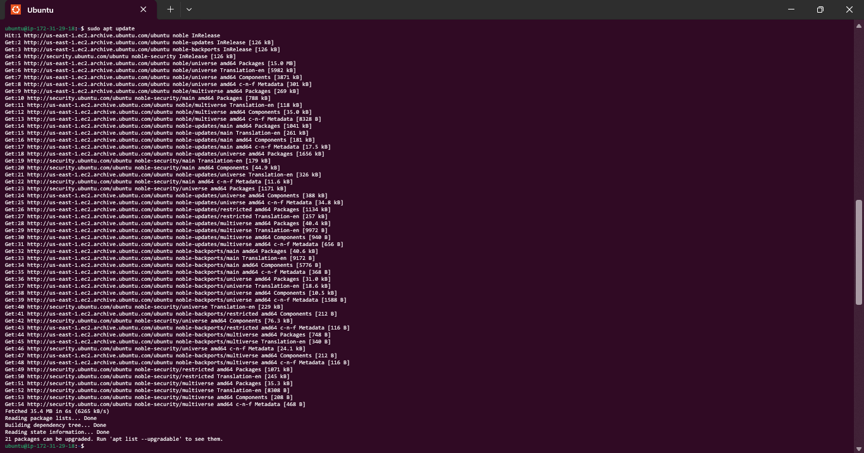

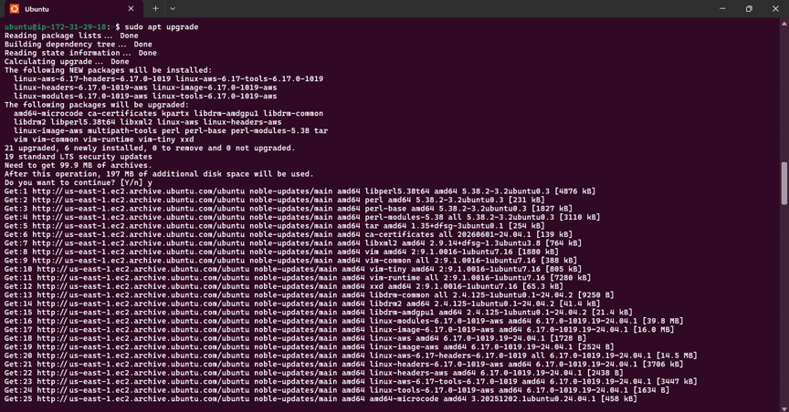
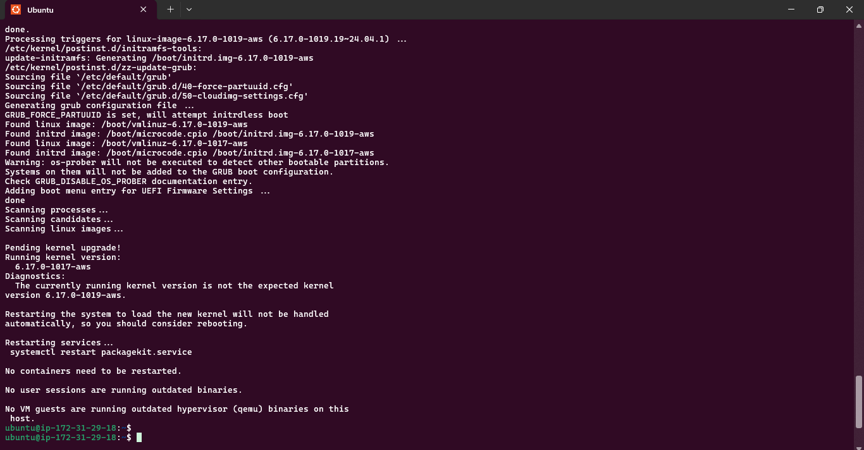

2. Add certificates

**sudo apt -y install curl dirmngr apt-transport-https lsb-release ca-certificates**

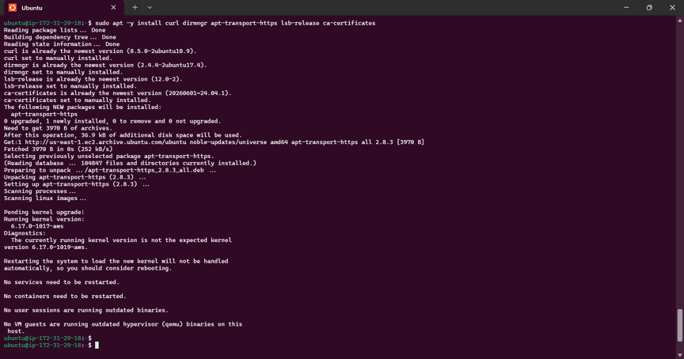

**curl -sL https://deb.nodesource.com/setup_18.x | sudo -E bash -**

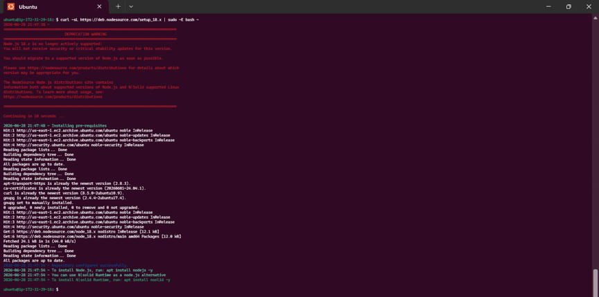

3 Install NodeJS by running this command:

**sudo apt-get install -y nodejs**

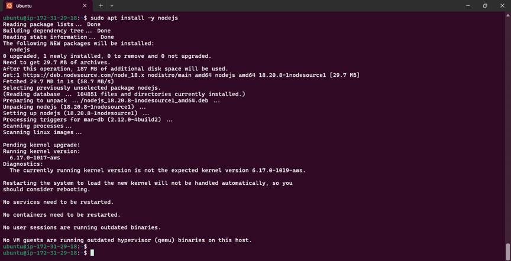

## Step 2 - Install MongoDB

For this application, Book records were added to MongoDB that contain book name, isbn number, author, and number of pages.

1. Download the MongoDB public GPG key

**curl -fsSL https://pgp.mongodb.com/server-7.0.asc | sudo gpg --dearmor -o /usr/share/keyrings/mongodb-archive-keyring.gpg**

2. Add the MongoDB repository

**echo "deb [ signed-by=/usr/share/keyrings/mongodb-archive-keyring.gpg ] https://repo.mongodb.org/apt/ubuntu jammy/mongodb-org/7.0 multiverse" | sudo tee /etc/apt/sources.list.d/mongodb-org-7.0.list**

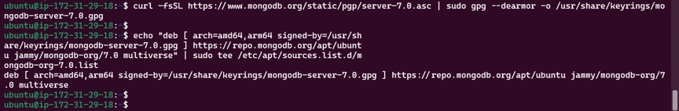

3. Update the package database and install MongoDB  
(Before running “sudo apt-get install -y mongodb-org” command an update package command must be run first “sudo apt-get update”)

**sudo apt-get update**

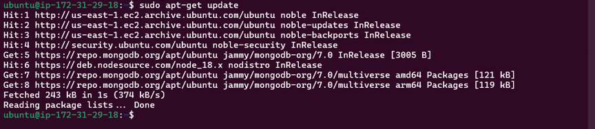

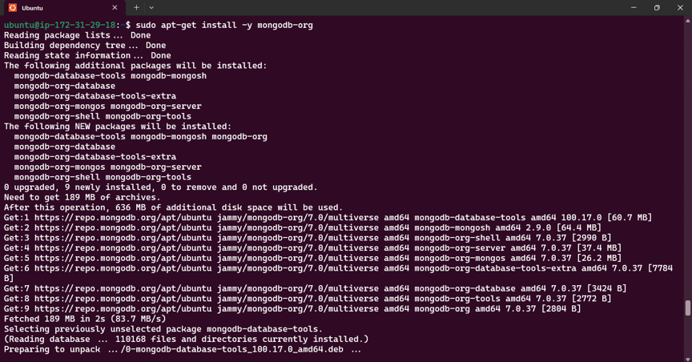

4. Start and enable MongoDB

(The command “sudo service mongodb start” failed to start hence I used the modern “sudo systemctl mongod start”)

**sudo systemctl start mongod**  
**sudo systemctl enable mongod**  
**sudo systemctl status mongod**

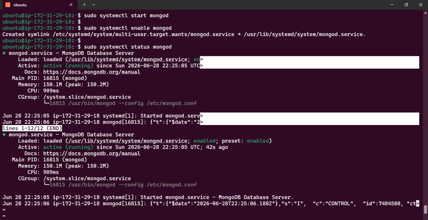

5. Install body-parser package

body-parser package is needed to help process JSON files passed in requests to the server.

**sudo npm install body-parser**

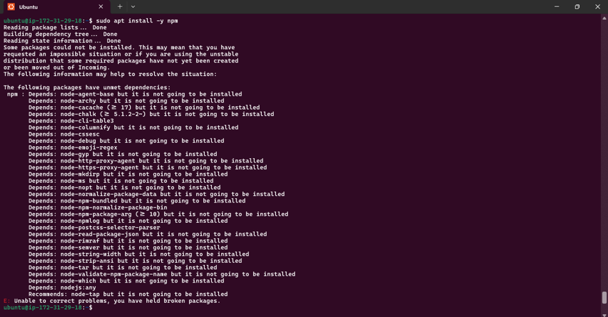

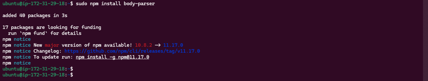

6. Create the project root folder named ‘Books’

**mkdir Books && cd Books**

Initialize the root folder

**npm init**

**vim server.js**

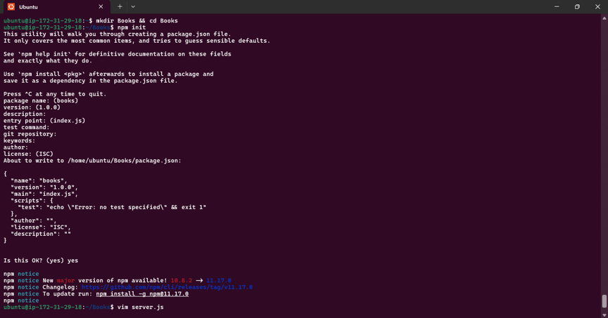

Add file named server.js to Books folder

**vim server.js**
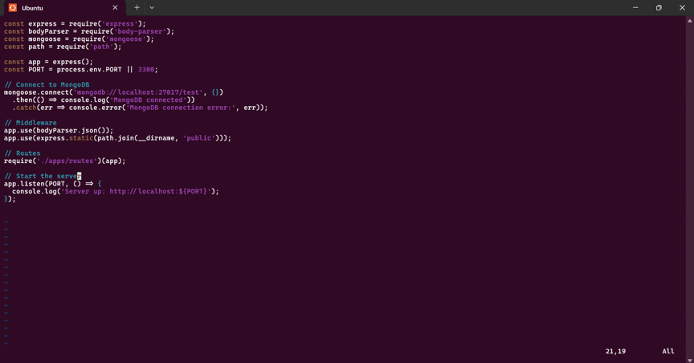

## Step 3 - Install Express and set up routes to the server

Express was used to pass book information to and from our MongoDB database. Mongoose package provides a straightforward schema-based solution to model the application data. Mongoose was used to establish a schema for the database to store data of the book register.

1. Install express and mongoose

**sudo npm install express mongoose**

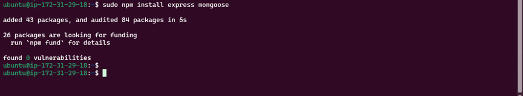

2. In Books folder, create a folder named ‘apps’

**mkdir apps && cd apps**

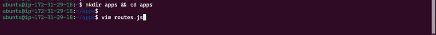

In apps, create a file named routes.js

**vim routes.js**

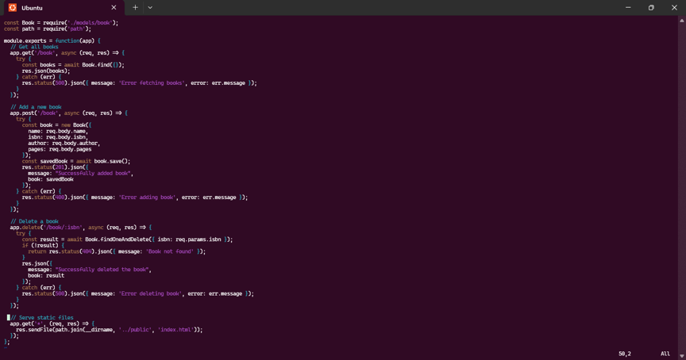

3. In the ‘apps’ folder, create a folder named models

**mkdir models && cd models**

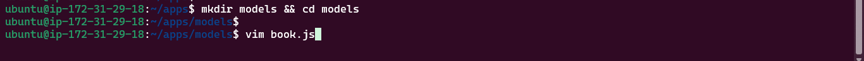

In models, create a file named book.js

**vim book.js**

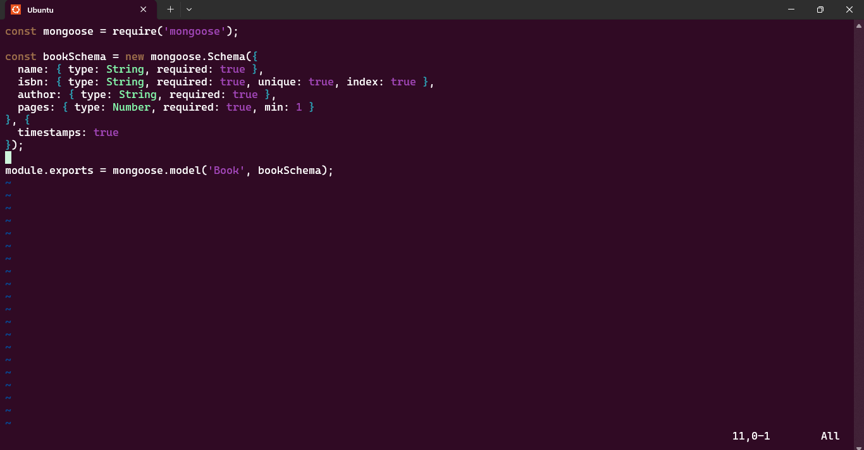

## Step 4 - Access the routes with AngularJS

In this project, AngularJS was used to connect the web page with Express and perform actions on the book register.

1. Change the directory back to ‘Books’ and create a folder named ‘public’

**cd ../..**

**mkdir public && cd public**

Add a file named script.js into public folder

**vim script.js**

Copy and paste the code below (controller configuration defined) into the script.js file.

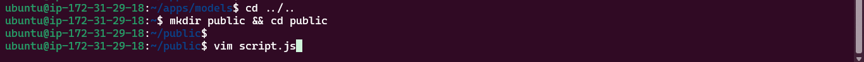

2. In ‘public’ folder, create a file named index.html

**vim index.html**

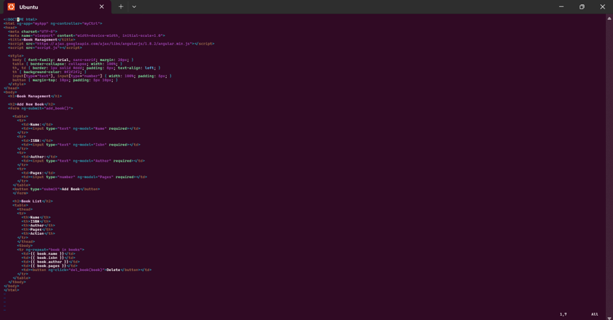

3. Change the directory back up to ‘Books’ and start the server

**cd ..**

**node server.js**

The server failed to run.

`Problem Summary`

The book registration application was failing on both the backend and frontend due to structural placement issues and strict software constraints:

    1. Backend Path Errors: The application crashed immediately on boot (MODULE_NOT_FOUND) because the apps folder was created in the root user directory instead of inside the Books parent folder.
   
    2. Strict Regex Rules: Once moved, it crashed again because a wildcard routing path (*) didn't comply with updated safety rules in modern Express dependency libraries.
   
    3. Frontend Isolation: The frontend layout was unreachable (Cannot GET /) because the "public" asset folder was left outside the root repository directory.
   
    4. Syntax Typo: Once visible, data wouldn't display because a typo (.Controller) on line 3 of script.js completely broke the initialization of the AngularJS engine.
   
`How It Was Fixed`

The application was restored to working order through the following step-by-step terminal adjustments:

    • File Organization: Relocated the "apps" and "public" folders into the main application root (~/Books/) using the Linux "mv" command.

    • Code Refactoring: Edited the routing wildcard catch-all string to a named parameter format (/*any) to satisfy library compliance, and updated server variables to use proper template string backticks (`).

    • Process Management: Cleared the cached background server scripts using "pkill" and initialized a fresh runner via "nohup node server.js".

    • Client Patch: Sanitized line 1 and line 3 of public/script.js into standard format (var app = angular.module('myApp', []); instead of "angular.module('myApp', []);"), and ("app.controller……" instead of ".controller") allowing the framework to safely communicate with MongoDB.

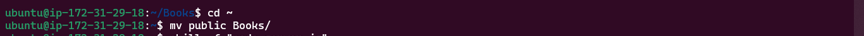

The server is now up and running, Connection to it is via port 3300. A separate Putty or SSH console to test what curl command returns locally can be launched.

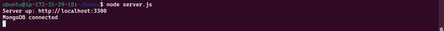

The Book Register web application can now be accessed from the internet with a browser using the Public IP address or Public DNS name.

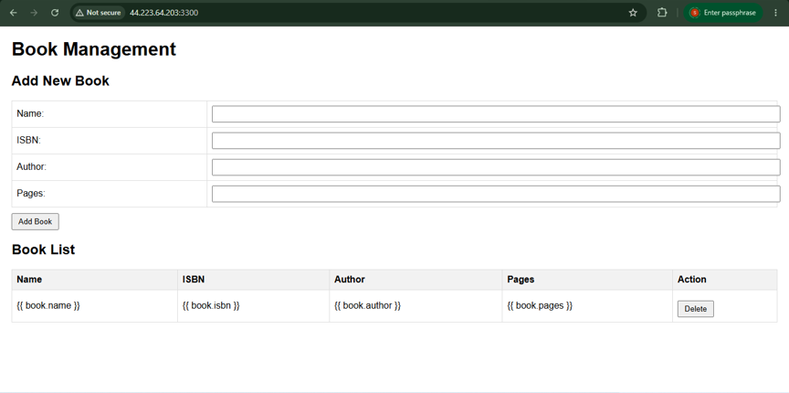

Add more books to the register

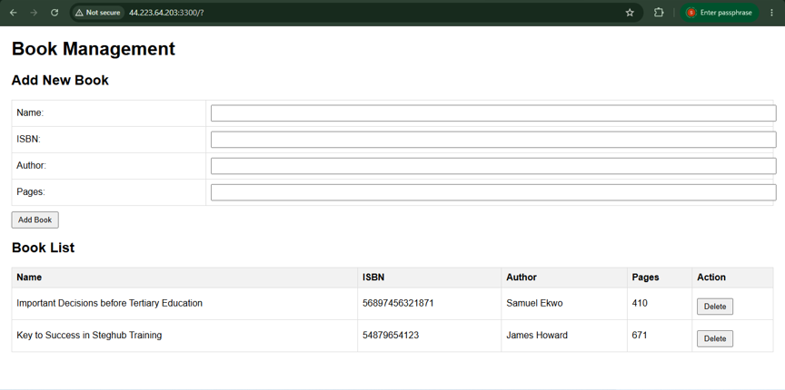

Get the json view

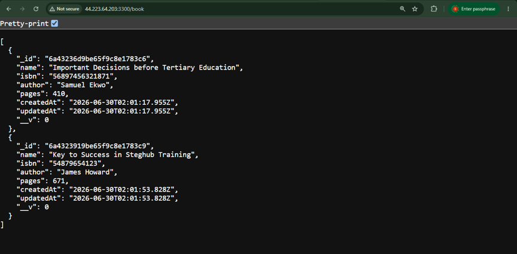

