# Task - Implement a Client Server Architecture using MySQL Database Management System (DBMS)

The following instructions were followed to implement the above task:

## Step 1. Create and configure two linux-based virtual servers (EC2 instance in AWS)

`mysql server`  

`mysql client`

1. Two EC2 Instances of t3.micro type and Ubuntu 24.04 LTS (HVM) was launched in the us-east-1 region using the AWS console.

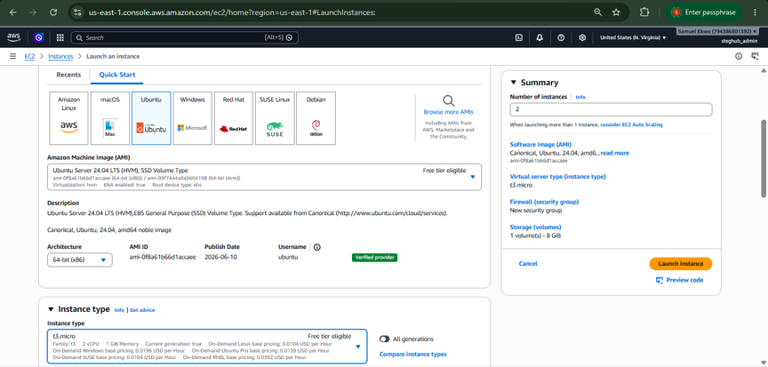

**mysql server**

**mysql client**
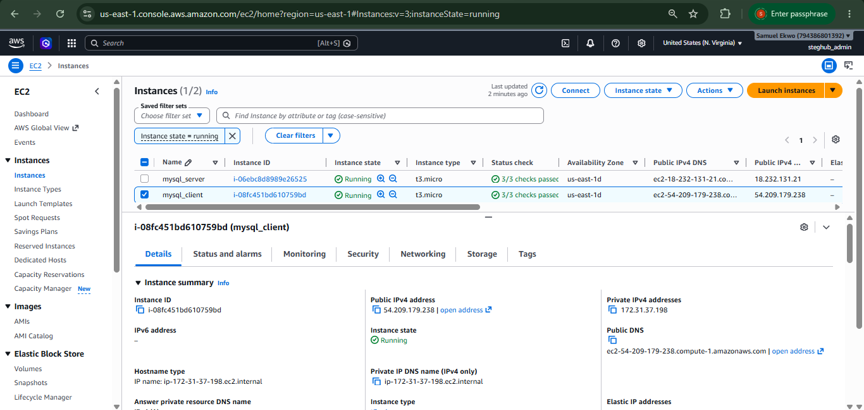

The security group inbound rule for both instances was configured with the default SSH on port 22 with source from anywhere.

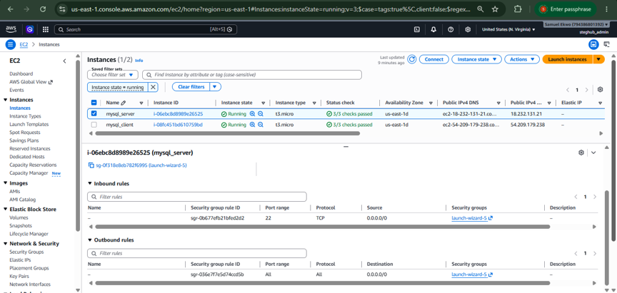

2. Attached SSH key named "STEG_MEAN.pem" to access the instance on port 22

## Step 2 - On mysql server Linux Server, install MySQL Server software

1. The private ssh key permission was changed for the private key file and then used to connect to the instance by running

**chmod 400 my-ec2-key.pem**

**ssh -i "STEG_MEAN" ubuntu@18.232.131.21**

Where username=ubuntu and public ip address=18.232.131.21

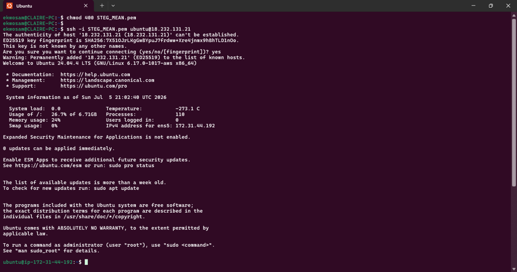

2. Update and upgrade Ubuntu

**sudo apt update && sudo apt upgrade -y**

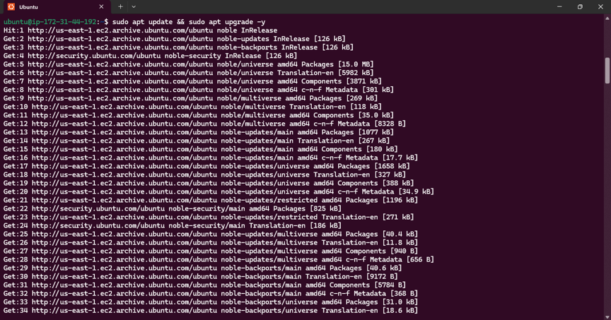
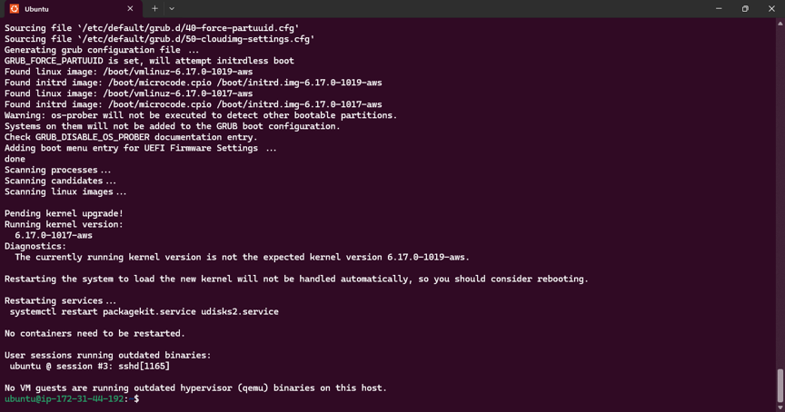

3. Install MySQL Server software

**sudo apt install mysql-server -y**

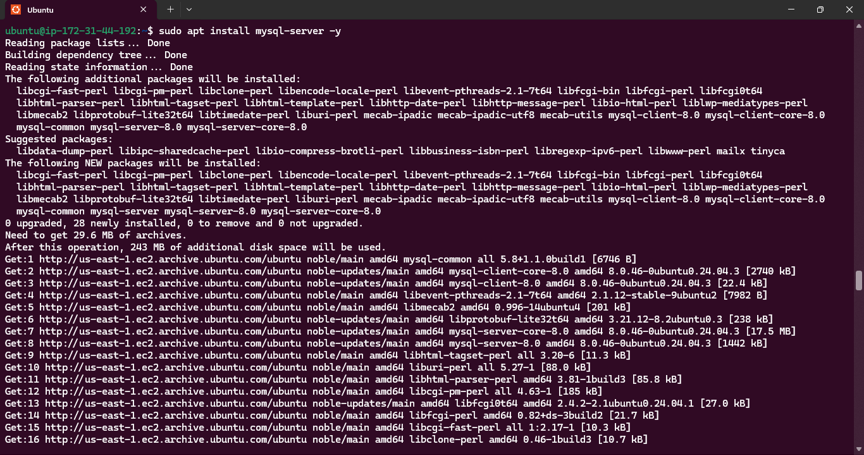
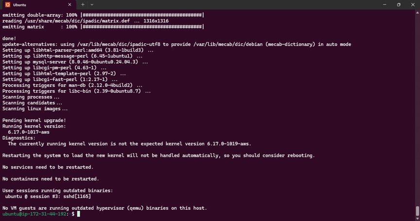

4. Enable mysql server

**sudo systemctl enable mysql**

## Step 3 - On mysql client Linux Server install MySQL Client software.

1. Connect to the instance

**ssh -i "STEG_MEAN.pem" ubuntu@54.209.179.238**

Where username=ubuntu and public ip address=54.209.179.238

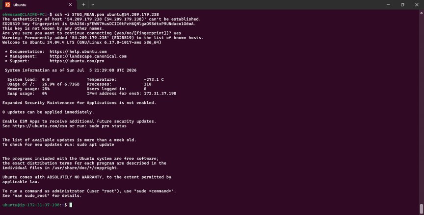

2. Update and upgrade Ubuntu

**sudo apt update && sudo apt upgrade -y**

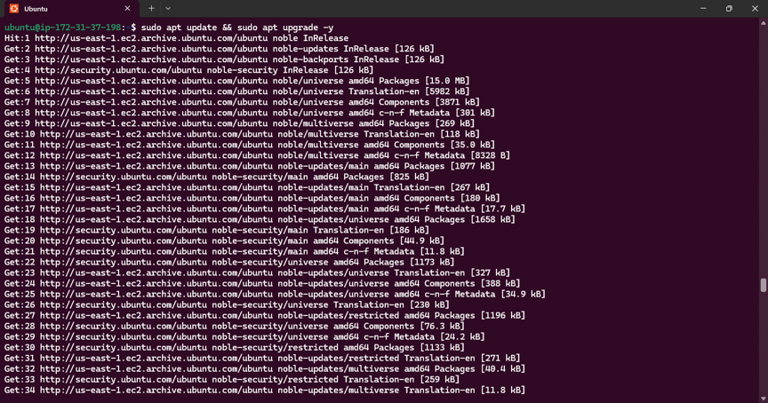
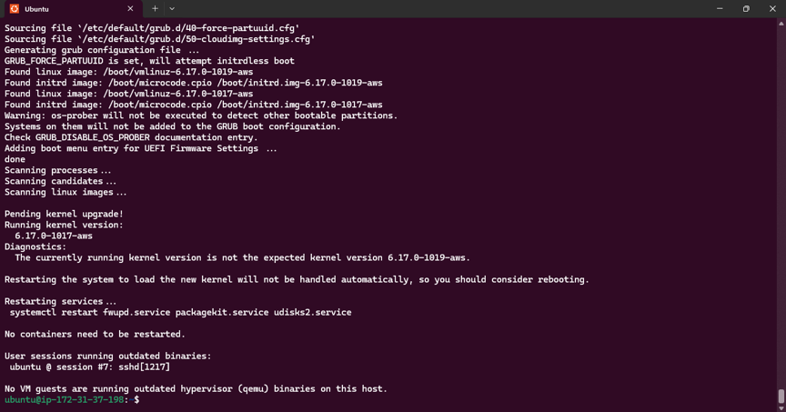

3. Install MySQL Client software

**sudo apt install mysql-client -y**

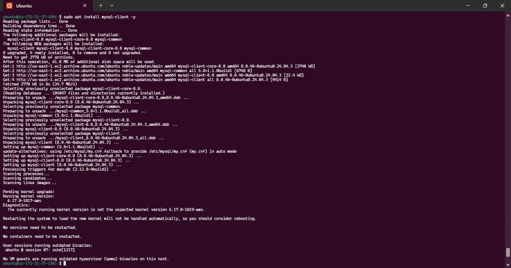

## Step 4 - Use mysql server's local IP address to connect from mysql client.

By default, both of the EC2 virtual servers are located in the same local virtual network, so they can communicate to each other using local IP addresses.   
Use mysql server's local IP address to connect from mysql client. MySQL server uses TCP port 3306 by default so it has to be opened by creating a new entry in inbound rules in mysql server Security Groups.   
For extra security, access to mysql server by all IP addresses was not allowed, only the specific local IP address of mysql client was allowed.

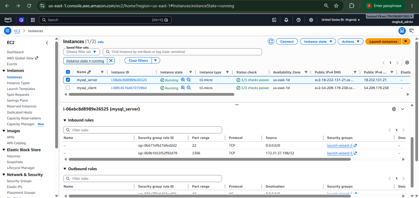

## Step 5 - Configure MySQL server to allow connections from remote hosts.

Befor the configuration stated above, the following were implemented:
 
1. The security script of MySQL was run on mysql server by running the command:

**sudo mysql_secure_installation**

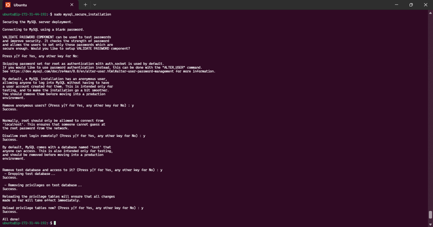

2. Now, configure MySQL server to allow connections from remote hosts.

**sudo vim /etc/mysql/mysql.conf.d/mysqld.cnf**

Locate bind-address = 127.0.0.1  
Replace 127.0.0.1 with 0.0.0.0

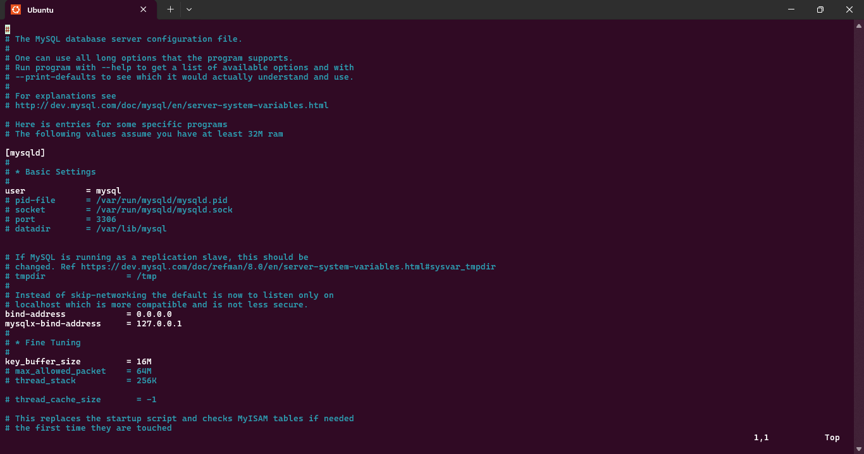

## Step 6 - From mysql client Linxus Sever, connect remotely to mysql server Database Engine without using SSH. The mysql utility must be used to perform this action.

**sudo mysql -u client -h 172.31.44.192 -p**

My sql server failed to connect with "ERROR 1130 (HY000)

**The Problem**

The MySQL server rejected the connection with ERROR 1130 because MySQL uses host-based authentication.  
By default, it only trusts connections originating from localhost (the server itself). It does not recognize or trust “client” EC2 instance's private IP address (172.31.37.198), even though both instances live in the same AWS network.

**The Solution**

Logged into the MySQL server machine and told MySQL to trust the client's identity.

1. Authorize the host: Ran a SQL command to create the “client” user, explicitly attaching a network wildcard ('client'@'%').

2. Apply permissions: Granted the required database privileges to this newly defined host-specific user “client”.

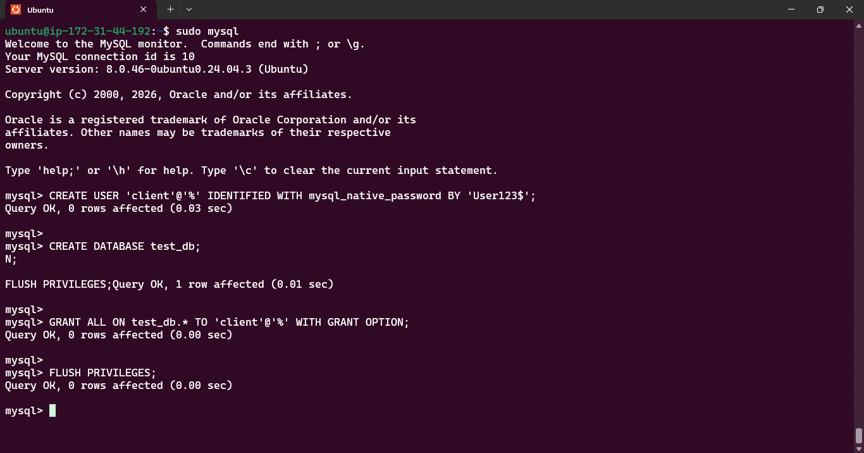

3. Open network bindings: Confirmed the server's mysqld.cnf file is configured to listen on all interfaces (bind-address = 0.0.0.0) and that AWS Security Group allows inbound traffic on port 3306 from the client.

With this solution, mysql client successfully connected remotely to mysql server Database Engine without using SSH but using the mysql utility to perform this action.

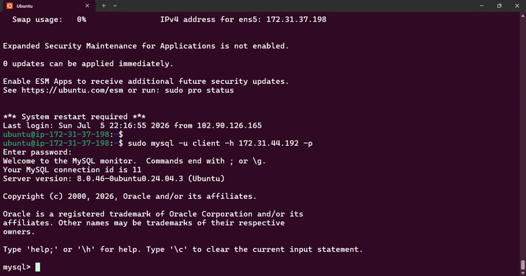

## Step 7 - Check that the connection to the remote MySQL server was successfull and can perform SQL queries.

**show databases;**

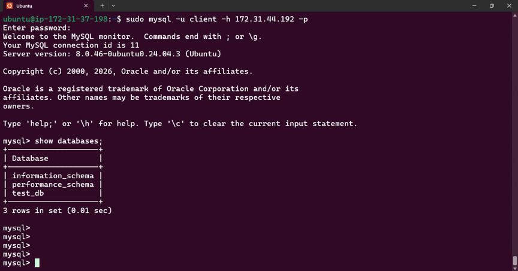

Create table, insert rows into table and select from the table

CREATE TABLE test_db.test_table (
  item_id INT AUTO_INCREMENT,
  content VARCHAR(255),
  PRIMARY KEY(item_id)
);

INSERT INTO test_db.test_table (content) VALUES ("My first choice football club is Chelsea");

INSERT INTO test_db.test_table (content) VALUES ("My second choice football club is R.Madrid");

SELECT * FROM test_db.test_table;

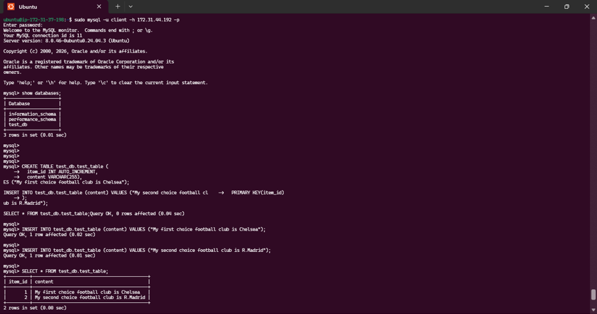

## Conclusion

At this stage, this project is successfully completed and demonstrates a fully functional MySQL Client-Server set up.

