# Web Solution With WordPress in AWS

## Step 1 - Prepare a Web Server

1. Launch a RedHat EC2 instance that serve as Web Server. Create 3 volumes in the same AZ as the web server ec2 each of 10GB and attach all 3 volumes one by one to the web server.

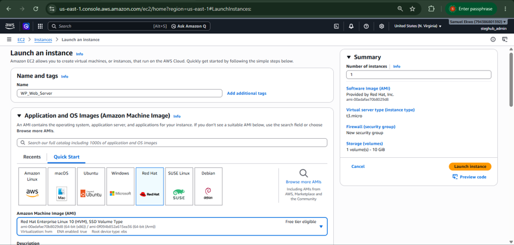  

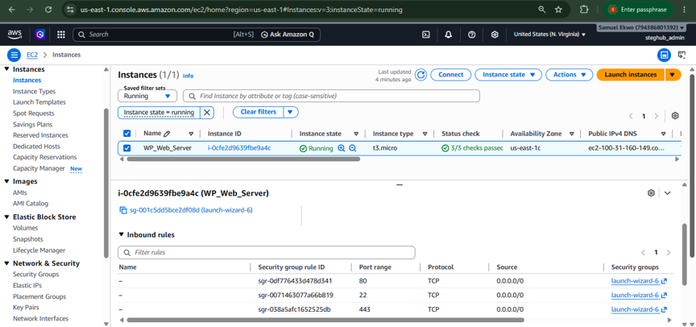  

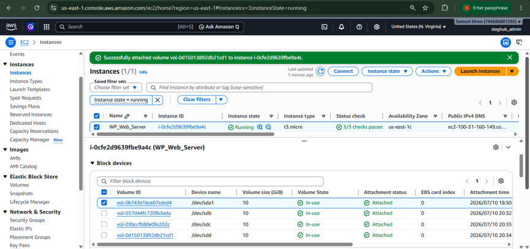

2. Open up the Linux terminal to begin configuration.

**ssh -i STEG_MEAN.pem ec2-user@100.31.160.149**

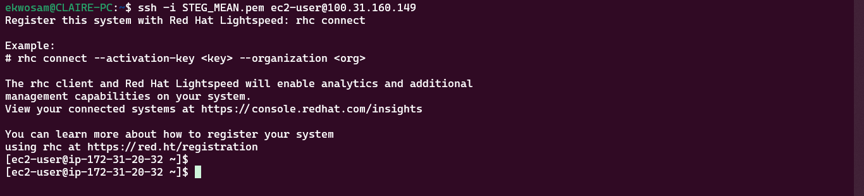

3. Use `lsblk` to inspect what block devices are attached to the server. All devices in Linux reside in /dev/directory. Inspect with `ls /dev/` and ensure all 3 newly created devices are there. Their name will likely be xvdf, xvdg and xvdh. Within the current Red Hat implementation, the block volume names changed to nvme1n1, nvme2n1 and nvme3n1.

**lsblk**

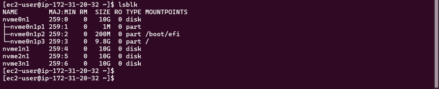

4. Use `df -h` to see all mounts and free space on the server.

**df -h**

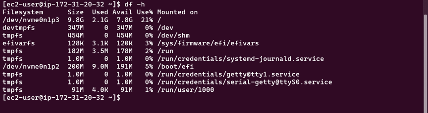

5a. Use gdisk utility to create a single partition on each of the 3 disks. **[Note]** `fdisk` was used instead of gdisk because the server was running the recently updated Red Hat Enterprise Linux (RHEL) 10, which has entirely removed gdisk from its core software repositories.  

While older versions of Linux required gdisk to handle modern GUID Partition Tables (GPT) and NVMe cloud drives, modern `fdisk` has been completely rewritten. It natively supports both GPT and NVMe out of the box, allowing to achieve the exact same structural partitioning results without needing to download external packages over a broken network channel.

**sudo fdisk /dev/nvme1n1**

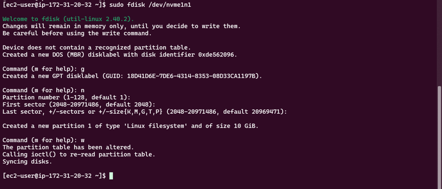

**sudo fdisk /dev/nvme2n1**

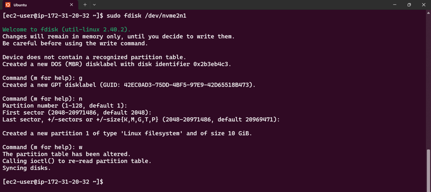

**sudo fdisk /dev/nvme3n1**

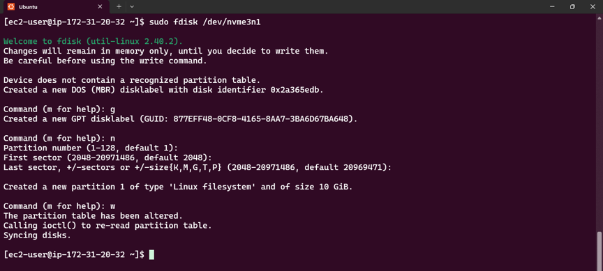

5b. Use `lsblk` utility to view the newly configured partitions on each of the 3 disks

**lsblk**

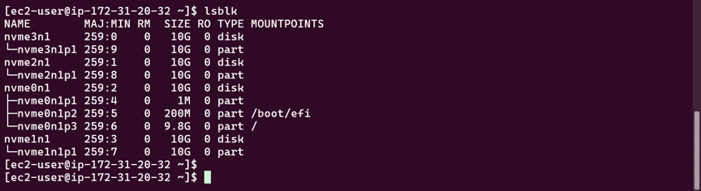

6. Install lvm package

**sudo yum install lvm2 -y**

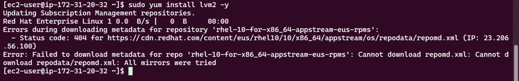

`Problem`  
There is an internal configuration glitch inside the AWS EC2 instance. The server is confused because it is searching for an experimental Red Hat 10 updated network (rhel-10-for-x86_64-appstream-eus-rpms), but my free Red Hat developer account only has access to Red Hat 9 repository software.  
The package manager (*yum/dnf*) is still completely blocked by the broken, inactive Red Hat 10 repository network.   
Because *yum* stops operating if even a single repository fails, it cannot download the lvm2 package normally until the system is told to ignore that broken RHEL 10 channel.  

`Solution`  
The command: `sudo yum install lvm2 -y --disablerepo="rhel-10*"` ensured “yum” completely ignored the broken RHEL 10 repository.  
It seamlessly pulled the lvm2 tools from the working RHEL 9 or EPEL channels. The "Complete!" notification confirms the Logical Volume Manager tools are active.

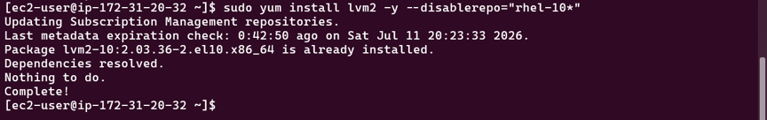

Run sudo `lvmdiskscan` to check available partitions

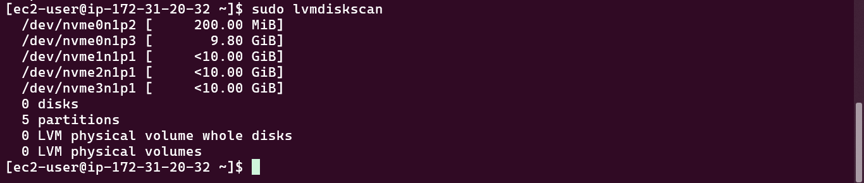

7. Use `pvcreate` utility to mark each of the 3 dicks as physical volumes (PVs) to be used by LVM. Verify that each of the volumes have been created successfully.

**sudo pvcreate /dev/nvme1n1p1 /dev/nvme2n1p1 /dev/nvme3n1p1**

**sudo pvs**

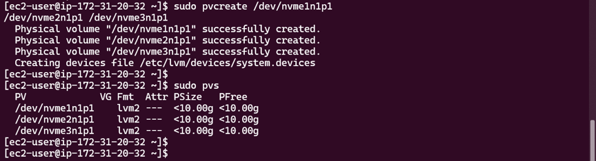

8. Use `vgcreate` utility to add all 3 PVs to a volume group (VG). Name the VG webdata-vg. Verify that the VG has been created successfully

**sudo vgcreate webdata-vg /dev/nvme1n1p1 /dev/nvme2n1p1 /dev/nvme3n1p1**

**sudo vgs**

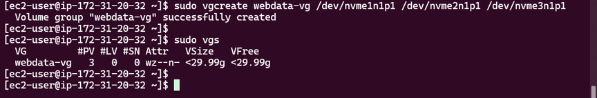

9. Use `lvcreate` utility to create 2 logical volume, apps-lv (Use half of the PV size), and logs-lv (Use the remaining space of the PV size). Verify that the logical volumes have been created successfully.

Note: `apps-lv` is used to store data for the Website while `logs-lv` is used to store data for logs.

**sudo lvcreate -n apps-lv -L 14G webdata-vg**

**sudo lvcreate -n logs-lv -L 14G webdata-vg**

**sudo lvs**

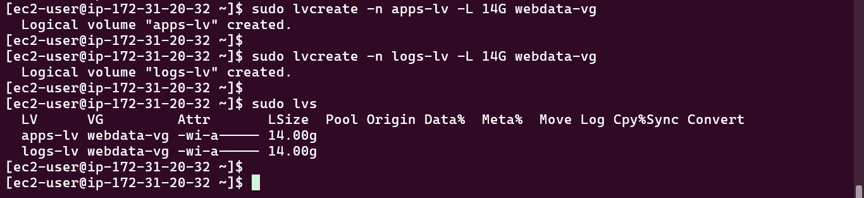

10a. Verify the entire setup

**sudo vgdisplay -v**   #view complete setup, VG, PV and LV

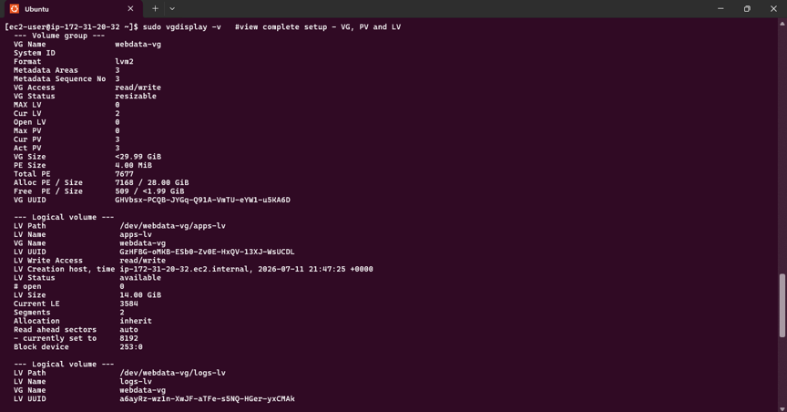

**lsblk**

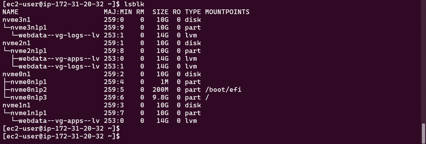

10b. Use `mkfs.ext4` to format the logical volumes with ext4 filesystem

**sudo mkfs.ext4 /dev/webdata-vg/apps-lv**

**sudo mkfs.ext4 /dev/webdata-vg/logs-lv**

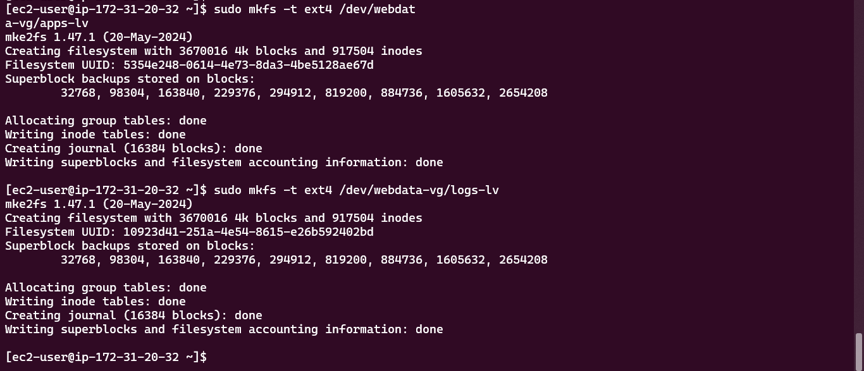

11. Create `/var/www/html` directory to store website files and `/home/recovery/logs` to store backup of log data

**sudo mkdir -p /var/www/html**

**sudo mkdir -p /home/recovery/logs**

Mount /var/www/html on apps-lv logical volume

**sudo mount /dev/webdata-vg/apps-lv /var/www/html**

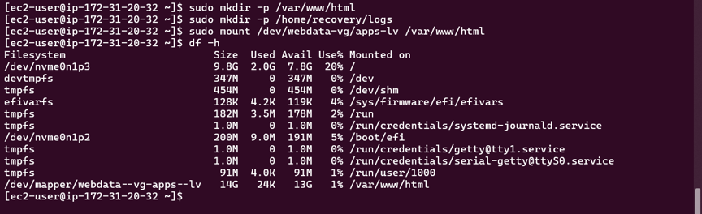

12. Use `rsync` utility to backup all the files in the log directory /var/log into /home/recovery/logs (This is required before mounting the file system)

**sudo rsync -av /var/log /home/recovery/logs**

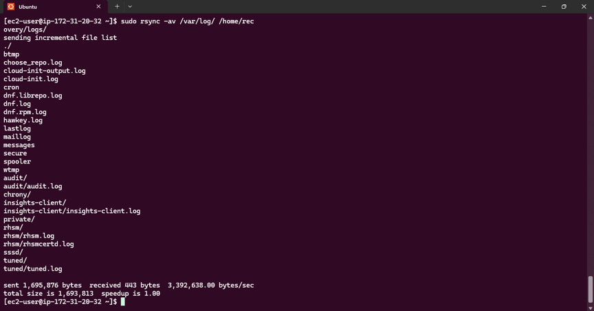

13. Mount `/var/log` on `logs-lv` logical volume (All existing data on /var/log is deleted with this mount process which was why the data was backed up)

**sudo mount /dev/webdata-vg/logs-lv /var/log**

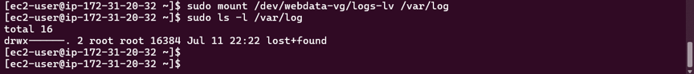

14. Restore log file back into /var/log directory

**sudo rsync -av /home/recovery/logs/log/ /var/log**

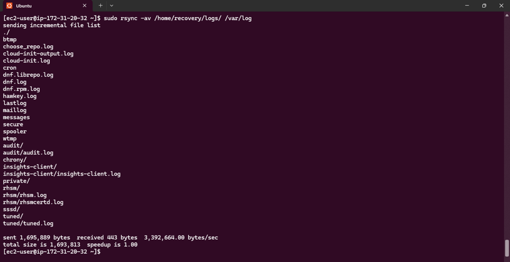

15. Update `/etc/fstab` file so that the mount configuration will persist after restart of the server

Get the UUID of the device and Update the /etc/fstab file with the format shown inside the file using the UUID. Remember to remove the leading and ending quotes.

**sudo blkid**   # To fetch the UUID

**sudo vi /etc/fstab**

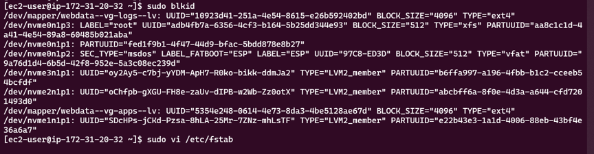

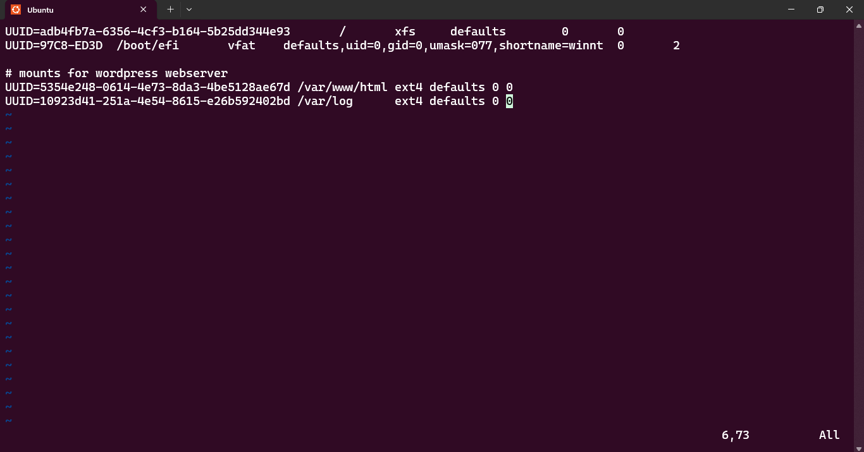

16. Test the configuration and reload daemon.   

Verify the setup

**sudo mount -a**   # Test the configuration

**sudo systemctl daemon-reload**

**df -h**   # Verifies the setup

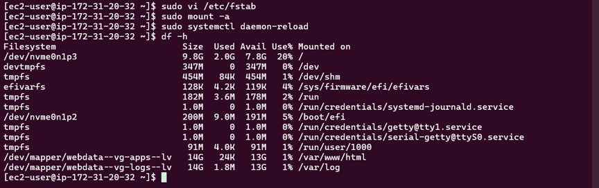

## Step 2 - Prepare the Database Server

Launch a second RedHat EC2 instance that will have a role - `DB Server`. Repeat the same steps as for the Web Server, but instead of apps-lv, create `db-lv` and mount it to `/db` directory.

1. Create 3 volumes in the same AZ as the DB Server ec2 each of 10GB and attach all 3 volumes one by one to the DB Server.

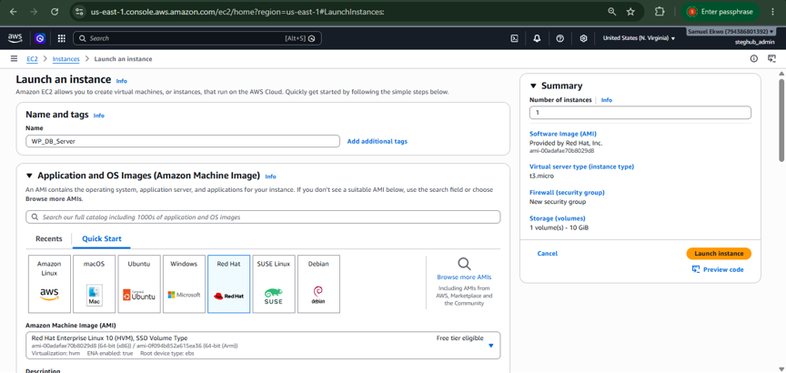

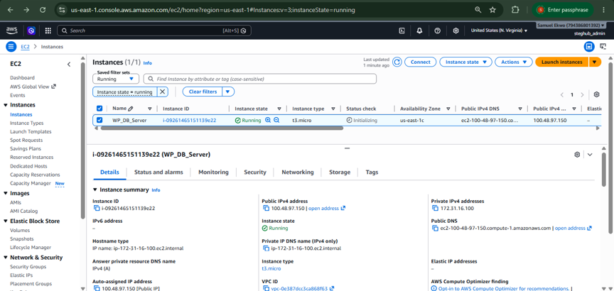

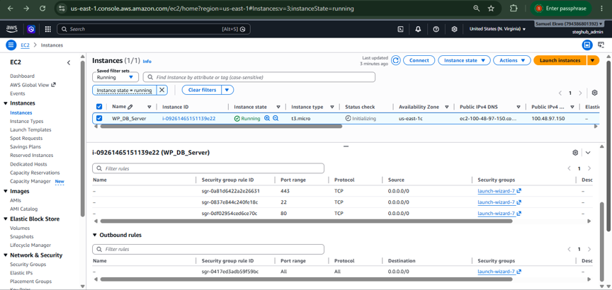

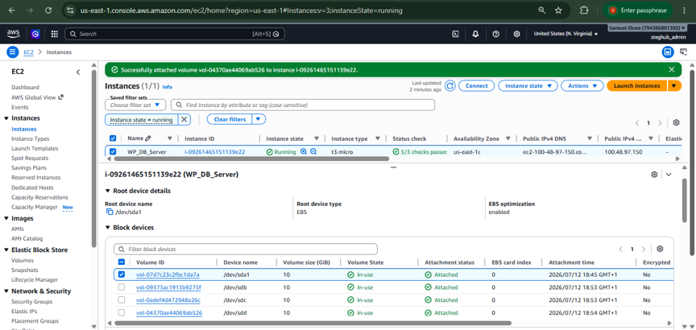

1. Open up the Linux terminal to begin configuration.

**ssh -i "STEG_MEAN.pem" ec2-user@100.48.97.150**

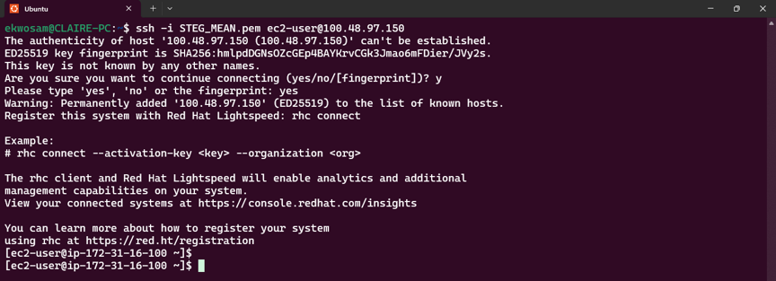

3. Use `lsblk` to inspect what block devices are attached to the server. Their name will likely be xvdf, xvdg and xvdh.

**lsblk**

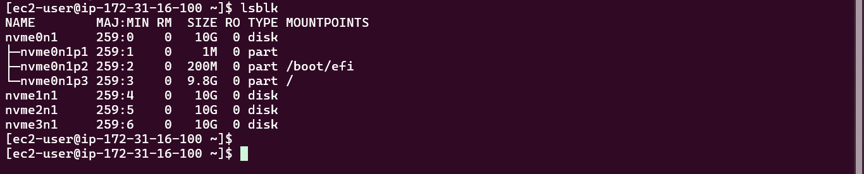

4a. Use gdisk utility to create a single partition on each of the 3 disks.(fdisk utility was used for reasons discussed above)

**sudo fdisk /dev/nvme1n1**

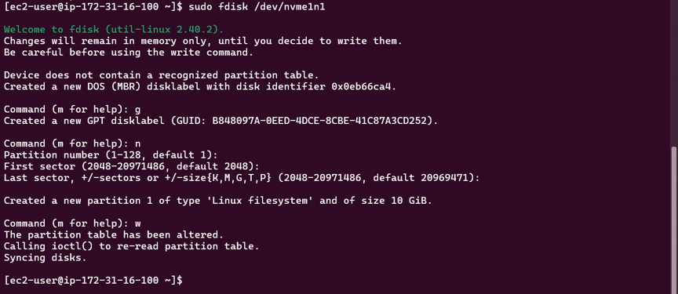

**sudo fdisk /dev/nvme2n1**

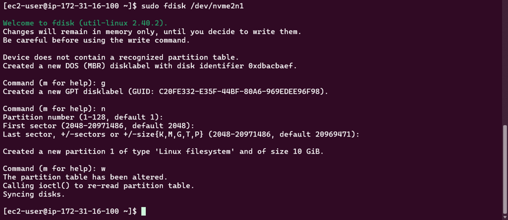

**sudo fdisk /dev/nvme3n1**

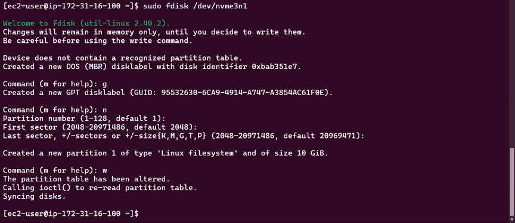

4b. Use `lsblk` utility to view the newly configured partitions on each of the 3 disks

**lsblk**

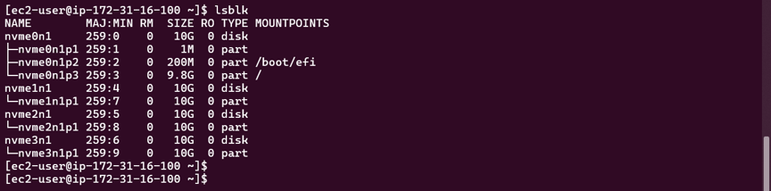

5. Install lvm package ("rhel=10" was disabled due to mismatch between AWS updated image and Red Hat account restrictions to "rhel=9" to free developer account as discussed above)

**sudo yum install lvm2 -y**

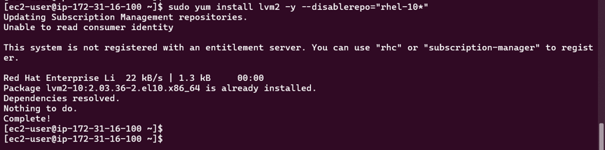

Run sudo `lvmdiskscan` to check available partitions

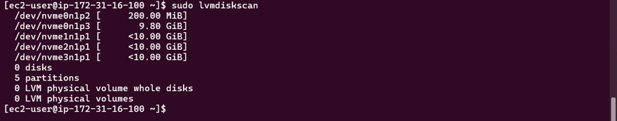

6. Use `pvcreate` utility to mark each of the 3 dicks as physical volumes (PVs) to be used by LVM.

Also, use `vgcreate` utility to add all 3 PVs to a volume group (VG). Name the VG `database-vg`. 

Verify that each of the volumes and the VG have been created successfully.

**sudo pvcreate /dev/nvme1n1 /dev/nvme2n1 /dev/nvme3n1**  

**sudo pvs**

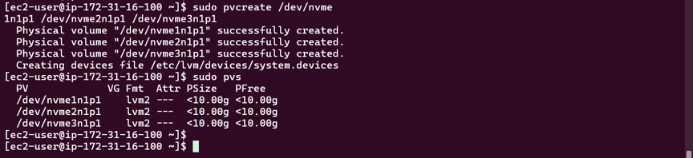

**sudo vgcreate database-vg /dev/nvme1n1 /dev/nvme2n1 /dev/nvme3n1**

**sudo vgs**

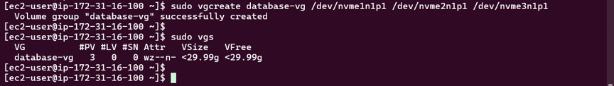

7. Use `lvcreate` utility to create 2 logical volume, db-lv (Use half of the PV size), and logs-lv (Use the remaining space of the PV size). Verify that the logical volumes have been created successfully.

Note: `db-lv` is used to store database for the website while `logs-lv` is used to store data for logs.

**sudo lvcreate -n db-lv -L 14G database-vg**

**sudo lvcreate -n logs-lv -L 14G database-vg**

**sudo lvs**

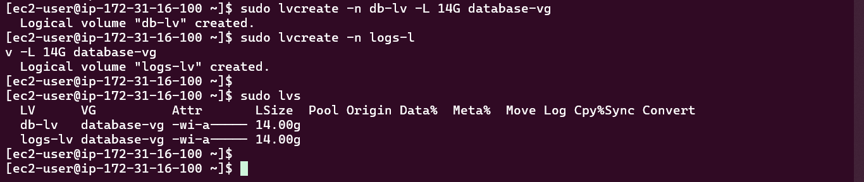

8. Use `mkfs.ext4` to format the logical volumes with ext4 filesystem and monut /db on db-lv

**sudo mkfs.ext4 /dev/webdata-vg/apps-lv**

**sudo mkfs.ext4 /dev/webdata-vg/logs-lv**

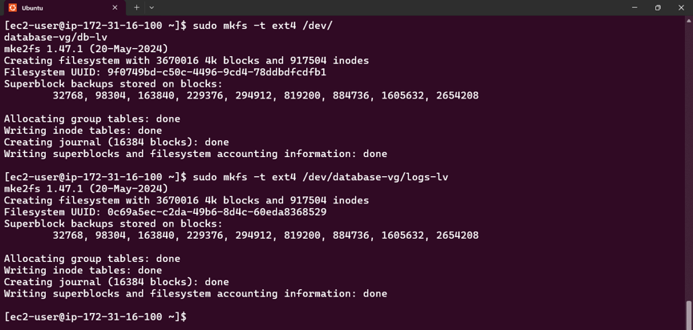

**sudo mount /dev/database-vg/db-lv /db**

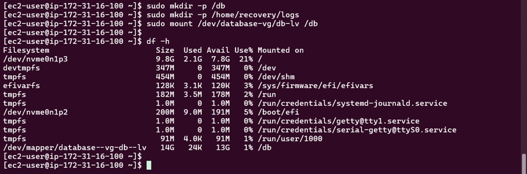

9. Use `rsync` utility to backup all the files in the log directory `/var/log` into `/home/recovery/logs` (This is required before mounting the file system)

**sudo rsync -av /var/log /home/recovery/logs**

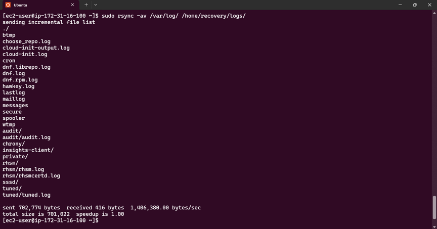

10. Mount ``/var/log` on `logs-lv` logical volume (All existing data on /var/log is deleted with this mount process which was why the data was backed up)

**sudo mount /dev/database-vg/logs-lv /var/log**

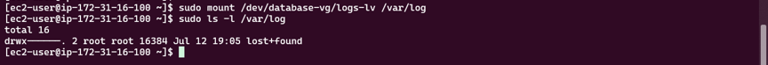

11. Restore log file back into /var/log directory

**sudo rsync -av /home/recovery/logs/log/ /var/log**

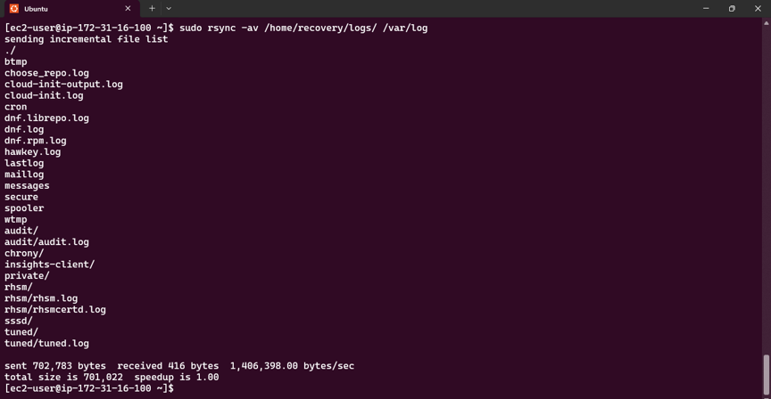

15. Update `/etc/fstab` file so that the mount configuration will persist after restart of the server

Get the UUID of the device and Update the /etc/fstab file with the format shown inside the file using the UUID. Remember to remove the leading and ending quotes.

**sudo blkid**   # To fetch the UUID

**sudo vi /etc/fstab**

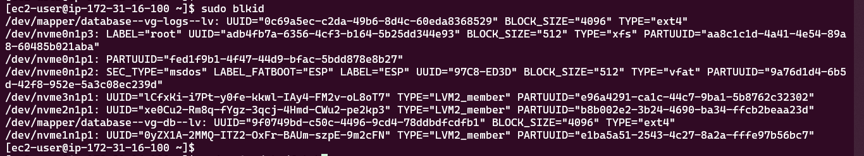

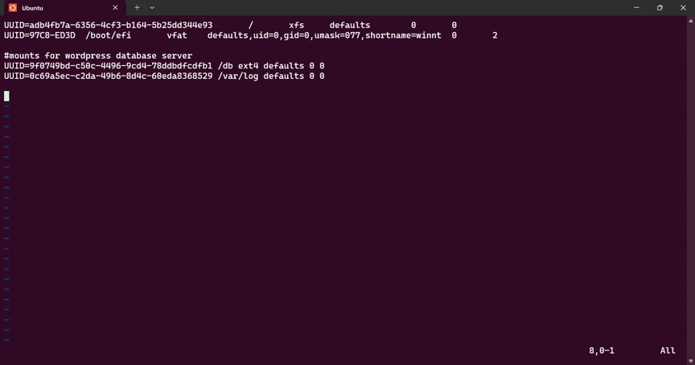

10. Test the configuration and reload daemon. Verify the setup

**sudo mount -a**   # Test the configuration

**sudo systemctl daemon-reload**

**df -h**   # Verifies the setup

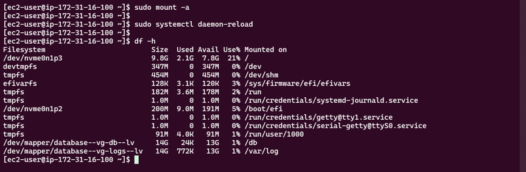

## Step 3 - Install WordPress on the Web Server EC2
1. Update the repository

**sudo yum -y update**

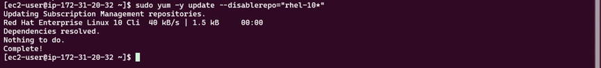

2. Install wget, Apache and it's dependencies

**sudo yum wget httpd php-fpm php-json**

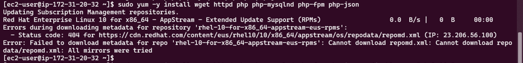

`Problem ` 

An AWS RHEL instance's package manager was frozen due to a conflict between the default AWS update network and a registered, yet broken, Red Hat developer subscription. The solution was to disable the subscription manager and clean the cache, allowing the system to revert to stable AWS mirrors for successful package installation.

(a) *Turn off the broken subscription manager checking mechanism*

**sudo subscription-manager config --rhsm.manage_repos=0**

(b) *Clear out the broken internet repository cache safely*

**sudo dnf clean all**

(c) *Automatically download and install your required packages using AWS mirrors*

**sudo dnf install -y wget httpd php php-mysqlnd php-fpm php-json**

`Solution`

Since the WordPress server is being built and the "yum/dnf" package manager is completely broken by the repository mismatch, the solution is to bypass the network repositories completely. 

Hence, one option is the web server is to completely ignore Red Hat's broken network configurations and use the official, automated AWS update repositories that are already built into your EC2 instance. 

AWS builds a custom update tool called RHUI (Red Hat Update Infrastructure) directly into its servers. This allows the instance to fetch software securely inside AWS, completely bypassing the broken subscription manager.

Wget and dependencies fully installed.

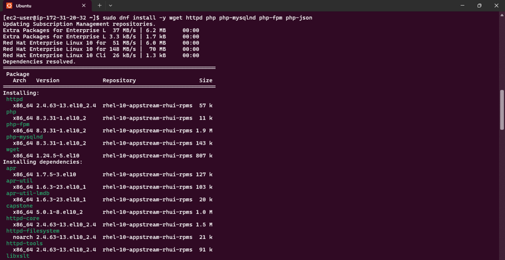

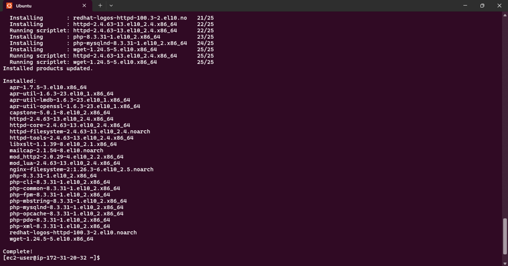

3 & 4. Install the latest version of PHP and it's dependencies using the Remi repository

Install the EPEL repository  

The package manager dnf was used here. It generally offers better performance and more efficient dependency resolution. dnf is the modern, actively maintained package manager, while yum is older and gradually being phased out.

Now, the system version of the RHEL EC2 is version "10".  

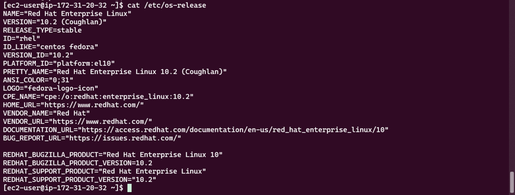

Since RHEL "10" was successfully installed from AWS Red Hat Update Infrastructure (RHUI) installations of lower versions registered as "already installed" and "complete".

**sudo dnf install https://dl.fedoraproject.org/pub/epel/epel-release-latest-10.noarch.rpm**

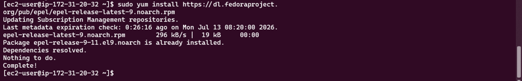

Install yum utils and enable remi-repository

**sudo dnf install dnf-utils http://rpms.remirepo.net/enterprise/remi-release-9.rpm**

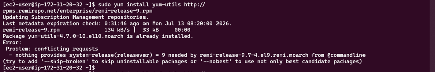

After the successful installation of yum-utils and Remi-packages, search for the PHP modules which are available for download by running the command.

**sudo dnf module list php**

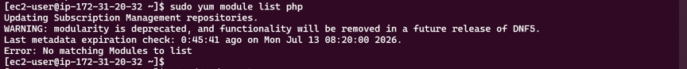

The output above indicates that if the currently installed version of PHP is PHP 8.1, there is need to install the newer release, PHP 8.2. Reset the PHP modules.

**sudo dnf module reset php**

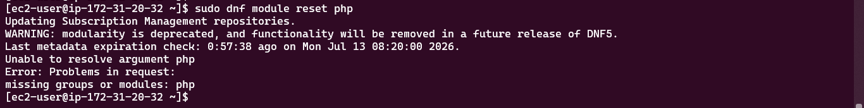

Having run reset, enable the PHP 8.2 module by running

**sudo dnf module enable php:remi-8.2**

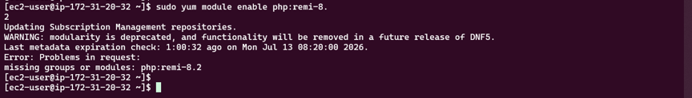

Install PHP, PHP-FPM (FastCGI Process Manager) and associated PHP modules using the command.

**sudo dnf install php php-opcache php-gd php-curl php-mysqlnd**

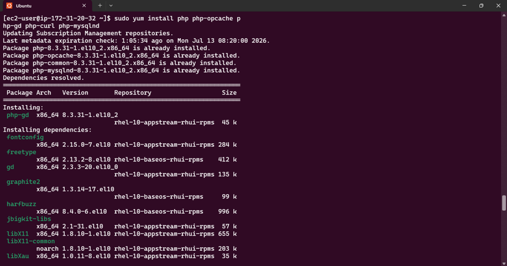

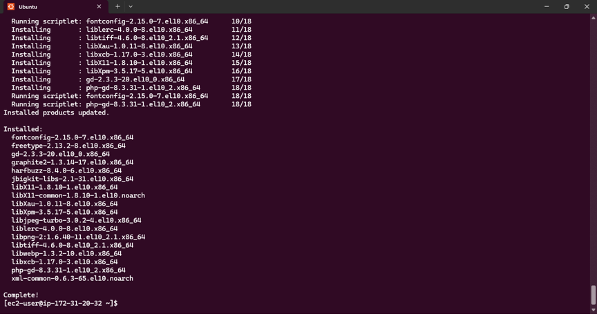

Most of the php dependencies were already installed as they come embedded into Red Hat RHEL version 10.

Start running and enable Apache

**sudo systemctl start php-fpm**  
**sudo systemctl enable php-fpm**  
**sudo systemctl status php-fpm**

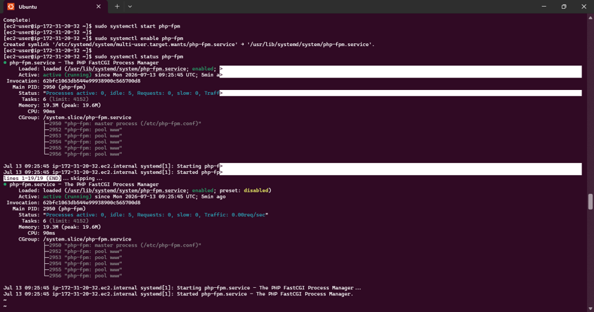

To verify the version installed to run.

**php -v**

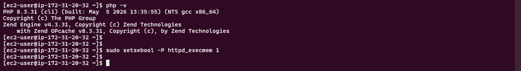

Start, enable and check status of PHP-FPM on boot-up.

5. Restart Apache web server for PHP to work with Apache web server.

**sudo systemctl restart httpd**

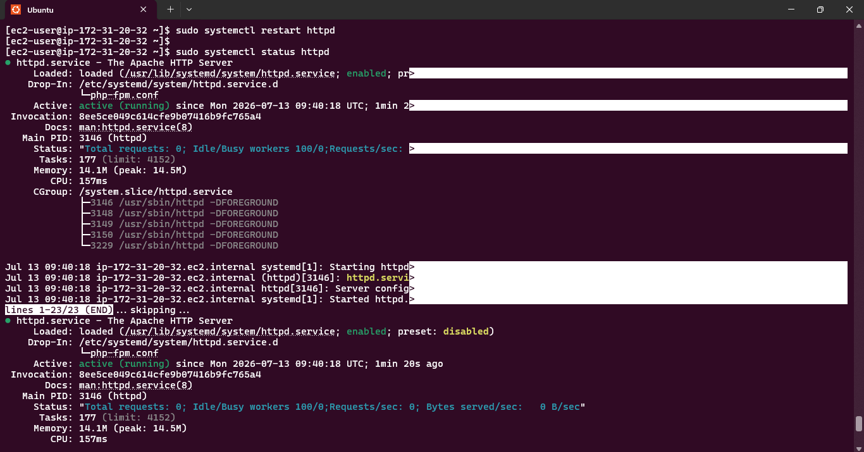

Test to see the default Apache page on a browser using the public IP address

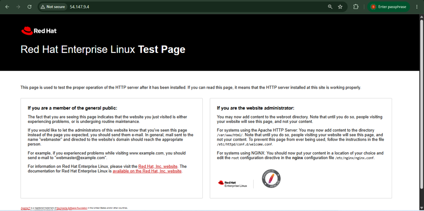

6. Download WordPress

Download wordpress and copy wordpress content to /var/www/html

**sudo mkdir wordpress && cd wordpress**  

**sudo wget http://wordpress.org/latest.tar.gz**  

**sudo tar xzvf latest.tar.gz**   # Extract wordpress

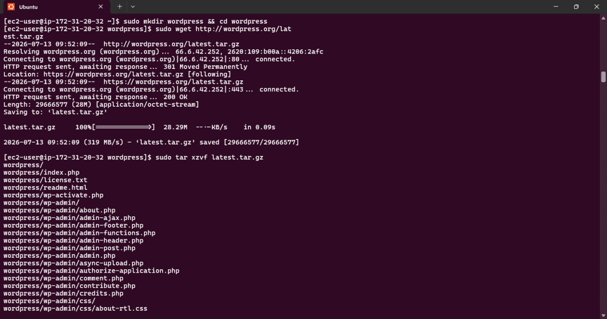

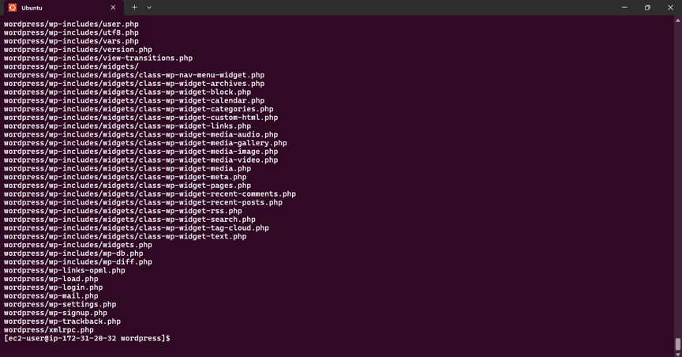

After extraction, cd into the extracted wordpress and Copy the content of wp-config-sample.php to wp-config.php.
This will copy and create the file wp-config.php

**cd wordpress/**

**sudo cp -R wp-config-sample.php wp-config.php**

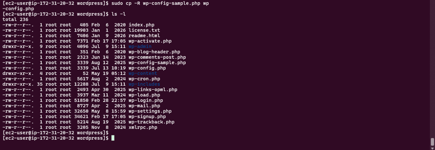

Exit from the extracted wordpress. Copy the content of the extracted wordpress to /var/www/html.

**cd ..**

**sudo cp -R wordpress/. /var/www/html/**

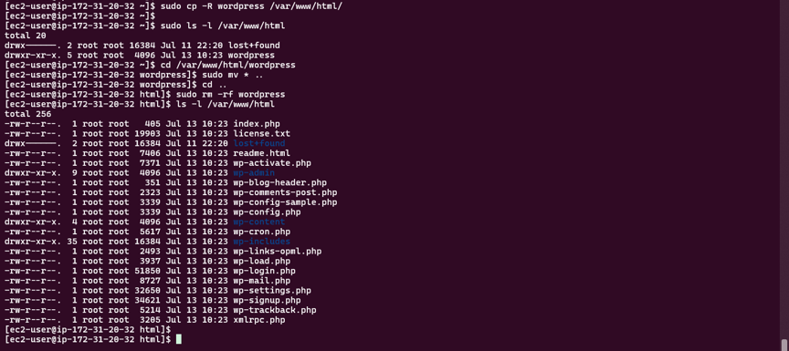

7. Configure SELinux policies

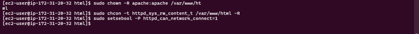

## Step 4 - Install Mysql on the DB Server EC2

1. Install MySQL on DB Server EC2

Update the EC2

**sudo yum update -y**

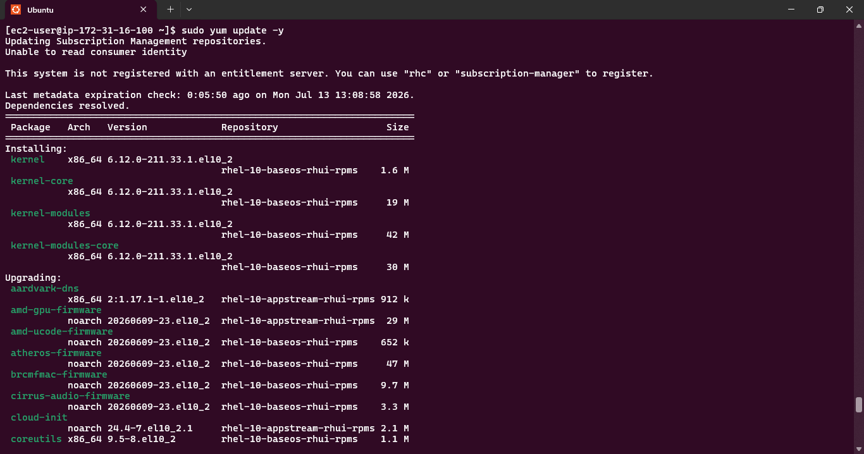

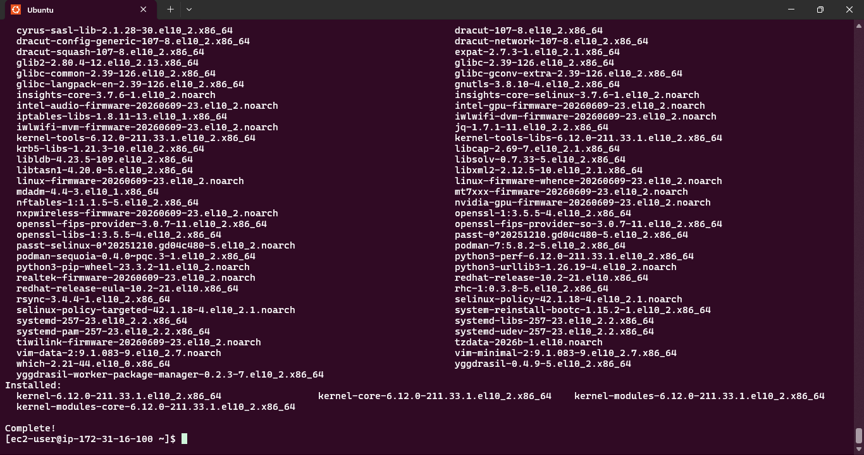

Install MySQL Server

**sudo yum install mysql-server -y**

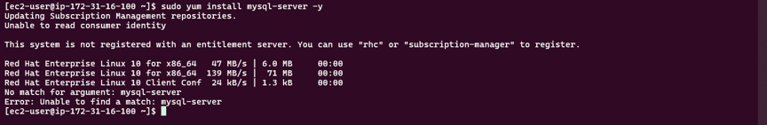

`Problem Statement`

The package manager (dnf/yum) failed to locate and install mysql-server on a Red Hat Enterprise Linux 10 database instance, returning a "No match for argument error".   
This occurred because Oracle's upstream MySQL Server package is absent from the core RHEL 10 repositories, which now exclusively provide MariaDB as the default, community-supported relational database system.

`Solution Statement`

The issue was resolved by pivoting to the platform's native database engine. Running `sudo dnf install -y mariadb-server` pulled the fully compatible MariaDB engine from the active AWS update mirrors, allowing the relational database services to be successfully installed, activated, and enabled on the volume layout without requiring external repositories.

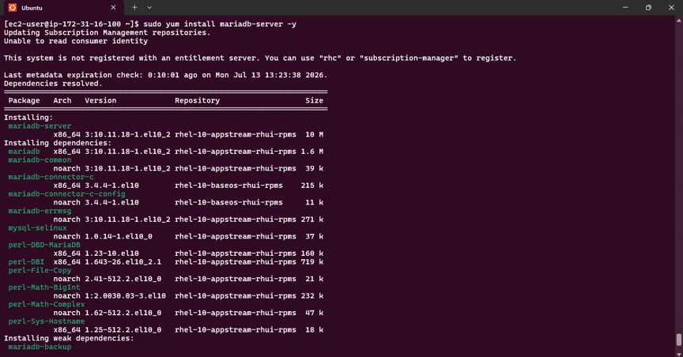

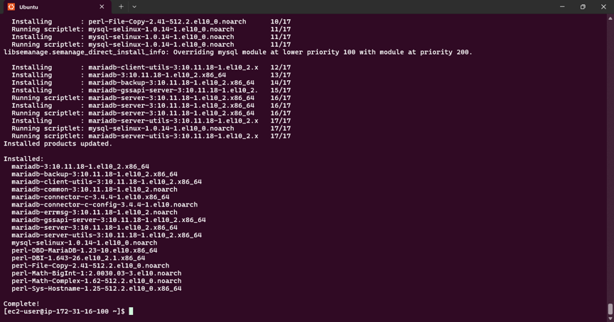

Verify that the service is up and running. If it is not running, restart the service and enable it so it will be running even after reboot.

sudo systemctl start mysqld
sudo systemctl enable mysqld
sudo systemctl status mysqld

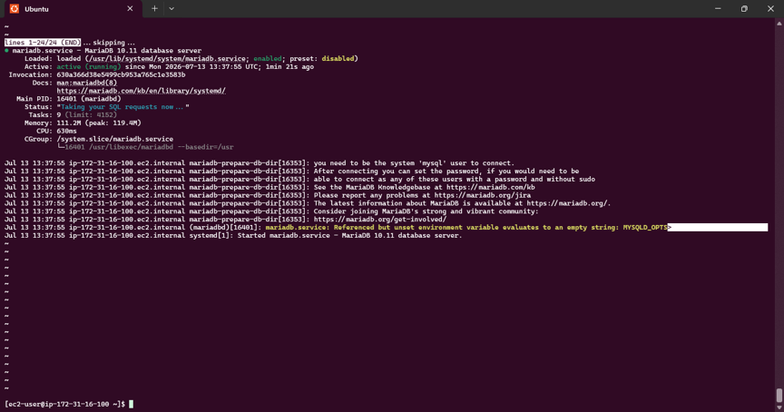

## Step 5 - Configure DB to work with Wordpress

Create database 

The user `wordpress` will be connecting to the database using the Web Server private IP address

**sudo mysql -u root -p**

CREATE DATABASE wordpress_db;
CREATE USER 'wordpress'@'172.31.20.32' IDENTIFIED BY 'Admin123$';
GRANT ALL PRIVILEGES ON wordpress.* TO 'wordpress'@'172.31.20.32';
FLUSH PRIVILEGES;
SHOW DATABASES;
exit

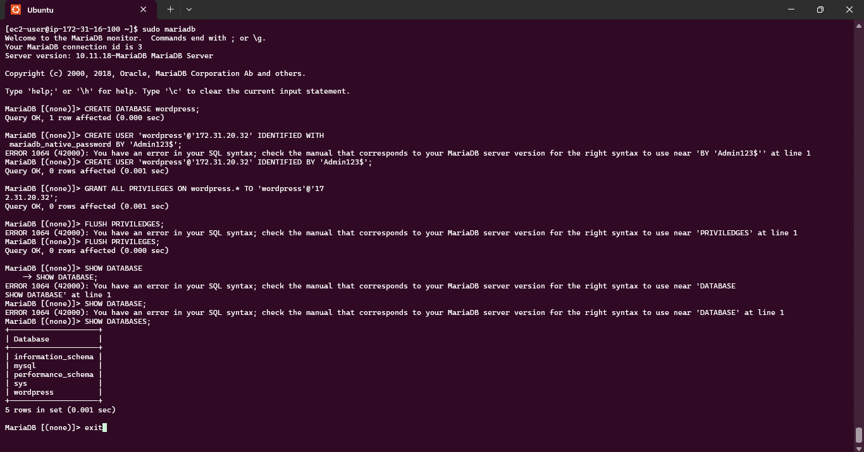

## Step 6 - Configure Wordpress to connect to remote DB

1. Configure WordPress to connect to remote database

Open MySQL port 3306 on the DB Server EC2. 

For extra security, access to the DB Server is allowed only from the Web Server IP address. In the inbound rule, /32 is configured as source.

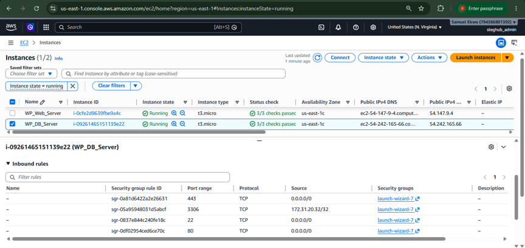

2. Install mysql server on the Web Server EC2.
WordPress has its own database, therefore it needs a database server to store it's information such as: Username, Email, Passwords, First name and Last name of the users on the wordpress website on a database.

**sudo yum install mariadb**

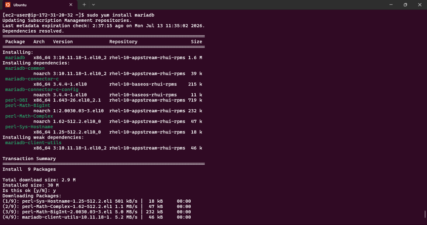

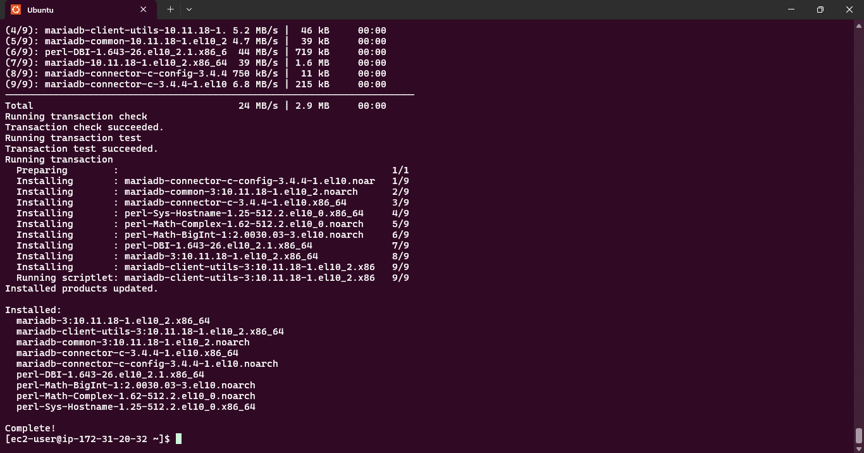

3. Change permissions and configure so Apache can use Wordpress

The private IP address of the DB Server (172.31.16.100) is set as the DB_HOST because the DB Server and the Web Server resides in the same subnet which makes it possible for them to communicate directly. The private IP address is not an internet routable address.

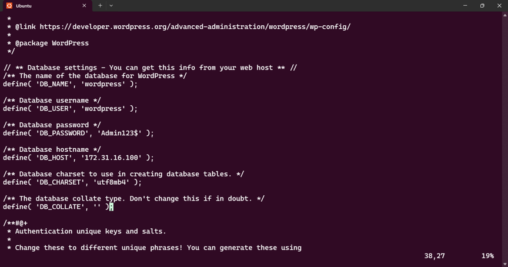

Restart so new configuration settings are applied 

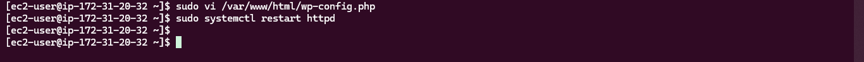

4. Test connection from webserver to DB

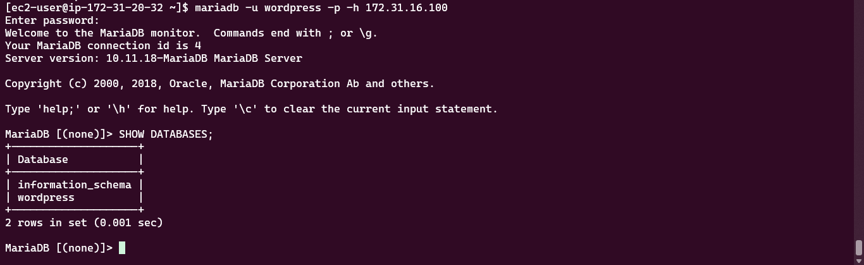

5. Access DB server using private IP (172.31.16.100)

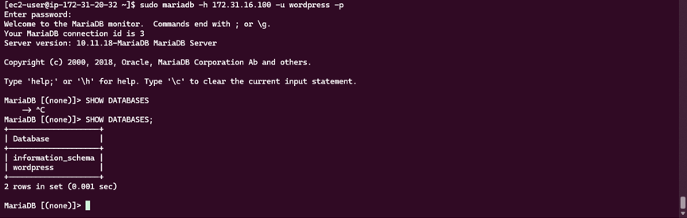

Access the web page again with the Web Server public IP address and install wordpress on the browser

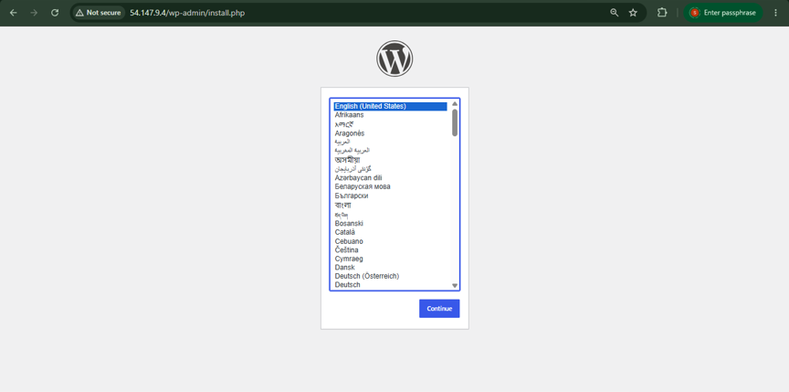

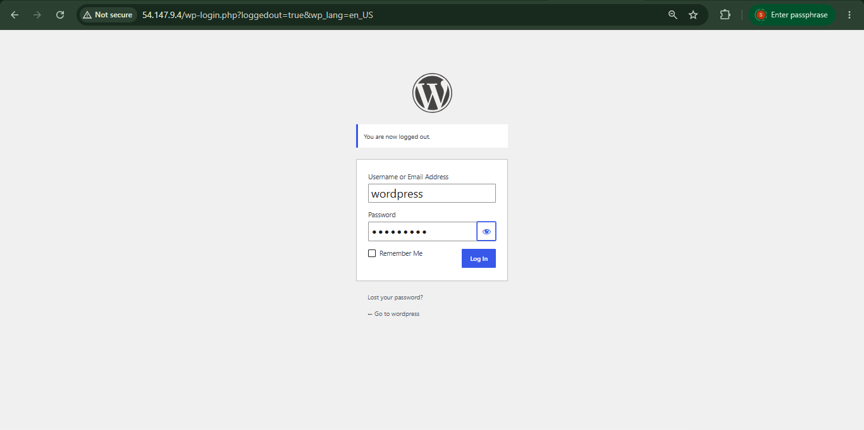

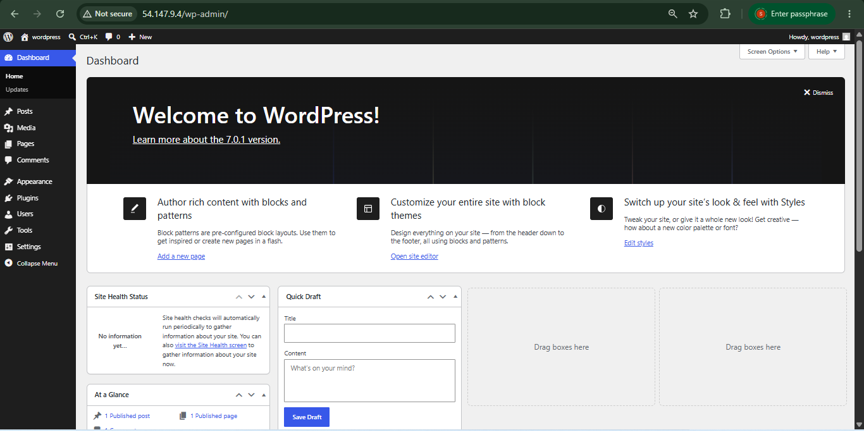

Created a wordpress post on Steghub training

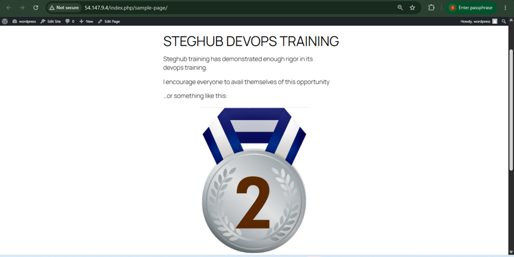

## Conclusion

At this point, the implementation of this project is complete and WordPress is available to be used.