# DevOps Tooling Website Solution

## Introduction

This project involves implementation of a solution that consists of the following components:

S/n | Item | Type
---------|----------|---------
 1 | Infrastructure | AWS
 2 | Web Server Linux | Red Hat Enterprise Linux 10
 3 | Database Server | Ubuntu Linux + MySQL
4 | Storage Server | Red Hat Enterprise Linux 10                      + NFS Server
5 | Programming Language | PHP |
6 | Code Repository | Github  

\
The diagram below shows the architecture of the solution.

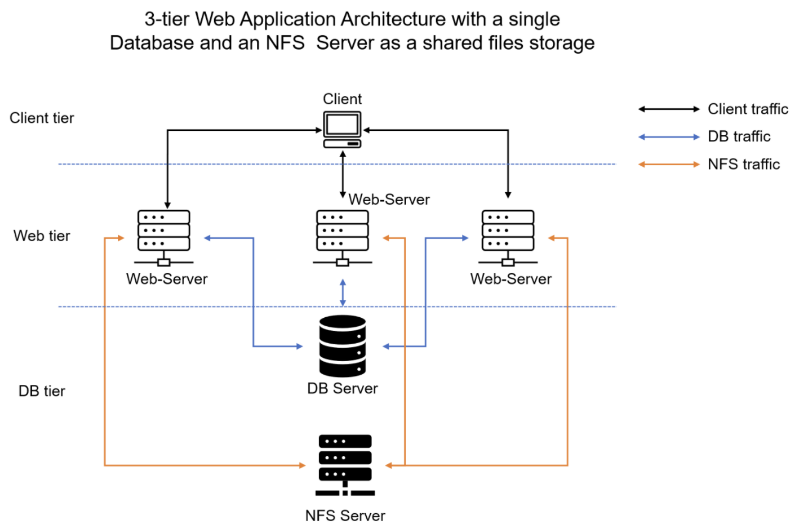

## Step 1 - Prepare NFS Server

1. Spin up an EC2 instance with RHEL Operating System

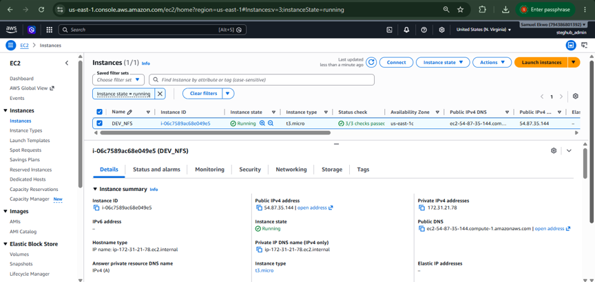

2. Configure Logical volume management on the server

(a) Format the logical volume mmanager (lvm) as `xfs`   

(b) Create 3 Logical volumes: `lv-opt`, `lv-apps`, `lv-logs`.  

(c) Create mount points on `/mnt` directory for the logical volumes as follows:  

(d) Mount `lv-apps` on `/mnt/apps` - To be used by web servers  

(e) Mount `lv-logs` on `/mnt/logs` - To be used by web serveer logs  

(f) Mount `lv-op`t on `/mnt/opt` - To be used by Jenkins server in next project.  

Create 3 volumes in the same AZ as the NFS Server ec2 each of 10GB and attache all 3 volumes one by one to the NFS Server.

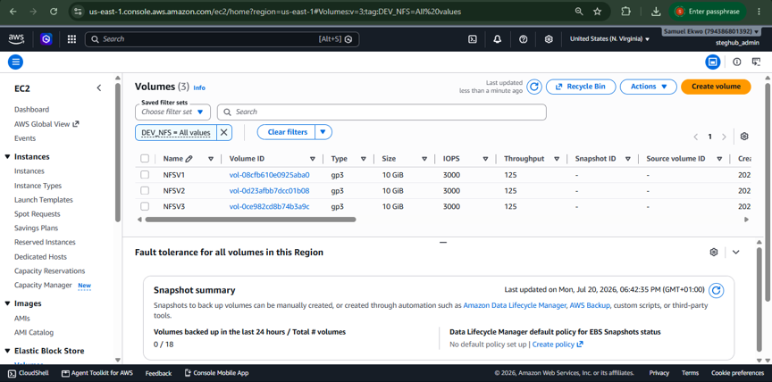

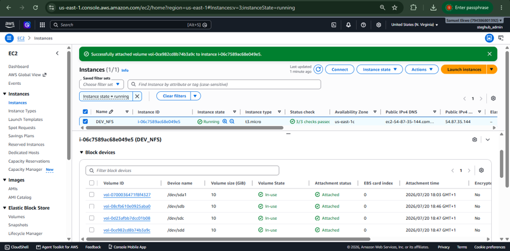

Open up the Linux terminal to begin NFS server configuration.  

**ssh -i "STEG_MEAN.pem" ec2-user@54.87.35.144**

`NFS Server`  
Public IP: 54.87.35.144  
Private IP: 172.31.21.78

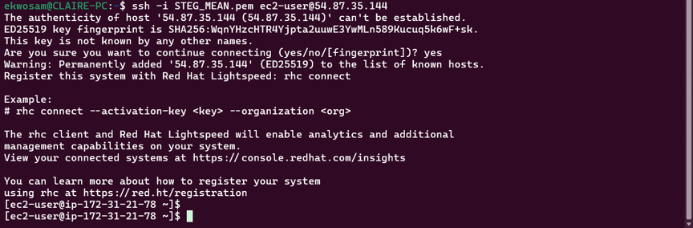

Use `lsblk` to inspect what block devices are attached to the server. 
All devices in Linux reside in `/dev/` directory. Inspect with `ls /dev/` and ensure all 3 newly created devices are there. Their name will likely be xvdf, xvdg and xvdh (Note: In this project, the names were `nvme1n1`, `nvme2n1` and `nvme3n1`)  

**lsblk**

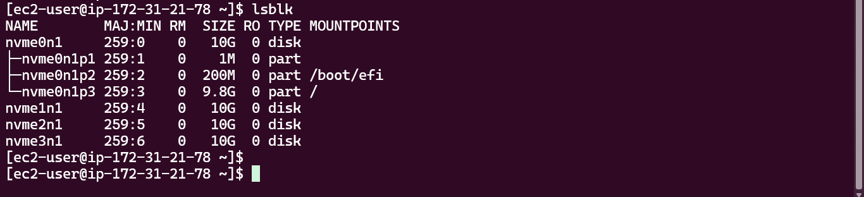

Use `gdisk` utility to create a single partition on each of the 3 disks.  
(Note: `fdisk` was used to create the modern GPT partition usually created with `gdisk` as `gdisk` is not supported in rhel 10).

**sudo fdisk /dev/nvme1n1**

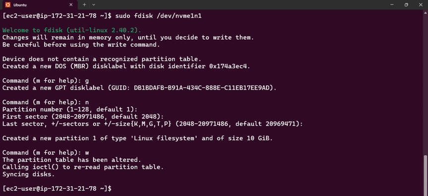

**sudo fdisk /dev/nvme2n1**

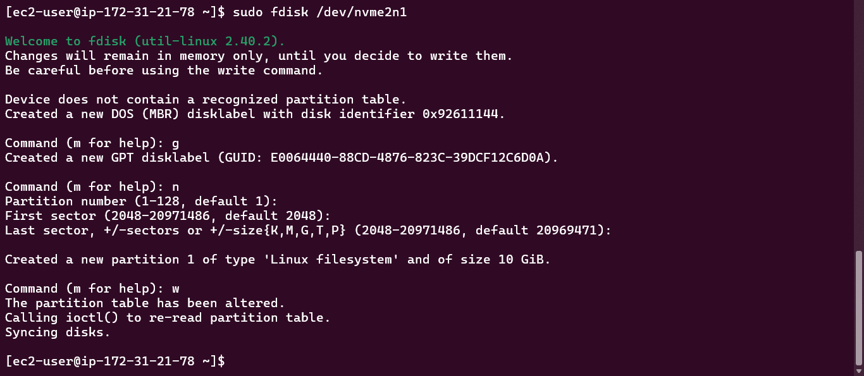

**sudo fdisk /dev/nvme3n1**

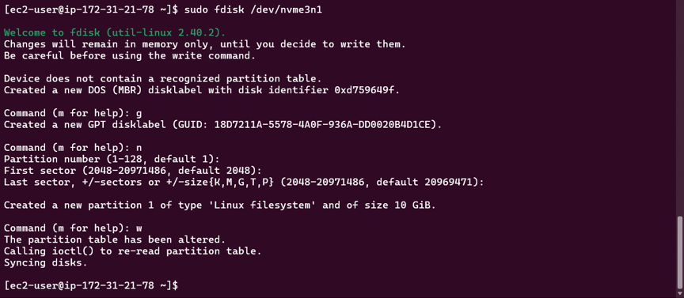

Use `lsblk` utility to view the newly configured partitions on each of the 3 disks  

**lsblk**

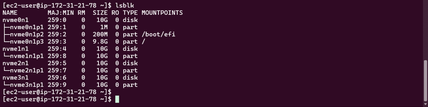

Install `lvm` package  

**sudo yum install lvm2 -y**

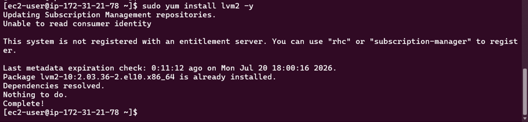

Use `pvcreate` utility to mark each of the 3 dicks as physical volumes (PVs) to be used by LVM.  
Verify that each of the volumes have been created successfully

**sudo pvcreate /dev/nvme1n1 /dev/nvme2n1 /dev/nvme3n1**

**sudo pvs**

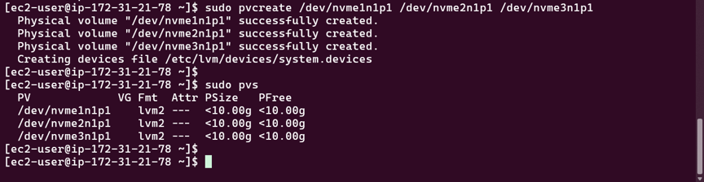

Use `vgcreate` utility to add all 3 PVs to a volume group (VG). Name the VG webdata-vg.   
Verify that the VG has been created successfully

**sudo vgcreate webdata-vg /dev/nvme1n1 /dev/nvme2n1 /dev/nvme3n1**

**sudo vgs**

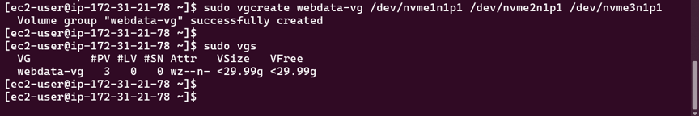

Use `lvcreate` utility to create 3 logical volume, `lv-apps`, `lv-logs` and `lv-opt`.  
 Verify that the logical volumes have been created successfully  

**sudo lvcreate -n lv-apps -L 9G webdata-vg**  
**sudo lvcreate -n lv-logs -L 9G webdata-vg**  
**sudo lvcreate -n lv-opt -L 9G webdata-vg**  

**sudo lvs**

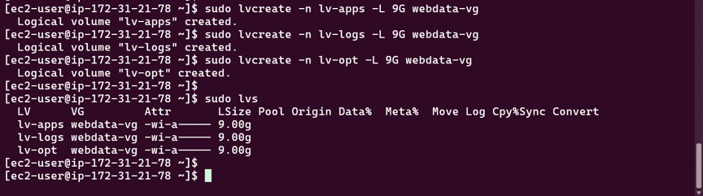

Verify the entire setup  

**sudo vgdisplay -v**  
   #view complete setup, VG, PV and LV

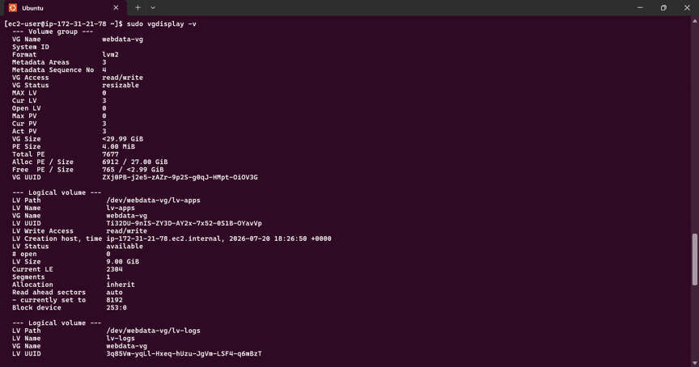

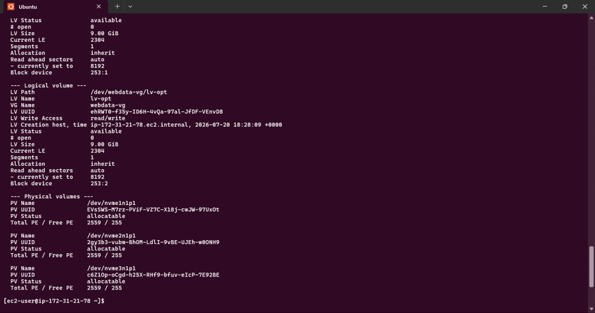

**lsblk**

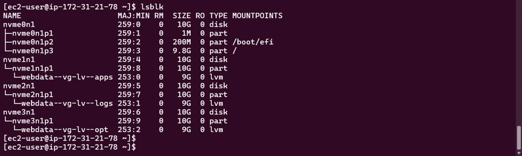

Use `mkfs -t xfs` to format the logical volumes instead of ext4 filesystem  

**sudo mkfs -t xfs /dev/webdata-vg/lv-apps**  
**sudo mkfs -t xfs /dev/webdata-vg/lv-logs**  
**sudo mkfs -t xfs /dev/webdata-vg/lv-opt**  

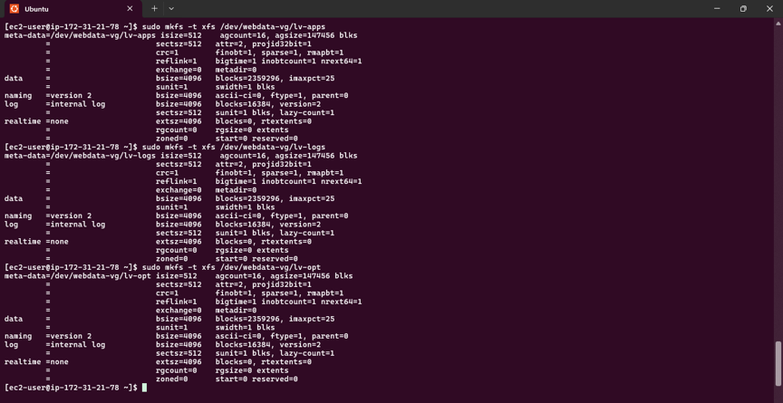

Create mount point on `/mnt` directory  

**sudo mkdir /mnt/apps**  
**sudo mkdir /mnt/logs**  
**sudo mkdir /mnt/opt**  

**sudo mount /dev/webdata-vg/lv-apps /mnt/apps**  
**sudo mount /dev/webdata-vg/lv-logs /mnt/logs**  
**sudo mount /dev/webdata-vg/lv-opt /mnt/opt**  

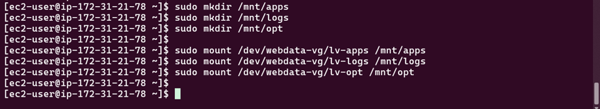

3. Install NFS Server, configure it to start on reboot and ensure it is up and running.

**sudo yum update -y**  
**sudo yum install nfs-utils -y**

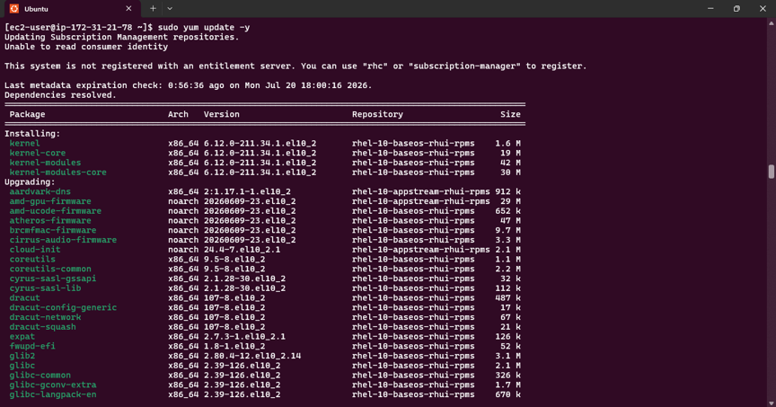

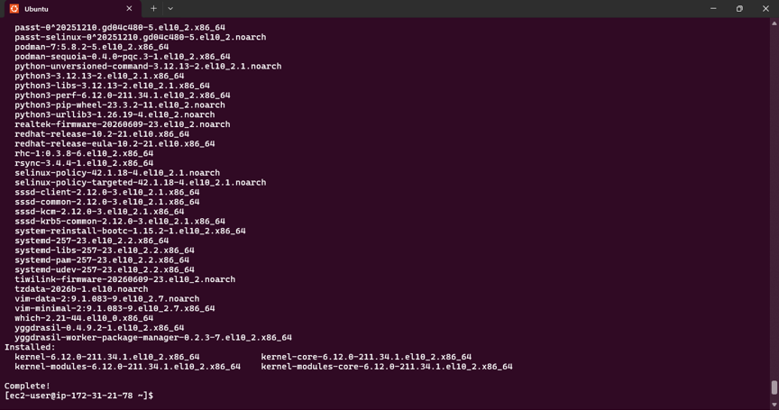

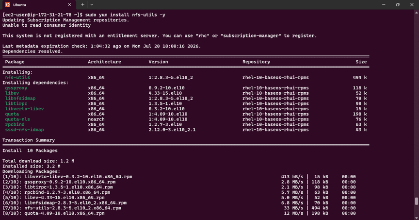

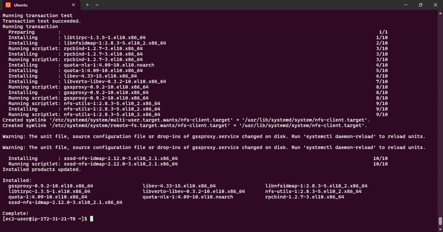

**sudo systemctl start nfs-server.service**  
**sudo systemctl enable nfs-server.service**  
**sudo systemctl status nfs-server.service**

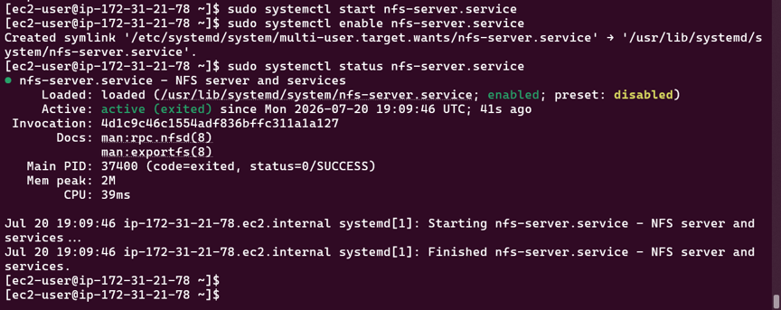

4. Export the mounts for Webservers' subnet cidr(IPv4 cidr) to connect as clients. For simplicity, all 3 Web Servers are installed in the same subnet but in production set up, each tier should be separated inside its own subnet or higher level of security.

Set up permission that will allow the Web Servers to read, write and execute files on NFS.

**sudo chown -R nobody: /mnt/apps**  
**sudo chown -R nobody: /mnt/logs**  
**sudo chown -R nobody: /mnt/opt**    

**sudo chmod -R 777 /mnt/apps**  
**sudo chmod -R 777 /mnt/logs**  
**sudo chmod -R 777 /mnt/opt**  

**sudo systemctl restart nfs-server.service**

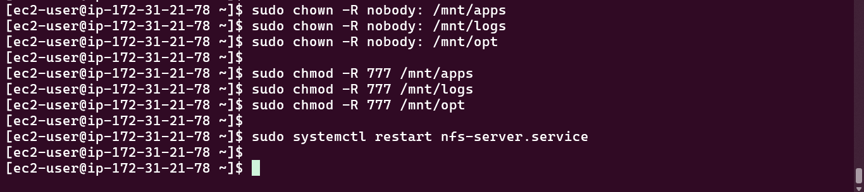

Configure access to NFS for clients within the same subnet  
(`Subnet Cidr - 172.31.16.0/20`)

**sudo vi /etc/exports**

**/mnt/apps 172.31.16.0/20(rw,sync,no_all_squash,no_root_squash)**
**/mnt/logs 172.31.16.0/20(rw,sync,no_all_squash,no_root_squash)**
**/mnt/opt 172.31.16.0/20(rw,sync,no_all_squash,no_root_squash)**

**sudo exportfs -arv**

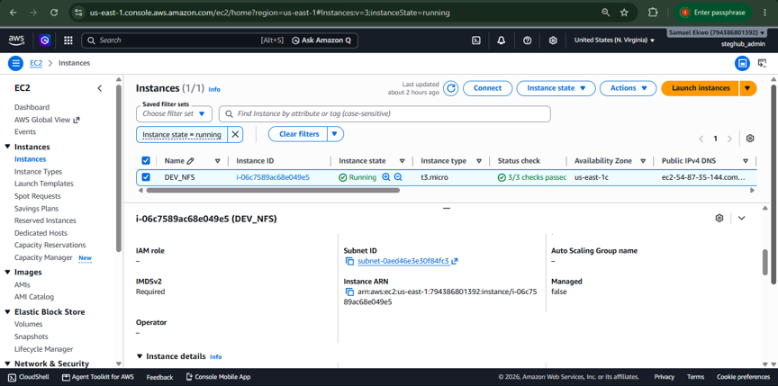

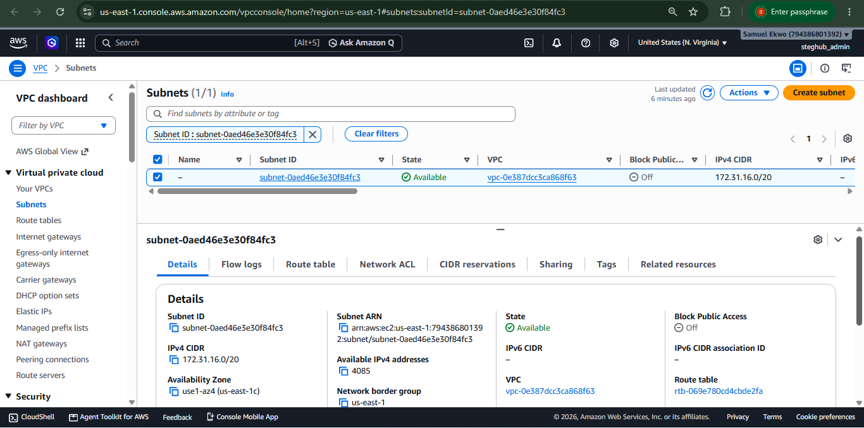

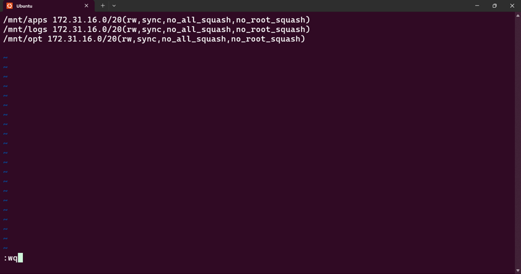

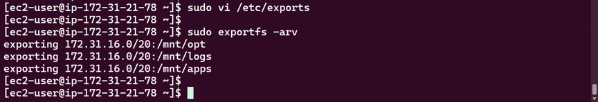

5. Check which port is used by NFS and open it using the security group (add new inbound rule)

**rpcinfo -p | grep nfs**

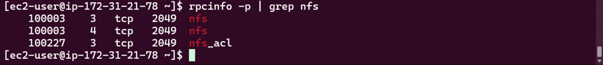

Note: For NFS Server to be accessible from the client, the following ports must be opened: TCP 111, UDP 111, UDP 2049, NFS 2049. Set the Web Server subnet cidr as the source

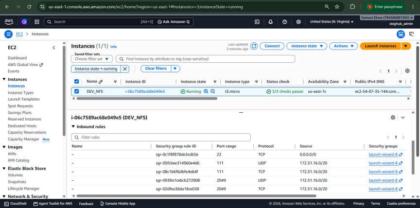

## Step 2 - Configure the Database Server

Launch an Ubuntu EC2 instance that will have a role - DB Server

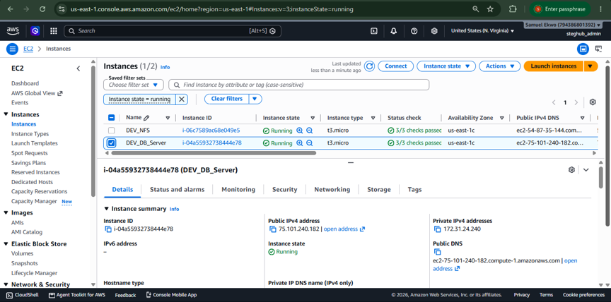

Access the instance to begin configuration.  

**ssh -i "STEG_MEAN.pem" ubuntu@18.116.87.242**

`DB Server`  
Public IP: 75.101.240.182  
Private IP: 172.31.24.240

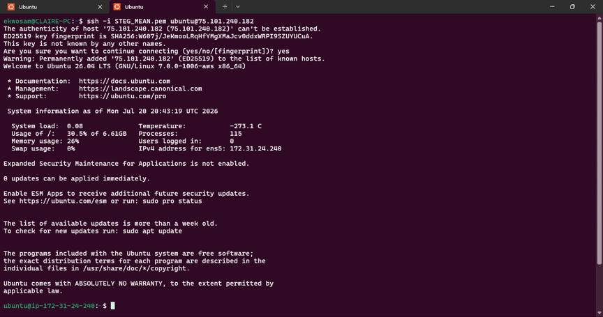

Update and upgrade Ubuntu

**sudo apt update && sudo apt upgrade -y**

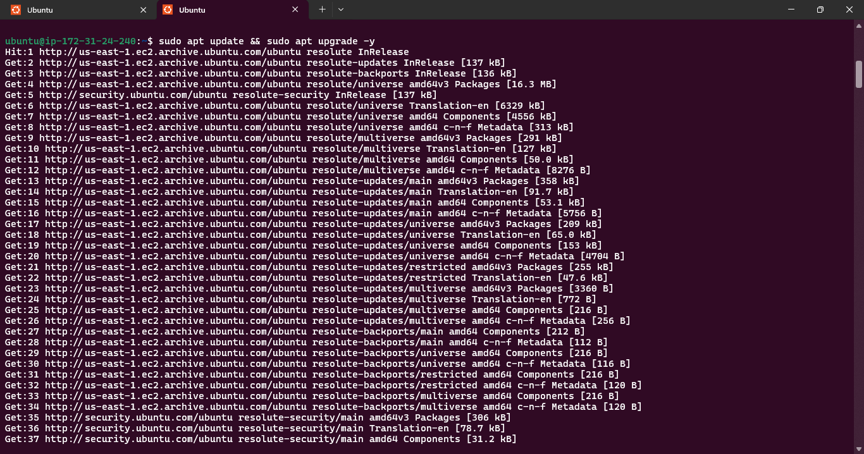

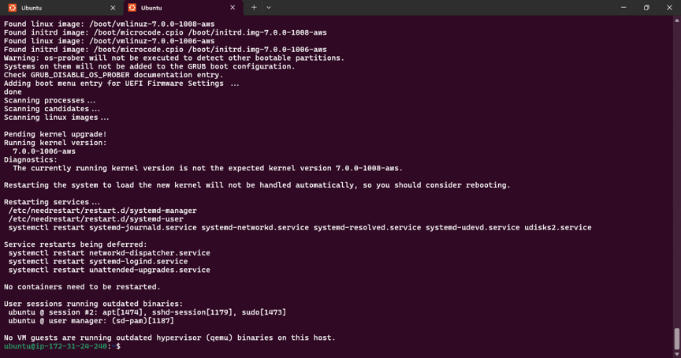

1. Install MySQL Server

Install mysql server

**sudo apt install mysql-server**

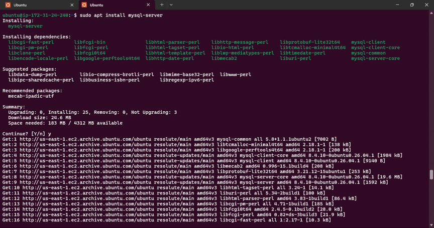

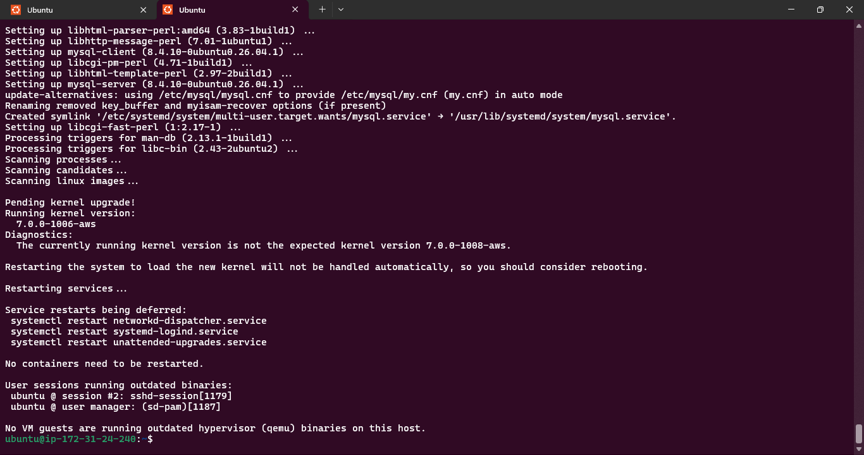

Run mysql secure script

**sudo mysql_secure_installation**

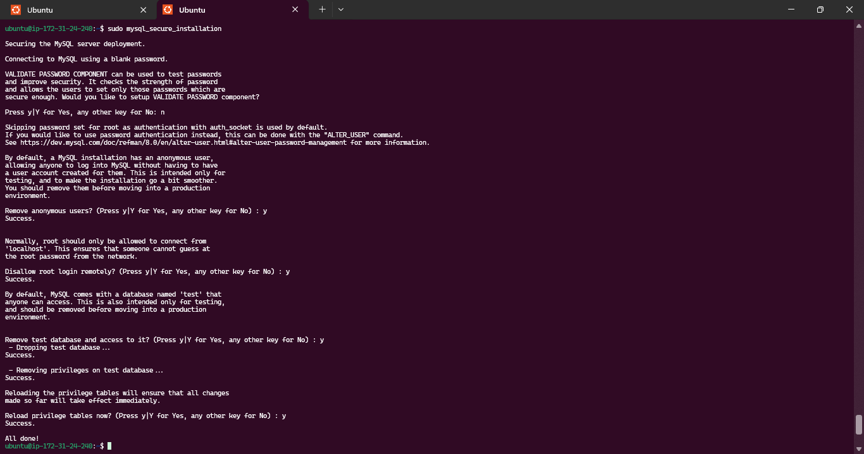

2. Create a database and name it `tooling`

3. Create a database user and name it `webaccess`

4. Grant permission to `webaccess` user on `tooling` database to do anything only from the webservers subnet cidr (`172.31.16.0/20`)

**sudo mysql**

CREATE DATABASE tooling;

CREATE USER 'webaccess'@'172.31.16.0/20' IDENTIFIED WITH mysql_native_password BY 'Admin123$';  

GRANT ALL PRIVILEGES ON tooling.\* TO 'webaccess'@'172.31.0.0/20' WITH GRANT OPTION;  
FLUSH PRIVILEGES; 

SHOW databases;  

USE tooling;  

SELECT host, user FROM mysql.user;  

exit

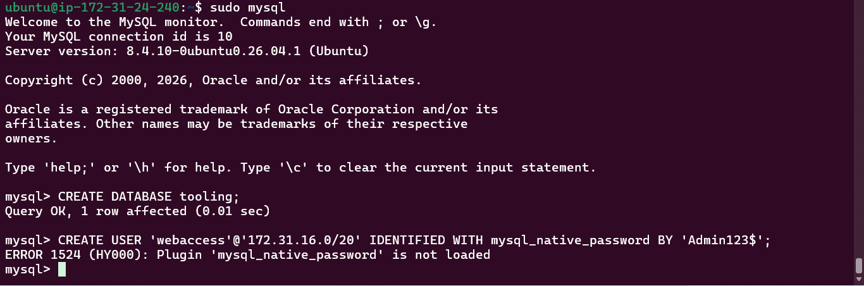

**1. Problem Description**

While configuring the database tier for the DevOps Tooling Website Solution, executing the standard database user creation command resulted in an immediate engine error: 

*sql  
mysql> CREATE USER 'webaccess'@'172.31.16.0/20' IDENTIFIED WITH mysql_native_password BY 'Admin123$';  
ERROR 1524 (HY000): Plugin 'mysql_native_password' is not loaded*

**2. Root Cause Analysis**

The failure was caused by two architectural conflicts between the query syntax and the modern MySQL engine:  

•	Deprecated Authentication Engine: In modern MySQL versions, the legacy mysql_native_password plugin is disabled by default in favor of the more secure caching_sha2_password mechanism. Attempting to explicitly invoke the uninstalled legacy plugin causes the query to fail.  

•	Unsupported Network Notation: Unlike firewalls or security groups, the MySQL database server cannot parse standard CIDR IP routing notation (such as /20). It rejects the query because it cannot dynamically compute the network range from that specific format.  

**3. Resolution (Solution A: Modern SHA2 + Netmask)**  

To align with modern security practices and correct the network syntax, the database user configuration was updated to use the default caching_sha2_password engine implicitly. Additionally, the network boundary was rewritten using Subnet Mask Notation (255.255.240.0 is the direct equivalent of a /20 network block).  

`Corrected SQL Commands:`  

(a) Create the user using the correct network mask and modern authentication  

CREATE USER 'webaccess'@'172.31.16.0/255.255.240.0' IDENTIFIED BY 'Admin123$'; 

(b) Grant required administrative access rights across the database infrastructure  

GRANT ALL PRIVILEGES ON *.* TO 'webaccess'@'172.31.16.0/255.255.240.0';

(c) Reload internal memory access tables to apply changes immediately  

FLUSH PRIVILEGES;

**4. Verification**

Running these updated statements successfully registered the account. The MySQL server can now accurately parse incoming connections from any EC2 web server instance residing within the 172.31.16.0/20 subnet range.

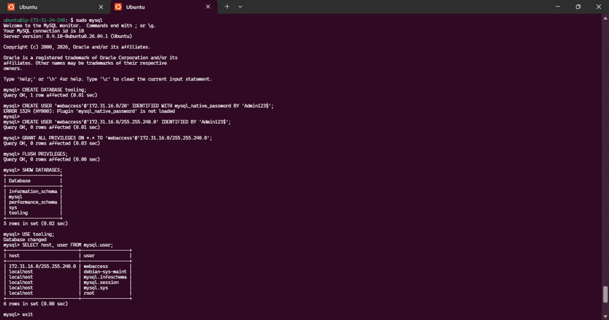

Set Bind Address and restart MySQL

**sudo vi /etc/mysql/mysql.conf.d/mysqld.cnf**

**sudo systemctl restart mysql**  
**sudo systemctl status mysql**

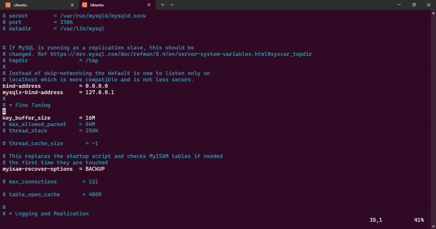

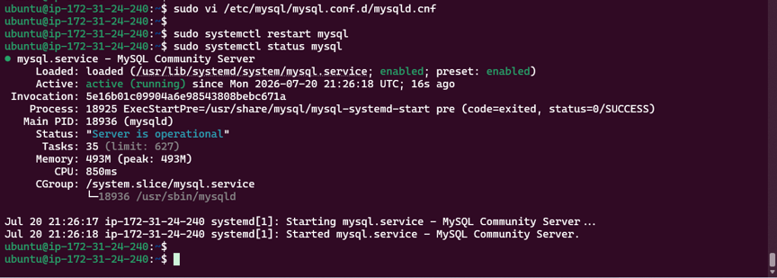

Open MySQL port 3306 on the DB Server EC2.

Access to the DB Server is allowed only from the Subnet Cidr configured as source.

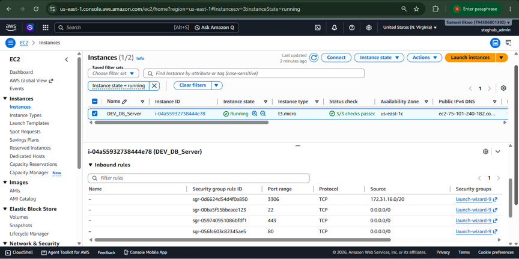

## Step 3 - Prepare the Web Servers

There is need to ensure that the Web Servers can serve the same content from a shared storage solution, in this case - NFS and MySQL database. 

One DB can be accessed for read and write by multiple clients. For storing shared files that the Web Servers will use, NFS is utilized and previousely created Logical Volume `lv-apps` is mounted to the folder where Apache stores files to be served to the users (`/var/www`).

This approach makes the Web server stateless which means they can be replaced when needed and data (in the database and on NFS) integrtity is preserved

In further steps, the following was done:

(a) Configured NFS (This step was done on all 3 servers)
(b) Deployed a tooling application to the Web Servers into a shared NFS folder
(c) Configured the Web Server to work with a single MySQL database

### Web Server 1

1. Launch a new EC2 instance with RHEL Operating System

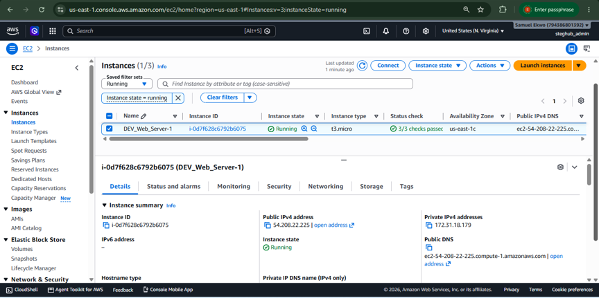

Establish remote connection to Web server 1

**ssh -i "STEG_MEAN.pem" ec2-user@54.208.22.225**

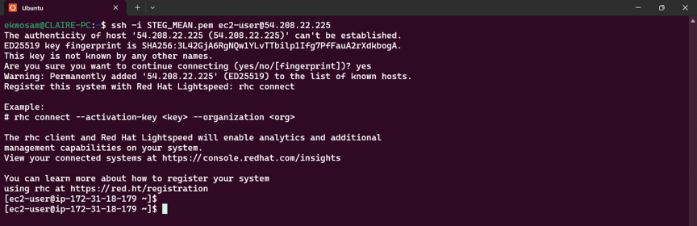

`Web Server 1`  
Public IP: 54.208.22.225   
Private IP: 172.31.18.179

2. Install NFS Client

**sudo yum install nfs-utils nfs4-acl-tools -y***

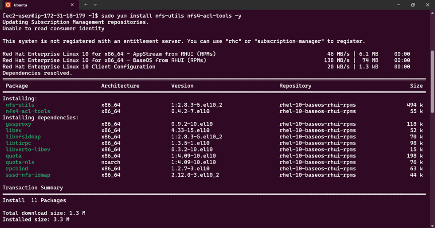

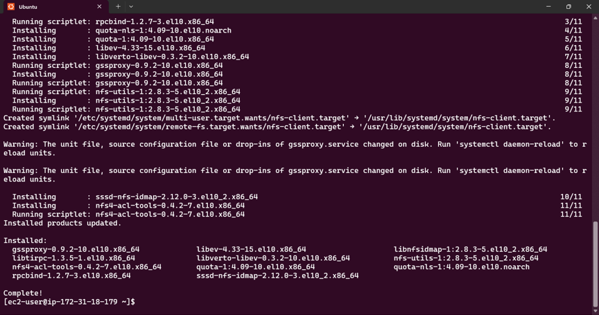

3. Mount `/var/www/` and target the NFS server's export for apps.  
   
NFS Server private IP address = `172.31.21.78`

**sudo mkdir /var/www**  
**sudo mount -t nfs -o rw,nosuid 172.31.1.209:/mnt/apps /var/www**  

1. Verify that NFS was mounted successfully by running `df -h`. Ensure that the changes will persist after reboot.

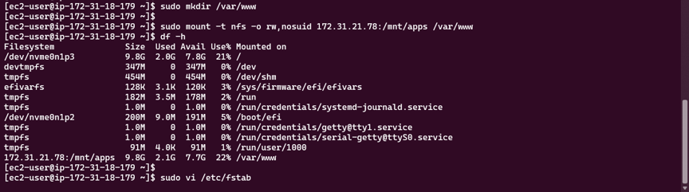

**sudo vi /etc/fstab**

Add the following line

`172.31.21.78:/mnt/apps /var/www nfs defaults 0 0`

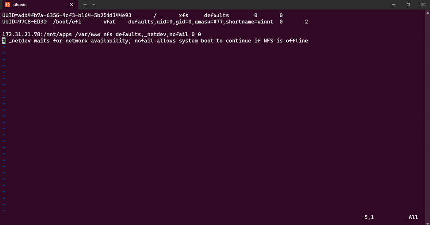

(**Note**: # `_netdev` is included to ensure mounting waits for network availability during the booting process; `nofail` allows system boot to continue if NFS is offline. These ensure the server does not go into emergency boot sequence and become dysfunctional during the booting process)

5. Install Remi's repository, Apache and PHP

**sudo yum install httpd -y**

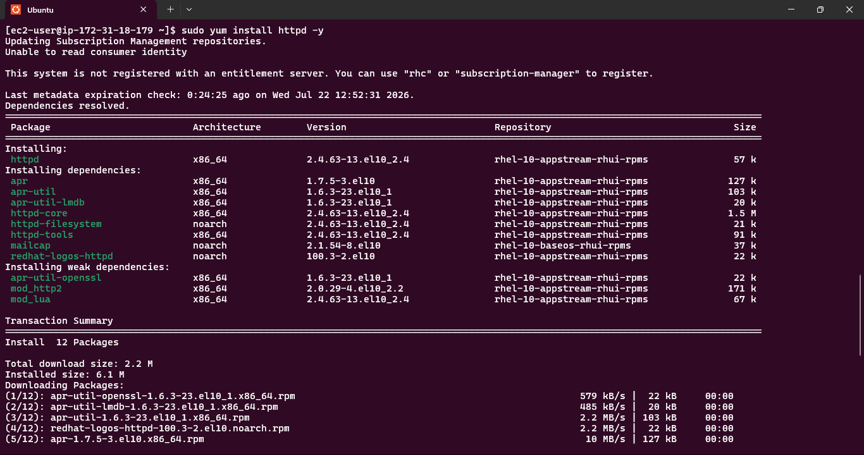


**sudo dnf install https://dl.fedoraproject.org/pub/epel/epel-release-latest-10.noarch.rpm**


**sudo dnf install dnf-utils http://rpms.remirepo.net/enterprise/remi-release-10.rpm**


**sudo dnf module reset php**


**sudo dnf module enable php:remi-8.5**


**sudo dnf install php php-opcache php-gd php-curl php-mysqlnd**


**sudo systemctl start php-fpm**  
**sudo systemctl enable php-fpm**  
**sudo systemctl status php-fpm**

**sudo setsebool -P httpd_execmem 1**  # Allows the Apache HTTP server (httpd) to execute memory that it can also write to. This is often needed for certain types of dynamic content and applications that may need to generate and execute code at runtime.


### Web Server 2

1. Launch another new EC2 instance with RHEL Operating System


Establish remote connection to Web server 2

**ssh -i "STEG_MEAN.pem" ec2-user@44.220.152.255**


`Web Server 2`  
Public IP: 44.220.152.255   
Private IP: 172.31.16.202

2. Install NFS Client

**sudo yum install nfs-utils nfs4-acl-tools -y**


3. Mount `/var/www/` and target the NFS server's export for apps. NFS Server private IP address = 172.31.21.78

**sudo mkdir /var/www**  
**sudo mount -t nfs -o rw,nosuid 172.31.21.78:/mnt/apps /var/www**  

4. Verify that NFS was mounted successfully by running `df -h`. Ensure that the changes will persist after reboot.

**sudo vi /etc/fstab**  

Add the following line

`172.31.21.78:/mnt/apps /var/www nfs defaults 0 0`   


(**Note**: # `_netdev` is included to ensure mounting waits for network availability during the booting process; `nofail` allows system boot to continue if NFS is offline. These ensure the server does not go into emergency boot sequence and become dysfunctional during the booting process)

5. Install Remi's repoeitory, Apache and PHP

**sudo yum install httpd -y**


**sudo dnf install https://dl.fedoraproject.org/pub/epel/epel-release-latest-10.noarch.rpm**


**sudo dnf install dnf-utils http://rpms.remirepo.net/enterprise/remi-release-10.rpm**


**sudo dnf module reset php**


**sudo dnf module enable php:remi-8.5**

**sudo dnf install php php-opcache php-gd php-curl php-mysqlnd**


**sudo systemctl start php-fpm**  
**sudo systemctl enable php-fpm**  
**sudo systemctl status php-fpm**  
**sudo setsebool -P httpd_execmem 1**  


### Web Server 3

1. Launch another new EC2 instance with RHEL Operating System


Establish remote connection to Web server 3

**ssh -i "STEG_MEAN.pem" ec2-user@98.93.19.208**


`Web Server 3`  
Public IP: 98.93.19.208   
Private IP: 172.31.18.39

2. Install NFS Client

**sudo yum install nfs-utils nfs4-acl-tools -y**


3. Mount `/var/www/` and target the NFS server's export for apps. NFS Server private IP address = 172.31.21.78

**sudo mkdir /var/www**  
**sudo mount -t nfs -o rw,nosuid 172.31.21.78:/mnt/apps /var/www**


4. Verify that NFS was mounted successfully by running `df -h`. Ensure that the changes will persist after reboot.


5. Install Remi's repoeitory, Apache and PHP

**sudo yum install httpd -y**


**sudo dnf install https://dl.fedoraproject.org/pub/epel/epel-release-latest-10.noarch.rpm**


**sudo dnf install dnf-utils http://rpms.remirepo.net/enterprise/remi-release-10.rpm**


**sudo dnf module reset php**


**sudo dnf module enable php:remi-8.5**

**sudo dnf install php php-opcache php-gd php-curl php-mysqlnd**


**sudo systemctl start php-fpm**  
**sudo systemctl enable php-fpm**  
**sudo systemctl status php-fpm**  
**sudo setsebool -P httpd_execmem 1**  


6. Verify that Apache files and directories are availabel on the Web Servers in `/var/www` and also on the NFS Server in `/mnt/apps`. If the same files are present in both, it means NFS was mounted correctly. `test.txt` file was created from Web Server 1, and it was accessible from Web Server 2.


7. Locate the log folder for Apache on the Web Server and mount it to NFS server's export for logs. Repeat step 4 to ensure the mount point persists after reboot.

**sudo vi /etc/fstab**

Add the following line

`172.31.21.78:/mnt/logs /var/log/httpd nfs defaults 0 0`


8. Fork the tooling source code from StegHub GitHub Account


9. Deploy the tooling Website's code to the Web Server. Ensure that the html folder from the repository is deplyed to `/var/www/html`

**install git**


Initialize the directory and clone the tooling repository
Ensure to clone the forked repository


Note: Access the website on a browser

Ensure TCP port 80 is open on the Web Server.
If 403 Error occur, check permissions to the /var/www/html folder and also disable SELinux
sudo setenforce 0
To make the change permanent, open selinux file and set selinux to disable.

**sudo vi /etc/sysconfig/selinux**

**SELINUX=disabled**

**sudo systemctl restart httpd**


Apache was not working.


10. Update the website's configuration to connect to the database (in `/var/www/html/function.php file`). Apply tooling-db.sql command sudo mysql -h <db-private-IP> -u <db-username> -p <db-password < tooling-db.sql

**sudo vi /var/www/html/functions.php**


The database could not be accessed from web server.

**Problem Statement**

The “curl -I” response: HTTP/1.1 302 found shifting location to login.php! This means the code executed perfectly, initialized a PHP session ID, and is actively trying to redirect the user to the login screen.  
The web server cannot speak to the remote MySQL server yet because the local mysql terminal command utility isn't installed.


On Red Hat Enterprise Linux (RHEL) 10, Red Hat has completely removed legacy `MySQL` package definitions from their official default AppStream repositories. They have fully migrated to `MariaDB` as their native, drop-in open-source relational database provider.
Because of this, trying to install a package named `mysql` returns `“No match for argument: mysql”`.


**sudo mysql -h 172.31.8.129 -u webaccess -p tooling < tooling-db.sql**


Access the database server from Web Server. 11. Create in MyQSL a new admin user with username: `myuser` and password: `password`

**sudo mysql -h 172.31.8.129 -u webaccess -p**


12. Open a browser and access the website using the Web Server public IP address `http://<Web-Server-public-IP-address>/index.php`. Ensure login into the website with myuser user.

\
`From Web Server 1`


\
`For Web Server 2`

Confirm webserver 2 mounting logs


**sudo setenforce 0**


Access website from the browser


\
`For Web Server 3`

Confirm webserver 3 mounting logs and apache is running


## Conclusion

By deploying a unified code base and centralized logging across a cluster of three synchronized web servers, this architecture achieves decoupled, highly resilient infrastructure backed by a dedicated MySQL database. 

Connecting these instances to a central Network File System (NFS) enables horizontal scaling while eliminating deployment drift across compute nodes. This layout establishes a robust, highly available foundation optimized for the seamless integration of an upstream Application Load Balancer.