# Load Balancer Solution With Apache

A Load Balancer (LB) distributes clients' requests among underlying Web Servers and makes sure that the load is distributed in an optimal way.

The diagrame below shows the architecture of the solution


## Task
Deploy and configure an Apache Load Balancer for Tooling Website solution on a separate Ubuntu EC2 instance. Make sure that users can be served by Web servers through the Load Balancer.

## Prerequisites
    Ensure that the following servers are installedd and configured already:

    - Two RHEL10 Web Servers
    - One MySQL DB Server (based on Ubuntu 26.04)
    - One RHEL10 NFS Server
  
    Prerequisites Configurations

    * Apache (httpd) is up and running on both Web Servers.
    * /var/www directories of both Web Servers are mounted to /mnt/apps of the NFS Server.
    * All neccessary TCP/UDP ports are opened on Web, DB and NFS Servers.
    * Client browsers can access both Web Servers by their Public IP addresses or Public DNS names and can open the Tooling Website (e.g, http://<Public-IP-Address-or-Public-DNS-Name>/index.php)


## Step 1 - Configure Apache As A Load Balancer

1. Create an Ubuntu Server 26.04 EC2 instance and name it `Project-8-apache-lb`

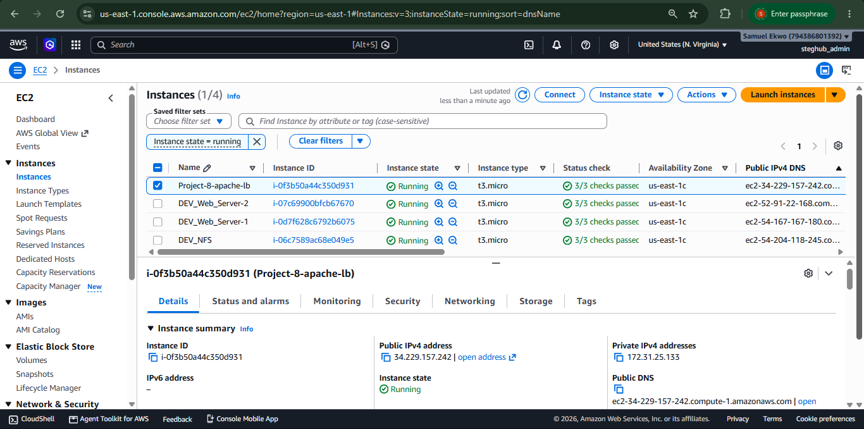

2. Open `TCP port 80` on `Project-8-apache-lb` by creating an Inbound Rule in Security Group

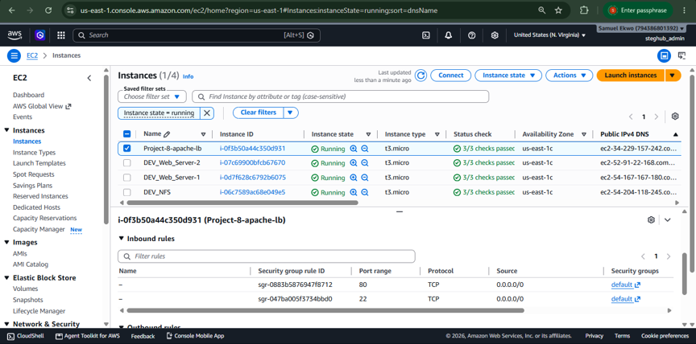

3. Instal Apache Load Balancer on `Project-8-apache-lb` and configure it to point traffic coming to LB to both Web Servers.
   
(a) Install Apache2  

(i) Access the instance  

**ssh -i STEG_MEAN.pem ubuntu@34.229.157.242**

`LB - Public IP address: 34.229.157.242`  
`LB - Private IP address: 172.31.25.133`

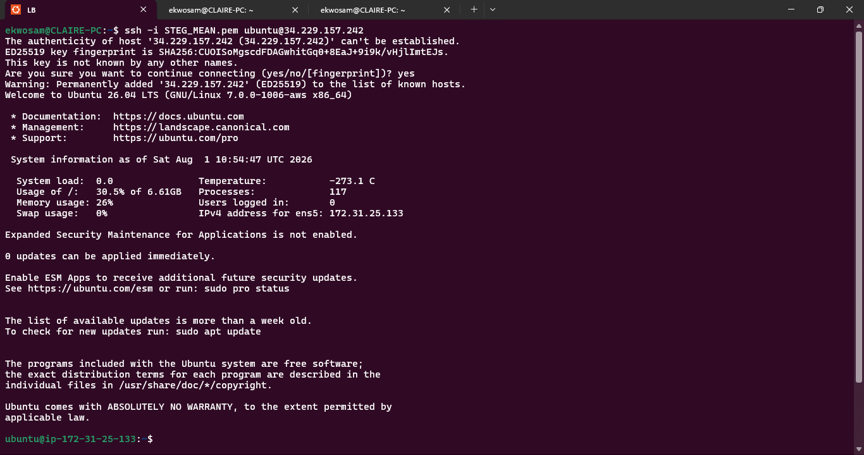

(ii) Update and upgrade Ubuntu

**sudo apt update && sudo apt upgrade**

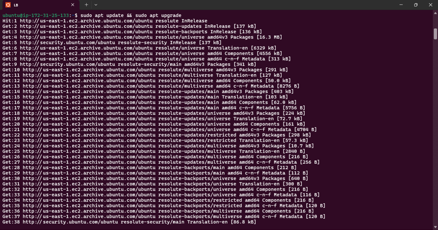

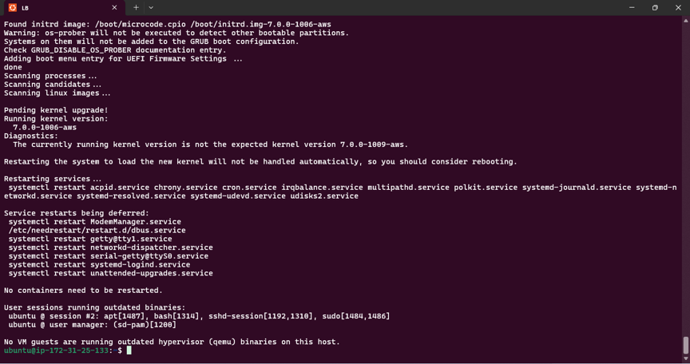

(iii) Install Apache2

**sudo apt install apache2 -y**

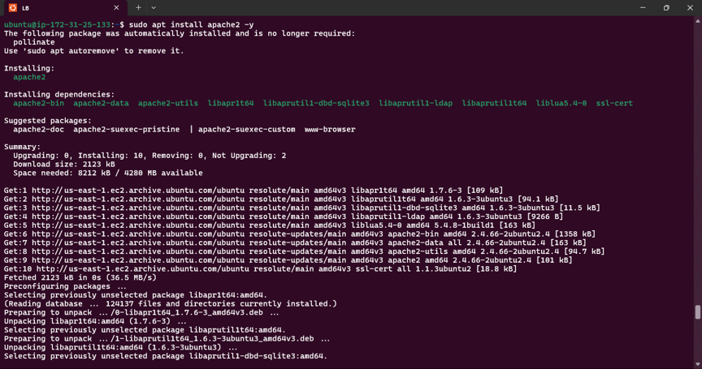

**sudo apt-get install libxml2-dev**

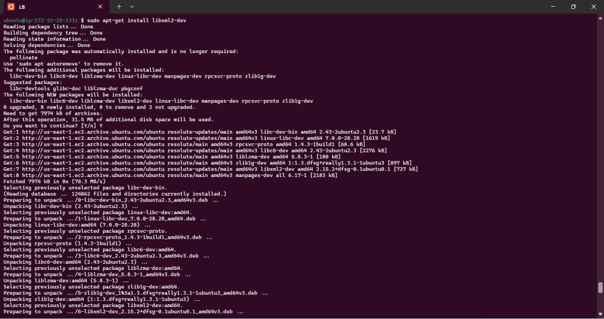

(b) Enable the following modules

    ```
    sudo a2enmod rewrite

    sudo a2enmod  proxy

    sudo a2enmod  proxy_balancer

    sudo a2enmod  proxy_http

    sudo a2enmod  headers

    sudo a2enmod  lbmethod_bytraffic```

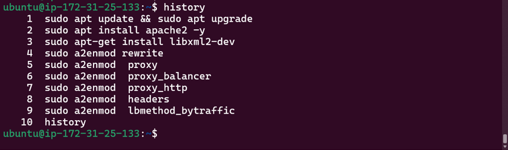

(c) Restart Apache2 Service

**sudo systemctl restart apache2**

**sudo systemctl status apache2**

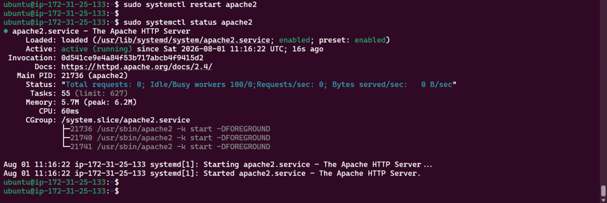

## Configure Load Balancing

`Webserver 1 Private IP address: 172.31.18.179`   
`Webserver 2 Private IP address: 171.31.16.202`

i. Open the file 000-default.conf in sites-available

**sudo vi /etc/apache2/sites-available/000-default.conf**

ii. Add this configuration into the section: 

    <VirtualHost *:80>  </VirtualHost>
    <Proxy “balancer://mycluster”>
            BalancerMember http://172.31.46.91:80 loadfactor=5 timeout=1
           BalancerMember http://172.31.43.221:80 loadfactor=5 timeout=1
           ProxySet lbmethod=bytraffic
           # ProxySet lbmethod=byrequests
    </Proxy>

    ProxyPreserveHost on
    ProxyPass / balancer://mycluster/
    ProxyPassReverse / balancer://mycluster/


`Webserver 1 Private IP address: 172.31.18.179`   
`Webserver 2 Private IP address: 171.31.16.202`

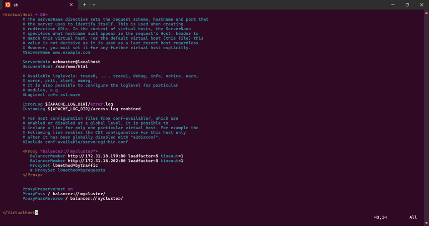

iii. Restart Apache

**sudo systemctl restart apache2**

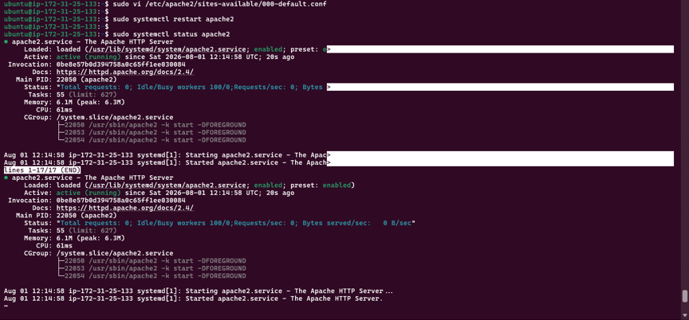

`bytraffic` balancing method with distribute incoming load between the Web Servers according to currentraffic load. The proportion in which traffic must be distributed can be controlled bt loadfactor parameter.

Other methods such as `bybusyness`, `byrequests`, `heartbeat` can also be adopted.

## 4. Verify that the configuration works

i. Access the website using the LB's Public IP address or the Public DNS name from a browser.


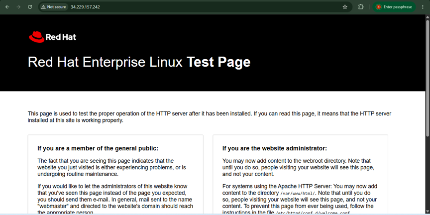


Access to the website using the LB's Public IP address failed.

**Problem: Load Balancer Alignment & Backend Path Remediation**

`Incident 1`:

Load Balancer Daemon Failure (Ubuntu Gateway):

- Problem: The Apache apache2 service on the Ubuntu Load Balancer instance crashed on startup with an exit code error and refused to route traffic.  

- Cause: Typographic "smart" or curly quotes (“ and ”) were copied into the VirtualHost configuration file on line 33 (<Proxy “balancer://mycluster”>). The Apache parser could not interpret these non-ASCII characters.  

- Solution: Edited `/etc/apache2/sites-available/000-default.conf`, replaced all smart quotes with standard straight ASCII quotes ("), validated configuration using sudo apachectl configtest, and successfully restarted the service.  

`Incident 2`:

Missing Application Deployment Page (RHEL Web Server 1):

- Problem: Navigating to the Load Balancer's public IP served the default Red Hat Enterprise Linux test landing page instead of the StegHub DevOps Tooling Website.  

- Cause: An overlapping, duplicate network storage mount structure existed in kernel memory. The central NFS directory `/mnt/apps` was mounted simultaneously to both `/var/www` and `/var/www/html`, which displaced file paths and hid `index.php` inside a nested subfolder.  

- Solution: 

1.	Executed a lazy unmount (`sudo umount -l`) on both paths to clear out the zombie kernel locks.  

2.	Re-mounted the NFS share uniquely to the target directory: `sudo mount -t nfs -o nfsvers=4.2 172.31.21.78:/mnt/apps /var/www/html`.
3.	Restructured directories by migrating all repository files out of the nested folder directly into the root web directory.

`Incident 3`:

Gateway 502 Proxy Error (Upstream Connection Drop)

- Problem: Refreshing the public URL threw a Proxy Error: Error reading from remote server from the Ubuntu frontend gateway.  
  
- Cause: A multi-layered backend processing failure on RHEL Web Server 1:  
1.	The core php-fpm processor engine was stopped, leaving Apache unable to execute PHP requests.  

2.	The application files were owned by the root user rather than the apache web server group.

- Solution: 

Started and enabled the php-fpm daemon, executed a recursive ownership update (sudo chown -R apache:apache /var/www/html/), and temporarily relaxed SELinux boundaries using setenforce 0 to allow clean, uninhibited script execution.  

`Incident 4`: 

500 Internal Server Error

- Problem: The browser or local curl requests returned an absolute server execution crash code (HTTP/1.1 500 Internal Server Error).
  
- Cause: The application's runtime data scripts (index.php / functions.php) attempted to trigger a connection to the dedicated Database instance, which was offline due to AWS usage optimization.
  
- Solution: Safely initialized the Database instance on the AWS EC2 dashboard, allowing the backend PHP engine to successfully establish its data handshake and render the live admin_tooling.php login dashboard.

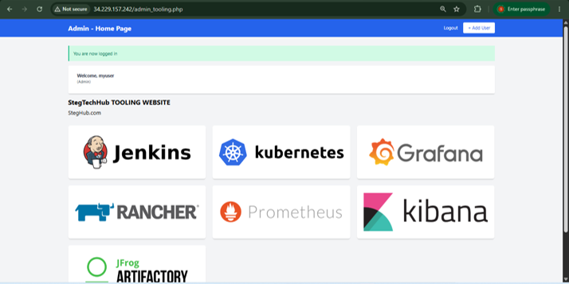


(i) Note: If in the previous project, `/var/log/httpd` was mounted from the Web Server to the NFS Server, unmount them and ensure that each Web Servers has its own log directory.

ii. Unmount the NFS directory

Check if the Web Server's log directory is mounted to NFS

**df -h**

**sudo umount -f /var/log/httpd**

If the directory is busy, the services using it needs to be stopped first.

**sudo systemctl stop httpd**

Check that the directory is unmounted

**df -h**


Confirmation that webserver 1  `/var/logs` not mounted on NFS.

(iii) check webserver 2 mounting of its `/var/logs`
and confirm its logs are not mounted on NFS server.
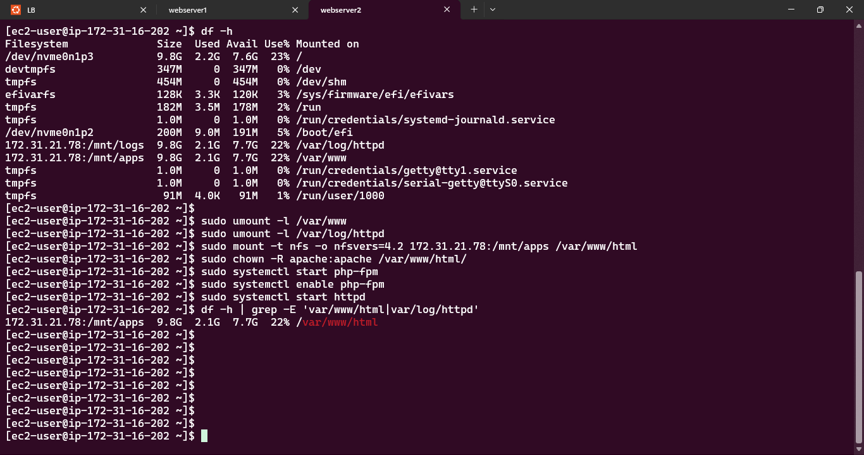

iv. Open two ssh consoles for both Web Servers (1 ans 2) and run the command:

**sudo tail -f /var/log/httpd/access_log**

For webserver 1

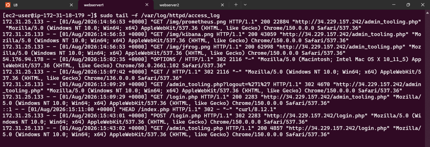

For webserver 2

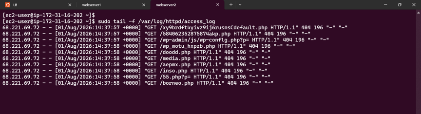

v. Refresh the browser page several times and ensure both Web Servers receive HTTP and GET requests.  
New records must apear in each web server log files. The number of request to each servers will be approximately the same since loadfactor is set to the same value for both servers. This means that traffic will be evenly distributed between them.

**Web Server 1 access_log**

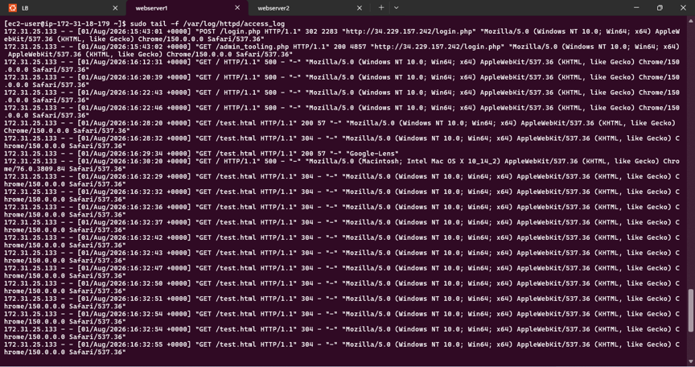

**Web Server 2 access_log**

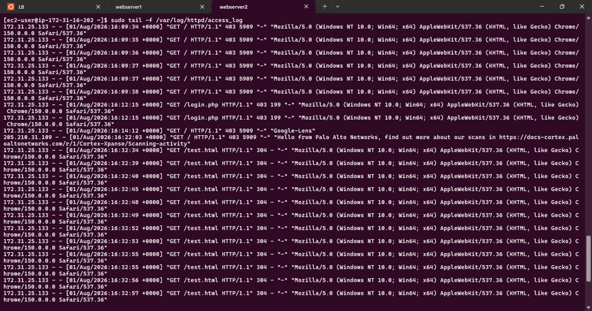


### Technical Notes:

**(1) Load Balancing Verification and Traffic Distribution Analysis** 

To validate that the Ubuntu Apache Load Balancer successfully routes and distributes traffic evenly across the backend cluster, a static test file (`test.html`) was deployed to the shared NFS mount point (`/var/www/html`). This bypassed database dependencies and allowed clean network verification.

Using the `tail -f /var/log/httpd/access_log` command on both Web Server 1 and Web Server 2, traffic patterns were observed in real time while making sequential browser requests to the Load Balancer IP (`34.229.157.242`).

#### Observations:

1. **Even Distribution:** Inbound HTTP GET requests for `/test.html` alternated sequentially between the two web server instances. 
   
2. **Stateless Efficiency:** Because the load balancing method was configured as `lbmethod=byrequests`, each individual browser refresh was cleanly captured by a different node.
3. **Local Logging:** Both servers logged these operations to their respective local NVMe filesystems rather than overloading the NFS share, ensuring maximum operational performance.

The above attached screenshot confirms successful Layer 7 content routing, a healthy response code of `200 OK` across both nodes, and active load distribution in real time.

**DIAGRAM**

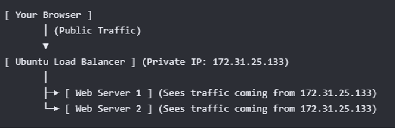

**How it works:**
1.	When user type `34.229.157.242` into the browser, the computer talks directly to the Ubuntu Load Balancer.

2.	The Load Balancer terminates that connection, looks at its routing rules, and opens a brand new internal connection to one of the RHEL web servers.
3.	Because the Load Balancer is the one opening the connection inside AWS private network, Web Server 1 and Web Server 2 do not see the personal home computer's IP address. They only see the IP address of the machine knocking on their door: the Ubuntu Load Balancer (`172.31.25.133`).

**(2) Testing Strategy under AWS Resource Constraints (no more than four servers running simultaneously allowed – 1xLB, 2xWebservers, 1xDB, 1xNFS)**

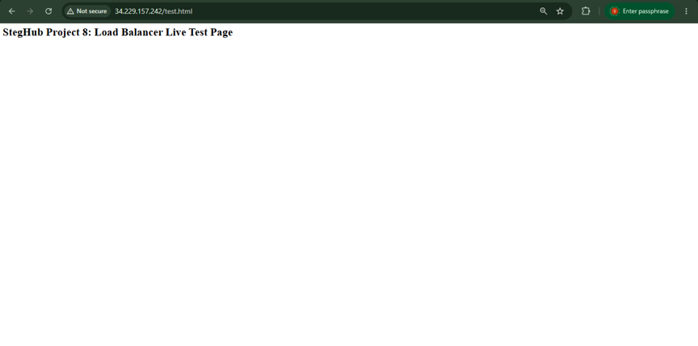

To optimize AWS resource allocation and adhere to strict usage boundaries, the dedicated Database (DB) instance was systematically powered down prior to final load balancing verification. This was becuase AWS would only allow only four simultenous running servers on my account (1xNFS, 2XWebserver and 1xLB) 

Because the primary objective of Project 8 is to validate Layer 7 traffic distribution, an ad-hoc health-check file (`test.html`) was deployed directly to the shared NFS mount point (`/var/www/html`). This decoupled the web tier testing from database availability. 

Using this static file ensured that:

1. Both backend RHEL web servers could serve incoming HTTP requests with a successful '`200 OK`' status without relying on an active database socket connection.
   
2. The Ubuntu Apache Load Balancer could accurately monitor backend target health and distribute client traffic evenly across both web worker nodes.

## Optional Step - Configure Local DNS Names Resolution

Sometimes it is tedious to remember and switch between IP addresses, especially if there are lots of servers to manage. It is best to configure local domain name resolution.   
The easiest way is use `/etc/hosts` file, although this approach is not very scalable, but it is very easy to configure and shows the concept well.

Configure the IP address to domain name mapping for our Load Balancer.

Open the hosts file

**sudo vi /etc/hosts**

Add two records into file with Local IP address and arbitrary name for the Web Servers

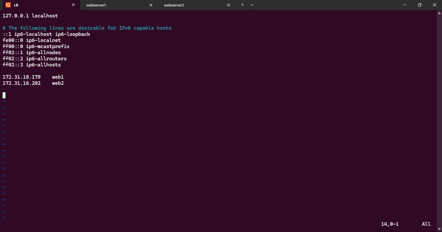

Update the LB config file with those arbitrary names instead of IP addresses

**sudo vi /etc/apache2/sites-available/000-default.conf**

BalancerMember http://Web1:80 loadfactor=5 timeout=1  
BalancerMember http://Web2:80 loadfactor=5 timeout=1


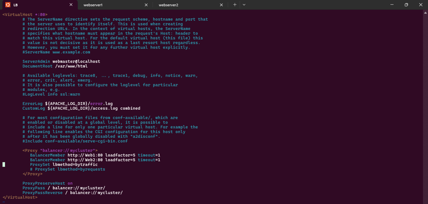

Try to curl the Web Servers from LB locally

**curl http://Web1**

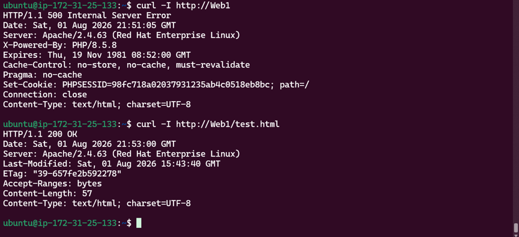

**curl http://Web2**

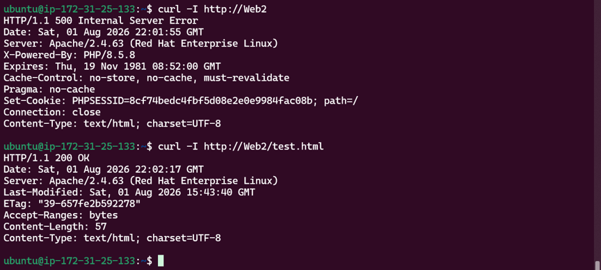

The local DNS resolution configuration is 100% complete and working perfectly!

The `curl -I http://Web1` command successfully reached the RHEL backend server. This is because the response contains the signature header: `Server: Apache/2.4.63 (Red Hat Enterprise Linux)`. If the `/etc/hosts` file had been misconfigured, the terminal would have thrown a `Could not resolve host` error instead.

The `500 Internal Server Error` is completely normal in this exact context. When `curl -I http://Web1` is run without specifying a file, it defaults to requesting the main root directory (/), which executes the `index.php` file. Since the Database instance is currently stopped to due to AWS usage constraints, `index.php` crashes on the database handshake.

The `HTTP/1.1 200` shows everything is OK.
This output officially proves everything works end-to-end:
1.	The local DNS name resolution (Web1) correctly resolves to the backend server.

2.	The Apache configuration cache is cleanly matching the virtual names.
3.	The server successfully fetches assets from the shared network NFS storage.

## CONCLUSION
This project successfully demonstrates the deployment of a resilient Layer 7 Load Balancing solution using Apache HTTP Server to evenly distribute traffic across an isolated backend web cluster. 

By integrating a centralized NFS storage tier and configuring local DNS name resolution, the architecture optimizes data consistency and streamlines system manageability. 

Ultimately, resolving the localized path, permission, and runtime blockers provided critical real-world DevOps insights into building highly available, fault-tolerant infrastructure.