# Tooling Website deployment automation with Continuous Integration using Jenkins

This project automates part of routine tasks with a free and open source automation server - Jenkins. It is one of the most popular CI/CD tools.

Acording to Circle CI, Continuous integration (CI) is a software development strategy that increases the speed of development while ensuring the quality of the code that teams deploy. 

Developers continually commit code in small increments which is then automatically built and tested before it is merged with the shared repository.

## Task

Enhance the architecture prepared in the previous project by adding a Jenkins server, configure a job to automatically deploy source codes changes from Git to NFS server.

Here is how the updated architecture looks:

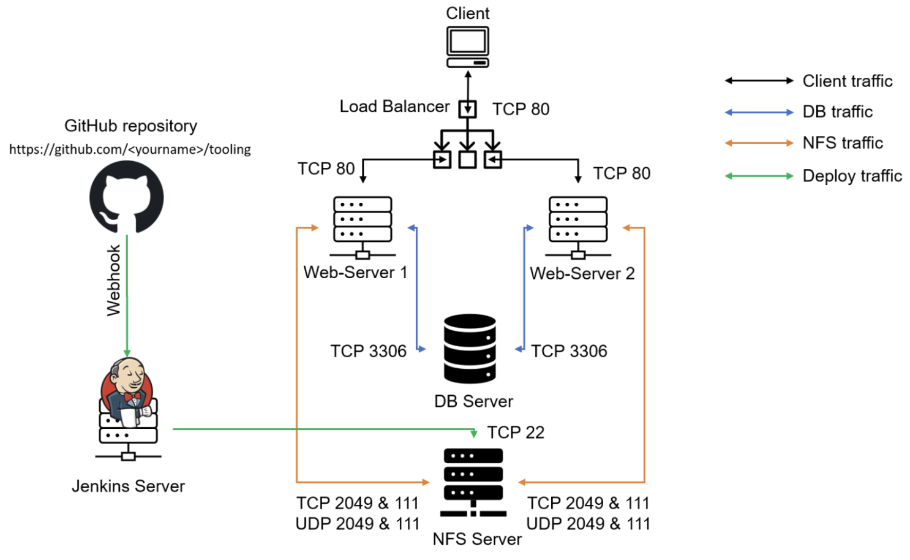

## Step 1 - Install Jenkins server

1. Create an aws EC2 instance based on Ubuntu Server 26.04 LTS and name it `Jenkins`

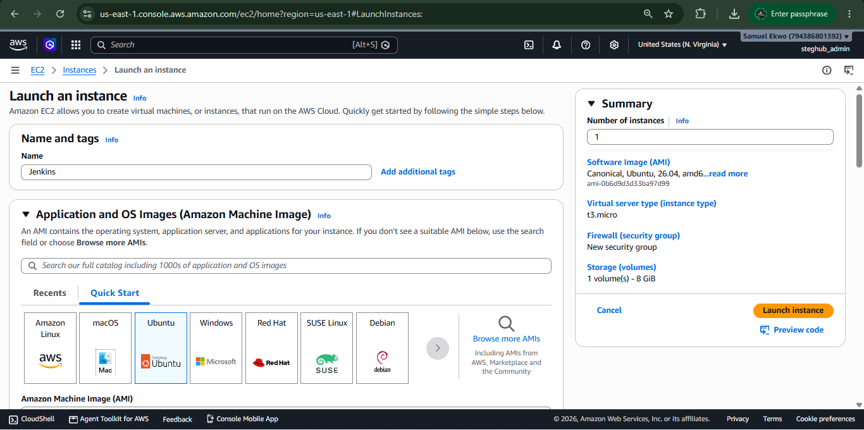

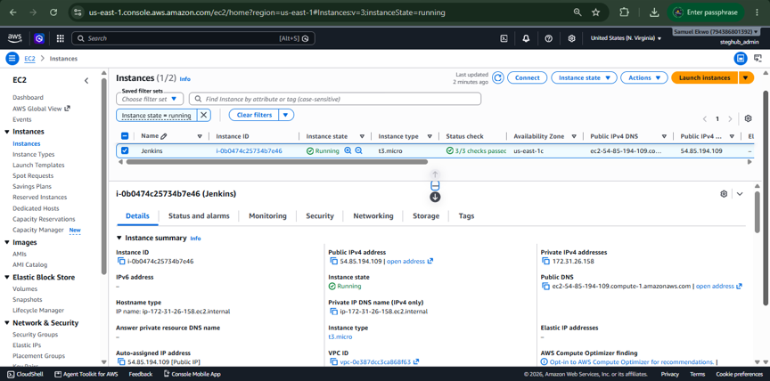

2. Install `JDK` since `Jenkins` is a Java-based application

Access the instance

**ssh -i "STEG_MEAN.pem" ubuntu@54.85.194.109**

`Jenkins Public IP: 54.85.194.109`  
`Jenkins Private IP: 172.31.26.158`

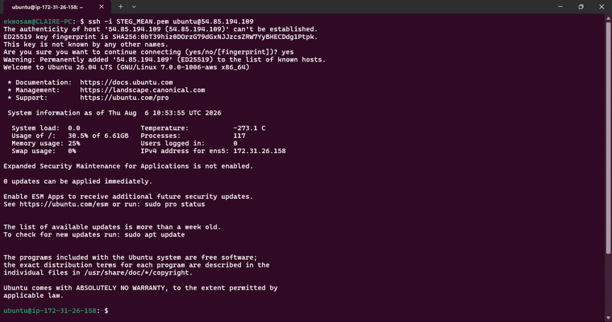

Update the Instance

**sudo apt-get update**

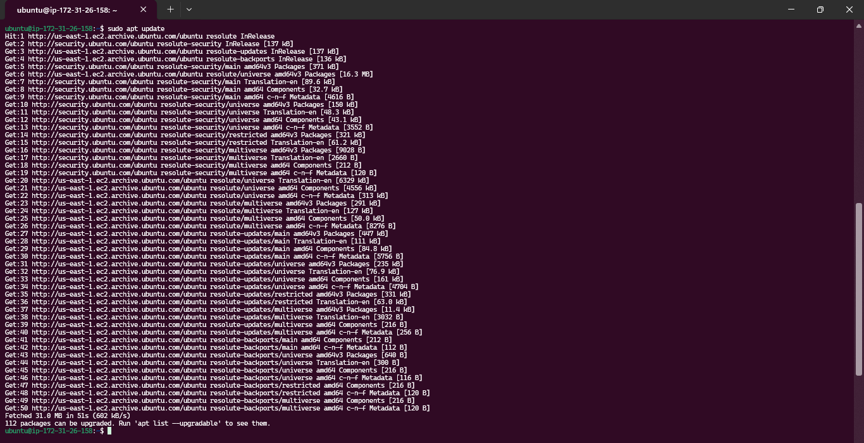

Install Java Development Kit (JDK).  

Jenkins requires Java to run, yet not all Linux distributions include Java by default. Additionally, not all Java versions are compatible with Jenkins.

**sudo install apt default-jdk-headless**

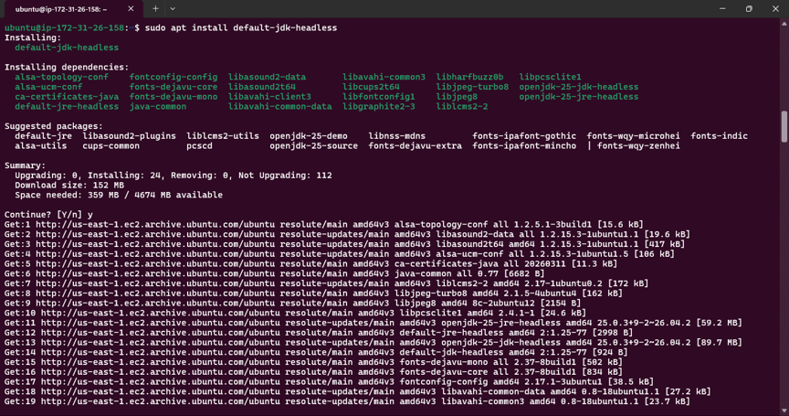

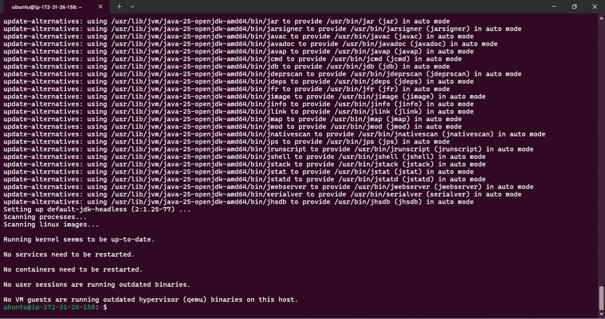

Download the Jenkins key

**sudo wget -q -O - https://pkg.jenkins.io/debian-stable/jenkins.io.key | sudo apt-key add -**

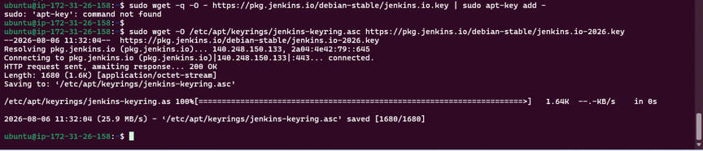

**Note**:

The command (`sudo wget -q -O - https://pkg.jenkins.io/debian-stable/jenkins.io.key | sudo apt-key add –`) failed because apt-key tool has been completely removed from modern versions of Ubuntu because it was a security risk that allowed third-party keys to globally sign system packages. 

Since the `Jenkins` server is running a modern version of Ubuntu, the legacy pipe command failed to work. Additionally, Jenkins updated its repository signing keys. Hence, the official, modern commands below was used to securely import the correct keyring and install Jenkins (`sudo wget -O /etc/apt/keyrings/jenkins-keyring.asc https://pkg.jenkins.io/debian-stable/jenkins.io-2026.key`)

**sudo wget -O /etc/apt/keyrings/jenkins-keyring.asc https://pkg.jenkins.io/debian-stable/jenkins.io-2026.key**

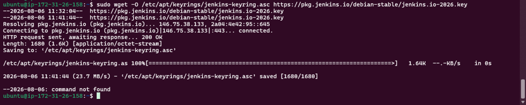

Add the Jenkins Repository

**sudo echo "deb [signed-by=/etc/apt/keyrings/jenkins-keyring.asc] https://pkg.jenkins.io/debian-stable binary"/ | sudo tee /etc/apt/sources.list.d/jenkins.list > /dev/null**

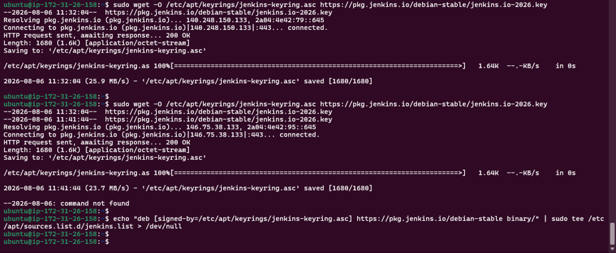

3. Install Jenkins

Update ubuntu

**sudo apt update**

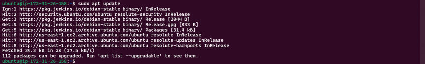

Install Jenkins

**sudo apt install jenkins -y**

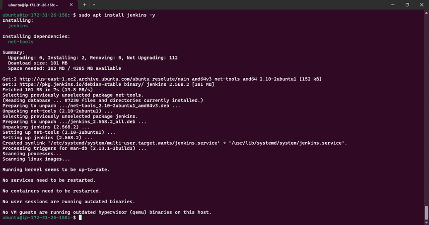

Ensure `Jenkins` is up and running

**sudo systemctl enable jenkins**  
**sudo systemctl start jenkins**  
**sudo systemctl status jenkins**

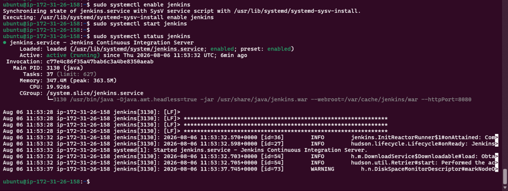

4. By default `Jenkins` server uses TCP port 8080. Open it by creating a new Inbound rule in the EC2 Security Group

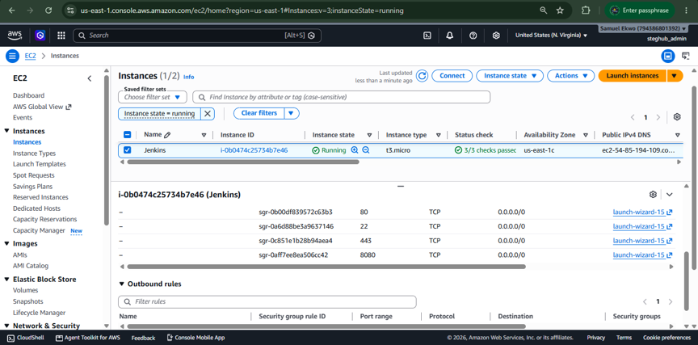

5. Perform initial `Jenkins` setup  

From a browser access http://<Jenkins-Server-Public-IP-Address>:8080 You will be prompted to provide a default admin password. Retrieve it from the server.

`Jenkins Public IP: 54.85.194.109`  
`Jenkins Private IP: 172.31.26.158`

http://54.85.194.109:8080

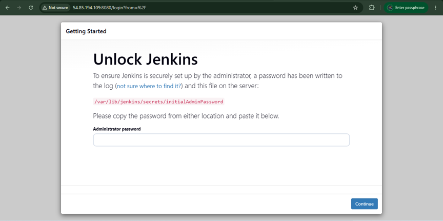

**sudo cat /var/lib/jenkins/secrets/initialAdminPassword**

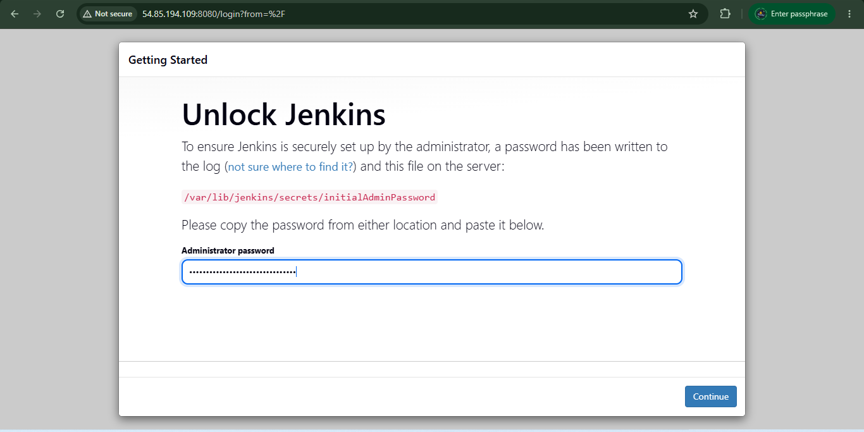

Then you will be asked which plugins to install - choose suggested plugins:

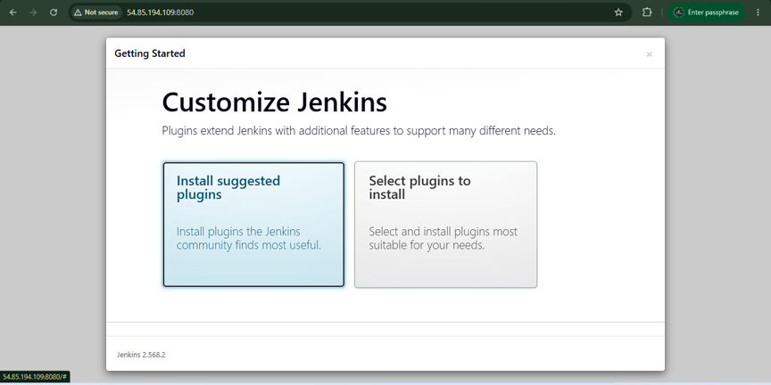

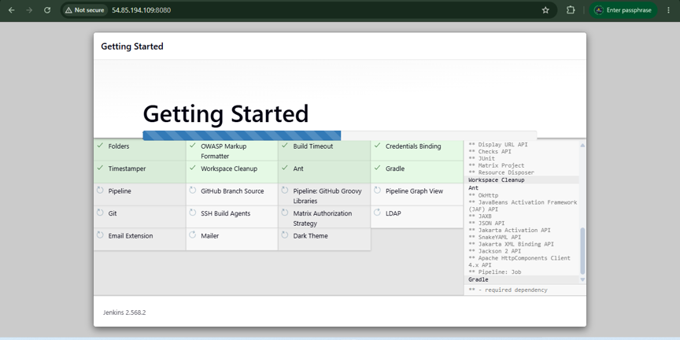

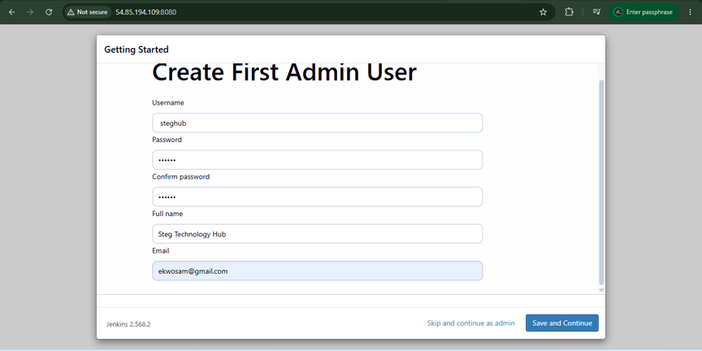

Once plugins installation is done, create an `admin user` and you will get the `Jenkins` server address.

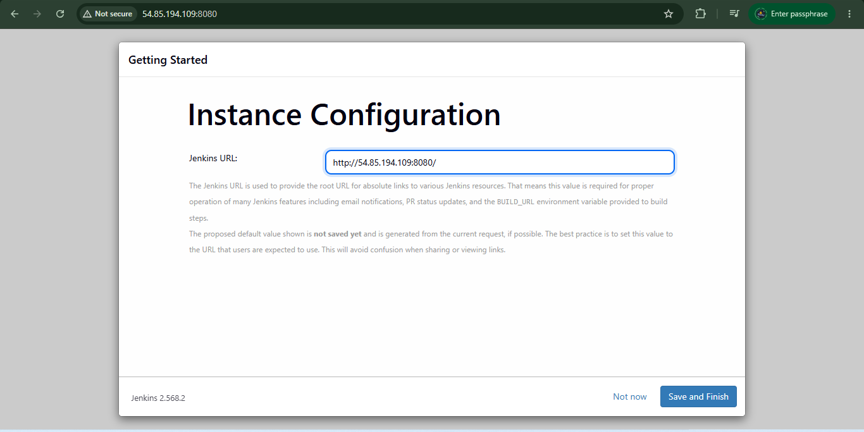

The installation is complete

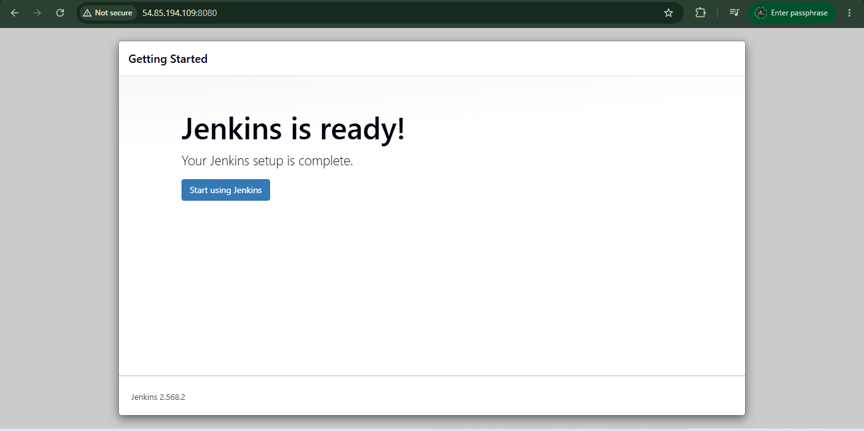

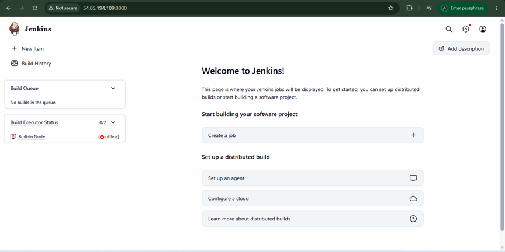

## Step 2 - Configure Jenkins to retrieve source codes from GitHub using Webhooks

This part focusses on configuring a simple Jenkins job/project. This job will be triggered by `GitHub webhooks` and will execute a build task to retrieve codes from `GitHub` and store it locally on `Jenkins` server.

1. Enable webhooks in your GitHub repository settings.

On your GitHub repository, Select `Settings` > `Webhooks` > `Add webhook`

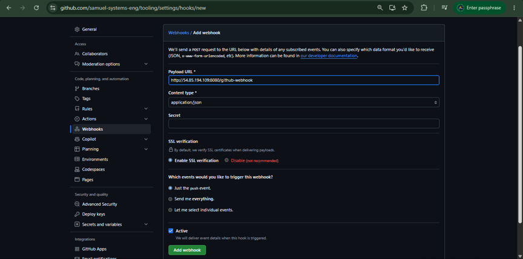

2. Go to `Jenkins` web console, click `New Item` and create a `Freestyle project`

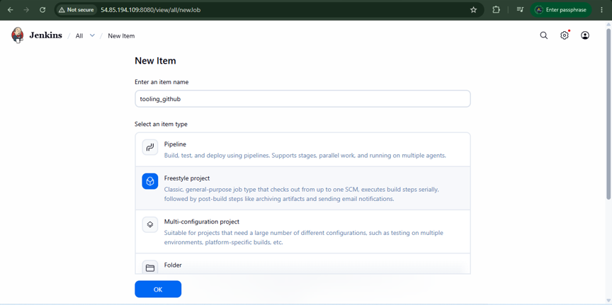

To connect our GitHub repository, we will need to provide its URL, we can copy from the repository itself

https://github.com/samuel-systems-eng/tooling.git

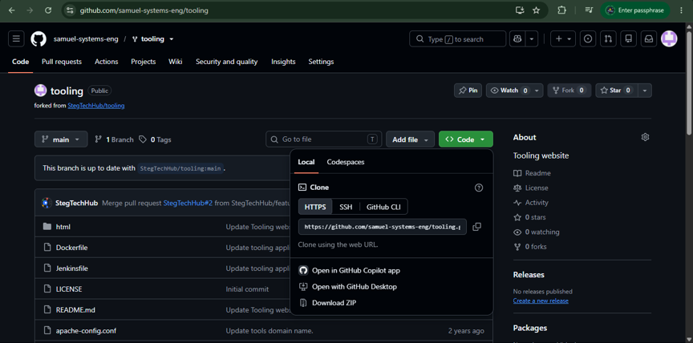

In configuration of our Jenkins freestyle project choose `Git` repository, provide there the link to our `Tooling GitHub repository` and credentials (user/password) so `Jenkins` could access files in the repository.

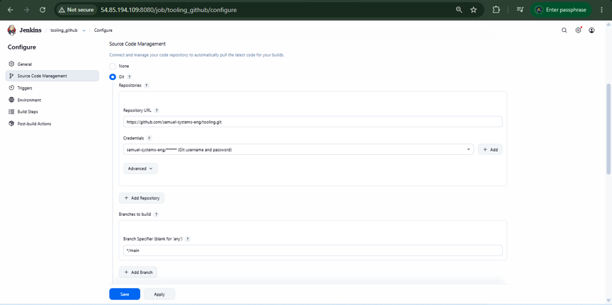

Save the configuration and try to run the build. For now we can only do it manually. Click `Build Now` button. 

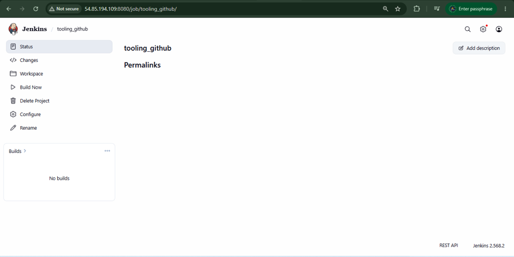

After the configuration, the build was NOT successfull as shown below: 

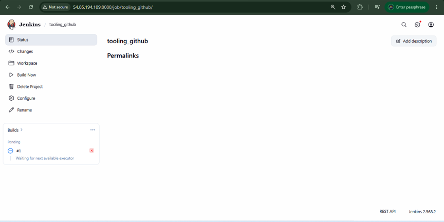

**Documentation: Jenkins Job Stuck in Queue (Insufficient Disk Space)**

**Problem**  
When executing a job by clicking "Build Now", the build remains indefinitely stuck in the queue with the status message:
`"waiting for next available executor"`

**Cause**  
Modern Jenkins architectures set a protective administrative safeguard that monitors system health. If available storage drops below a hardcoded safe limit, the automation engine automatically marks the execution node as Offline to prevent database or OS corruption.

In this instance, the `/tmp` directory dropped to 449.64 MiB, violating the default 1.00 GiB minimum threshold requirement. This caused the Built-In Node to terminate its execution capabilities, leaving the pipeline with zero active slots (executors) to run the task.

**Solution**  
To restore build capabilities on a space-constrained self-study instance, the monitoring thresholds must be adjusted to accommodate lower disk profiles:

**1.	Modify Safety Thresholds**:  
- Navigate to Manage Jenkins → Nodes. 
   
- Click Configure Monitors in the left-side navigation panel.  
- Locate Free Temp Space Threshold and Free Disk Space Threshold.  
- Reduce the values from 1GiB to 200MiB (or temporarily disable the monitor checkbox).  
- Click Save.

**2.	Re-activate Node**:  

- Return to the Built-In Node status page.
  
- Click the "Bring this node back online" button to force a system re-scan.

The node status will immediately shift to active (green), clearing the build queue and executing the stuck job.

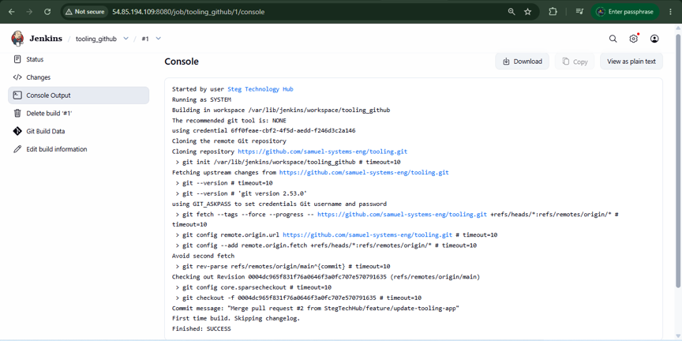

But this build does not produce anything and it runs only when we trigger it manually. The fix is as follows:

3. Click Configure our job/project and add these two configurations
   
Configure triggering the job from GitHub webhook and also Configure Post-build Actions to archive all the files - files resulted from a build are called artifacts:

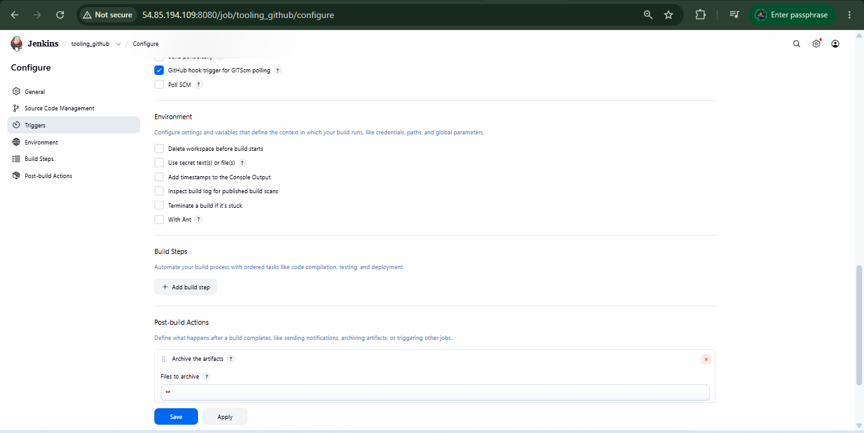

Now, go ahead and make some change in any file in our GitHub repository (e.g. README.MD file) and push the changes to the main branch.

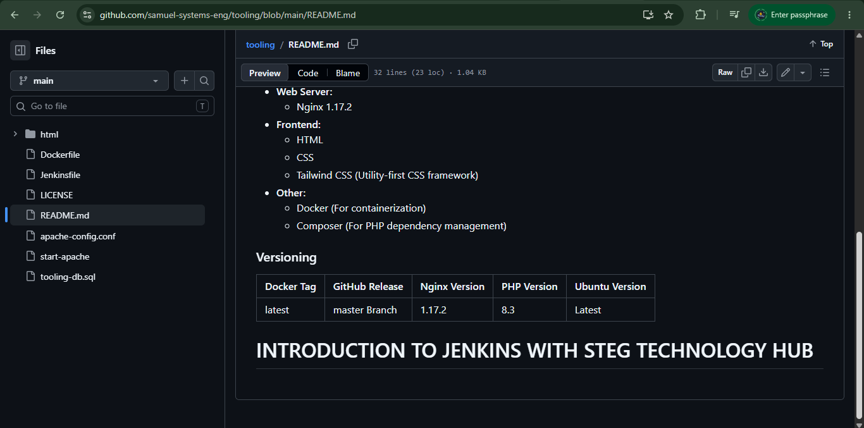

It can be seen that a new build has been launched automatically by webhook and its results - artifacts, saved on Jenkins server.

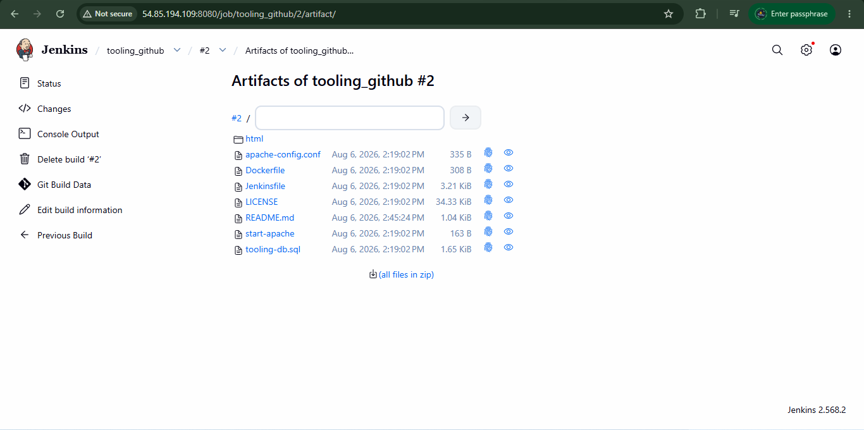

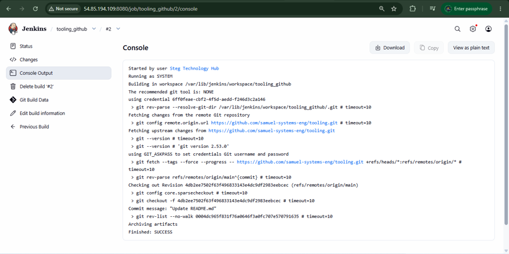

A third modification was carried out on the github README file:

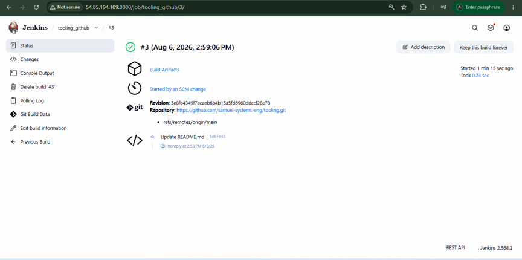

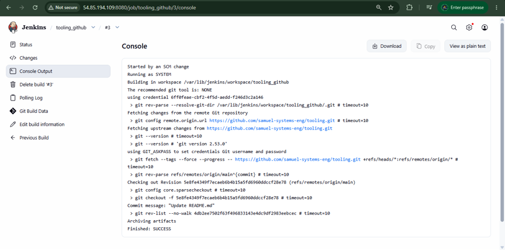

Now we configured an automated Jenkins job that receives files from GitHub by webhook trigger this method is considered as push because the changes are being pushed and files transfer is initiated by GitHub. There are also other methods: trigger one job (downstreadm) from another (upstream), poll GitHub periodically and others.

By default, the artifacts are stored on `Jenkins` server locally

**ls /var/lib/jenkins/jobs/tooling_github/builds/<build_number>/archive/**

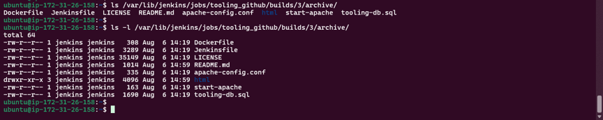

## Step 3 - Configure Jenkins to copy files to NFS server via SSH

Now that the artifacts are saved locally on `Jenkins` server, the next step is to copy them to the `NFS` server to `/mnt/apps` directory.

`Jenkins` is a highly extendable application and there are more than 1400 plugins available. Now we will need a plugin that is called `Publish Over SSH`

1. Install Publish Over SSH plugin.
   
On main dashboard, Select Manage `Jenkin`s > `Manage Plugins` > `Available plugins` > Search for `Publish over SSH` and Install without restart.

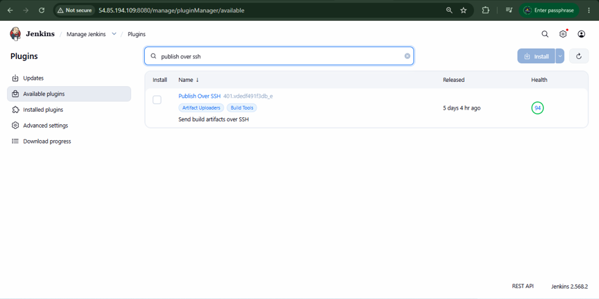

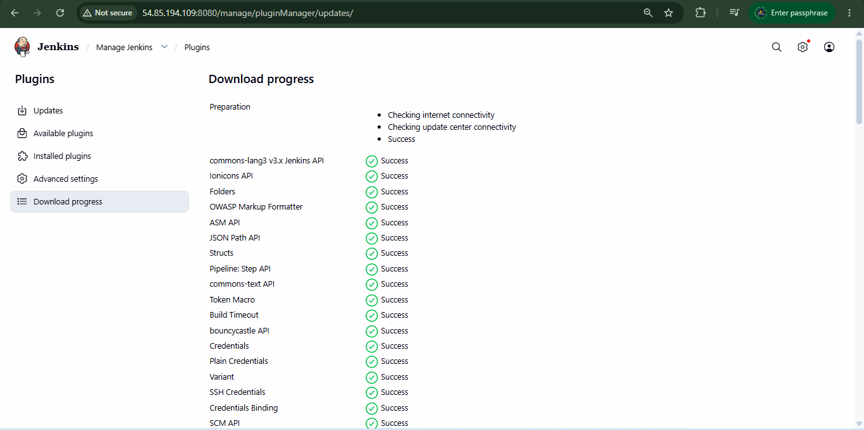

2. Configure the job/project to copy artifacts over to `NFS server`

On main dashboard select `Manage Jenkins` > Configure System menu item.

Scroll down to `Publish over SSH` plugin configuration section and configure it to be able to connect to your `NFS server`:

Provide a `private key (content of .pem file that we use to connect to` `NFS` server via SSH/Putty)

Arbitrary name

Hostname - can be private IP address of our NFS server

Username - ec2-user (since NFS server is based on EC2 with RHEL 9)

Remote directory - `/mnt/apps` since our Web Servers use it as a mointing point to retrieve files from the `NFS server`

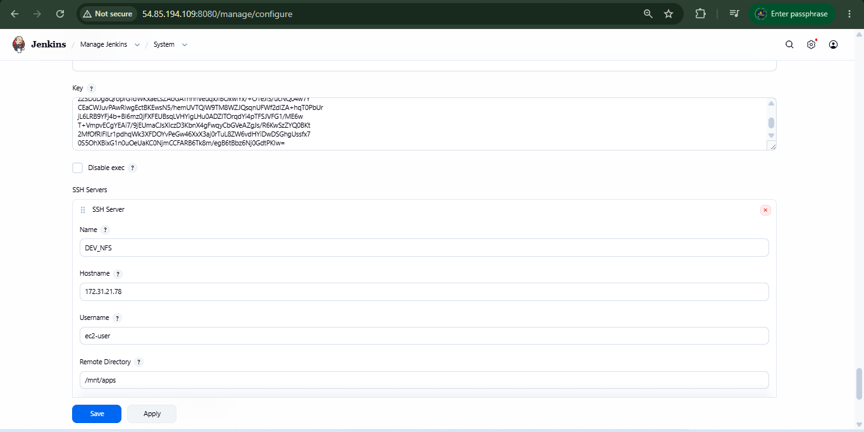

Although TCP port 22 on NFS server was open to receive SSH connections, after testing the configuration, the `Publish over ssh` plugin did not work.

**NOTE:**

**Documentation: Migration from Legacy "Publish over SSH" Plugin to Native "Execute Shell"**

**Problem**  
When testing or saving the `Publish over SSH` plugin configuration within the Jenkins system administration panel, the user interface crashed completely with the following error:

`"A problem occurred while processing the request. Logging ID=b7cf58bd... REST API Jenkins 2.568.2"`

**Cause:**  
•	Plugin Obsolescence: The legacy "Publish over SSH" plugin is unmaintained and architecturally incompatible with modern Jenkins versions (v2.568.2+).  

•	Runtime Failures: The plugin’s backend data-binding operations crash when running on modern Java environments (Java 11/17/21). It cannot handle modern secure private key schemas or forms with empty passphrases without triggering internal REST API server exceptions.

**Solution:**  
To bypass the faulty plugin interface and adopt standard DevOps patterns, the implementation shifted to a native `Execute Shell` build step using built-in Linux utilities (`scp/ssh`).

**NOTE:** A temporary folder was created to test the pipeline from `Jenkins` to `NFS server` called `/tmp folder`.

`NFS Server Private IP used: 172.31.21.78`

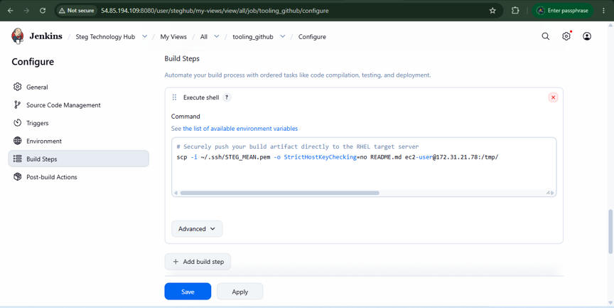

Save this configuration and go ahead, change something in README.MD file in our GitHub Tooling repository

The README file was modified with the text: 

    # MODIFYING README TO TEST AND CONFIRM THAT JENKINS SERVER PUSHES COMITS TO NFS SERVER.

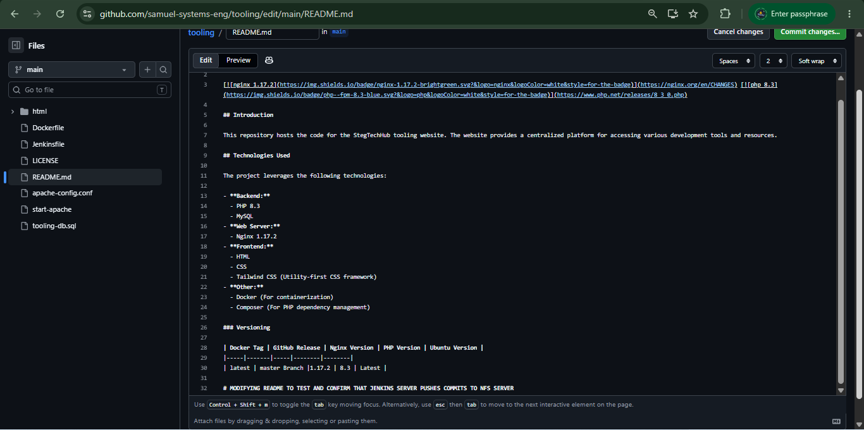

The changes that was made on github was observed in the NFS server.

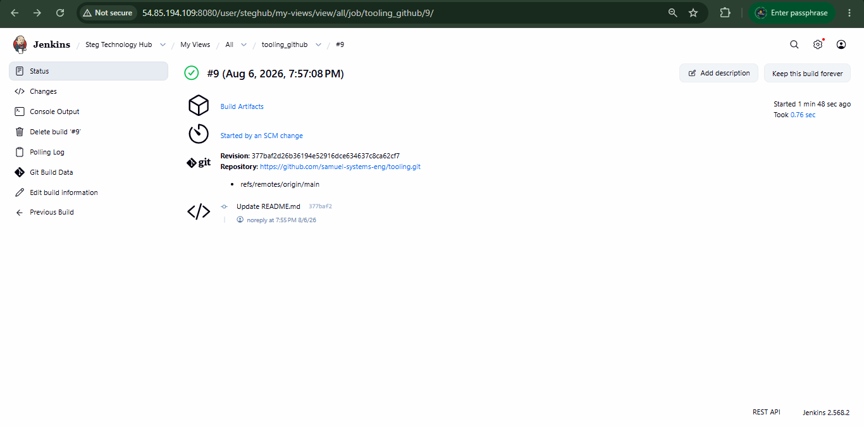

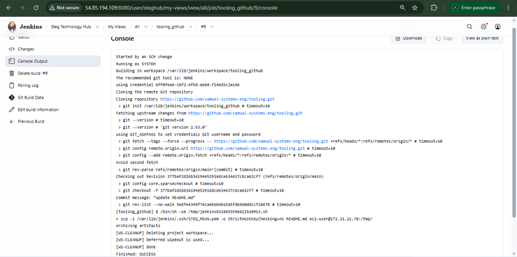

Using the `cat` command from `Jenkins server` to access the `NFS server` revealed the change at the bottom of the README file “# MODIFYING README TO TEST AND CONFIRM THAT JENKINS SERVER PUSHES COMITS TO NFS SERVER” was observed registered on the `NFS server`.

`NFS Server Private IP used: 172.31.21.78`
`Jenkins server Private IP: 172.31.26.158`
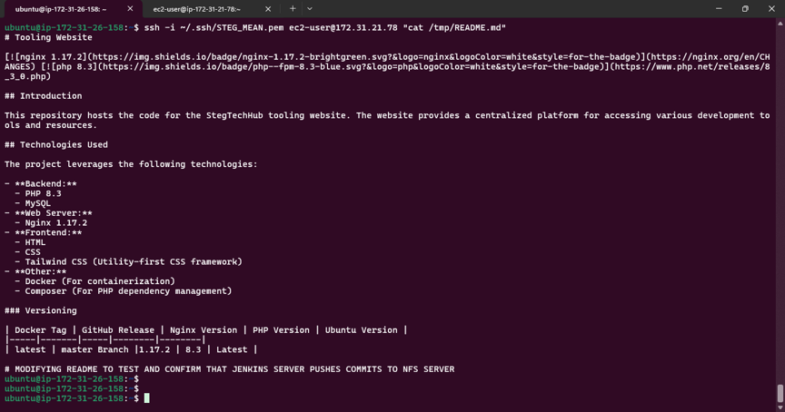

**Important Note**  

Now there is need to change to the production grade NFS mounting that all changes from github are usually stored (`/mnt/apps`).

Hence, appropriate permissions have to be implemented to allow `Jenkins` to write to the `/mnt/apps` folder (NFS server) as the owner of this folder is the Root.

Therefore, two specific commands are required to enable  Jenkins write to NFS `/mnt/apps` folder.

**sudo chown -R ec2-user:ec2-user /mnt/apps**

•	What it does: Changes the ownership of the `/mnt/apps` directory (and everything inside it) to the ec2-user account and group.

•	Why important: By default, system-mounted directories like `/mnt/` are owned by the root user. If trying to deploy files as `ec2-user` via `Jenkins` scp script into a folder owned by root, the RHEL server will completely block it with a Permission denied error. Hence, running this command grants the deployment user permission to manage the folder.

**sudo chmod -R 777 /mnt/apps**

•	What it does: Grants full Read, Write, and Execute permissions to Everyone (Owner, Group, and Public) for that folder.

•	Why important: In a shared infrastructure setup (like using an NFS server to share files with other web servers), multiple system users need instant access to read and execute the code.   
Setting `777` ensures that whatever files `Jenkins` drops into `/mnt/apps` can be instantly picked up and served by the web applications without permission blocks.

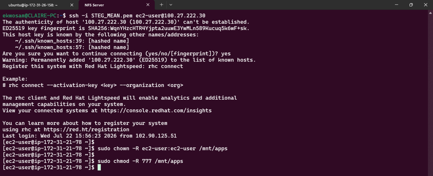

The next step is to modify the “execute shell” command in `Jenkins` to point to the `/mnt/apps` folder in the `NFS server`.

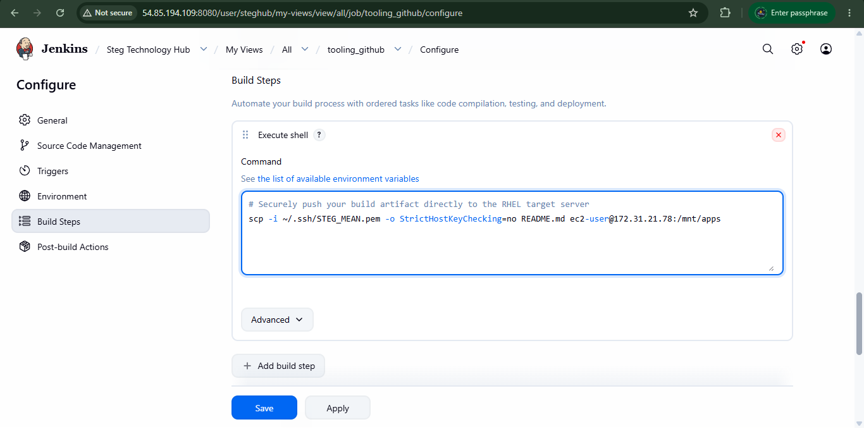

To confirm that a github commit can successfully build in `Jenkins` and securely register in the `/mnt/apps` folder in `NFS server`, a modification at the bottom of the README file was carried out in github as shown below:

    # FINAL MODIFICATION OF README TO CONFIRM COMMITS AT GITHUB BUILD JENKINS SUCCESSFULLY AND REGISTERS AT NFS SERVER

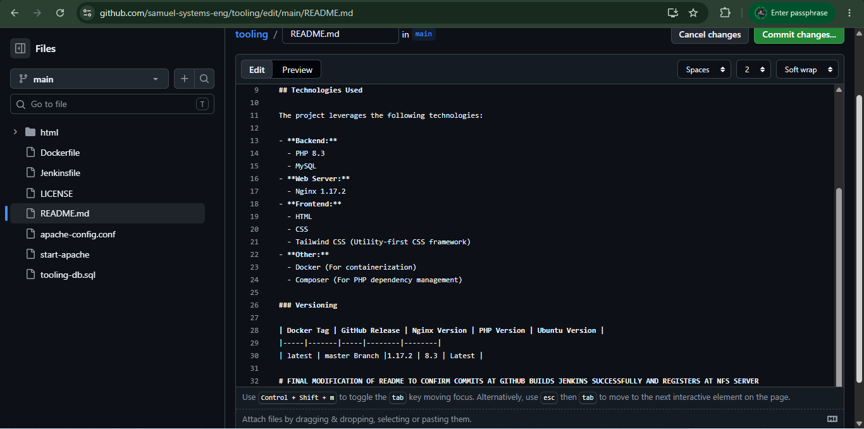

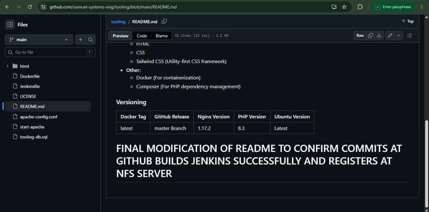

The changes that was made on github triggered a successful build in `Jenkins`.

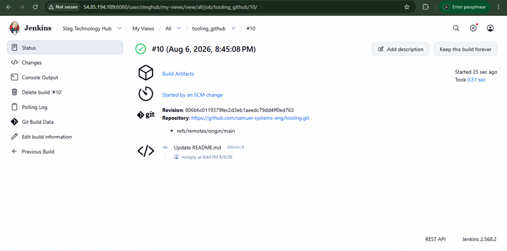

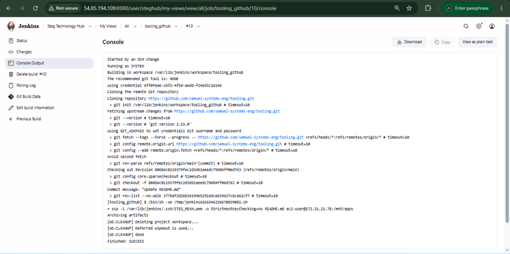

Implementing `CAT` command from `NFS server` showed the changes committed in github registered successfully on the `NFS server`.

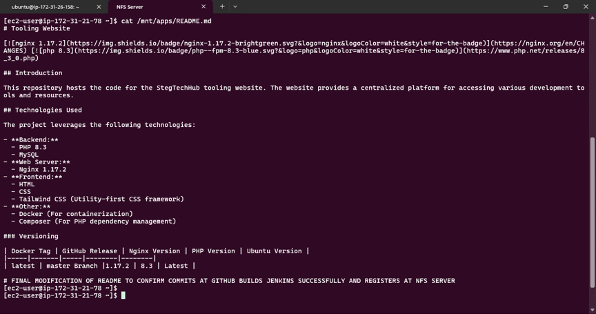

When the changes made in GitHub is registered in the `/mnt/apps` folder in the `NFS server` as demonstrated here - the job works as expected.

## Conclusion

The implementation of this Tooling Website Solution with Jenkins Continuous Integration successfully establishes an automated, secure, and reliable pipeline for software delivery. 

By replacing fragile, legacy plugins with native Linux automation tools (scp/ssh) and resolving cross-platform environment dependencies—such as case-sensitive files and AWS network address constraints—the engineering workspace is now fully optimized for agility.

Ultimately, this setup ensures that every verified code modification pushed to the GitHub repository is automatically built, validated, and instantly deployed to the target RHEL NFS storage array. 

This architectural shift significantly cuts down on manual deployment errors, minimizes downtime, and lays down a robust foundation for scaling out modern, high-velocity DevOps engineering workflows.

