# Load Balancer Solution With Nginx and SSL/TLS

A Load Balancer (LB) distributes clients' requests among underlying Web Servers and makes sure that the load is distributed in an optimal way. 

In this project, the configuration of `Nginx Load Balancer Solution` is carried out.

It is extremely important to ensure that connections to our Web Solutions are secure and information is encrypted in transit. Connection over secured HTTP (HTTPS protocol), it's purpose and what is required for implementation is covered.

**Task**  

    This project consist of two parts:

    1. Configure Nginx as a Load Balancer
   
    2. Register a new domain name and configure secure connection

The diagram below shows the architecture of the solution

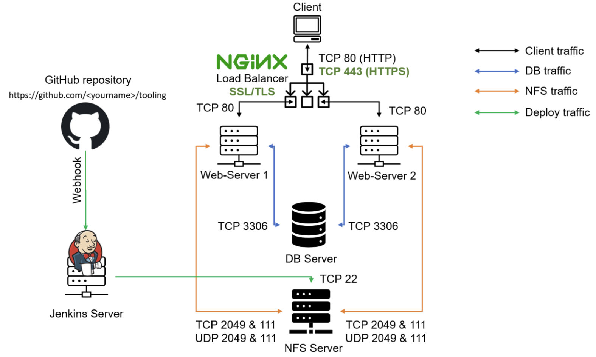

## Part 1 - Configure Nginx as a Load Balancer

1. Create an EC2 VM based on Ubuntu Server 26.04 LTS and name it `nginx LB`  

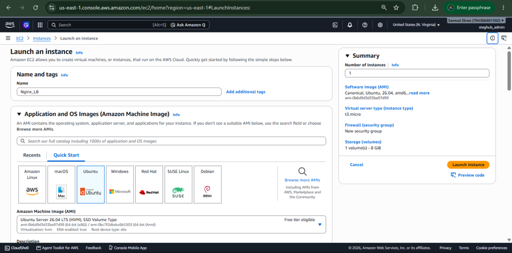

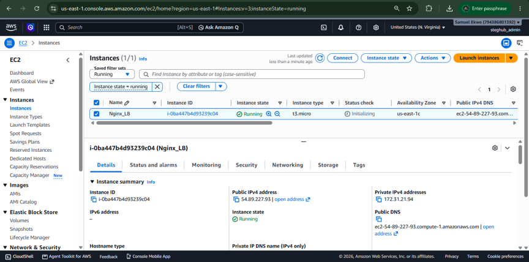

Open TCP port 80 for HTTP connections and TCP port 443 for secured HTTPS connections

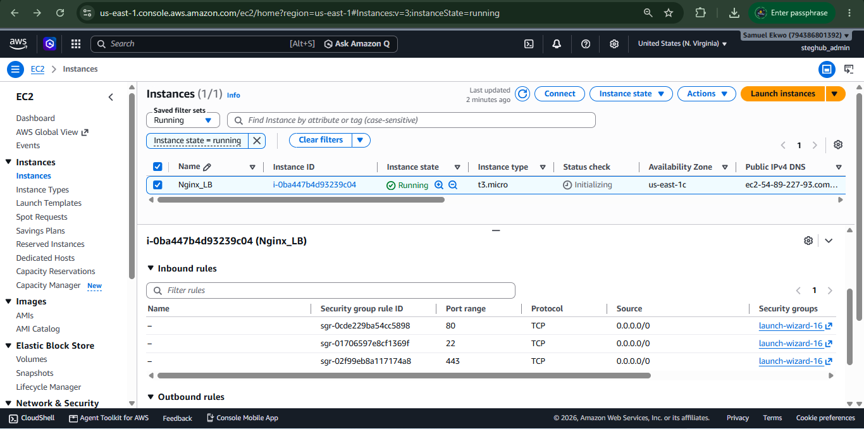

2. Update `/etc/hosts` file for local DNS with Web Servers' names (e.g `web1` and `web2`) and their local IP addresses
   
Access the instance

**Nginx public IP = 54.89.227.93**  
**Nginx private IP = 172.31.21.94**

```ssh -i STEG_MEAN.pem ubuntu@18.119.165.258```

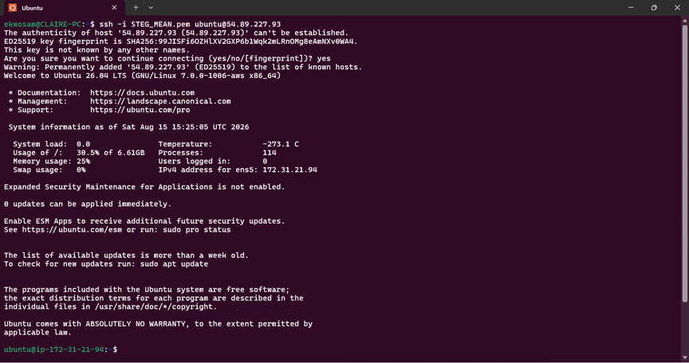

Update the hosts file

**Webserver 1 private IP = 172.31.18.179**  
**Webserver 2 private IP = 172.31.16.202**

```sudo vi /etc/hosts```


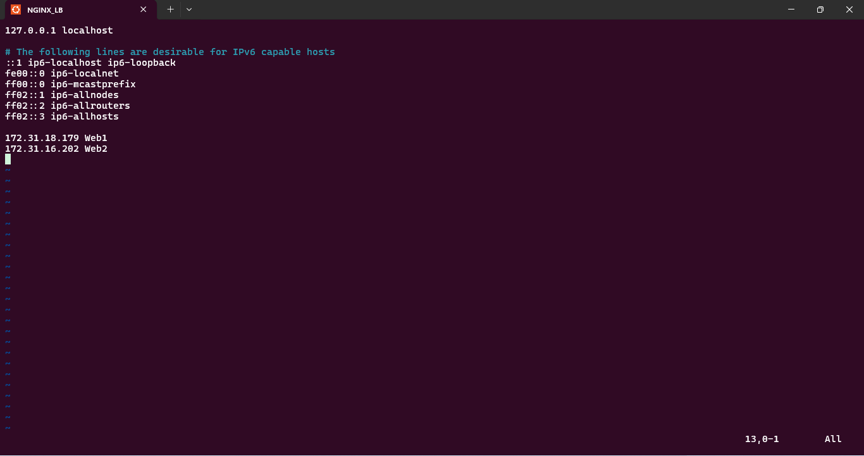


3. Install and configure Nginx as a load balancer to point traffic to the resolvable DNS names of the webservers
   
Update the instance

```sudo apt update && sudo apt upgrade -y```

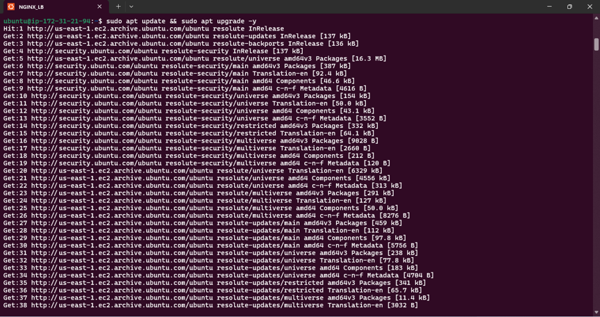

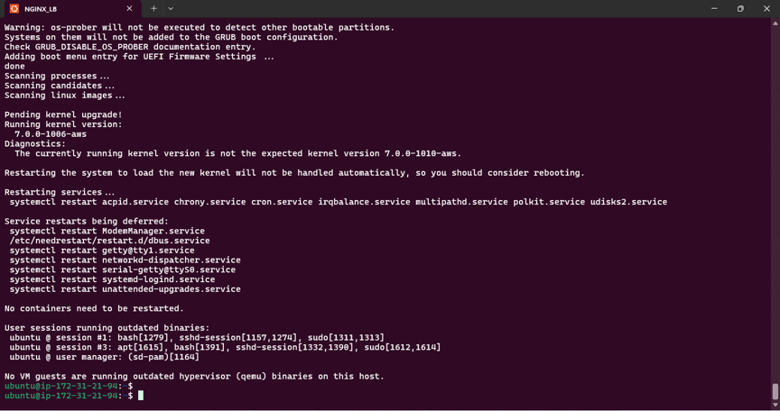

Install Nginx

```sudo apt install nginx```

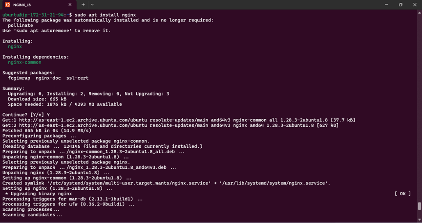

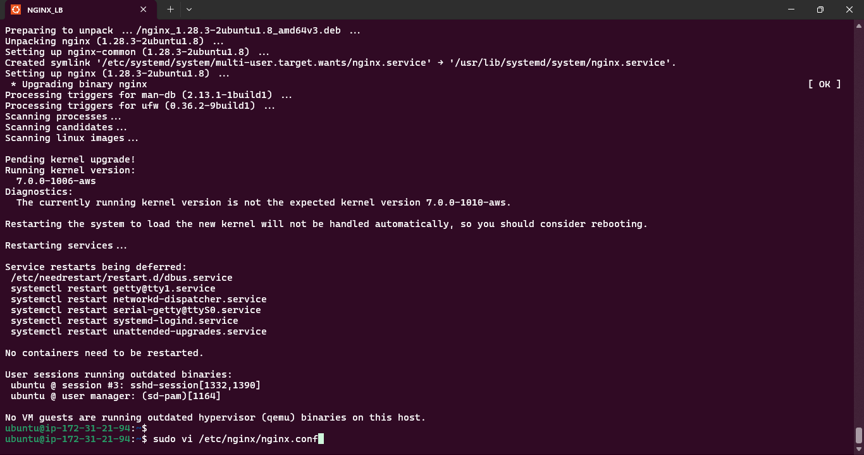

4. Configure Nginx LB using the Web Servers' name defined in `/etc/hosts`.  

Open the default Nginx configuration file

```sudo vi /etc/nginx/nginx.conf```

Insert the following configuration in http section

    ```upstream myproject {
       server Web1 weight=5;
       server Web2 weight=5;
    }

    server {
        listen 80;
        server_name ww.domain.com;

        location / {
            proxy_pass http://myproject;
        }
    }
    # comment out this line
    # include /ete/nginx/sites-enabled/```

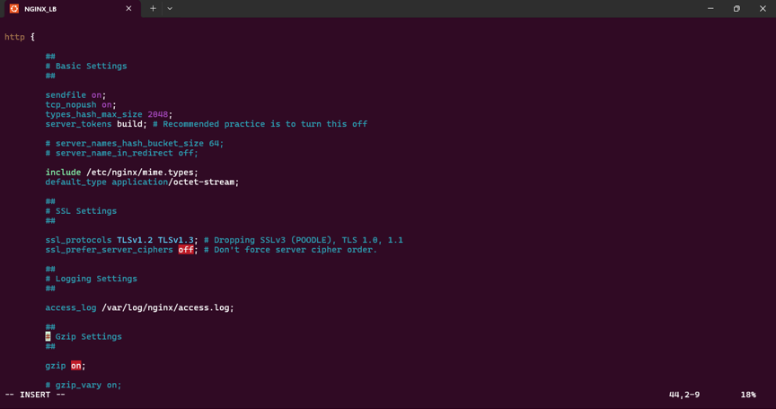

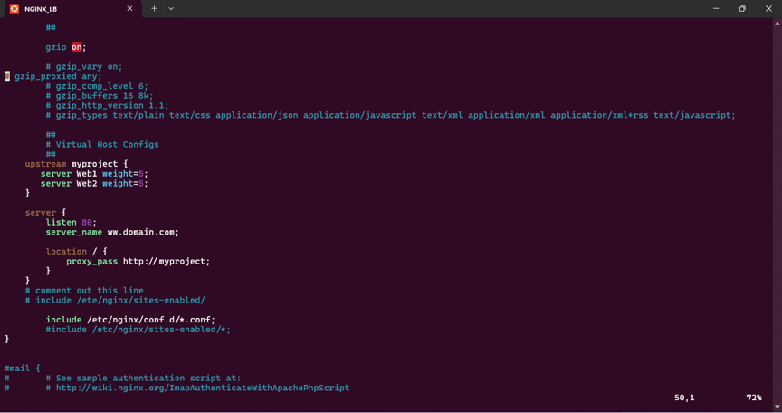

Test the server configuration

```sudo nginx -t```

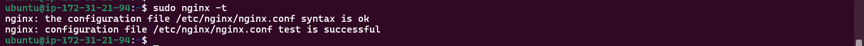

Restart Nginx and ensure the service is up and running

```sudo systemctl restart nginx```  
```sudo systemctl status nginx```

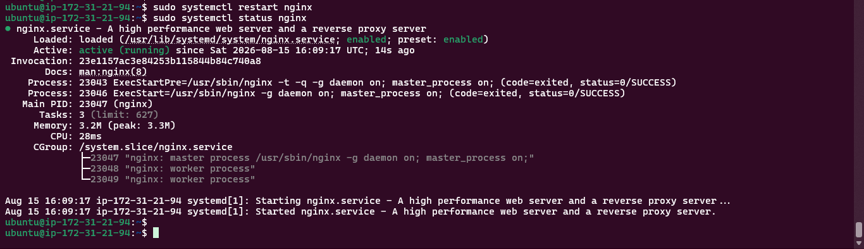

## Part 2 - Register a new domain name and configure secured connection using SSL/TLS certificates

In order to get a valid `SSL certificate` we need to register a new domain name, we can do it using any Domain name registrar - a company that manages reservation of domain names. The most popular ones are: *Godaddy.com*, *Domain.com*, *Bluehost.com*.

1. Register a new domain name with any registrar of your choice in any domain zone. (e.g .com, .net, .org, .edu, info, .xyz or any other)
   
`Cloudns.net` is the domain name registrar used for this project.

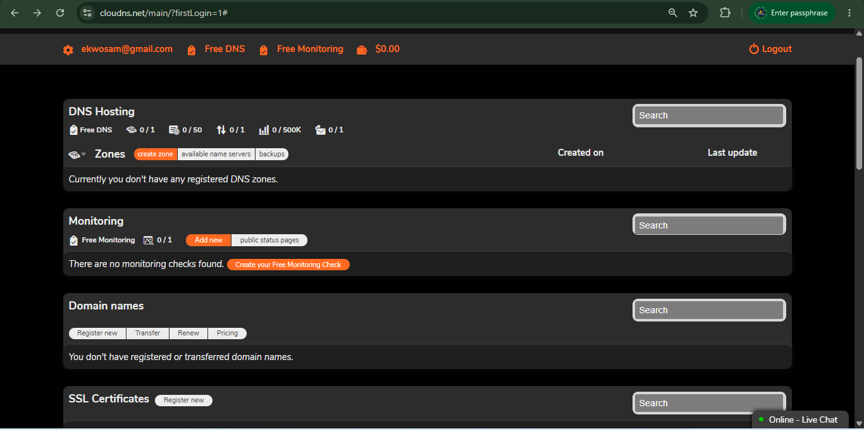

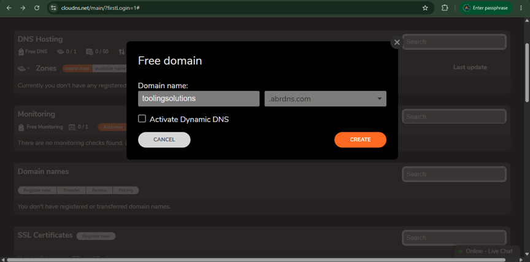

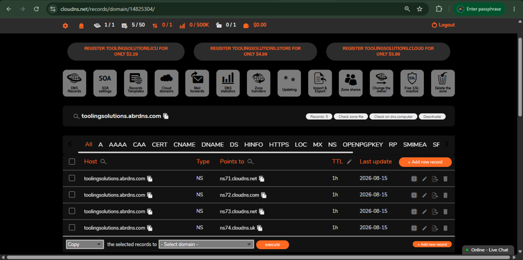

2. Assign an `Elastic IP` to our `Nginx LB` server and associate our domain name with this Elastic IP
   
This is neccessary in order to have a static IP address that does not change after reboot.

**Nginx elastic IP = 18.210.150.10**

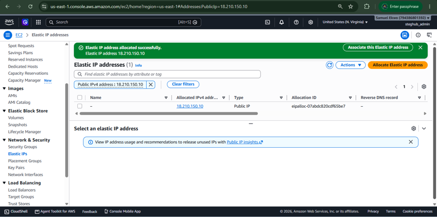

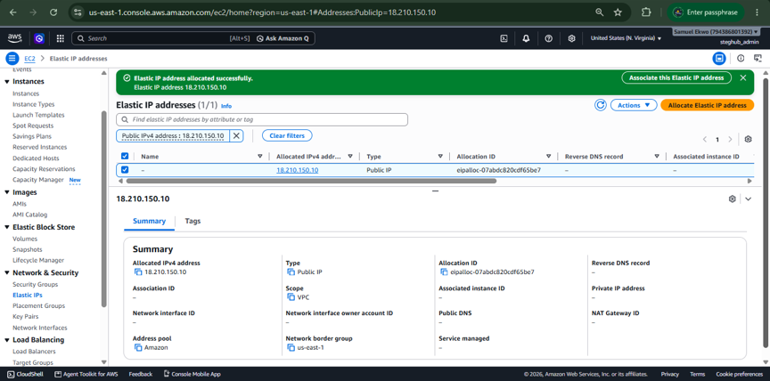

Associate the elastic IP with `Nginx LB`

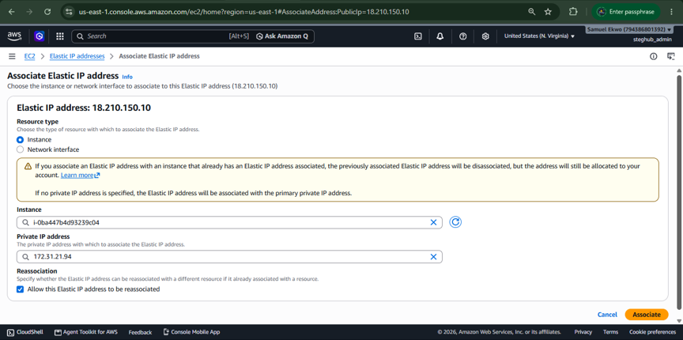

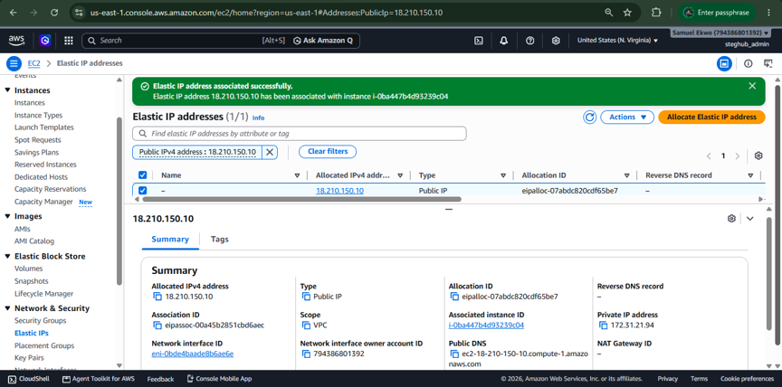

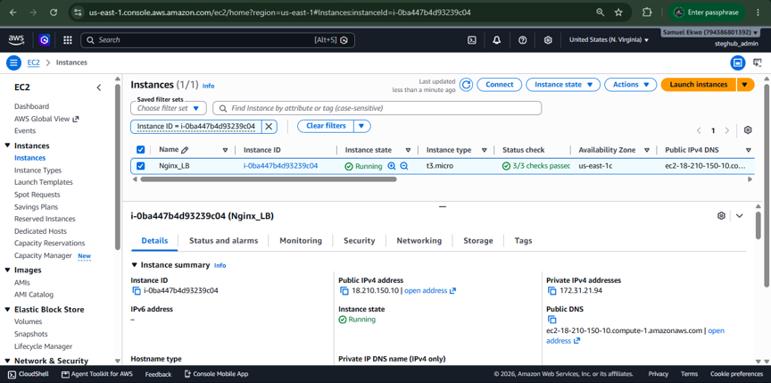

3. Update or create `A record` your registrar to point to Nginx LB using the elastic IP

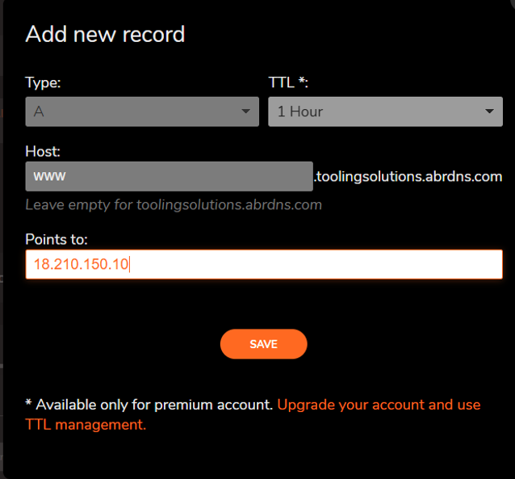

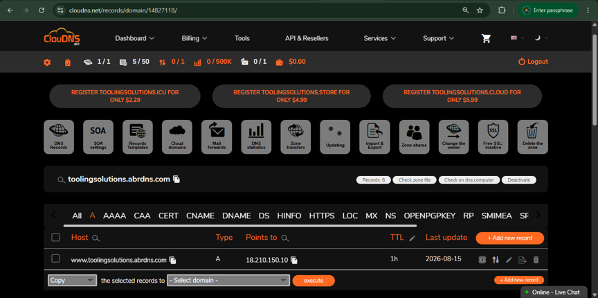

Use [dns checker](https://dnschecker.org/#A/www.toolingsolutions.abrdns.com) to verify the DNS record

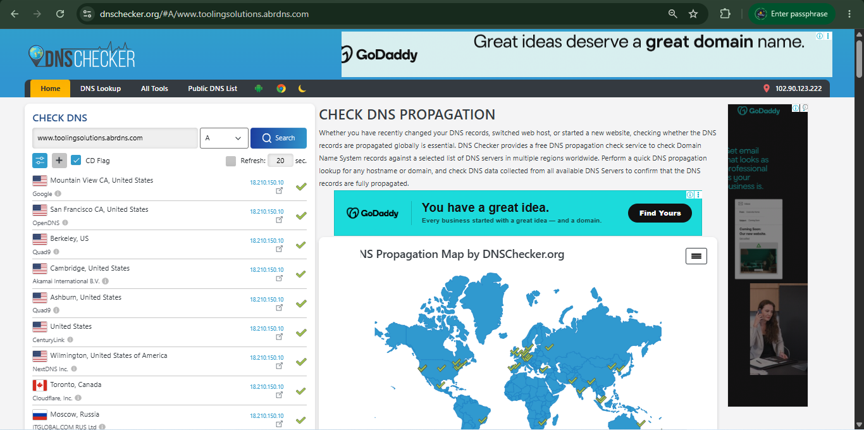

4. Configure Nginx to recognize your new domain name
   
Update your `nginx.conf` with server_name `www.<your-domain-name.com` instead of server_name `www.domain.com`

In this project, the server_name is **www.toolingsolutions.abrdns.com**

```sudo vi /etc/nginx/nginx.conf```

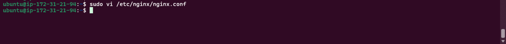

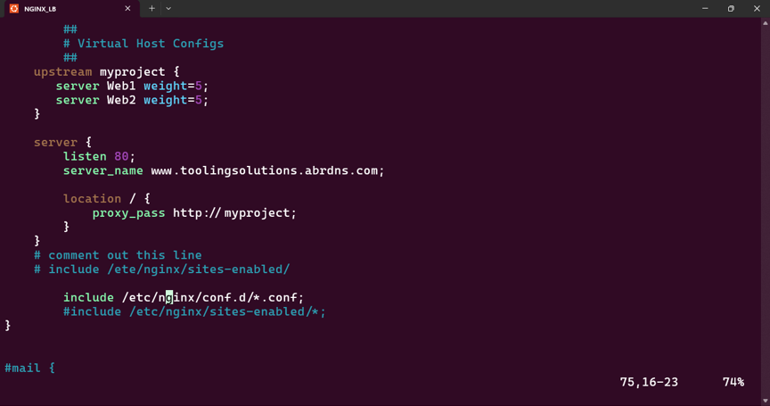

Restart Nginx

```sudo systemctl restart nginx```

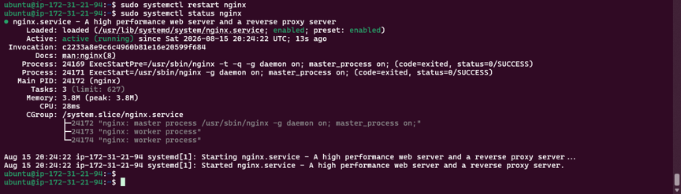

Check that the Web Server can be reach from a browser with the new domain name using HTTP protocol.

http://<your-domain-name.com> 
`http://www.toolingsolutions.abrdns.com`

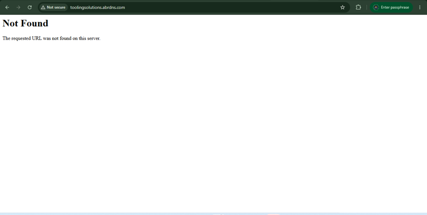

**DevOps Troubleshooting Report: Nginx Load Balancer Deployment**

**1. Problem Description**  
After configuring the Nginx Load Balancer to distribute traffic to the backend web nodes (Web1 and Web2) using the domain name http://www.toolingsolutions.abrdns.com, the browser returned a 404 Not Found error page.   
Furthermore, attempts to connect to the backend servers (webserver one – private IP-172.31.18.179) from the load balancer terminal via curl failed completely with connection errors.


**2. Root Cause Analysis**  
The issue was caused by three separate configuration misalignments across the infrastructure:  

•	Nginx Configuration Typos: The server_name directive inside /etc/nginx/nginx.conf contained some typos (ww. instead of www.). This caused Nginx to ignore the custom virtual host block and serve a default local 404 page.  

•	Apache Service Naming: The backend web servers were running Red Hat Enterprise Linux (RHEL). The Apache service was inactive because it was being managed under the Debian/Ubuntu service name (apache2) instead of the Red Hat service name (httpd).  

•	Unmounted Network Storage (NFS): The Apache service (httpd) on the backend nodes was crashing immediately upon startup because the required network shared directory (/var/www/html) was unmounted, causing the DocumentRoot safety validation check to fail.

**From webserver-1**

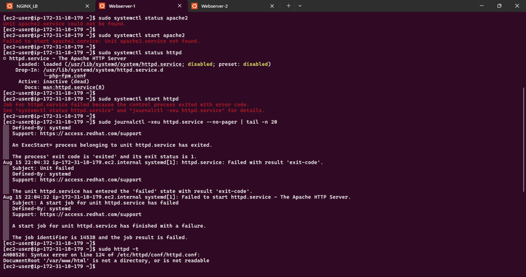

**3. Implemented Solutions**  

**Step 1:** Fixed the Nginx Load Balancer Configurations

•	Corrected the server name line inside `/etc/nginx/nginx.conf` to match the exact training domain layout without protocol prefixes:

    nginx

    server name toolingsolutions.abrdns.com www.toolingsolutions.abrdns.com;

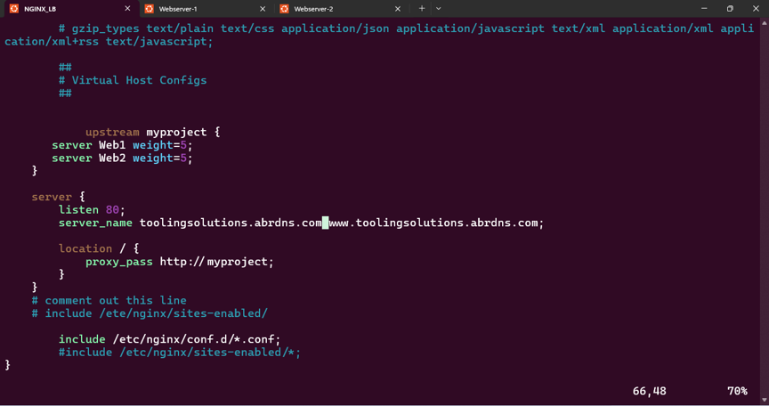

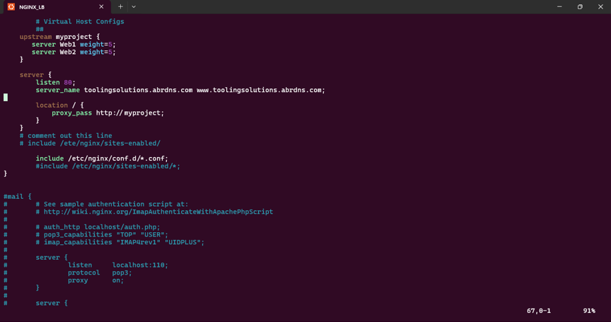

•	Validated the new settings using `sudo nginx -t` and applied the clean configuration with `sudo systemctl reload nginx`.

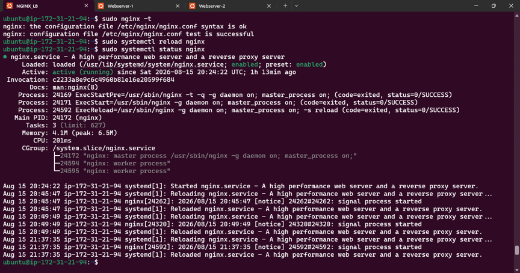

**Step 2:** Restored Network Mounts on Backend Web Servers

•	Logged into the backend nodes and manually remounted the shared applications folder from the central NFS server to the local Apache web root:

    bash
    sudo mkdir -p /var/www/html
    sudo mount -t nfs -o rw,nosuid <NFS_SERVER_PRIVATE_IP>:/mnt/apps /var/www/html

    NFS server IP = 172.31.21.78  

For webserver one (private IP = **172.31.18.179**)

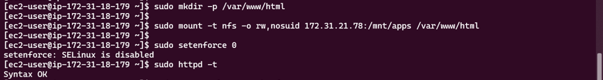

Although `setenforce 0` was disabled, in a production environment, it will be set to a level of security permitted by the organization.  

For webserver two (private IP = **172.31.16.202**)

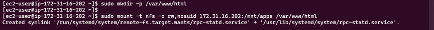

**Step 3:** Started and Enabled Web Server Components

•	Started the PHP processing engine (php-fpm) and the Red Hat Apache web server (httpd) services:

    bash
    sudo systemctl start php-fpm httpd
    sudo systemctl enable php-fpm httpd

**For webserver -1**

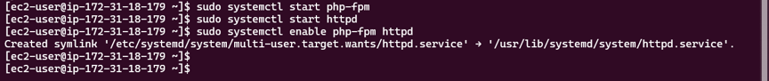

**For webserver 2**

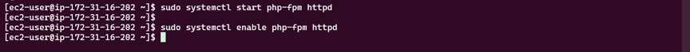

4. Verification and Results
   
•	A terminal check from the Nginx Load Balancer using `curl -I http://Web1/login.php` returned a successful `HTTP/1.1 200 OK` response from the Red Hat Apache backend.

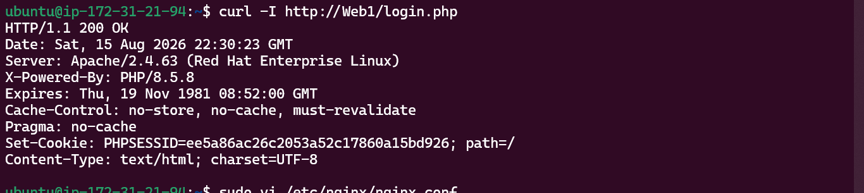

•	Accessing http://www.toolingsolutions.abrdns.com via an external web browser loaded the core tooling application login page successfully.

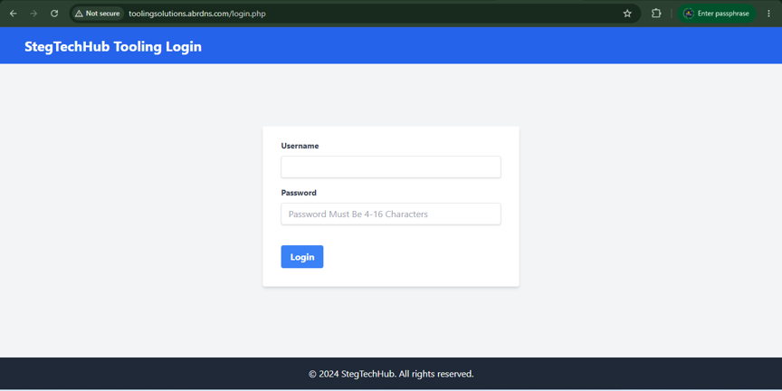

5. Install certbot and request for an SSL/TLS certificate

Ensure snapd service is active and running

```sudo systemctl status snapd```

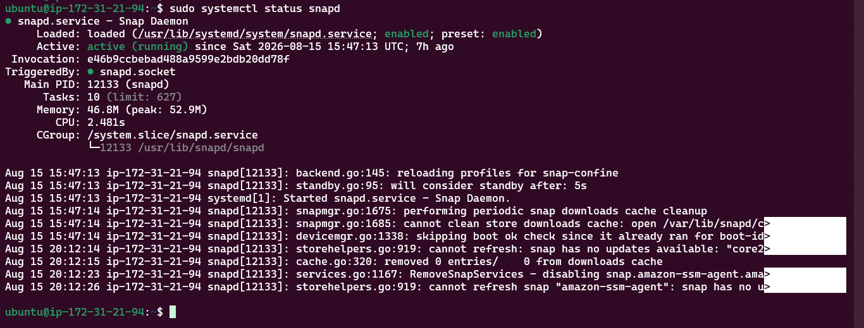

Install certbot

```sudo snap install --classic certbot```

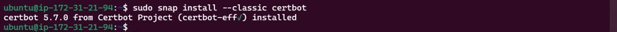

Request SSL/TLS Certificate  

Create a Symlink in /usr/bin for Certbot: Place a symbolic link in this PATH to make it easier to run certbot from the command line without needing to specify its full path.

```sudo ln -s /snap/bin/certbot /usr/bin/certbot```

Follow the certbot instructions you will need to choose which domain you want your certificate to be issued for, domain name will be looked up from nginx.conf file so ensure you have updated it on step 4.

```sudo certbot --nginx```

CERTBOT FAILED TO PROVIDE CERTIFICATE

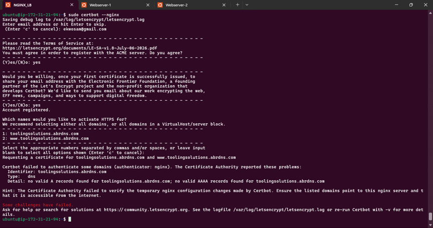

**DevOps Troubleshooting Report: Certbot SSL/TLS Authentication Failure**

**1. Problem Description** 
   
When executing sudo certbot --nginx to acquire an SSL/TLS certificate for both the root domain (`toolingsolutions.abrdns.com`) and the subdomain (`www.toolingsolutions.abrdns.com`), the Let's Encrypt Certificate Authority failed to authenticate the domains, terminating with the error:

*no valid A records found for toolingsolutions.abrdns.com.*

**2. Root Cause Analysis**

The domain verification process failed because of a partial DNS infrastructure configuration [DNS Record Types and Uses]:

•	While a valid A Record had been created for the www subdomain at the DNS provider (ClouDNS.net), the root domain (toolingsolutions.abrdns.com) lacked an autonomous mapping.

•	Because Certbot was explicitly instructed to register both entries, Let's Encrypt attempted a public challenge handshake against both names. The absence of a root A record prevented the automated public server from resolving the hostname to the Nginx Elastic IP address, failing the verification challenge [DNS Record Types and Uses].

**3. Implemented Solution**

•	Logged into the ClouDNS.net management console.

•	Created a new A Record to handle root domain routing:

o   Host/Name: Left blank (representing the apex/root domain @).
o	Points to: The AWS Elastic IP address assigned to the Nginx Load Balancer instance.
•	Allowed a brief window for DNS propagation, then successfully re-executed the certificate configuration command:`sudo certbot --nginx`

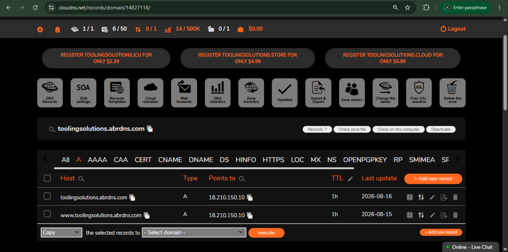

4. Verification and Results
   
The `Let's Encrypt` ACME server successfully validated both records. Certbot generated the cryptographic keys, safely stored the certificates locally, and automatically injected the necessary secure listen 443 ssl blocks into the `/etc/nginx/nginx.conf` orchestration layer. 

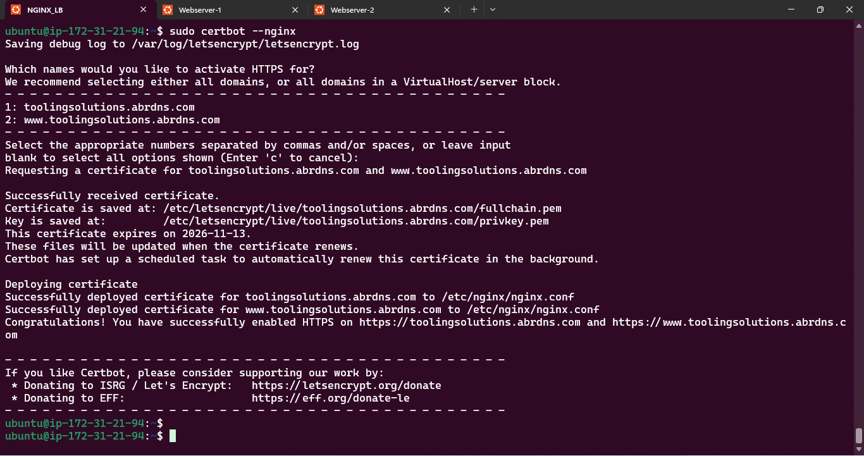

Test secured access to your Web Solution by trying to reach https://<your-domain-name.com>.

You shall be able to access your wesite using HTTPS protocol (Uses TCP port 443) and see a padlock image in your browsers' search string. Click on the padlock icon and you can see the detail of the certificate issued for the website.

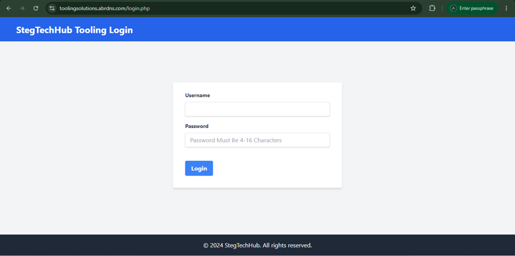

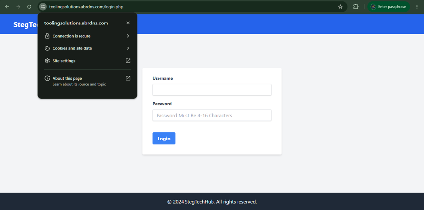

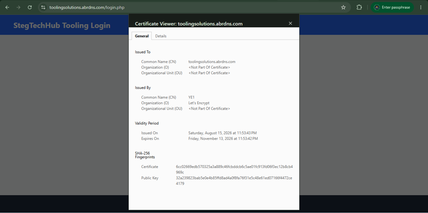

6. Set up periodical renewal of your SSL/TLS certificate
By default, `LetsEncrypt` certificate is valid for 90 days, so it is recommended to renew it at least every 60 days or more frequently.

Test the renewal command in dry-run mode

```sudo certbot renew --dry-run```

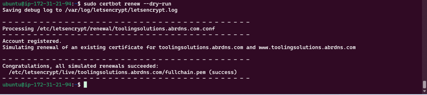

Best pracice is to have a scheduled job that runs renew command periodically. Configure a cronjob to run the command twice a day

Edit the crontab file

**crontab -e**


Add the following line to scheduled a job that runs renew command twice daily

```* */12 * * *   root /usr/bin/certbot renew > /dev/null 2>&1```

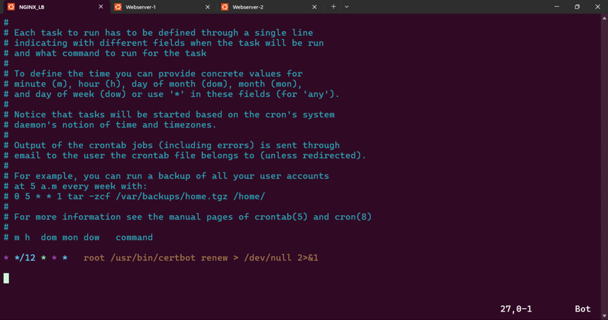

You can always change the interval of the cronjob if twice a day is too often by adjusting the schedule expression.

## Conclusion

This task successfully demonstrated the deployment of a highly available, scalable, and secure web infrastructure using an Nginx Layer 7 Load Balancer sitting in front of Red Hat Enterprise Linux backend web nodes [Nginx Load Balancing Methods and Features Supported by Nginx]. 

By decoupling traffic routing from backend execution, resolving network-attached NFS storage paths, and automating production-grade SSL/TLS termination via Let's Encrypt, the environment was engineered to meet modern enterprise reliability and data-in-transit security standards [Nginx Load Balancing Methods and Features Supported by Nginx, DevOps Troubleshooting Report: Certbot SSL/TLS Authentication Failure]. 

The final architecture validates critical DevOps core competencies in web server optimization, real-world network debugging, and public DNS management [Nginx Load Balancing Methods and Features Supported by Nginx, DevOps Troubleshooting Report: Certbot SSL/TLS Authentication Failure].

## References on cron configuration:

1. [Job Scheduling (cronjob/crontab) on Linux CentOS 8](https://www.youtube.com/watch?v=4g1i0ylvx3A)

2. [Online cron expression editor](https://crontab.guru/)