# Ansible Refactoring & Static Assignments (Imports and Roles)

This project continues working with `ansible-config-mgt repository` and make some improvements of our code. Now we need to `refactor` our Ansible code, create `assignments`, and learn how to use the `imports` functionality. `Imports` allow to effectively re-use previously created `playbooks` in a new playbook - it allows us to organize our tasks and reuse them when needed.

## Step 1 - Jenkins job enhancement

Before we begin, let us make some changes to our Jenkins job - now every new change in the codes creates a separate directory which is not very convenient when we want to run some commands from one place. Besides, it consumes space on Jenkins servers with each subsequent change. Let us enhance it by introducing a new Jenkins project/job - we will require `Copy Artifact plugin`.

Go to your `Jenkins-Ansible server` and create a new directory called `ansible-config-artifact` - we will store there all artifacts after each build.

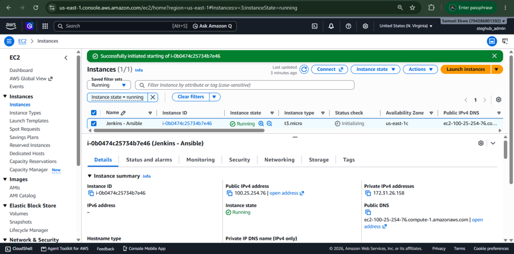

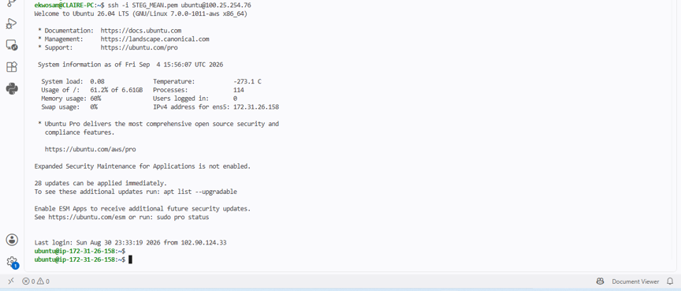

**sudo mkdir /home/ubuntu/ansible-config-artifact**

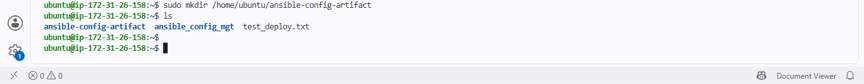

2. Change permissions to this directory, so Jenkins could save files there

**chmod -R 0777 /home/ubuntu/ansible-config-artifact**

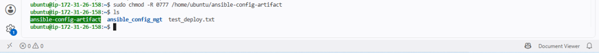

3. Go to Jenkins web console -> Manage Jenkins -> Manage Plugins -> on Available tab search for Copy Artifact and install this plugin without restarting Jenkins

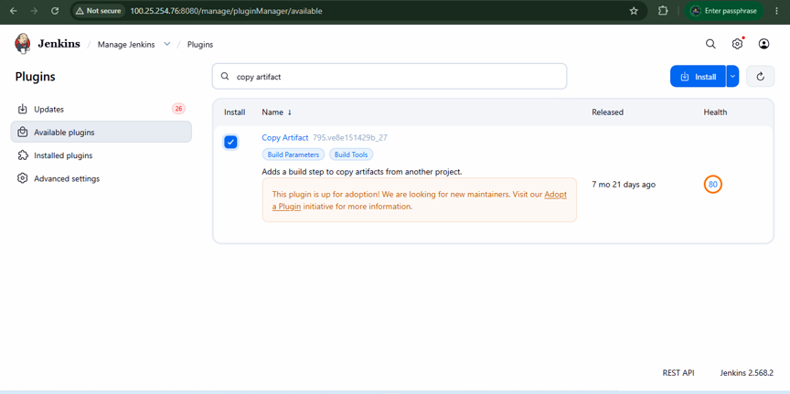

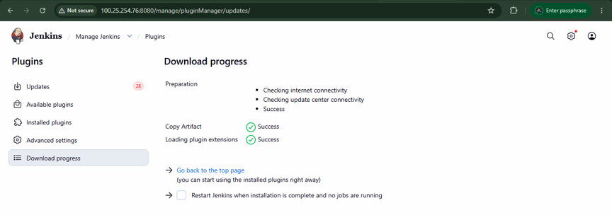

4. Create a new Freestyle project and name it `save_artifacts`.

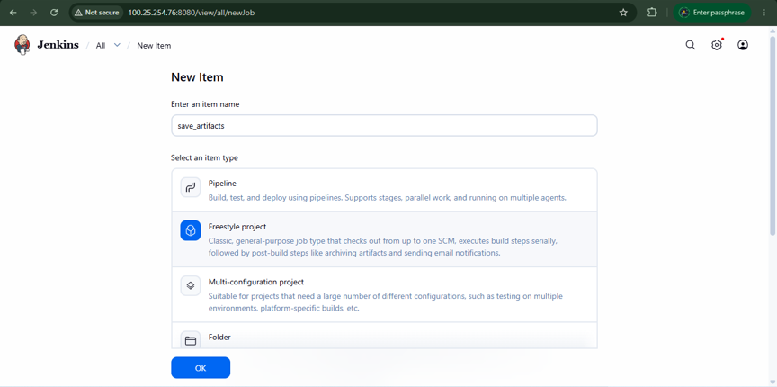

5. This project will be triggered by completion of your existing ansible project. Configure it accordingly

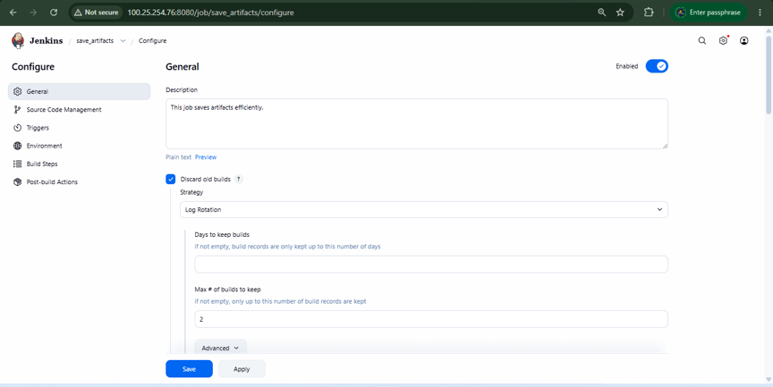

Note: You can configure number of builds to keep in order to save space on the server, for example, you might want to keep only last 2 or 5 build results. You can also make this change to your ansible job.

6. The main idea of save_artifacts project is to save artifacts into `/home/ubuntu/ansible-config-artifact directory`. To achieve this, create a Build step and choose `Copy artifacts from other project`, specify `ansible` as a source project and `/home/ubuntu/ansible-config-artifact` as a target directory.

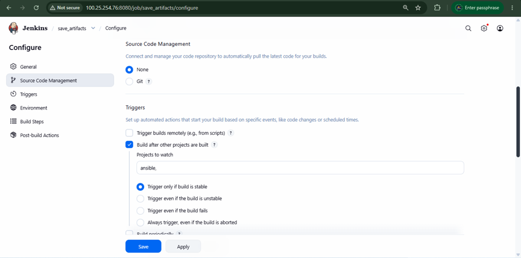

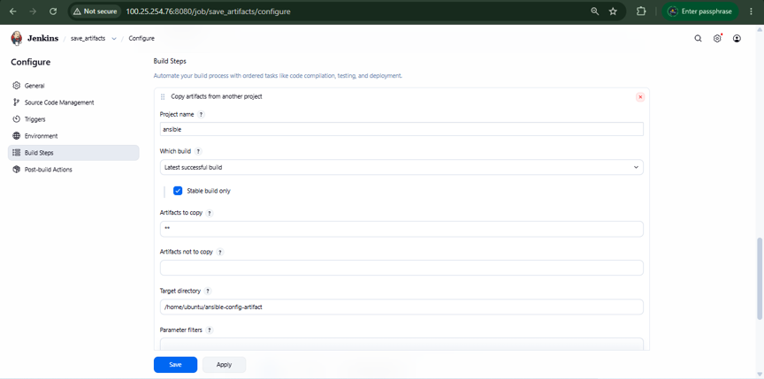

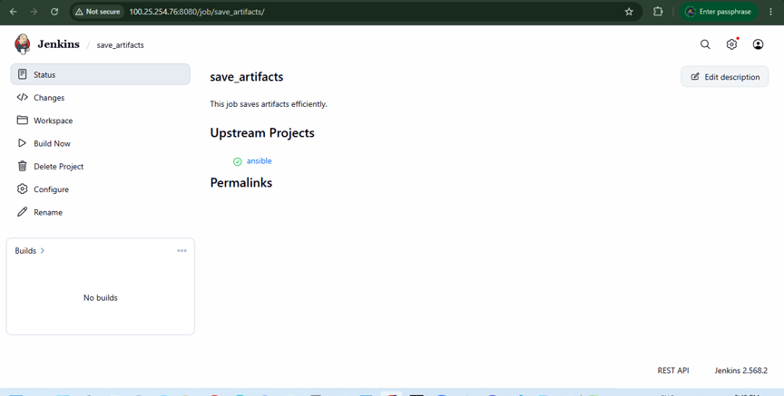

7. Test your set up by making some change in `README.MD` file inside your `ansible-config-mgt repository` (right inside main branch).

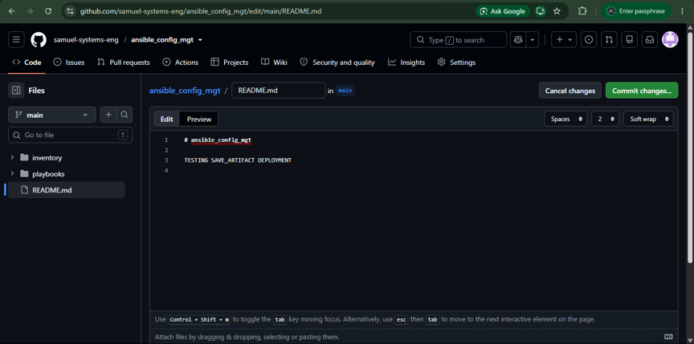

If both Jenkins jobs have completed one after another - you shall see your files inside /home/ubuntu/ansible-config-artifact directory and it will be updated with every commit to your master branch. Now your Jenkins pipeline is more neat and clean.

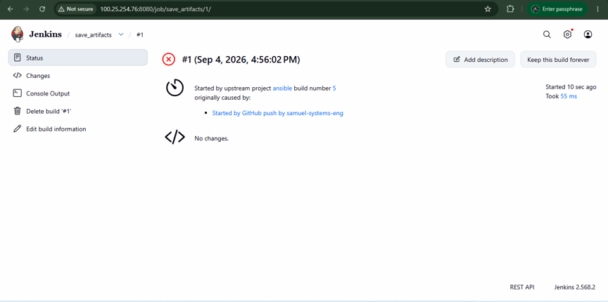

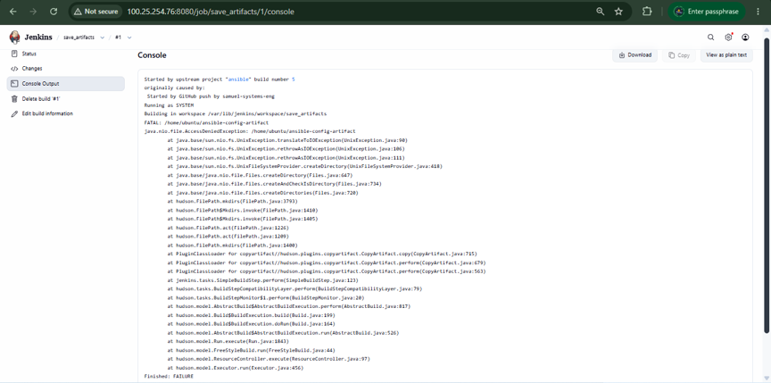

**Incident Post-Mortem: Jenkins Artifact Copy Failure**  (AccessDeniedException)

**Problem Description**

The Jenkins build job `save_artifacts` failed during the artifact deployment phase while executing the `Copy Artifact plugin`. The build failed with a `java.nio.file.AccessDeniedException error`, pointing to the target path `/home/ubuntu/ansible-config-artifact`.

    Error Log Snippet:  

    FATAL: /home/ubuntu/ansible-config-artifact
    java.nio.file.AccessDeniedException: /home/ubuntu/ansible-config-artifact
	at java.base/sun.nio.fs.UnixFileSystemProvider.createDirectory(UnixFileSystemProvider.java:418)
	at hudson.FilePath.mkdirs(FilePath.java:3793)
	Finished: FAILURE

**Root Cause Analysis**

The failure occurred due to restrictive Linux directory permissions on the AWS EC2 instance.
Although the target folder (/home/ubuntu/ansible-config-artifact) was correctly created and explicitly opened up with full permissions (chmod -R 777), its parent directory (/home/ubuntu) retained its default secure AWS permissions (drwxr-x---).

Because the jenkins system user did not have execution/traversal rights (+x) on the parent `/home/ubuntu`directory, it was blocked from "stepping through" to reach the open subfolder, causing Java to throw an access denial error when trying to resolve the file path.

**Resolution Actions**

To fix the permission block and allow Jenkins to traverse the directory path safely, the following sequence was applied to the controller instance:

1.	Granted Path Traversal Rights:   
Unlocked the parent home directory to allow external system users (like jenkins) to read and traverse into it:
```
    bash
    sudo chmod o+rx /home/ubuntu
```
2.	Ensured Target Folder Structure:  
 Verified the path existed precisely matching the pipeline configuration:
 ```
bash
sudo mkdir -p /home/ubuntu/ansible-config-artifact
```
3.	Set Target Directory Permissions:  
Re-applied recursive read, write, and execute permissions to the target folder:
```
bash
sudo chmod -R 777 /home/ubuntu/ansible-config-artifact
```

**Outcome & Verification**

A manual execution of the build was triggered via the Jenkins UI. The job completed successfully, successfully migrating the upstream Ansible config artifacts into the designated directory.
________________________________________

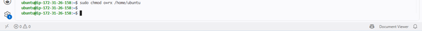

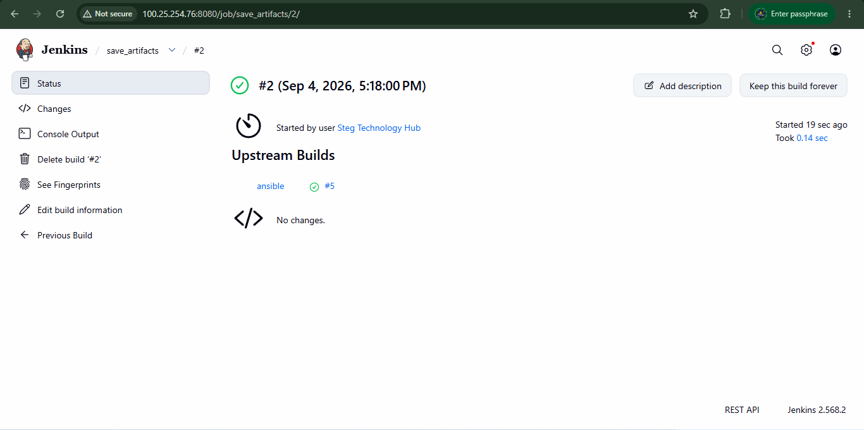

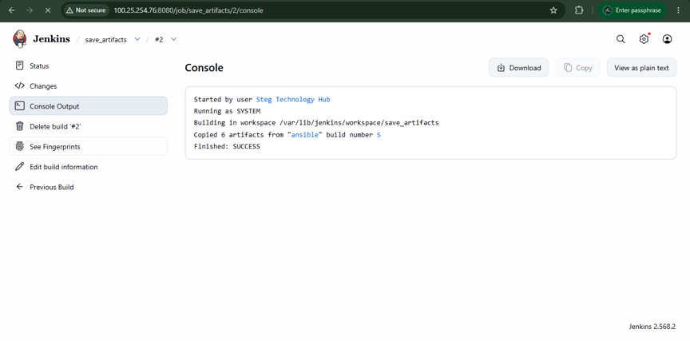

## Step 2 - Refactor Ansible code by importing other playbooks into `site.yml`

Before starting to refactor the codes, ensure that you have pulled down the latest code from master (main) branch, and create a new branch, name it `refactor`.

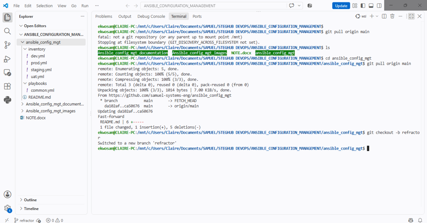

DevOps philosophy implies constant iterative improvement for better efficiency - refactoring is one of the techniques that can be used, but you always have an answer to question "why?". Why do we need to change something if it works well?

In previous project, you wrote all tasks in a single playbook common.yml, now it is pretty simple set of instructions for only two types of OS, but imagine you have many more tasks and you need to apply this playbook to other servers with different requirements. 

In this case, you will have to read through the whole playbook to check if all tasks written there are applicable and is there anything that you need to add for certain server/OS families. 

Very fast it will become a tedious exercise and your playbook will become messy with many commented parts. Your DevOps colleagues will not appreciate such organization of your codes and it will be difficult for them to use your playbook.

Let see code re-use in action by importing other playbooks.

1. Within playbooks folder, create a new file and name it `site.yml` - This file will now be considered as an entry point into the entire infrastructure configuration.   
Other playbooks will be included here as a reference. In other words, site.yml will become a parent to all other playbooks that will be developed. Including common.yml that you created previously.

2. Create a new folder in root of the repository and name it `static-assignments`. The `static-assignments` folder is where all other children playbooks will be stored. This is merely for easy organization of your work.  
It is not an Ansible specific concept, therefore you can choose how you want to organize your work. You will see why the folder name has a prefix of static very soon. For now, just follow along.

3. Move `common.yml` file into the newly created `static-assignments` folder.

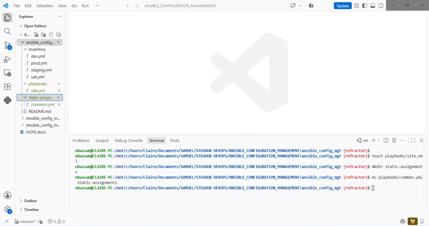

4. Inside `site.yml` file, import `common.yml` playbook.

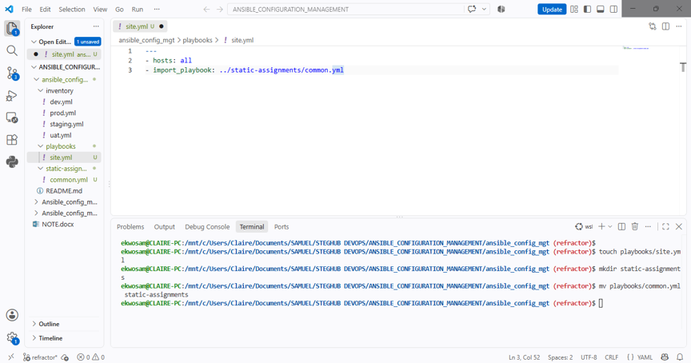

The code above uses built in import_playbook Ansible module.

Your folder structure should look like this;
```
├── static-assignments  
│   └── common.yml  
├── inventory  
    └── dev  
    └── stage  
    └── uat  
    └── prod  
└── playbooks
    └── site.yml
```
5. Run ansible-playbook command against the dev environment

Since you need to apply some tasks to your `dev servers` and `wireshark` is already installed - you can go ahead and create another playbook under `static-assignments` and name it `common-del.yml`.

In this playbook, configure deletion of wireshark utility.
```
---
- name: update web, nfs and db servers
  hosts: webservers, nfs, db
  remote_user: ec2-user
  become: yes
  become_user: root
  tasks:
  - name: delete wireshark
    yum:
      name: wireshark
      state: removed

- name: update LB server
  hosts: lb
  remote_user: ubuntu
  become: yes
  become_user: root
  tasks:
  - name: delete wireshark
    apt:
      name: wireshark
      state: absent
      autoremove: yes
      purge: yes
      autoclean: yes
```
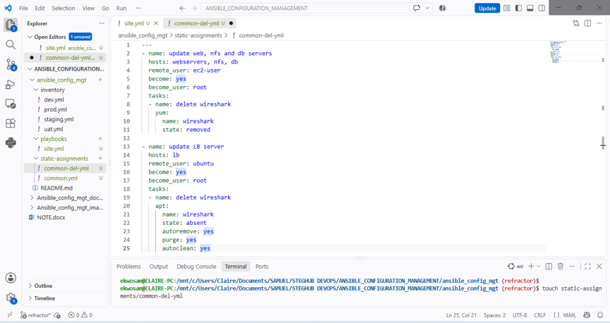

Update `site.yml` with - `import_playbook: ../static-assignments/common-del.yml instead of common.yml`

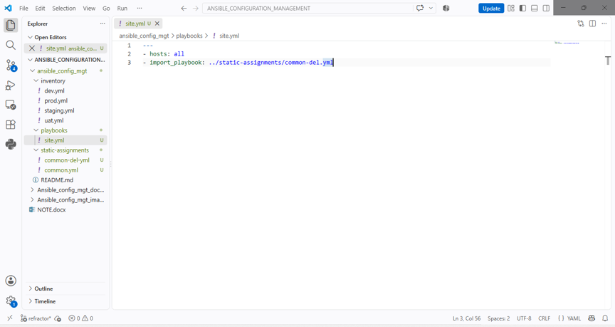

```
---
- hosts: all
- import_playbook: ../static-assignments/common-del.yml
```

Run it against `dev` servers
```
cd /home/ubuntu/ansible-config-mgt/

ansible-playbook -i inventory/dev.yml playbooks/site.yaml
```
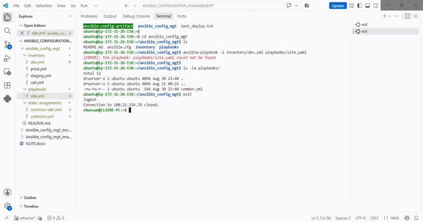

Before running refactoring on development servers, it must first be commited to the “refactor branch” in github, merged with the “main” branch so that new changes are triggered on the Jenkins-Ansible server by Jenkins build (alternatively, Jenkins build can be configured to pay attention to `refactor` branch which is NOT recommended in production):

1. Ensure your changes are committed on your refactor branch  

    `git checkout refactor`  
    `git add .`   
    `git commit -m "Refactor static assignments and added site.yml"`  

2. Push the refactor branch to GitHub so it exists remotely  
    `git push origin refactor`

3. Switch back to your local main branch  
`git checkout main`

4. Pull any updates from GitHub to make sure you are up to date  
`git pull origin main`

5. Merge your refactor branch into your main branch locally
`git merge refactor`

6. Push the updated main branch up to GitHub  
`git push origin main`

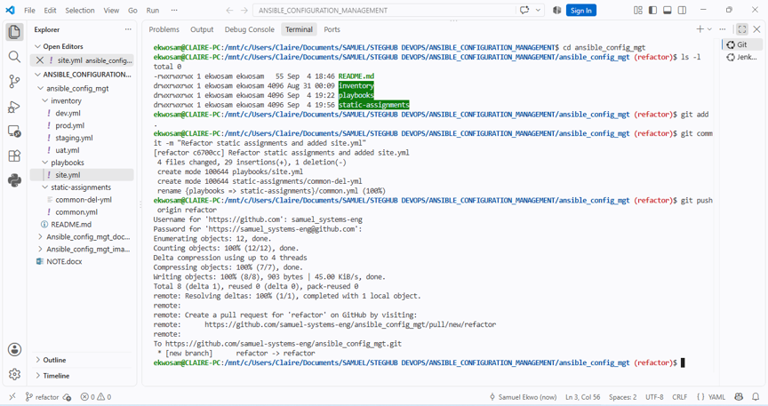

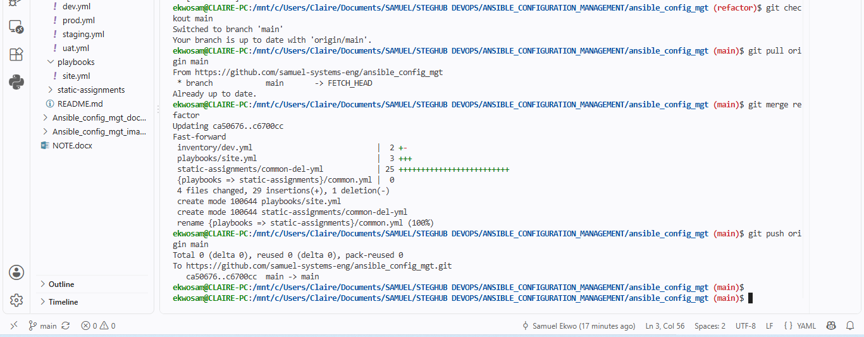

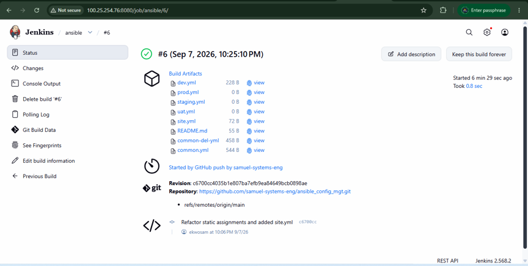

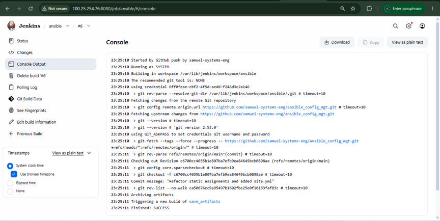

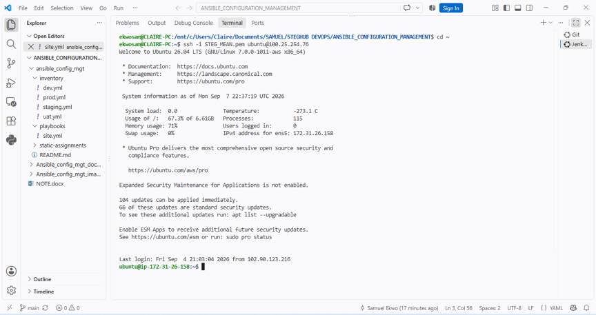

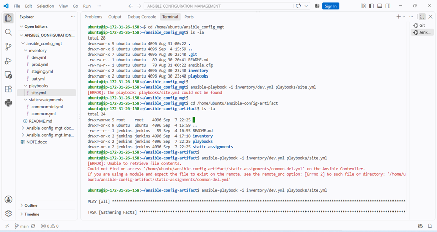

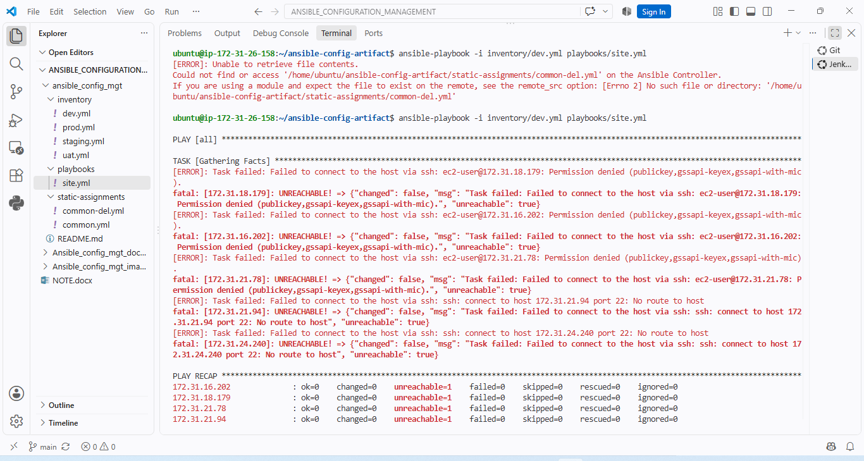

**Technical Log: Resolving Git Branching Disconnects, Filename Typos, and SSH Target Fleet Authentication**

1. **Issue: Out-of-Sync File Structure on Ansible Controller**
    
`Problem`: Running ansible-playbook -i inventory/dev.yml playbooks/site.yml on the Jenkins-Ansible server failed because site.yml could not be found. The local structural files were present on the laptop but missing on the server. 

`Root Cause`: A breakdown in the CI/CD pipeline progression. The code refactoring changes were sitting uncommitted on the local laptop. Because they were not pushed to GitHub, the upstream Jenkins job was building a stale version of the main branch.  

`Resolution`:
- Undid an accidental commit on the local main branch safely using git reset --soft HEAD~1.
- Fixed a local branch name typo from refractor to refactor using git branch -m refactor.
- Comitted and merged the changes locally into the main branch.
- Pushed the updated main branch to GitHub, triggering a clean Jenkins build that successfully deployed the fresh artifacts to the server.

2. **Issue: Ansible Playbook Crash via Extension Misspelling**
   
`Problem`: Executing the playbook on the server threw an immediate fatal error: Unable to retrieve file contents. Could not find or access static-assignments/common-del.yml.

`Root Cause`: A subtle syntax typo during the local file creation phase. The file inside the static-assignments directory had been accidentally named common-del-yml (using a hyphen) instead of common-del.yml (using a dot), preventing Ansible from resolving the path string.

`Resolution`: Renamed the file to the correct .yml format on the local machine, committed the fix, and pushed it through the automated pipeline. Jenkins pulled and overwritten the broken extension on the server seamlessly.

3. **Issue: Target Host SSH Connection Denial (Permission denied)**

`Problem`: The playbook execution failed during the Gathering Facts phase on all active target instances with an UNREACHABLE! => Permission denied (publickey) error message.

`Root Cause`: The Jenkins-Ansible controller server was attempting to connect to the internal private IP addresses of the target fleet (webservers and NFS) without possessing the required AWS private identity key (STEG_MEAN.pem).

`Resolution`: Implemented SSH Agent Forwarding to securely stream the local laptop's identity credentials to the controller.
- Initiated the authentication agent on the laptop via `eval $(ssh-agent -s)`.
- Registered the private key into memory using `ssh-add ~/STEG_MEAN.pem`.
- Established a new session to the controller using the forwarding flag: `ssh -A ubuntu@100.25.254.76`.
- Re-executed the playbook, resulting in a successful run across all powered target servers (changed=1).
  
(Note: Inbound connection failures on the Load Balancer and Database instances were determined to be intentional false-flags, as those machines were deliberately powered down to stay within AWS Free Tier usage thresholds).

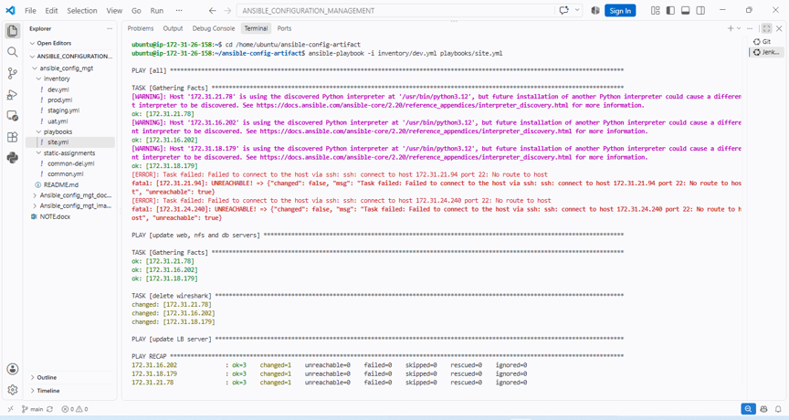

Esure that wireshark is deleted on all the servers

**Run wireshark --version to check**

Check the Webserver one

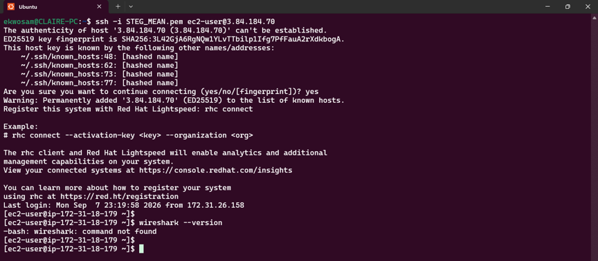

Check the Webserver two

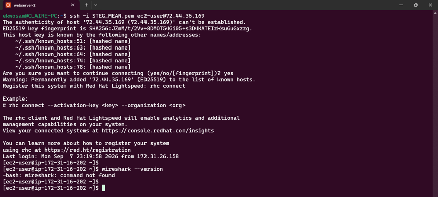

Check the NFS server

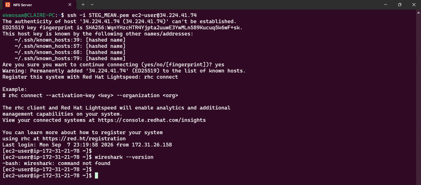

Now you have learned how to use import_playbooks module and you have a ready solution to install/delete packages on multiple servers with just one command.

## Step 3 - Configure UAT Webservers with a role `Webserver`

We have our nice and clean dev environment, so let us put it aside and configure two new Web Servers as `uat`. We could write tasks to configure Web Servers in the same playbook, but it would be too messy, instead, we will use a dedicated role to make our configuration reusable.

1. Launch 2 fresh EC2 instances using RHEL 10 image, we will use them as our `uat servers`, so give them names accordingly - `Web1-UAT` and `Web2-UAT`.

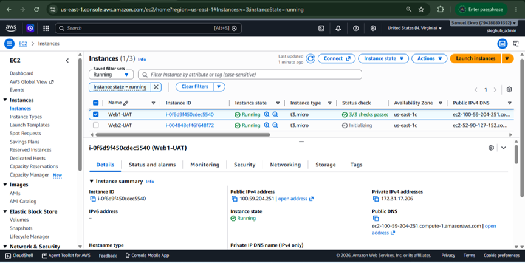

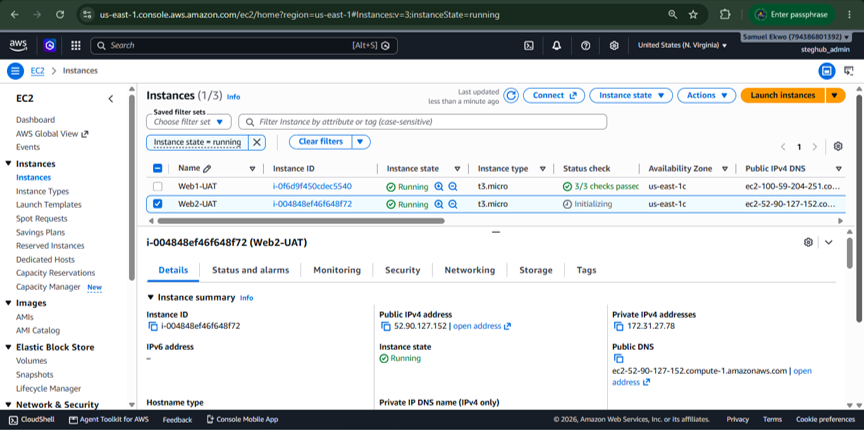

2. To create a role, you must create a directory called `roles/`, relative to the playbook file or in /etc/ansible/ directory.  

There are two ways how you can create this folder structure:

Use an Ansible utility called ansible-galaxy inside ansible-config-mgt/roles directory (you need to create roles directory upfront)

mkdir roles
cd roles
ansible-galaxy init webserver
`Note`: You can choose either way, but since you store all your codes in GitHub, it is recommended to create folders and files there rather than locally on Jenkins-Ansible server.

The entire folder structure should look like below, but if you create it manually - you can skip creating `tests`, `files`, and `vars` or remove them if you used ansible-galaxy

```
└── webserver
    ├── README.md
    ├── defaults
    │   └── main.yml
    ├── handlers
    │   └── main.yml
    ├── meta
    │   └── main.yml
    ├── tasks
    │   └── main.yml
    └── templates
```

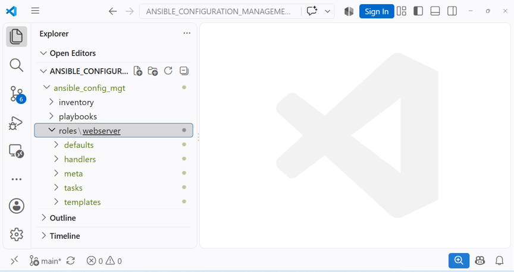

3. Update your inventory `ansible-config-mgt/inventory/uat.yml` file with IP addresses of your 2 UAT Web servers  
NOTE: Ensure you are using `ssh-agent` to `ssh` into the Jenkins-Ansible instance
```
[uat-webservers]

<Web1-UAT-Server-Private-IP-Address> ansible_ssh_user='ec2-user'
<Web2-UAT-Server-Private-IP-Address> ansible_ssh_user='ec2-user'
```

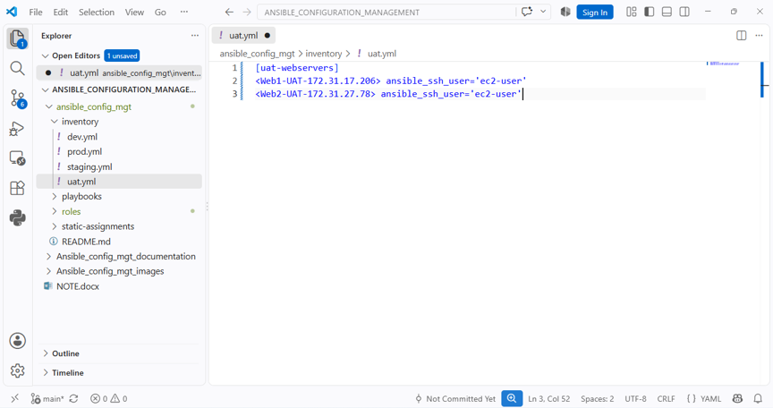

To learn how to setup SSH agent and connect VS Code to your Jenkins-Ansible instance, please see this video:  

- For Windows users - [ssh-agent on windows](https://www.youtube.com/watch?v=TYyTXxVWOYA)  
- For Linux users - [ssh-agent on linux](https://www.youtube.com/watch?v=EoLrCX1VVog)

In `/etc/ansible/ansible.cfg` file uncomment roles_path string and provide a full path to your roles directory `roles_path = /home/ubuntu/ansible-config-mgt/roles`, so Ansible could know where to find configured roles.

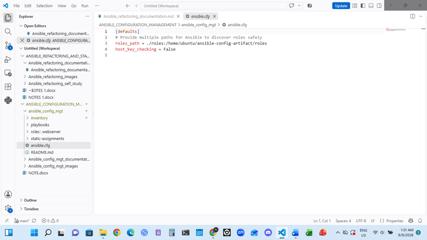

The full path could not be provided to ansible_config_mgt/roles because the Jenkins website copy artifact plugin copies all current Jenkins build to ansible-config-artifacts (as created in step 1 documentation) as its target folder in the jenkins-ansible server which contains the most current jenkin builds instead of the ansible_config_mgt folder. Hence, the relative role file path above.

5. It is time to start adding some logic to the webserver role. Go into tasks directory, and within the main.yml file, start writing configuration tasks to do the following:
 
- Install and configure Apache (httpd service)
- Clone Tooling website from GitHub https://github.com//tooling.git.
- Ensure the tooling website code is deployed to /var/www/html on each of 2 UAT Web servers.
- Make sure httpd service is started

Your main.yml consist of following tasks:
```
# tasks file for webserver
---
- name: install apache
  remote_user: ec2-user
  become: true
  become_user: root
  ansible.builtin.yum:
    name: "httpd"
    state: present

- name: install git
  remote_user: ec2-user
  become: true
  become_user: root
  ansible.builtin.yum:
    name: "git"
    state: present

- name: clone a repo
  remote_user: ec2-user
  become: true
  become_user: root
  ansible.builtin.git:
    repo: https://github.com/francdomain/tooling.git
    dest: /var/www/html
    force: yes

- name: copy html content to one level up
  remote_user: ec2-user
  become: true
  become_user: root
  command: cp -r /var/www/html/html/ /var/www/

- name: Start service httpd, if not started
  remote_user: ec2-user
  become: true
  become_user: root
  ansible.builtin.service:
    name: httpd
    state: started

- name: recursively remove /var/www/html/html/ directory
  remote_user: ec2-user
  become: true
  become_user: root
  ansible.builtin.file:
    path: /var/www/html/html
    state: absent
```

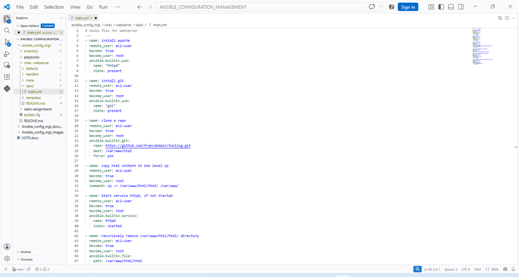

## Step 4 - Reference Webserver role

Within the static-assignments folder, create a new assignment for `uat-webservers uat-webservers.yml`. This is where you will reference the role.
```
---
- hosts: uat-webservers
  roles:
     - webserver
```

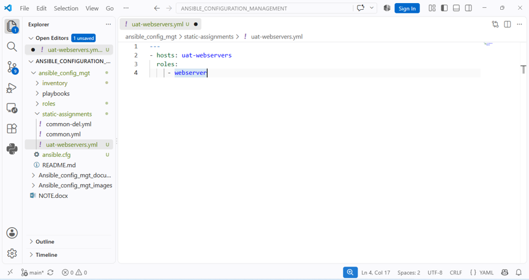

Remember that the entry point to our ansible configuration is the site.yml file. Therefore, you need to refer your uat-webservers.yml role inside site.yml.

So, we should have this in site.yml
```
---
- hosts: all
- import_playbook: ../static-assignments/common.yml

- hosts: uat-webservers
- import_playbook: ../static-assignments/uat-webservers.yml
```
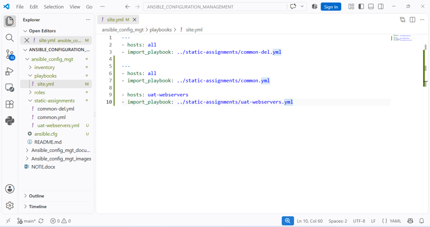


## Step 5 - Commit & Test

Commit your changes, create a Pull Request and main them to master branch, make sure webhook triggered two consequent Jenkins jobs, they ran successfully and copied all the files to your Jenkins-Ansible server into /home/ubuntu/ansible-config-artifact/ directory.

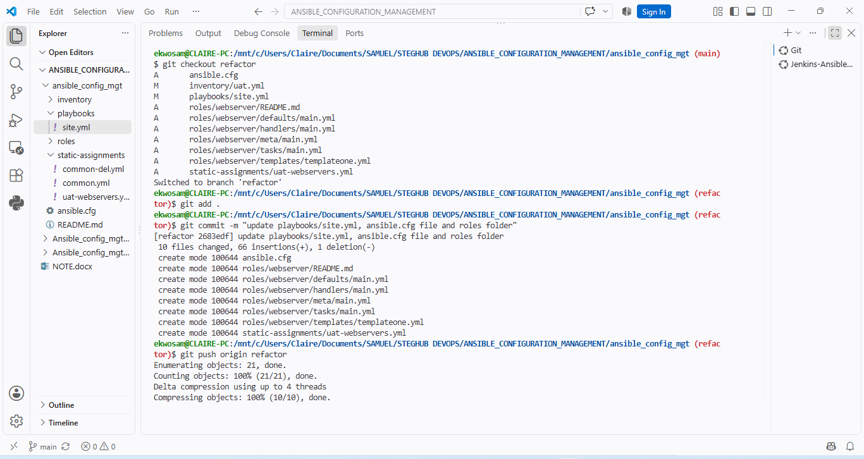

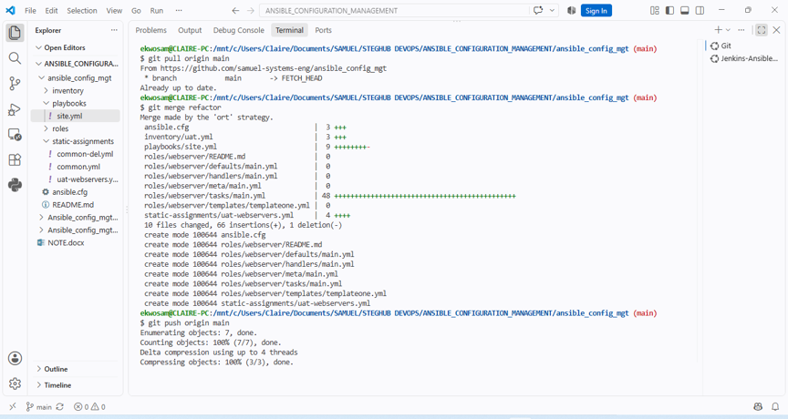

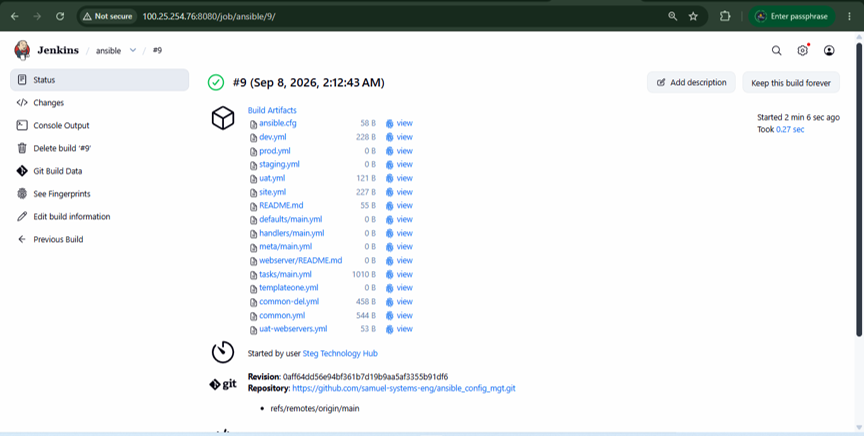

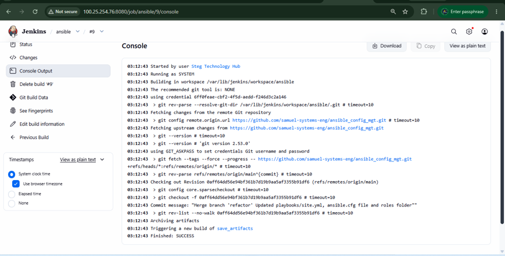

Now run the playbook against your `uat inventory` and see what happens:

NOTE: Before running your playbook, ensure you have tunneled into your Jenkins-Ansible server via ssh-agent For windows users, see this video For [Linux] users, see this video

**cd /home/ubuntu/ansible-config-artifact**

**ansible-playbook -i /inventory/uat.yml playbooks/site.yaml**

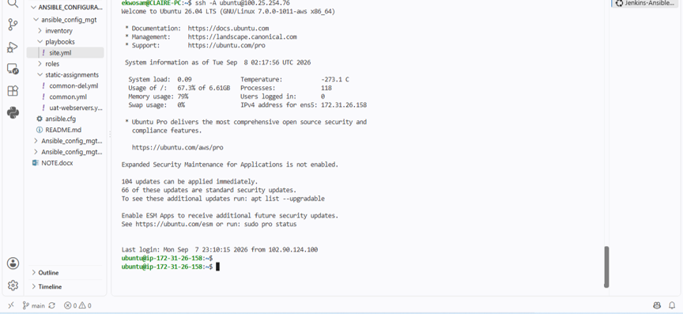

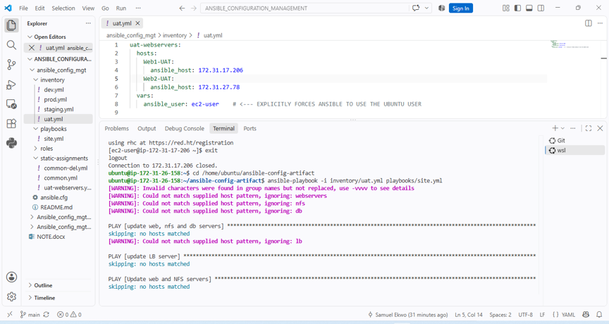

**Incident Post-Mortem: Cross-OS Authentication Failures (Permission denied / Hostname Unknown) during UAT Playbook Execution**

**Problem Description**

While executing the master playbook against the `UAT` environment using the command `ansible-playbook -i inventory/uat.yml playbooks/site.yml`, the execution crashed during the initial Gathering Facts stage. The target hosts were flagged as completely UNREACHABLE.
```
Initial Error Variant (Syntax Block):
text
fatal: [<Web1-UAT-172.31.17.206>]: UNREACHABLE! => {"msg": "Task failed: Failed to connect to the host via ssh: hostname contains invalid characters"}
```
*Secondary Error Variant (OS Block):*
```
fatal: [Web1-UAT]: UNREACHABLE! => {"msg": "ubuntu@172.31.17.206: Permission denied (publickey,gssapi-keyex,gssapi-with-mic)."}
```

**Root Cause Analysis**

The deployment failure was driven by two distinct configuration issues in the UAT inventory staging file (inventory/uat.yml):

1.	**Invalid Host String Formatting:** The inventory file wrapped target IP addresses inside angle brackets (e.g., <Web1-UAT-...>). Linux shells interpret angle brackets literally as stream redirection operators, which caused the underlying SSH client execution string to crash immediately.
2.	**Cross-OS Administrative Username Mismatch:** After stripping out the angle brackets, the connection was still rejected with a Permission denied error. This occurred because the newly launched UAT instances were running Red Hat Enterprise Linux 10 (RHEL 10), but Ansible was implicitly attempting to connect using the default ubuntu user profile. RHEL systems strictly enforce the use of ec2-user for remote administrative actions, causing them to reject the incoming public key session under the wrong username.

**Resolution Actions**

The tracking and inventory configurations were successfully refactored on the local development machine and deployed through the pipeline using these steps:

**1.	Isolated Variable Mapping & Stripped Brackets:** Rewrote inventory/uat.yml to remove the stream-breaking angle brackets and implemented clean display name mapping.

**2.	Enforced RHEL Connection Compliance:**  
Declared an explicit ansible_user variable block under the UAT group to map the session directly to the required Red Hat user profile (see image above):
```
yaml
uat-webservers:
  hosts:
    Web1-UAT:
      ansible_host: 172.31.17.206
    Web2-UAT:
      ansible_host: 172.31.27.78
  vars:
    ansible_user: ec2-user
```
**3.	Automated Pipeline Sync:**  
Pushed the updated file from the laptop to GitHub (git push origin main), prompting a green Jenkins build that cleanly populated the /home/ubuntu/ansible-config-artifact deployment directory.

**Outcome & Verification**  

The playbook execution was re-triggered via the server CLI. With the correct username mapping actively enforced, Ansible successfully processed all plays, completed the Python interpreter discovery phase, and fully configured the UAT target infrastructure.
```
Final Play Recap:

Web1-UAT: ok=7    changed=6    unreachable=0    failed=0    skipped=0    rescued=0    ignored=0   

Web2-UAT: ok=7    changed=6    unreachable=0    failed=0    skipped=0    rescued=0    ignored=0   
```

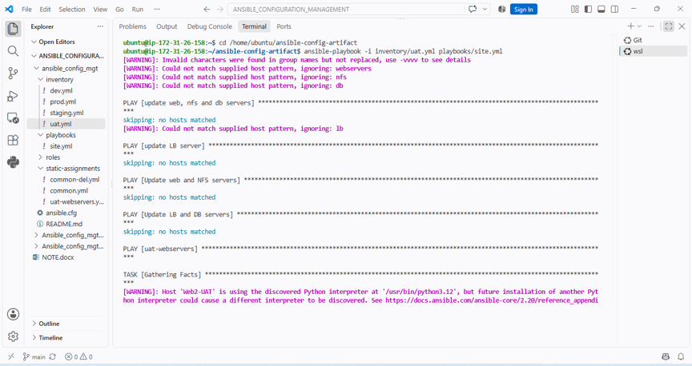

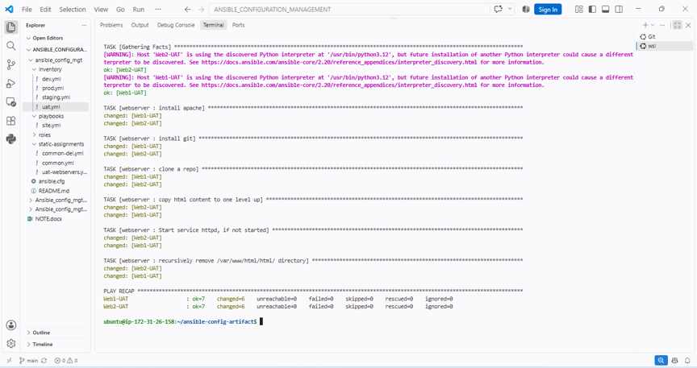

You should be able to see both of your UAT Web servers configured and you can try to reach them from your browser:

**http://\<Web1-UAT-Server-Public-IP-or-Public-DNS-Name>/index.php**

or

**http://\<Web1-UAT-Server-Public-IP-or-Public-DNS-Name>/index.php**

Access Web1-UAT

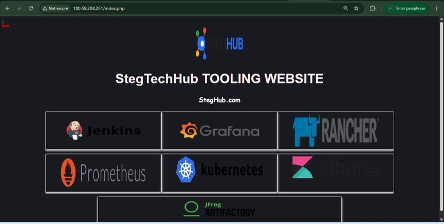

Access Web2-UAT

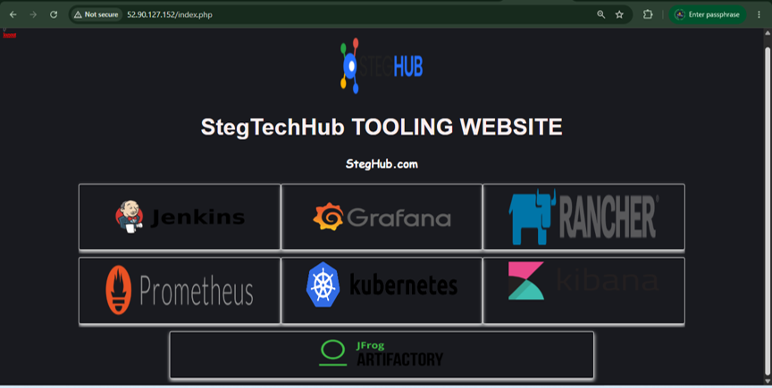

Our Ansible architecture now looks like this:

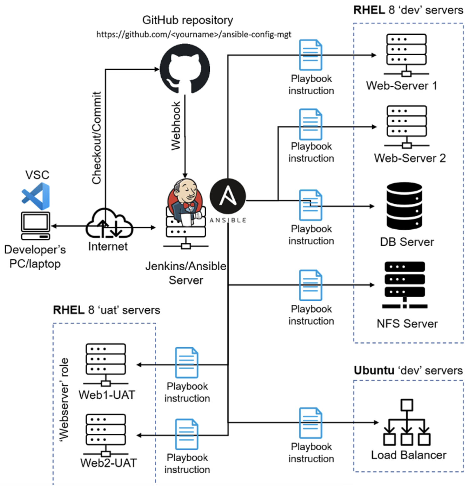

## Conclusion
This implementation successfully establishes a robust, production-grade CI/CD infrastructure automation pipeline utilizing GitHub, Jenkins, and Ansible. By refactoring static assignments into modular layouts and securing cross-tier directories with clean group permissions (775), the deployment framework remains resilient and highly scalable.

Furthermore, deploying configurations successfully across a mixed ecosystem (Ubuntu 26.04 controllers and RHEL 10 target instances) demonstrates a strong grasp of real-world enterprise constraints—specifically regarding SSH agent forwarding, explicit connection user mappings (ec2-user), and cloud resource optimization. The resulting configuration suite successfully provisions multi-tier environments, laying a solid foundation for future automated cluster expansions and advanced configuration management tasks.